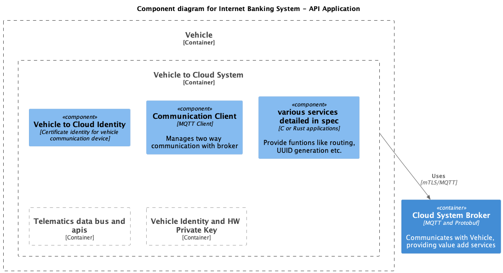
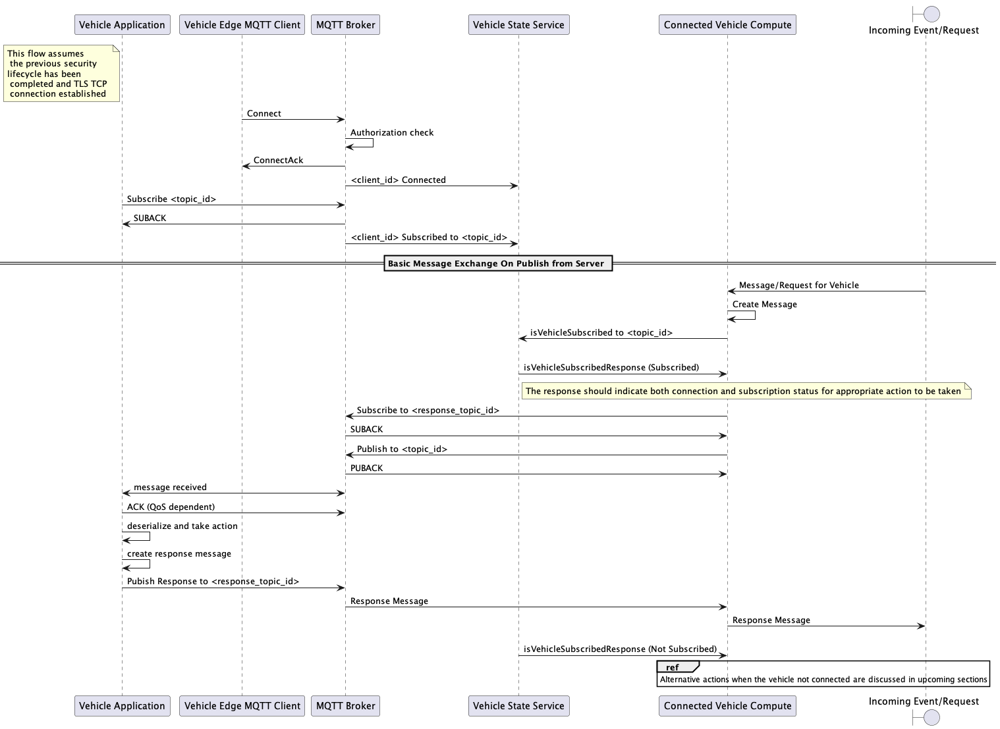
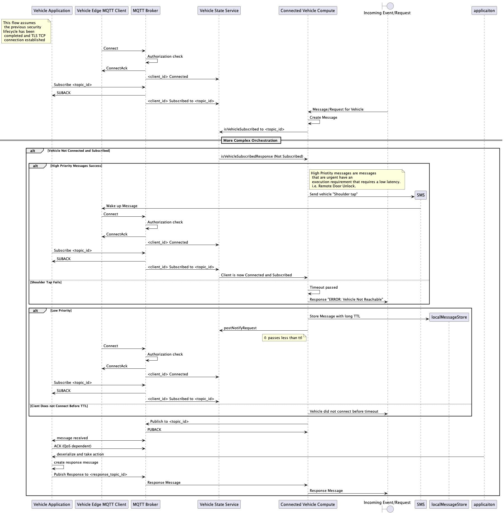

- [Project Definition](#project-definition)
- [Scope](#scope)
- [General Architecture](#general-architecture)
- [Potential Use Cases](#potential-use-cases)
- [Introduction](#introduction)
  - [Contributions](#contributions)
    - [Calls for Help](#calls-for-help)
- [MQTT V5](#mqtt-v5)
- [MQTT Communication Management](#mqtt-communication-management)
  - [Security Recommendations](#security-recommendations)
  - [Compliance](#compliance)
  - [MQTT Publish and Subscribe Lifecycle](#mqtt-publish-and-subscribe-lifecycle)
    - [The Importance of State](#the-importance-of-state)
    - [Handling High Priority Message Vs. Low Priority Messages](#handling-high-priority-message-vs-low-priority-messages)
  - [Message IDs](#message-ids)
  - [MQTT Client Connection](#mqtt-client-connection)
  - [MQTT Request and Response Headers](#mqtt-request-and-response-headers)
  - [Dealing with Corner Cases](#dealing-with-corner-cases)

## Project Definition
The intention of this project is to produce a prescriptive specification for the production, consumption and orchestration of messages between connected vehicle devices and the cloud using MQTT and Protocol Buffers, inclusive of recommendations for vehicle identity, security and system architecture.  

## Scope
Documentation of recommended basic practices for MQTT V5 based vehicle to cloud communication patterns. 
* Message format and orchestration for the most common vehicle telemetry and command based use patterns. [See Documentation Here](src/main/doc/v2c.md)
* Gradle Build configuration for building both documentation and Java (and other?) stubs from protocol buffer files.
* Example message implementations for reference. 
* Middleware API set for translation from ISO Standards to VSS
 

## General Architecture


## Documentation

### 📘 Core References
- [API and Protocol Reference](docs/API_AND_PROTOCOL_REFERENCE.md) - Complete MQTT topics and Protocol Buffer specifications
- [Architecture Review](ARCHITECTURE_REVIEW.md) - System architecture and design decisions

### 🔒 Security & Compliance
- [ISO 21434 TARA](docs/security/ISO_21434_TARA.md) - Threat Analysis and Risk Assessment
- [PII Data Governance](docs/security/PII_DATA_GOVERNANCE.md) - Personal data handling policies
- [Certificate Lifecycle](docs/security/CERTIFICATE_LIFECYCLE.md) - PKI and certificate management
- [Audit Logging](docs/security/AUDIT_LOGGING.md) - Security event logging

### 🛠️ Implementation Guides
- [Topic Naming Convention](docs/standards/TOPIC_NAMING_CONVENTION.md) - MQTT topic structure standards
- [QoS Selection Guide](docs/standards/QOS_SELECTION_GUIDE.md) - Quality of Service level selection
- [Topic Aliases](docs/implementation/TOPIC_ALIASES.md) - Bandwidth optimization with aliases

### 🔍 Failure Mode Analysis
- [FMEA: Remote Door Lock](docs/fmea/FMEA_REMOTE_DOOR_LOCK.md) - Comprehensive failure mode analysis for remote door locking

## Potential Use Cases
* Vehicle and Vehicle Device Provisioning
* MQTT Communication Lifecycle Events, Monitoring and Best Practices
* Client Initiation and Connection
* General Messages
* Basic Telemetry
* Remote Commands
* OTA Orchestration and Content Downloads
* Remote Diagnostics
* Application Defined Messages [Key Value Pairs]
* Simulation and Testing
## Introduction
The AGL Vehicle to Cloud Communications Project defines standard data communication protocols for Telematics Units vehicles to interface with the cloud based connected vehicle platforms. This project assumes an in-vehicle unit consisting of either a Telematics Unit or Head Unit/Infotainment with embedded modem. The connecte vehicle platform can be hosted in any one of many cloud based infrastructures including Amazon Web Services (AWS). The authors of this document are most familiar with AWS design patterns, consequently, though every attempt will be made to be cloud agnostic, implementation on other platforms may require some adjustments. 

This project includes: 
* Documentation of recommended basic practices for MQTT V5 based vehicle to cloud communication patterns. 
* Message format and orchestration for the most common vehicle telemetry and command based use patterns. [See Documentation Here](src/main/doc/v2c.md)
* Gradle Build configuration for building both documentation and Java (and other?) stubs from protocol buffer files.
* Example message implementations for reference. 

### Contributions
To make contributions to this project, please submit a pull request. Otherwise, detail any issues or changes using [Github issues](https://github.com/issues)for the project. 

#### Calls for Help
* Need reviews of content in Repo as produced and help adjusting the diagrams as needed
* Help producing reference implementation in C, RUST, PYTHON etc. 
* Help creating a quality testing and simulation framework. 
* Help creating security tests to validate securiy of vehicle identity and vehicle to cloud communications scrips
* Need to create the vehicle identity API for AGL and understand the mechanism for translating back to VIN in the cloud system.
* Help aligning the message objects to VSS
* Help creating middleware from I/Os to VSS

## MQTT V5
Per Wikipedia: 
>MQTT is a lightweight, publish-subscribe, machine to machine network protocol for Message queuing service. It is designed for connections with remote locations that have devices with resource constraints or limited network bandwidth. It must run over a transport protocol that provides ordered, lossless, bi-directional connections—typically, TCP/IP. 

Please read the standard found on the [OASIS MQTT Page](https://docs.oasis-open.org/mqtt/mqtt/v5.0/mqtt-v5.0.html)

With MQTT 5 a number of new and useful features have been added, including the addition of
* Message Expiry Interval
* Reason Codes
* Topic Alias
* User Properties
* Request and Response (Additional Header Info)

Of those listed here, Message Expiry Interval and Request/Response are the most applicable to the scope of this specification. 

## MQTT Communication Management
MQTT communication happens on the Application Layer according the OSI model, and therefore depends on establishing connection and security at the layers beneath. 

| Layer       | Description     | Protocol     |
| ----------- | -----           | --------     |
| 7     | Application Layer | MQTT         |
| 6     | Presentation Layer|              |
| 5     | Session           | TLS          |
| 4     | Transport         | TCP          |
| 3     | Network           | IP RFC 791   |
| 2     | IP                | IP RFC 894   |
| 1     | Physical Layer    | Ethernet/LTE |

For the purposes of this project MQTT will use a broker where clients and server will both publlish and subscribe to message queue topics for the exchange of messages that drive both command and control and basic telemety data interchange. The schema and serialization format for the messages will be Google Protocol Buffers. 

Because vehicles are stateful machines that are constantly moving, disconnecting and changing state it is important that connection, subscription and various attribute states are consistently managed and monitored within the connected vehicle platform. The following sections provide important considerations and recommendations for the Management of MQTT and vehicle lifecycle. 

### Security Recommendations
While outside of the scope of this project, establishing a secure communication channel between the vehicle and any system outside of the vehicle is and should remain a paramount concern. [ISO 21434](https://www.iso.org/standard/70918.html) and [United Nations WP.29](https://documents-dds-ny.un.org/doc/UNDOC/GEN/G20/076/63/PDF/G2007663.pdf?OpenElement) provide basic roadmaps but are by no means prescriptive about providing the required security for connected vehicles. The most common standard for secure communication to establish a mutually authenticated TLS session, using at a minimum TLS 1.2 standard. 

In recent history OEMS have also used a private network, communicating only over white listed IPs and and IP ranges. However, as consumer feature requirements evolve, bringing internet connected entertainment and assistants into the vehicle, and more OEM programs go global, public internet and domain name restricted routing are taking center stage.  

We recommend working with your security experts, or well established industry partners to design the right security for your connected vehicle program. 

### Compliance
In addition to security, connected vehicle programs need to be aware of regulations around consumer privacy and right to repair, including [GDPR (General Data Protection Regulation)](https://gdpr-info.eu/) and [CCPA (Calfornia Consumer Privacy Act)](https://oag.ca.gov/privacy/ccpa).  There are more regulations to consider than those listed here, once again we recommend working with experts to fully understand them. At minimum however, for the scope of this project we should consider:

* Information considered PII (Personal Identifiable) should only be transmitted if absolutely necessary to achieve feature requirements and where it is permitted by regulation and consumer consent
* PII should be encrypted at transimission (TLS) and at rest for consumer protection
* The use of PII for feature execution, monetization or internal research must be closely tracked and able to scrubbed from all systems, including 3rd parties upon request. 

It is not the scope of this project to classify data objects in terms of PII, but at a base level it should be understood that wherever one or more pieces of data can identify an individual and reveal personal information about them, this is likely PII. 

### MQTT Publish and Subscribe Lifecycle
The diagram below shows the basic Connection, Subscription and Messsage publishing lifecycle for MQTT Messages in a Connected Vehicle System. More complex orchestrations are required for particular patterns and will be detailed in the documentation for each pattern. 




#### The Importance of State
It is important for a number of reasons to track stateful information about the vehicle, starting with the highest degree of certainty possible, the vehicle's power state, connection to the MQTT broker and status of topic subscriptions. This helps us understand the likelihood of sucess and minimizes the publishing of  messages to topics on external endpoints that will not be immediately recieved by the vehicle, and thereby represent an unecessary attack surface and expendature of broker resources. 
You may also want to track
* Doors and windows, windows, 
* locks
* ignition, 
* theft alarm
* Battery SoC information
* Diagnostic Trouble Codes

#### Handling High Priority Message Vs. Low Priority Messages
Some messages are time sensitive in nature and must be delivered immediately in order to fulfill their purpose or meet user expectations, for the purpose of this project we refer to these at High Priority Messages. Other messages may have a much longer shelf life, such as a campaign notification for an Over the Air update of a recent software release. 

We would see these messages treated very differently, in particular sincec the most common pattern for prompting a disconnected vehicle to connect to the MQTT broker is by sending an SMS message, which is costly. In fact for anyone being cost conscious about data transfer, the waking of the vehicle and establishing of the mTLS connection carries its own cost at approximatley 4.5K if the TCP network connection has already been disconnected.



### Message IDs
For both system and operations purposes message id's are important for MQTT communications, for the most part these are system provided in MQTT5 and help support both QOS and request/response activites. The message identifier types provided by MQTT 5 include: 
  * **Packet Identifier (Packet ID)**: This is a 16-bit identifier that is included in most MQTT message types. It is used by the client to identify a specific message it has sent and by the broker to identify which message is being acknowledged in the ACK message. The Packet ID is a mandatory field for QoS levels 1 and 2.

  * **Subscription Identifier (Subscription ID)**: This is a 32-bit identifier that is used to identify a specific subscription made by the client. The broker includes the Subscription ID in the PUBLISH messages to indicate which subscription the message is related to. Subscription ID is an optional field.

  * **Correlation Identifier (Correlation ID)**: This is a UTF-8 encoded string that is used to correlate request/response messages. The requester sets the Correlation ID in the request message, and the broker includes the same Correlation ID in the response message. Correlation ID is an optional field, but it is strongly recommended for ops purposes that it be used. 

  Other identifiers can be used either in the MQTT Header level as self defined attribtutes or the application message layer, including: 
  * **Transaction ID**: This ID can be used correlate and follow messages across the system. For example, a remote command request comming in through the AWS API Gateway is assigned this type of identifier and it can be carried across the connected vehicle platform, added to the MQTT request and response messages. These transactions can then be followed pro-actively by Ops platforms to keep the volume, health and performance of key platform features visible. 

### MQTT Client Connection 
MQTT Client connections are typically established with lightweight clients like Paho. There are several important attributes that should be considered when connecting, these include: 
* **protocol**: Where MQTT5 is being used this should be set to *"mqtt.MQTTv5"*
* **client_id**: Platform systems like **AWS IoT Core** generally recommend a combination of a human readable name, mac address and device serial number.  Another viable identity option is a human readable category id like *telemodulev3* and the fingerprint on the device certificate. Any unique identifier that allows for the system to register and manage the uunique device and is easily idenitfied by human operaters for diagnostic purposes is acceptable. This should not however, be the same as the vehicle identity as devices often get swapped, especially during development. 
* **clean_session**: Clean session should be set to ***false*** to avoid the accidental deletion of messages intended for the vehicle and published while it is offline.  
* **tls_set**: mTLS is the minimum standard security used for vehicle to cloud communications and should be used instead of challenge and response. You can provide a **ca_certs** file to verify the broker's certificate, and  a **certfile** and **keyfile** to authenticate the client.
* **will**: Also referred to as *last will* this setting allows the broker to inform other applications and clients when the device goes offline. When using this, it is important to set an onConnect() call back to also announce when the client comes back online. *last will* is an effective tool for minimizing errors and improving end user experience, since it helps keep the downstream system components aware of the clients connection state
* **keepaliveinterval**: This is actuall set as part of the *client.connect* command. By default the keep alive is 60 seconds, this is probably far too frequent for any always connected vehicle and will result in higher data transmission costs with the network operaters. It is important to understand the balance between cost and the time it may take to detect a client has gone offline and will not respond to a published message. Making use of settings like TTL and proactively managing time-out and error handling on the cloud side can help mitigate these problems as well. It is recommended by network operators that the network timeout be 1.5 times the max keep alive interval. In most cases this means a maximum keep alive interval of 40 minutes. 
### MQTT Request and Response Headers
MQTT5 adds the ability to set a **Response** topic as a part of a published message, setting up a request and response pattern within the MQTT system, wherein previous releases this woul have to be handled exclusively at the application level. The example below shows a typical example of a request message with preset response topic: 
```python

Message Type: PUBLISH

Message Expiry Interval: 3600

Response Topic: <client_id>/response/remotectl

Content Type: application/x-protobuf

User Property: { "transaction_id": "abc12345-20230219T135917Z" }

Payload: b'\x0D\xCD\xCC\x8C@33\x8E\xC2A\x9A\x99\xF1A'
 // {"temperature": 25.6, "humidity": 62.3} 
```
### Dealing with Corner Cases
In order to prevent both excessive system issues that compromise system performance or use experience, and over-engineering it is vital that disciplined approaches to engineering like [FMEA](https://medium.com/@SWQuality3/software-quality-fmea-for-software-development-18baf517baae) be used to understand the required QoS, Time to Live and Error Handling required for each message pattern being implemented in the system. Key questions should be asked for each step in the communication pattern including *but not limited to*: 
* Is there a performance requirement or user expection for this message? | Users may expect < 5 second execution and response for operations like *remote start* 
* What is the impact of this message not being delivered? 
* What is the impact of this message being delivered more than once? 
* What happens if this message is delivered, but no Ack is returned? 
* what happens if this message is delivered and Acknowledged, but nothing returns to the Response Topic? 
* What happens if this message arrives out of order with other related messages? 

These questions and those like them should have their answers ranked according to how likely their effects are to occur and the severity of the impact of their effects. We recommend that the system only solve for those that are likely to occur and have meaninful impact. The FMEA process is recommended because it provides recommendations for all of the above. This is why each of the defined communication patterns in this specification contains a sequence diagram, as they are central to the FMEA process. 


