# Vehicle-to-Cloud Communications: API and Protocol Reference

**Version:** 1.0.0
**Protocol:** MQTT 5.0 over TLS 1.3
**Serialization:** Protocol Buffers (proto3)
**Last Updated:** 2025-10-09

---

## Table of Contents

### Part 1: API Reference
1. [Quick Start](#quick-start)
2. [Authentication](#authentication)
3. [Connection Setup](#connection-setup)
4. [Topic Structure](#topic-structure)
5. [Message Protocols](#message-protocols)
   - [Telemetry API](#telemetry-api)
   - [Commands API](#commands-api)
   - [OTA Updates API](#ota-updates-api)
   - [Diagnostics API](#diagnostics-api)
6. [Error Handling](#error-handling)
7. [Rate Limits](#rate-limits)
8. [Code Examples](#code-examples)
9. [Testing Guide](#testing-guide)
10. [Migration Guide](#migration-guide)

### Part 2: Protocol Buffer Specifications
11. [Protocol Buffer Overview](#protocol-buffer-overview)
12. [MQTT Topics Reference](#mqtt-topics-reference)
13. [Architecture Diagrams](#architecture-diagrams)
14. [Message Definitions](#message-definitions)
    - [Command Cancellation Messages](#command-cancellation-messages)
    - [Remote Command Messages](#remote-command-messages)
    - [Common Types and Error Taxonomy](#common-types-and-error-taxonomy)
    - [Diagnostics Messages](#diagnostics-messages)
    - [OTA Update Messages](#ota-update-messages)
    - [Telemetry Messages](#telemetry-messages)

---

# Part 1: API Reference

## Quick Start

### Prerequisites

- **MQTT Client**: Eclipse Paho, Mosquitto, or AWS IoT Device SDK
- **Protocol Buffers**: protoc compiler version 3.20+
- **TLS Certificates**: Device certificate, private key, Root CA
- **AWS IoT Core Endpoint**: `<account-id>.iot.<region>.amazonaws.com`

### 5-Minute Integration

```bash
# 1. Clone repository
git clone https://github.com/your-org/vehicle-to-cloud-architecture.git
cd vehicle-to-cloud-architecture

# 2. Generate protobuf code
protoc --java_out=src/main/java src/main/proto/V2C/*.proto

# 3. Install MQTT client
mvn install:install-file \
  -Dfile=org.eclipse.paho.mqttv5.client-1.2.5.jar \
  -DgroupId=org.eclipse.paho \
  -DartifactId=org.eclipse.paho.mqttv5.client \
  -Dversion=1.2.5 \
  -Dpackaging=jar

# 4. Configure connection
export AWS_IOT_ENDPOINT="a1b2c3d4e5f6g7.iot.us-east-1.amazonaws.com"
export VEHICLE_ID="VIN-1HGBH41JXMN109186"
export CERT_PATH="/path/to/device.crt"
export KEY_PATH="/path/to/device.key"
export CA_PATH="/path/to/AmazonRootCA1.pem"

# 5. Run sample application
java -jar v2c-client-sample.jar
```

---

## Authentication

### Mutual TLS (mTLS)

All connections MUST use mutual TLS with X.509 certificates.

**Certificate Requirements:**
- **Algorithm**: ECC P-256 or RSA 2048-bit
- **Validity**: 1 year (automatic rotation required)
- **Common Name (CN)**: Vehicle VIN
- **Key Usage**: Digital Signature, Key Encipherment
- **Extended Key Usage**: Client Authentication
- **Storage**: Hardware Security Module (HSM) or Trusted Platform Module (TPM)

**Certificate Chain:**
```
Root CA (offline, 20-year validity)
  └─ Intermediate CA (online, 10-year validity)
       └─ Device Issuing CA (5-year validity)
            └─ Vehicle Device Certificate (1-year validity, ECC P-256)
```

### Connection Policy

AWS IoT Core policy attached to device certificate:

```json
{
  "Version": "2012-10-17",
  "Statement": [
    {
      "Effect": "Allow",
      "Action": "iot:Connect",
      "Resource": "arn:aws:iot:us-east-1:123456789012:client/${iot:Connection.Thing.ThingName}"
    },
    {
      "Effect": "Allow",
      "Action": "iot:Publish",
      "Resource": [
        "arn:aws:iot:us-east-1:123456789012:topic/v2c/v1/*/VIN-${iot:Connection.Thing.ThingName}/*"
      ]
    },
    {
      "Effect": "Allow",
      "Action": "iot:Subscribe",
      "Resource": [
        "arn:aws:iot:us-east-1:123456789012:topicfilter/v2c/v1/*/VIN-${iot:Connection.Thing.ThingName}/*"
      ]
    },
    {
      "Effect": "Allow",
      "Action": "iot:Receive",
      "Resource": [
        "arn:aws:iot:us-east-1:123456789012:topic/v2c/v1/*/VIN-${iot:Connection.Thing.ThingName}/*"
      ]
    }
  ]
}
```

---

## Connection Setup

### MQTT 5.0 Connection Parameters

```java
import org.eclipse.paho.mqttv5.client.*;
import org.eclipse.paho.mqttv5.common.MqttConnectOptions;

String broker = "ssl://a1b2c3d4e5f6g7.iot.us-east-1.amazonaws.com:8883";
String clientId = "VIN-1HGBH41JXMN109186";

MqttClient client = new MqttClient(broker, clientId);

MqttConnectionOptions options = new MqttConnectionOptions();
options.setMqttVersion(MqttConnectionOptions.MQTT_VERSION_5_0);
options.setCleanStart(false);  // Persistent session
options.setSessionExpiryInterval(3600L);  // 1 hour
options.setKeepAliveInterval(300);  // 5 minutes
options.setAutomaticReconnect(true);
options.setMaxReconnectDelay(60000);  // 60 seconds

// TLS configuration
options.setSocketFactory(createSSLSocketFactory(
    CERT_PATH,
    KEY_PATH,
    CA_PATH
));

// Topic alias configuration
MqttProperties connectProps = new MqttProperties();
connectProps.setTopicAliasMaximum(10);
options.setConnectionProperties(connectProps);

client.connect(options);
```

### Connection Lifecycle

```
┌─────────────┐
│   OFFLINE   │
└──────┬──────┘
       │ connect()
       ▼
┌─────────────┐    connectionLost()    ┌─────────────┐
│  CONNECTING ├───────────────────────►│ RECONNECTING│
└──────┬──────┘                        └──────┬──────┘
       │ connected()                          │
       ▼                                      │
┌─────────────┐◄───────────────────────────┐ │
│  CONNECTED  │        reconnected()         │ │
└──────┬──────┘                              │ │
       │ disconnect()                         │ │
       ▼                                      │ │
┌─────────────┐                              │ │
│ DISCONNECTING│                              │ │
└──────┬──────┘                              │ │
       │                                      │ │
       └──────────────────────────────────────┘ │
              │                                  │
              └──────────────────────────────────┘
```

### Connection Callbacks

```java
client.setCallback(new MqttCallback() {
    @Override
    public void connectionLost(Throwable cause) {
        log.error("Connection lost", cause);
        // Clear topic aliases (they're invalid now)
        topicAliasManager.reset();
        // Notify application layer
        notifyDisconnection();
    }

    @Override
    public void messageArrived(String topic, MqttMessage message) {
        handleIncomingMessage(topic, message.getPayload());
    }

    @Override
    public void deliveryComplete(IMqttToken token) {
        log.debug("Message delivered: {}", token.getMessageId());
    }

    @Override
    public void connectComplete(boolean reconnect, String serverURI) {
        if (reconnect) {
            log.info("Reconnected to {}", serverURI);
            resubscribeToTopics();
        } else {
            log.info("Connected to {}", serverURI);
            subscribeToTopics();
        }
    }
});
```

---

## Topic Structure

### Topic Naming Convention

```
v2c/v1/{region}/{vehicle_id}/{domain}/{message_type}
```

**Components:**
- `v2c`: Product identifier (Vehicle-to-Cloud)
- `v1`: API version
- `{region}`: AWS region (us-east-1, eu-west-1, ap-southeast-1)
- `{vehicle_id}`: VIN prefixed with "VIN-" (e.g., VIN-1HGBH41JXMN109186)
- `{domain}`: Message category (telemetry, command, ota, diagnostics)
- `{message_type}`: Specific message type

### Topic Hierarchy

```
v2c/v1/us-east-1/VIN-1HGBH41JXMN109186/
├── telemetry/
│   ├── vehicle          (Vehicle → Cloud, QoS 1)
│   └── batch            (Vehicle → Cloud, QoS 1)
├── command/
│   ├── request          (Cloud → Vehicle, QoS 1-2)
│   ├── response         (Vehicle → Cloud, QoS 1)
│   ├── status           (Vehicle → Cloud, QoS 1)
│   └── cancel           (Cloud → Vehicle, QoS 2)
├── ota/
│   ├── available        (Cloud → Vehicle, QoS 2)
│   ├── accept           (Vehicle → Cloud, QoS 1)
│   ├── download         (Cloud → Vehicle, QoS 2)
│   ├── progress         (Vehicle → Cloud, QoS 1)
│   ├── install          (Cloud → Vehicle, QoS 2)
│   └── complete         (Vehicle → Cloud, QoS 1)
└── diagnostics/
    ├── request          (Cloud → Vehicle, QoS 1)
    ├── dtc              (Vehicle → Cloud, QoS 1)
    ├── snapshot         (Vehicle → Cloud, QoS 1)
    ├── health           (Vehicle → Cloud, QoS 1)
    └── logs             (Vehicle → Cloud, QoS 1)
```

### Subscription Patterns

```java
// Subscribe to all cloud→vehicle commands
String commandSubscription = "v2c/v1/+/VIN-1HGBH41JXMN109186/command/+";
client.subscribe(commandSubscription, 1);

// Subscribe to OTA updates
String otaSubscription = "v2c/v1/+/VIN-1HGBH41JXMN109186/ota/+";
client.subscribe(otaSubscription, 2);  // QoS 2 for safety-critical OTA

// Subscribe to diagnostic requests
String diagSubscription = "v2c/v1/+/VIN-1HGBH41JXMN109186/diagnostics/request";
client.subscribe(diagSubscription, 1);
```

---

## Message Protocols

### Telemetry API

#### Send Vehicle Telemetry

**Topic:** `v2c/v1/{region}/{vehicle_id}/telemetry/vehicle`
**Direction:** Vehicle → Cloud
**QoS:** 1 (at least once)
**Message Type:** `VehicleTelemetry`

**Example:**

```java
import com.vehicle.v2c.telemetry.v1.VehicleTelemetry;
import com.vehicle.v2c.common.v1.MessageMetadata;

// Build telemetry message
VehicleTelemetry telemetry = VehicleTelemetry.newBuilder()
    .setSpeed(65.5f)
    .setEngineRpm(2500)
    .setFuelLevel(75.0f)
    .setBatteryVoltage(12.6f)
    .setCoolantTemp(88.5f)
    .setOdometer(125430)
    .setGear("D")
    .setThrottlePosition(45.2f)
    .setMetadata(MessageMetadata.newBuilder()
        .setMessageId(UUID.randomUUID().toString())
        .setTimestamp(System.currentTimeMillis())
        .setVehicleId("VIN-1HGBH41JXMN109186")
        .setRegion("us-east-1")
        .build())
    .build();

// Serialize to protobuf
byte[] payload = telemetry.toByteArray();

// Publish with topic alias
String topic = "v2c/v1/us-east-1/VIN-1HGBH41JXMN109186/telemetry/vehicle";
MqttMessage message = new MqttMessage(payload);
message.setQos(1);

MqttProperties props = new MqttProperties();
props.setTopicAlias(1);  // Alias for telemetry topic

client.publish(topic, message, null, null, props);
```

**Frequency:** 1-10 messages per minute (configurable)
**Size:** 150-300 bytes (compressed)
**Retention:** 90 days (hot), 7 years (cold archive)

#### Send Batch Telemetry

**Topic:** `v2c/v1/{region}/{vehicle_id}/telemetry/batch`
**Direction:** Vehicle → Cloud
**QoS:** 1
**Message Type:** `TelemetryBatch`

**Example:**

```java
import com.vehicle.v2c.telemetrybatch.v1.TelemetryBatch;

List<VehicleTelemetry> messages = new ArrayList<>();
// Collect 25 telemetry messages...

TelemetryBatch batch = TelemetryBatch.newBuilder()
    .setBatchId(UUID.randomUUID().toString())
    .setBatchTimestamp(System.currentTimeMillis())
    .setMessageCount(messages.size())
    .addAllTelemetryMessages(messages)
    .setCompression(CompressionType.ZSTD)
    .setTimeRange(TimeRange.newBuilder()
        .setStartTime(messages.get(0).getMetadata().getTimestamp())
        .setEndTime(messages.get(messages.size()-1).getMetadata().getTimestamp())
        .build())
    .build();

// Compress batch
byte[] compressed = compressZstd(batch.toByteArray());

client.publish(
    "v2c/v1/us-east-1/VIN-1HGBH41JXMN109186/telemetry/batch",
    compressed,
    1,
    false
);
```

**Batching Strategy:**
- Max 25-50 messages per batch
- Max 30 seconds between flushes
- Max 128KB batch size
- Use ZSTD compression (70% reduction)

---

### Commands API

#### Receive Remote Command

**Topic:** `v2c/v1/{region}/{vehicle_id}/command/request`
**Direction:** Cloud → Vehicle
**QoS:** 1-2 (depending on command criticality)
**Message Type:** `RemoteCommandRequest`

**Example:**

```java
client.subscribe("v2c/v1/+/VIN-1HGBH41JXMN109186/command/request", 2);

client.setCallback(new MqttCallback() {
    @Override
    public void messageArrived(String topic, MqttMessage message) {
        // Deserialize command
        RemoteCommandRequest request = RemoteCommandRequest.parseFrom(
            message.getPayload()
        );

        // Check for duplicate (idempotency)
        if (executedCommands.contains(request.getCommandId())) {
            log.warn("Duplicate command: {}", request.getCommandId());
            sendResponse(request.getCommandId(), ResponseStatus.DUPLICATE);
            return;
        }

        // Validate preconditions
        if (!validatePreconditions(request)) {
            sendResponse(request.getCommandId(), ResponseStatus.REJECTED);
            return;
        }

        // Execute command
        switch (request.getCommandCase()) {
            case LOCK_DOORS:
                executeLockDoors(request.getLockDoors());
                break;
            case UNLOCK_DOORS:
                executeUnlockDoors(request.getUnlockDoors());
                break;
            case START_CLIMATE:
                executeStartClimate(request.getStartClimate());
                break;
            // ... handle other commands
        }

        // Send acknowledgment
        sendResponse(request.getCommandId(), ResponseStatus.ACCEPTED);
    }
});
```

#### Send Command Response

**Topic:** `v2c/v1/{region}/{vehicle_id}/command/response`
**Direction:** Vehicle → Cloud
**QoS:** 1
**Message Type:** `RemoteCommandResponse`

**Example:**

```java
void sendResponse(String commandId, ResponseStatus status) {
    RemoteCommandResponse response = RemoteCommandResponse.newBuilder()
        .setCommandId(commandId)
        .setStatus(status)
        .setVehicleState(VehicleCommandState.newBuilder()
            .setSpeedKmh(currentSpeed)
            .setIgnitionOn(ignitionState)
            .setDoorsOpen(areDoorsOpen())
            .setLocked(isLocked())
            .setBatteryLevel(batteryLevel)
            .build())
        .setMetadata(MessageMetadata.newBuilder()
            .setMessageId(UUID.randomUUID().toString())
            .setTimestamp(System.currentTimeMillis())
            .build())
        .build();

    client.publish(
        "v2c/v1/us-east-1/VIN-1HGBH41JXMN109186/command/response",
        response.toByteArray(),
        1,
        false
    );
}
```

#### Common Commands

##### Lock Doors

```java
RemoteCommandRequest lockRequest = RemoteCommandRequest.newBuilder()
    .setCommandId(UUID.randomUUID().toString())
    .setUserId("user-12345")
    .setLockDoors(LockDoorsCommand.newBuilder()
        .setLockTrunk(true)
        .setEnableAlarm(true)
        .setFlashLights(true)
        .setHonkHorn(false)
        .build())
    .setPriority(CommandPriority.NORMAL)
    .setTimeoutSeconds(30)
    .build();

cloudPublish("v2c/v1/us-east-1/VIN-1HGBH41JXMN109186/command/request",
             lockRequest, 1);
```

##### Start Climate

```java
RemoteCommandRequest climateRequest = RemoteCommandRequest.newBuilder()
    .setCommandId(UUID.randomUUID().toString())
    .setUserId("user-12345")
    .setStartClimate(StartClimateCommand.newBuilder()
        .setTargetTemperatureCelsius(22.0f)
        .setMode(ClimateMode.AUTO)
        .setFanSpeed(0)  // Auto
        .setSeatHeaterEnabled(true)
        .setSeatHeaterLevel(2)
        .setAutoShutoffMinutes(15)
        .build())
    .setPriority(CommandPriority.NORMAL)
    .setTimeoutSeconds(60)
    .build();

cloudPublish("v2c/v1/us-east-1/VIN-1HGBH41JXMN109186/command/request",
             climateRequest, 1);
```

##### Remote Start (Critical - QoS 2)

```java
RemoteCommandRequest startRequest = RemoteCommandRequest.newBuilder()
    .setCommandId(UUID.randomUUID().toString())
    .setUserId("user-12345")
    .setRemoteStart(RemoteStartCommand.newBuilder()
        .setClimateSettings(StartClimateCommand.newBuilder()
            .setTargetTemperatureCelsius(21.0f)
            .build())
        .setAutoShutoffMinutes(10)
        .setBatteryPreconditioningEnabled(true)
        .setPinCode("1234")  // Additional security
        .build())
    .setPriority(CommandPriority.HIGH)
    .setTimeoutSeconds(120)
    .setAuthorizationToken("jwt-token-here")  // Required for critical commands
    .build();

// QoS 2 for safety-critical remote start
cloudPublish("v2c/v1/us-east-1/VIN-1HGBH41JXMN109186/command/request",
             startRequest, 2);
```

---

### OTA Updates API

#### Notify Update Available

**Topic:** `v2c/v1/{region}/{vehicle_id}/ota/available`
**Direction:** Cloud → Vehicle
**QoS:** 2 (exactly once, safety-critical)
**Message Type:** `OTAUpdateAvailable`

**Example:**

```java
OTAUpdateAvailable update = OTAUpdateAvailable.newBuilder()
    .setUpdateId(UUID.randomUUID().toString())
    .setVersion("2.5.0")
    .setUpdateType(UpdateType.SECURITY_PATCH)
    .setPriority(UpdatePriority.HIGH)
    .setSizeBytes(52428800)  // 50 MB
    .setReleaseNotes("Critical security update. Fixes CVE-2025-12345.")
    .setMinBatteryLevel(30)
    .setCanInstallWhileDriving(false)
    .setEstimatedInstallTimeSec(600)  // 10 minutes
    .setExpiresAt(System.currentTimeMillis() + 7 * 24 * 3600 * 1000L)  // 7 days
    .build();

cloudPublish("v2c/v1/us-east-1/VIN-1HGBH41JXMN109186/ota/available",
             update, 2);
```

#### Accept/Reject Update

**Topic:** `v2c/v1/{region}/{vehicle_id}/ota/accept`
**Direction:** Vehicle → Cloud
**QoS:** 1
**Message Type:** `OTAUpdateAccept`

**Example:**

```java
// User accepts update
OTAUpdateAccept accept = OTAUpdateAccept.newBuilder()
    .setUpdateId(update.getUpdateId())
    .setStatus(AcceptanceStatus.ACCEPTED)
    .setScheduledInstallTime(System.currentTimeMillis() + 3600000)  // 1 hour
    .setVehicleState(VehicleState.newBuilder()
        .setPowerState(PowerState.ACCESSORY)
        .setIsMoving(false)
        .setIgnitionOn(false)
        .setParkingBrakeEngaged(true)
        .build())
    .setBatteryLevel(85)
    .setAvailableStorageBytes(5368709120L)  // 5 GB
    .build();

vehiclePublish("v2c/v1/us-east-1/VIN-1HGBH41JXMN109186/ota/accept",
               accept, 1);

// User defers update
OTAUpdateAccept defer = OTAUpdateAccept.newBuilder()
    .setUpdateId(update.getUpdateId())
    .setStatus(AcceptanceStatus.DEFERRED)
    .setReason("User postponed to tomorrow")
    .setScheduledInstallTime(System.currentTimeMillis() + 86400000)  // 24 hours
    .build();
```

#### Download Update

**Topic:** `v2c/v1/{region}/{vehicle_id}/ota/download`
**Direction:** Cloud → Vehicle
**QoS:** 2
**Message Type:** `OTADownloadRequest`

**Example:**

```java
// Generate presigned S3 URL (valid for 1 hour)
String downloadUrl = s3Client.generatePresignedUrl(
    "v2c-ota-updates",
    "firmware/v2.5.0/update.bin",
    Date.from(Instant.now().plus(1, ChronoUnit.HOURS))
);

OTADownloadRequest download = OTADownloadRequest.newBuilder()
    .setUpdateId(updateId)
    .setDownloadUrl(downloadUrl)
    .setChecksumSha256("a3f5b9c1e2d4...")
    .setSignature(ByteString.copyFrom(hsmSignature))
    .setSizeBytes(52428800)
    .setSupportsResume(true)
    .setChunkSizeBytes(1048576)  // 1 MB chunks
    .setMaxDownloadTimeSec(3600)  // 1 hour
    .build();

cloudPublish("v2c/v1/us-east-1/VIN-1HGBH41JXMN109186/ota/download",
             download, 2);
```

#### Report Download Progress

**Topic:** `v2c/v1/{region}/{vehicle_id}/ota/progress`
**Direction:** Vehicle → Cloud
**QoS:** 1
**Message Type:** `OTADownloadProgress`

**Example:**

```java
// Send progress every 10%
OTADownloadProgress progress = OTADownloadProgress.newBuilder()
    .setUpdateId(updateId)
    .setStatus(DownloadStatus.IN_PROGRESS)
    .setBytesDownloaded(26214400)  // 25 MB
    .setTotalBytes(52428800)  // 50 MB
    .setSpeedBps(1048576)  // 1 MB/s
    .setEtaSeconds(25)
    .build();

vehiclePublish("v2c/v1/us-east-1/VIN-1HGBH41JXMN109186/ota/progress",
               progress, 1);
```

---

### Diagnostics API

#### Request Diagnostic Session

**Topic:** `v2c/v1/{region}/{vehicle_id}/diagnostics/request`
**Direction:** Cloud → Vehicle
**QoS:** 1
**Message Type:** `DiagnosticSessionRequest`

**Example:**

```java
DiagnosticSessionRequest request = DiagnosticSessionRequest.newBuilder()
    .setSessionId(UUID.randomUUID().toString())
    .setSessionType(SessionType.COMPREHENSIVE)
    .addAllRequestedDiagnostics(Arrays.asList(
        DiagnosticType.DTCS,
        DiagnosticType.ECU_HEALTH,
        DiagnosticType.BATTERY_HEALTH,
        DiagnosticType.TPMS
    ))
    .setMaxDurationSeconds(300)  // 5 minutes
    .setPriority(SessionPriority.NORMAL)
    .build();

cloudPublish("v2c/v1/us-east-1/VIN-1HGBH41JXMN109186/diagnostics/request",
             request, 1);
```

#### Report DTCs

**Topic:** `v2c/v1/{region}/{vehicle_id}/diagnostics/dtc`
**Direction:** Vehicle → Cloud
**QoS:** 1
**Message Type:** `DTCReport`

**Example:**

```java
DTCReport report = DTCReport.newBuilder()
    .setReportId(UUID.randomUUID().toString())
    .setTimestamp(System.currentTimeMillis())
    .setReportType(DTCReportType.ACTIVE_DTCS)
    .addDtcs(DiagnosticTroubleCode.newBuilder()
        .setCode("P0171")
        .setDescription("System Too Lean (Bank 1)")
        .setSeverity(DTCSeverity.MEDIUM)
        .setCategory(DTCCategory.POWERTRAIN)
        .setStatus(DTCStatus.ACTIVE)
        .setFirstOccurrence(System.currentTimeMillis() - 86400000)  // 1 day ago
        .setOccurrenceCount(3)
        .setFreezeFrame(FreezeFrame.newBuilder()
            .setEngineRpm(2200)
            .setSpeedKmh(80.0f)
            .setCoolantTempCelsius(92.5f)
            .setThrottlePositionPercent(42.0f)
            .build())
        .setAffectedSystem("Fuel System")
        .setRecommendedAction("Check for vacuum leaks, inspect MAF sensor")
        .build())
    .setTotalDtcCount(1)
    .setSourceEcu("ECM")
    .setMileageKm(125430)
    .build();

vehiclePublish("v2c/v1/us-east-1/VIN-1HGBH41JXMN109186/diagnostics/dtc",
               report, 1);
```

#### Send Vehicle Snapshot

**Topic:** `v2c/v1/{region}/{vehicle_id}/diagnostics/snapshot`
**Direction:** Vehicle → Cloud
**QoS:** 1
**Message Type:** `VehicleSnapshot`

**Example:**

```java
VehicleSnapshot snapshot = VehicleSnapshot.newBuilder()
    .setSnapshotId(UUID.randomUUID().toString())
    .setTimestamp(System.currentTimeMillis())
    .setReason(SnapshotReason.PERIODIC)
    .setTrigger("Daily health check")
    .setTelemetry(getCurrentTelemetry())
    .addAllActiveDtcs(getActiveDTCs())
    .addAllEcuHealth(getAllECUHealth())
    .setBatteryHealth(BatteryHealth.newBuilder()
        .setVoltage12v(12.6f)
        .setSoc12vPercent(95.0f)
        .setSoh12vPercent(98.0f)
        .setTemperature12vCelsius(25.0f)
        .build())
    .setTpms(TirePressureMonitoring.newBuilder()
        .setFrontLeft(TireData.newBuilder()
            .setPressureKpa(220.0f)
            .setTemperatureCelsius(32.0f)
            .setStatus(TireStatus.NORMAL)
            .build())
        // ... other tires
        .build())
    .build();

vehiclePublish("v2c/v1/us-east-1/VIN-1HGBH41JXMN109186/diagnostics/snapshot",
               snapshot, 1);
```

---

## Error Handling

### V2CError Structure

All error responses use standardized `V2CError` message from Common.proto:

```protobuf
message V2CError {
  ErrorCode code = 1;
  string message = 2;
  string details = 3;
  repeated string stack_trace = 4;
  map<string, string> metadata = 5;
}
```

### Error Codes

| Code | Name | HTTP Equiv | Description |
|------|------|------------|-------------|
| 0 | UNKNOWN | 500 | Unknown error |
| 1 | INVALID_REQUEST | 400 | Malformed request |
| 2 | UNAUTHORIZED | 401 | Authentication failed |
| 3 | FORBIDDEN | 403 | Insufficient permissions |
| 4 | NOT_FOUND | 404 | Resource not found |
| 5 | CONFLICT | 409 | Resource conflict |
| 6 | PRECONDITION_FAILED | 412 | Precondition not met |
| 7 | RATE_LIMIT_EXCEEDED | 429 | Too many requests |
| 8 | INTERNAL_ERROR | 500 | Internal server error |
| 9 | SERVICE_UNAVAILABLE | 503 | Service unavailable |
| 10 | TIMEOUT | 504 | Request timeout |

### Error Handling Example

```java
try {
    RemoteCommandRequest request = RemoteCommandRequest.parseFrom(payload);

    // Validate preconditions
    if (currentSpeed > 5.0f && request.hasUnlockDoors()) {
        V2CError error = V2CError.newBuilder()
            .setCode(ErrorCode.PRECONDITION_FAILED)
            .setMessage("Cannot unlock doors while moving")
            .setDetails("Current speed: " + currentSpeed + " km/h")
            .putMetadata("max_speed_allowed", "5.0")
            .putMetadata("current_speed", String.valueOf(currentSpeed))
            .build();

        sendErrorResponse(request.getCommandId(), error);
        return;
    }

    // Execute command
    executeCommand(request);

} catch (InvalidProtocolBufferException e) {
    V2CError error = V2CError.newBuilder()
        .setCode(ErrorCode.INVALID_REQUEST)
        .setMessage("Failed to parse command request")
        .setDetails(e.getMessage())
        .build();

    sendErrorResponse(null, error);
}
```

### Retry Strategy

```java
class RetryPolicy {
    private static final int MAX_RETRIES = 3;
    private static final int BASE_DELAY_MS = 1000;

    public void executeWithRetry(Callable<Void> operation) {
        int attempt = 0;

        while (attempt < MAX_RETRIES) {
            try {
                operation.call();
                return;  // Success

            } catch (TransientException e) {
                attempt++;
                if (attempt >= MAX_RETRIES) {
                    throw new RuntimeException("Max retries exceeded", e);
                }

                // Exponential backoff: 1s, 2s, 4s
                int delay = BASE_DELAY_MS * (1 << (attempt - 1));
                log.warn("Retry attempt {} after {}ms", attempt, delay);
                Thread.sleep(delay);

            } catch (PermanentException e) {
                // Don't retry permanent errors
                throw new RuntimeException("Permanent error", e);
            }
        }
    }
}
```

---

## Rate Limits

### Vehicle → Cloud Limits

| Message Type | Limit | Window | Burst |
|-------------|-------|--------|-------|
| Telemetry (individual) | 10/min | 1 min | 20 |
| Telemetry (batch) | 2/min | 1 min | 5 |
| Command Response | 100/min | 1 min | 150 |
| DTC Reports | 10/hour | 1 hour | 20 |
| Snapshots | 1/hour | 1 hour | 3 |

### Cloud → Vehicle Limits

| Message Type | Limit | Window | Burst |
|-------------|-------|--------|-------|
| Commands | 10/min | 1 min | 15 |
| OTA Requests | 1/day | 24 hours | 1 |
| Diagnostic Requests | 5/hour | 1 hour | 10 |

### Rate Limit Response

```java
// When rate limit exceeded
RateLimitExceeded response = RateLimitExceeded.newBuilder()
    .setResetAt(System.currentTimeMillis() + 60000)  // Resets in 1 minute
    .setRetryAfterSeconds(60)
    .setRateLimitInfo(RateLimitInfo.newBuilder()
        .setCommandsSent(10)
        .setMaxCommands(10)
        .setWindowSeconds(60)
        .setResetInSeconds(45)
        .build())
    .build();

// Publish rate limit error
vehiclePublish("v2c/v1/us-east-1/VIN-1HGBH41JXMN109186/command/response",
               response, 1);
```

---

## Code Examples

### Complete Vehicle Client (Java)

```java
public class V2CVehicleClient {
    private final MqttClient mqttClient;
    private final TopicAliasManager aliasManager;
    private final String vehicleId;
    private final String region;

    public V2CVehicleClient(String endpoint, String vehicleId, String region,
                            String certPath, String keyPath, String caPath)
            throws Exception {
        this.vehicleId = vehicleId;
        this.region = region;

        // Initialize MQTT client
        String broker = "ssl://" + endpoint + ":8883";
        this.mqttClient = new MqttClient(broker, vehicleId);

        // Configure connection
        MqttConnectionOptions options = new MqttConnectionOptions();
        options.setMqttVersion(MqttConnectionOptions.MQTT_VERSION_5_0);
        options.setCleanStart(false);
        options.setSessionExpiryInterval(3600L);
        options.setKeepAliveInterval(300);
        options.setAutomaticReconnect(true);
        options.setSocketFactory(SSLUtil.createSocketFactory(certPath, keyPath, caPath));

        MqttProperties connectProps = new MqttProperties();
        connectProps.setTopicAliasMaximum(10);
        options.setConnectionProperties(connectProps);

        // Set callback
        mqttClient.setCallback(new V2CCallback());

        // Connect
        mqttClient.connect(options);

        // Initialize topic alias manager
        this.aliasManager = new TopicAliasManager(region, vehicleId);

        // Subscribe to cloud→vehicle topics
        subscribeToTopics();
    }

    private void subscribeToTopics() throws Exception {
        String baseTopic = "v2c/v1/+/" + vehicleId;

        mqttClient.subscribe(baseTopic + "/command/request", 2);
        mqttClient.subscribe(baseTopic + "/command/cancel", 2);
        mqttClient.subscribe(baseTopic + "/ota/#", 2);
        mqttClient.subscribe(baseTopic + "/diagnostics/request", 1);
    }

    public void sendTelemetry(VehicleTelemetry telemetry) throws Exception {
        String topic = String.format("v2c/v1/%s/%s/telemetry/vehicle",
                                    region, vehicleId);

        MqttPublishMessage msg = aliasManager.preparePublish(
            topic, telemetry.toByteArray(), 1);

        MqttMessage mqttMsg = new MqttMessage(msg.payload);
        mqttMsg.setQos(msg.qos);

        MqttProperties props = new MqttProperties();
        if (msg.topicAlias != null) {
            props.setTopicAlias(msg.topicAlias);
        }

        mqttClient.publish(msg.topic, mqttMsg, null, null, props);
    }

    private class V2CCallback implements MqttCallback {
        @Override
        public void messageArrived(String topic, MqttMessage message) {
            try {
                if (topic.contains("/command/request")) {
                    handleCommandRequest(
                        RemoteCommandRequest.parseFrom(message.getPayload())
                    );
                } else if (topic.contains("/ota/available")) {
                    handleOTAAvailable(
                        OTAUpdateAvailable.parseFrom(message.getPayload())
                    );
                } else if (topic.contains("/diagnostics/request")) {
                    handleDiagnosticRequest(
                        DiagnosticSessionRequest.parseFrom(message.getPayload())
                    );
                }
            } catch (Exception e) {
                log.error("Failed to process message", e);
            }
        }

        @Override
        public void connectionLost(Throwable cause) {
            log.error("Connection lost", cause);
            aliasManager.reset();
        }

        @Override
        public void deliveryComplete(IMqttToken token) {
            log.debug("Message delivered: {}", token.getMessageId());
        }

        @Override
        public void connectComplete(boolean reconnect, String serverURI) {
            log.info("Connected to {}", serverURI);
            if (reconnect) {
                try {
                    subscribeToTopics();
                } catch (Exception e) {
                    log.error("Failed to resubscribe", e);
                }
            }
        }
    }
}
```

---

## Testing Guide

### Unit Testing

```java
@Test
public void testTelemetryPublish() throws Exception {
    // Mock MQTT client
    MqttClient mockClient = mock(MqttClient.class);

    V2CVehicleClient client = new V2CVehicleClient(mockClient);

    VehicleTelemetry telemetry = VehicleTelemetry.newBuilder()
        .setSpeed(60.0f)
        .setEngineRpm(2000)
        .build();

    client.sendTelemetry(telemetry);

    // Verify publish was called
    verify(mockClient).publish(
        eq("v2c/v1/us-east-1/VIN-TEST/telemetry/vehicle"),
        any(MqttMessage.class),
        isNull(),
        isNull(),
        any(MqttProperties.class)
    );
}
```

### Integration Testing

```java
@Test
public void testCommandExecution() throws Exception {
    // Connect real client to test broker
    V2CVehicleClient client = new V2CVehicleClient(
        TEST_ENDPOINT,
        "VIN-TEST",
        "us-east-1",
        TEST_CERT,
        TEST_KEY,
        TEST_CA
    );

    // Send lock command from cloud simulator
    RemoteCommandRequest lockCommand = RemoteCommandRequest.newBuilder()
        .setCommandId(UUID.randomUUID().toString())
        .setLockDoors(LockDoorsCommand.newBuilder()
            .setLockTrunk(true)
            .build())
        .build();

    cloudSimulator.publish(
        "v2c/v1/us-east-1/VIN-TEST/command/request",
        lockCommand.toByteArray(),
        1
    );

    // Wait for response
    RemoteCommandResponse response = cloudSimulator.waitForResponse(5000);

    assertEquals(ResponseStatus.COMPLETED, response.getStatus());
}
```

---

## Migration Guide

### From MQTT 3.1.1 to MQTT 5.0

**Changes Required:**

1. **Update Client Library**
```xml
<!-- Old -->
<dependency>
    <groupId>org.eclipse.paho</groupId>
    <artifactId>org.eclipse.paho.client.mqttv3</artifactId>
    <version>1.2.5</version>
</dependency>

<!-- New -->
<dependency>
    <groupId>org.eclipse.paho</groupId>
    <artifactId>org.eclipse.paho.mqttv5.client</artifactId>
    <version>1.2.5</version>
</dependency>
```

2. **Update Connection Code**
```java
// Old
MqttConnectOptions options = new MqttConnectOptions();
options.setMqttVersion(MqttConnectOptions.MQTT_VERSION_3_1_1);

// New
MqttConnectionOptions options = new MqttConnectionOptions();
options.setMqttVersion(MqttConnectionOptions.MQTT_VERSION_5_0);
MqttProperties props = new MqttProperties();
props.setTopicAliasMaximum(10);
options.setConnectionProperties(props);
```

3. **Add Topic Aliases**
```java
// New feature in MQTT 5.0
TopicAliasManager aliasManager = new TopicAliasManager(region, vehicleId);
```

**Benefits:**
- 96% bandwidth savings with topic aliases
- Better error reporting
- Session expiry control
- Reason codes for all failures

---

# Part 2: Protocol Buffer Specifications

## Protocol Buffer Overview

This section provides comprehensive documentation for all Protocol Buffer message definitions used in the Vehicle-to-Cloud communications architecture. These messages are serialized and transmitted over MQTT 5.0 protocol as defined in the AsyncAPI specification.

All message definitions are located in the `src/main/proto/V2C/` directory and organized by functional domain.

---

## MQTT Topics Reference

The following MQTT topics are used for publishing and subscribing to vehicle messages:

| Topic Pattern | QoS | Direction | Description |
|--------------|-----|-----------|-------------|
| `v2c/v1/{region}/{vehicle_id}/telemetry/vehicle` | 1 | Publish | Real-time vehicle sensor data published by the vehicle |
| `v2c/v1/{region}/{vehicle_id}/telemetry/batch` | 1 | Publish | Aggregated telemetry messages for bandwidth optimization (96% savings) |
| `v2c/v1/{region}/{vehicle_id}/command/request` | 1-2 | Subscribe | Cloud sends remote commands to vehicle (lock doors, start climate, etc.) |
| `v2c/v1/{region}/{vehicle_id}/command/response` | 1 | Publish | Vehicle acknowledges and reports command execution status |
| `v2c/v1/{region}/{vehicle_id}/command/cancel` | 2 | Subscribe | Cloud sends command cancellation requests |
| `v2c/v1/{region}/{vehicle_id}/ota/available` | 2 | Subscribe | Cloud notifies vehicle that a software update is available |
| `v2c/v1/{region}/{vehicle_id}/ota/accept` | 1 | Publish | Vehicle accepts or defers the update offer |
| `v2c/v1/{region}/{vehicle_id}/ota/download` | 2 | Subscribe | Cloud provides download URL and details |
| `v2c/v1/{region}/{vehicle_id}/ota/progress` | 1 | Publish | Vehicle reports download and installation progress |
| `v2c/v1/{region}/{vehicle_id}/ota/install` | 2 | Subscribe | Cloud triggers installation |
| `v2c/v1/{region}/{vehicle_id}/ota/complete` | 1 | Publish | Vehicle reports completion status |
| `v2c/v1/{region}/{vehicle_id}/diagnostics/request` | 1 | Subscribe | Cloud requests diagnostic session |
| `v2c/v1/{region}/{vehicle_id}/diagnostics/dtc` | 1 | Publish | Vehicle reports active or stored DTCs with freeze frames |
| `v2c/v1/{region}/{vehicle_id}/diagnostics/snapshot` | 1 | Publish | Vehicle sends comprehensive health snapshot |
| `v2c/v1/{region}/{vehicle_id}/diagnostics/health` | 1 | Publish | Vehicle reports ECU health status |
| `v2c/v1/{region}/{vehicle_id}/diagnostics/logs` | 1 | Publish | Vehicle uploads diagnostic logs |

---

## Architecture Diagrams

### C4 Project Architecture


This diagram shows the high-level system architecture including vehicle components, MQTT broker, cloud services, and data flow patterns.

### Message Lifecycle


Illustrates the complete MQTT connection, subscription, and message publishing lifecycle for connected vehicles.

### High and Low Priority Message Handling


Demonstrates different handling strategies for time-sensitive (high priority) vs. deferrable (low priority) messages.

### MQTT Client Message Life Cycle

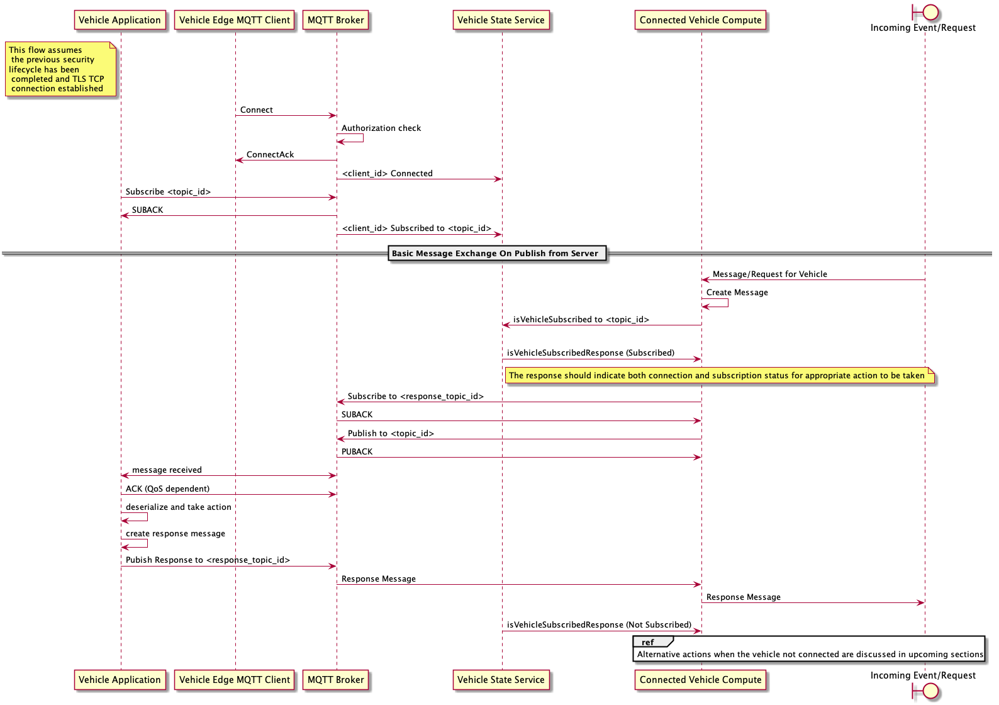

Detailed sequence diagram showing MQTT client connection states and message flow patterns.

---

## Message Definitions

### Command Cancellation Messages

**Package:** `com.vehicle.v2c.commandcancellation.v1`

#### Overview

The command cancellation protocol enables safe cancellation of in-flight remote commands and handles partial execution cleanup.

**Use Cases:**
- User changes mind after initiating command
- Command taking longer than expected
- Safety condition changed (e.g., vehicle started moving)
- System detected unsafe condition
- Timeout occurred
- Application crash/restart recovery

**Cancellation Behavior:**
- Commands can be cancelled while QUEUED or IN_PROGRESS
- Already COMPLETED commands cannot be cancelled (but may be reversed)
- Vehicle performs best-effort cancellation and cleanup
- Partial execution may occur (e.g., door unlocked before cancellation)
- Cancellation is idempotent (duplicate cancellations are safe)

**MQTT Topics:**
- Cloud → Vehicle: `v2c/v1/{region}/{vehicle_id}/command/cancel`
- Vehicle → Cloud: `v2c/v1/{region}/{vehicle_id}/command/cancel/ack`

**QoS Recommendations:**
- Cancellation request: QoS 2 (exactly once, safety-critical)
- Cancellation acknowledgment: QoS 1

#### Enums

##### CancellationReason

| Name | Value | Description |
|------|-------|-------------|
| CANCELLATION_REASON_UNKNOWN | 0 | Unknown reason |
| USER_CANCELLED | 1 | User manually cancelled |
| TIMEOUT | 2 | Command timed out |
| UNSAFE_CONDITION | 3 | Unsafe condition detected |
| VEHICLE_STATE_CHANGED | 4 | Vehicle state changed |
| SYSTEM_ERROR | 5 | System error |
| SYSTEM_RECOVERY | 6 | Application restart/recovery |
| SUPERSEDED | 7 | Superseded by newer command |
| INVALID_COMMAND | 8 | Invalid command parameters |

##### CancellationPriority

| Name | Value | Description |
|------|-------|-------------|
| CANCELLATION_PRIORITY_UNKNOWN | 0 | Unknown priority |
| NORMAL | 1 | Normal priority |
| HIGH | 2 | High priority (safety-related) |
| EMERGENCY | 3 | Emergency stop |

##### CancellationStatus

| Name | Value | Description |
|------|-------|-------------|
| CANCELLATION_STATUS_UNKNOWN | 0 | Unknown status |
| CANCELLED | 1 | Cancellation successful, command stopped |
| ALREADY_COMPLETED | 2 | Command already completed, cannot cancel |
| COMMAND_NOT_FOUND | 3 | Command not found (may have already finished) |
| FAILED | 4 | Cancellation failed |
| IN_PROGRESS | 5 | Cancellation in progress |
| PARTIAL_CANCELLATION | 6 | Partial cancellation (some actions irreversible) |

#### Messages

##### CancelCommandRequest

Cloud requests cancellation of a command.

| Field | Type | Number | Description |
|-------|------|--------|-------------|
| cancellation_id | string | 1 | Unique cancellation request ID |
| command_id | string | 2 | Command ID to cancel |
| user_id | string | 3 | User who initiated cancellation |
| reason | CancellationReason | 4 | Reason for cancellation |
| priority | CancellationPriority | 5 | Cancellation priority |
| cleanup_required | bool | 6 | Whether to perform cleanup/rollback |
| timeout_seconds | int32 | 7 | Maximum time to wait for cancellation (seconds) |
| force_cancel | bool | 8 | Force cancellation even if risky |

##### CancelCommandResponse

Vehicle acknowledges cancellation request.

| Field | Type | Number | Description |
|-------|------|--------|-------------|
| cancellation_id | string | 1 | Cancellation ID from request |
| command_id | string | 2 | Command ID that was cancelled |
| status | CancellationStatus | 3 | Cancellation status |
| command_state | CommandStateAtCancellation | 4 | Command state when cancellation received |
| cleanup_actions | repeated CleanupAction | 5 | Cleanup actions performed |
| cancellation_time_ms | int32 | 6 | Time taken to cancel (milliseconds) |
| partial_execution_occurred | bool | 7 | Whether partial execution occurred |
| partial_state_description | string | 8 | Description of partial state (if any) |

---

### Remote Command Messages

**Package:** `com.vehicle.v2c.commands.v1`

#### Message Orchestration Sequence Diagram

The following diagram shows the basic command flow from mobile app through cloud services to the vehicle.

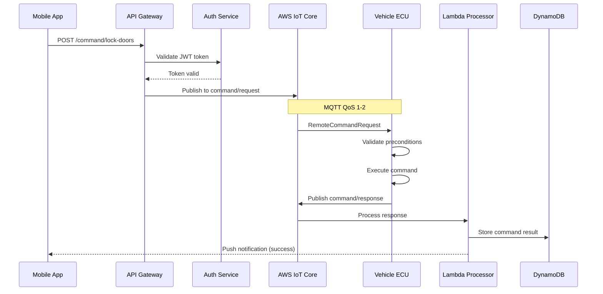

This shows the complete request/response flow for remote commands. The vehicle validates safety preconditions before execution and sends status updates back through MQTT.

**Detailed FMEA-Ready Diagram:**

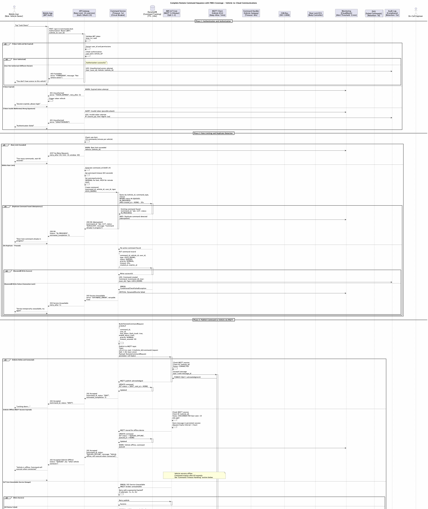
*Complete command execution flow with error handling and recovery mechanisms*

**Note:** For the complete FMEA-ready sequence diagram with all error scenarios, recovery mechanisms, and failure annotations, please refer to: `docs/sequence-diagrams/02-command-flow.puml`

---

#### Overview

The remote command protocol enables cloud-to-vehicle actionable commands with comprehensive safety checks and execution tracking.

**Security Requirements:**
- All commands MUST be authenticated with valid JWT token
- Commands MUST be logged to audit trail with user attribution
- Vehicle MUST validate command safety before execution
- Critical commands (remote start) require additional authorization
- Rate limiting: max 10 commands per vehicle per minute

**Supported Commands:**
- Lock/Unlock Doors
- Start/Stop Climate Control
- Remote Engine Start
- Horn and Lights
- Charge Control (EVs)
- Valet Mode
- Trunk Release
- Window Control

#### Enums

##### CommandPriority

| Name | Value | Description |
|------|-------|-------------|
| PRIORITY_UNKNOWN | 0 | Unknown priority |
| NORMAL | 1 | Normal user-initiated command |
| HIGH | 2 | High priority (emergency assistance) |
| CRITICAL | 3 | Critical (stolen vehicle recovery) |

##### ResponseStatus

| Name | Value | Description |
|------|-------|-------------|
| RESPONSE_STATUS_UNKNOWN | 0 | Unknown status |
| ACCEPTED | 1 | Command accepted, will execute |
| REJECTED | 2 | Command rejected due to preconditions |
| FAILED | 3 | Command execution failed |
| COMPLETED | 4 | Command completed successfully |
| DUPLICATE | 5 | Command already in progress (duplicate) |
| EXPIRED | 6 | Command expired before execution |
| CANCELLED | 7 | Command cancelled |

##### ClimateMode

| Name | Value | Description |
|------|-------|-------------|
| CLIMATE_MODE_UNKNOWN | 0 | Unknown mode |
| AUTO | 1 | Auto mode |
| COOL | 2 | Cooling mode |
| HEAT | 3 | Heating mode |
| DEFROST | 4 | Defrost mode |
| VENTILATE | 5 | Ventilation mode |

#### Messages

##### RemoteCommandRequest

Cloud sends command to vehicle.

| Field | Type | Number | Description |
|-------|------|--------|-------------|
| command_id | string | 1 | Unique command identifier (UUID) - Used for idempotency |
| user_id | string | 2 | User who initiated the command |
| lock_doors | LockDoorsCommand | 10 | Lock doors command (oneof) |
| unlock_doors | UnlockDoorsCommand | 11 | Unlock doors command (oneof) |
| start_climate | StartClimateCommand | 12 | Start climate command (oneof) |
| stop_climate | StopClimateCommand | 13 | Stop climate command (oneof) |
| horn_lights | HornLightsCommand | 14 | Horn/lights command (oneof) |
| remote_start | RemoteStartCommand | 15 | Remote start command (oneof) |
| charge_control | ChargeControlCommand | 16 | Charge control command (oneof) |
| valet_mode | ValetModeCommand | 17 | Valet mode command (oneof) |
| trunk_release | TrunkReleaseCommand | 18 | Trunk release command (oneof) |
| window_control | WindowControlCommand | 19 | Window control command (oneof) |
| priority | CommandPriority | 20 | Command priority |
| timeout_seconds | int32 | 21 | Maximum time to wait for execution (seconds) |
| expires_at | int64 | 22 | Command expiry timestamp (EPOCH milliseconds) |
| authorization_token | string | 23 | Authorization token for critical commands |

##### LockDoorsCommand

Lock all vehicle doors.

| Field | Type | Number | Description |
|-------|------|--------|-------------|
| lock_trunk | bool | 1 | Lock trunk in addition to doors |
| enable_alarm | bool | 2 | Enable alarm system after locking |
| flash_lights | bool | 3 | Flash lights to confirm lock |
| honk_horn | bool | 4 | Honk horn to confirm lock |

##### StartClimateCommand

Start climate control system.

| Field | Type | Number | Description |
|-------|------|--------|-------------|
| target_temperature_celsius | float | 1 | Target cabin temperature (Celsius, 15-30°C) |
| mode | ClimateMode | 2 | Climate mode |
| fan_speed | int32 | 3 | Fan speed (0-7, 0=auto) |
| seat_heater_enabled | bool | 4 | Enable seat heater |
| seat_heater_level | int32 | 5 | Seat heater level (1-3) |
| steering_wheel_heater_enabled | bool | 6 | Enable steering wheel heater |
| auto_shutoff_minutes | int32 | 7 | Auto shut-off time (minutes, max 30) |
| recirculation_enabled | bool | 8 | Recirculation mode |

##### RemoteCommandResponse

Vehicle acknowledges command receipt.

| Field | Type | Number | Description |
|-------|------|--------|-------------|
| command_id | string | 1 | Command ID from request |
| status | ResponseStatus | 2 | Response status |
| reason | string | 3 | If REJECTED or FAILED, reason code |
| estimated_execution_seconds | int32 | 4 | If ACCEPTED, estimated execution time |
| vehicle_state | VehicleCommandState | 5 | Current vehicle state at time of command |

---

### Common Types and Error Taxonomy

**Package:** `com.vehicle.v2c.common.v1`

#### Overview

This package defines common types, enums, and comprehensive error handling structures used across the V2C communications system. The error taxonomy is designed to support FMEA (Failure Mode and Effects Analysis) and enable systematic error handling, monitoring, and recovery.

**Design Principles:**
1. **Comprehensive Coverage**: All failure modes have distinct error codes
2. **Actionable**: Each error code has clear retry and recovery guidance
3. **Observable**: Errors are categorized for monitoring and alerting
4. **ISO 21434 Compliant**: Security-related errors are explicitly classified

#### Error Code Ranges

- **0-99**: Success and informational
- **100-199**: Client errors (vehicle-side issues)
- **200-299**: Server errors (cloud-side issues)
- **300-399**: Network and connectivity errors
- **400-499**: Security and authorization errors
- **500-599**: Data validation and protocol errors
- **600-699**: Resource exhaustion errors
- **700-799**: Business logic errors

#### Key Enums

##### ErrorCode

Comprehensive error code taxonomy covering all failure modes identified in FMEA.

| Code | Name | Retryable | Description |
|------|------|-----------|-------------|
| 0 | SUCCESS | N/A | Operation completed successfully |
| 100 | DEVICE_OFFLINE | Yes | Vehicle device is offline or unreachable |
| 101 | TIMEOUT | Yes | Request timeout - vehicle did not respond |
| 102 | COMMAND_REJECTED | No | Vehicle rejected the command (safety conditions not met) |
| 103 | INVALID_STATE | No | Vehicle is in wrong state for this operation |
| 104 | HARDWARE_FAILURE | No | Hardware failure on vehicle (requires physical repair) |
| 200 | INTERNAL_SERVER_ERROR | Yes | Internal server error (unhandled exception) |
| 201 | SERVICE_UNAVAILABLE | Yes | Service temporarily unavailable |
| 202 | DATABASE_ERROR | Yes | Database connection failed |
| 203 | MESSAGE_QUEUE_ERROR | Yes | Message queue (MQTT broker) error |
| 300 | NETWORK_ERROR | Yes | Network connection lost during operation |
| 302 | TLS_HANDSHAKE_FAILED | No | TLS/SSL handshake failed |
| 303 | CERTIFICATE_EXPIRED | No | Certificate expired |
| 400 | UNAUTHORIZED | No | Authentication failed (invalid credentials) |
| 401 | FORBIDDEN | No | Authorization failed (insufficient permissions) |
| 402 | TOKEN_EXPIRED | Yes | Invalid or expired authentication token |
| 500 | INVALID_MESSAGE_FORMAT | No | Invalid message format (protobuf parsing failed) |
| 600 | RATE_LIMIT_EXCEEDED | Yes | Rate limit exceeded (too many requests) |
| 700 | VEHICLE_NOT_FOUND | No | Vehicle not found in database |

##### ErrorSeverity

Severity classification for monitoring, alerting, and incident response.

| Name | Value | Description |
|------|-------|-------------|
| INFO | 0 | Informational - no user impact |
| WARNING | 1 | Warning - degraded functionality but operation continues |
| ERROR | 2 | Error - operation failed but system is stable |
| CRITICAL | 3 | Critical - system instability, requires immediate attention |
| FATAL | 4 | Fatal - system failure, service down |

##### QosLevel

MQTT Quality of Service levels with semantic descriptions.

| Name | Value | Use For |
|------|-------|---------|
| QOS_0 | 0 | Non-critical telemetry (periodic location) |
| QOS_1 | 1 | Important telemetry, most commands |
| QOS_2 | 2 | Safety-critical commands, billing events |

#### Key Messages

##### V2CError

Standard error structure returned in all failure scenarios.

| Field | Type | Number | Description |
|-------|------|--------|-------------|
| code | ErrorCode | 1 | Error code from ErrorCode enum |
| message | string | 2 | Human-readable error message (English) |
| timestamp | int64 | 4 | Timestamp when error occurred (EPOCH milliseconds) |
| trace_id | string | 5 | Trace ID for distributed tracing (128-bit UUID) |
| retryable | bool | 6 | Whether this error is retryable |
| severity | ErrorSeverity | 7 | Severity level of the error |

##### MessageMetadata

Metadata for all messages (distributed tracing, observability).

| Field | Type | Number | Description |
|-------|------|--------|-------------|
| message_id | string | 1 | Unique message ID (UUID) |
| correlation_id | string | 2 | Correlation ID for request/response |
| trace_id | string | 3 | Distributed tracing trace ID |
| span_id | string | 4 | Distributed tracing span ID |
| timestamp | int64 | 5 | Message creation timestamp (EPOCH milliseconds) |
| protocol_version | string | 6 | Protocol version (e.g., "1.0") |
| topic | string | 7 | MQTT topic where message was published |
| qos | QosLevel | 8 | QoS level used for this message |

##### RetryPolicy

Defines retry behavior for failed operations.

| Field | Type | Number | Description |
|-------|------|--------|-------------|
| max_attempts | int32 | 1 | Maximum number of retry attempts |
| initial_backoff_ms | int32 | 2 | Initial backoff delay in milliseconds |
| backoff_multiplier | double | 3 | Backoff multiplier for exponential backoff |
| max_backoff_ms | int32 | 4 | Maximum backoff delay in milliseconds |
| total_timeout_ms | int32 | 5 | Total timeout for all retries in milliseconds |

---

### Diagnostics Messages

**Package:** `com.vehicle.v2c.diagnostics.v1`

#### Message Orchestration Sequence Diagram

The following diagram shows the diagnostics flow from DTC detection through ML analysis to customer notification.

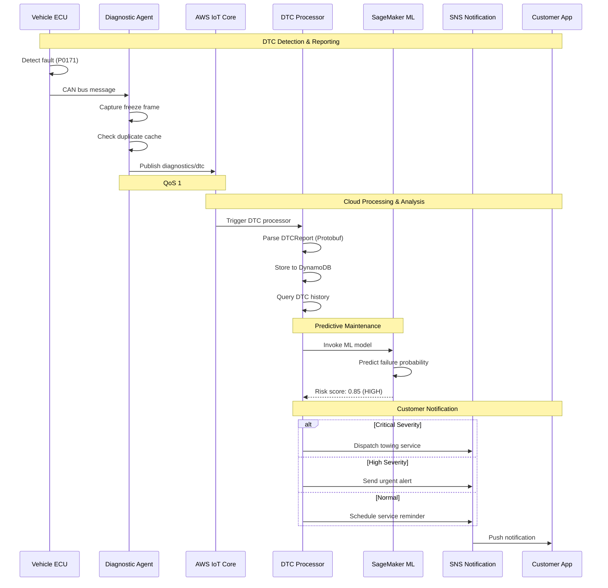

This shows DTC detection at the ECU level, intelligent deduplication, ML-based predictive maintenance analysis, and severity-based customer notification routing with warranty integration.

**Detailed FMEA-Ready Diagrams:**

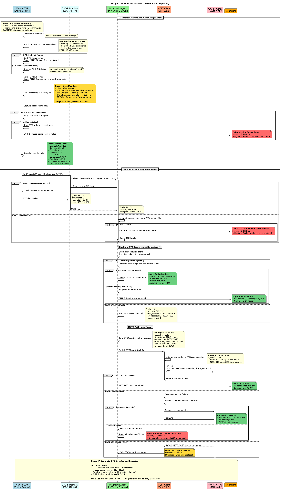
*Phase 1: DTC Detection and Reporting*

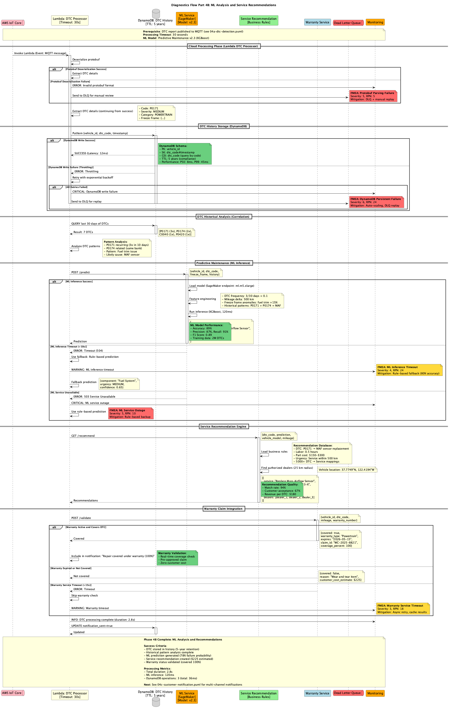
*Phase 2: Predictive Maintenance ML Analysis*


*Phase 3: Severity-Based Customer Notification*

For complete failure mode analysis, see the PlantUML source files in `docs/sequence-diagrams/`

**Note:** For the complete FMEA-ready sequence diagram with all error scenarios, recovery mechanisms, warranty validation, multi-channel notifications, and failure annotations, please refer to: `docs/sequence-diagrams/04-diagnostics-flow.puml`

---

#### Overview

The diagnostics protocol enables comprehensive vehicle diagnostic data collection including DTCs, ECU health, system snapshots, and logs.

**Use Cases:**
- Remote diagnostics and troubleshooting
- Predictive maintenance (detect issues before failure)
- Fleet health monitoring
- Warranty claim validation
- Engineering analysis (field data collection)
- Customer support assistance

**MQTT Topics:**
- Cloud → Vehicle: `v2c/v1/{region}/{vehicle_id}/diagnostics/request`
- Vehicle → Cloud: `v2c/v1/{region}/{vehicle_id}/diagnostics/dtc`
- Vehicle → Cloud: `v2c/v1/{region}/{vehicle_id}/diagnostics/snapshot`
- Vehicle → Cloud: `v2c/v1/{region}/{vehicle_id}/diagnostics/logs`
- Vehicle → Cloud: `v2c/v1/{region}/{vehicle_id}/diagnostics/health`

**QoS:** QoS 1 for all diagnostic messages

#### Key Enums

##### DTCSeverity

| Name | Value | Description |
|------|-------|-------------|
| DTC_SEVERITY_UNKNOWN | 0 | Unknown severity |
| INFO | 1 | Informational only, no action required |
| LOW | 2 | Minor issue, service recommended |
| MEDIUM | 3 | Moderate issue, service soon |
| HIGH | 4 | Serious issue, service immediately |
| CRITICAL | 5 | Critical issue, do not drive |

##### DTCStatus

| Name | Value | Description |
|------|-------|-------------|
| DTC_STATUS_UNKNOWN | 0 | Unknown status |
| ACTIVE | 1 | Currently active |
| STORED | 2 | Stored (occurred in past, not active) |
| PENDING | 3 | Pending (detected but not confirmed) |
| PERMANENT | 4 | Permanent (emissions-related, cannot be cleared) |
| CLEARED | 5 | Cleared by technician |

##### SessionType

| Name | Value | Description |
|------|-------|-------------|
| SESSION_TYPE_UNKNOWN | 0 | Unknown type |
| READ_DTCS | 1 | Read DTCs only |
| CLEAR_DTCS | 2 | Clear DTCs |
| SNAPSHOT | 3 | Full snapshot |
| CONTINUOUS_MONITORING | 4 | Continuous monitoring |
| LOG_UPLOAD | 5 | Log upload |
| ECU_HEALTH | 6 | ECU health check |
| COMPREHENSIVE | 7 | Comprehensive (all of above) |

#### Key Messages

##### DTCReport

Vehicle reports active or stored DTCs.

| Field | Type | Number | Description |
|-------|------|--------|-------------|
| report_id | string | 1 | Report identifier |
| timestamp | int64 | 2 | Report timestamp |
| report_type | DTCReportType | 3 | Report type |
| dtcs | repeated DiagnosticTroubleCode | 4 | Diagnostic trouble codes |
| total_dtc_count | int32 | 5 | Total DTC count |
| source_ecu | string | 6 | ECU that generated this report |
| mileage_km | int64 | 7 | Vehicle mileage when report generated (km) |

##### DiagnosticTroubleCode

Individual DTC details.

| Field | Type | Number | Description |
|-------|------|--------|-------------|
| code | string | 1 | DTC code (e.g., "P0171", "C0035") |
| description | string | 2 | DTC description |
| severity | DTCSeverity | 3 | DTC severity |
| category | DTCCategory | 4 | DTC category |
| status | DTCStatus | 5 | DTC status |
| first_occurrence | int64 | 6 | When DTC first occurred |
| last_occurrence | int64 | 7 | When DTC last occurred |
| occurrence_count | int32 | 8 | Number of occurrences |
| freeze_frame | FreezeFrame | 9 | Freeze frame data (snapshot when DTC set) |
| affected_system | string | 10 | Affected system/component |
| recommended_action | string | 11 | Recommended action |

##### VehicleSnapshot

Complete vehicle state capture.

| Field | Type | Number | Description |
|-------|------|--------|-------------|
| snapshot_id | string | 1 | Snapshot identifier |
| timestamp | int64 | 2 | Snapshot timestamp |
| reason | SnapshotReason | 3 | Reason for snapshot |
| trigger | string | 4 | Trigger (what caused snapshot) |
| active_dtcs | repeated DiagnosticTroubleCode | 6 | All active DTCs |
| ecu_health | repeated ECUHealth | 7 | ECU health status |
| can_bus_stats | repeated CANBusStatistics | 8 | CAN bus statistics |
| battery_health | BatteryHealth | 9 | Battery health |
| tpms | TirePressureMonitoring | 10 | Tire pressure monitoring |
| fluid_levels | FluidLevels | 11 | Fluid levels |

---

### OTA Update Messages

**Package:** `com.vehicle.v2c.ota.v1`

#### Message Orchestration Sequence Diagram

The following diagram shows the three-phase OTA update flow: notification, download, and installation.

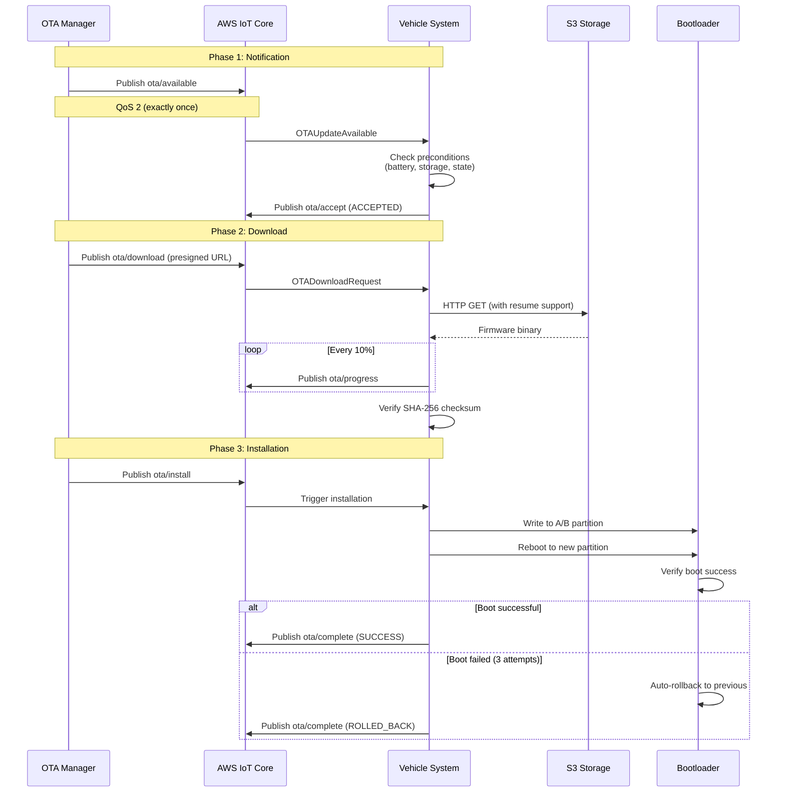

This shows the complete OTA lifecycle with three distinct phases: notification with precondition checking, secure download with progress tracking, and installation with automatic rollback protection.

**Detailed FMEA-Ready Diagrams:**

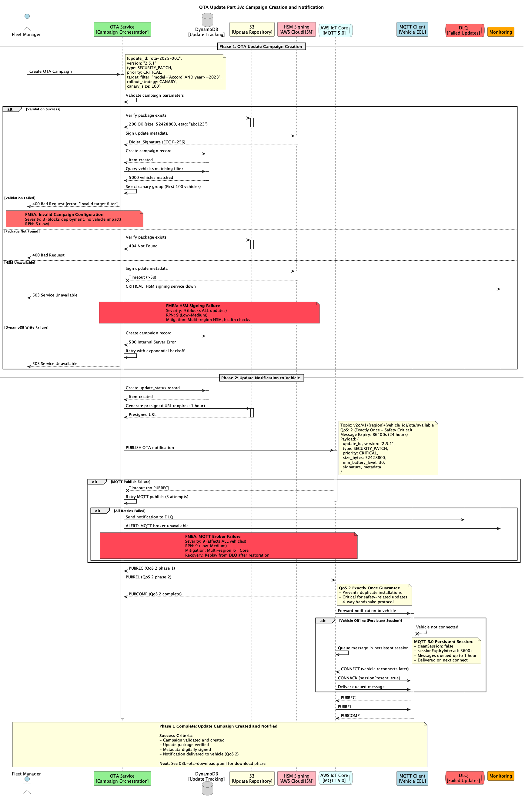
*Phase 1: Update Notification and Acceptance*

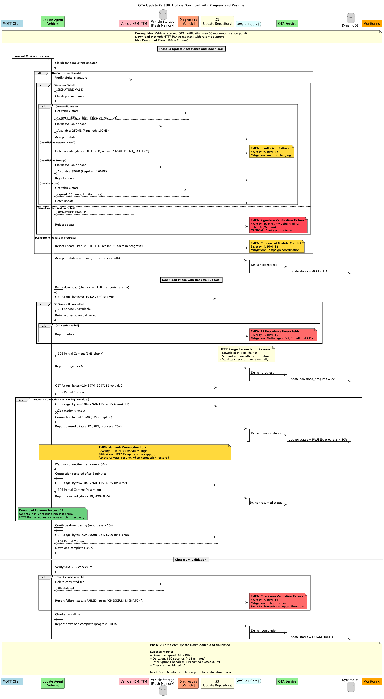
*Phase 2: Secure Download with Progress Tracking*

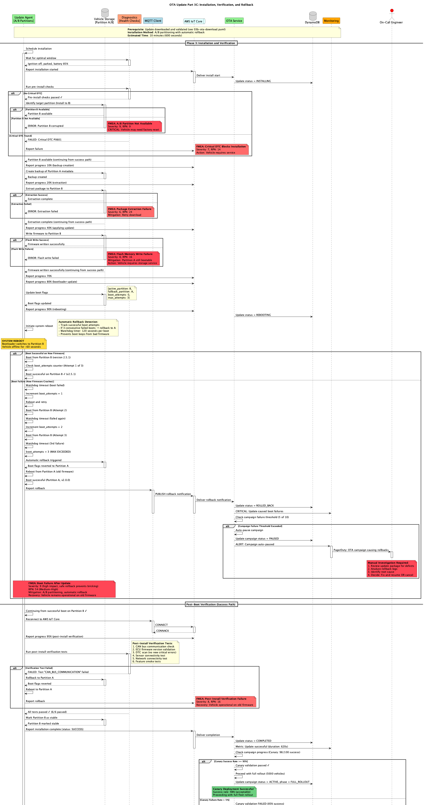
*Phase 3: Installation with Rollback Protection*

For complete failure mode analysis, see the PlantUML source files in `docs/sequence-diagrams/`

**Note:** For the complete FMEA-ready sequence diagram with all error scenarios, recovery mechanisms, canary deployment, emergency rollback, and failure annotations, please refer to: `docs/sequence-diagrams/03-ota-update-flow.puml`

---

#### Overview

The OTA (Over-The-Air) update protocol manages secure firmware and software updates for vehicle systems.

**Update Types:**
- Full system image replacement
- Incremental delta updates (smaller download)
- Security patches
- Feature updates
- Bug fixes
- Configuration changes

**MQTT Topics:**
- Cloud → Vehicle: `v2c/v1/{region}/{vehicle_id}/ota/available`
- Vehicle → Cloud: `v2c/v1/{region}/{vehicle_id}/ota/accept`
- Cloud → Vehicle: `v2c/v1/{region}/{vehicle_id}/ota/download`
- Vehicle → Cloud: `v2c/v1/{region}/{vehicle_id}/ota/progress`
- Cloud → Vehicle: `v2c/v1/{region}/{vehicle_id}/ota/install`
- Vehicle → Cloud: `v2c/v1/{region}/{vehicle_id}/ota/complete`

**QoS:** QoS 2 for all OTA control messages (safety-critical)

#### Key Enums

##### UpdatePriority

| Name | Value | Description |
|------|-------|-------------|
| PRIORITY_UNKNOWN | 0 | Unknown priority |
| LOW | 1 | Can be deferred by user |
| MEDIUM | 2 | Should be installed soon |
| HIGH | 3 | Important security or bug fix |
| CRITICAL | 4 | Critical security vulnerability, mandatory |

##### AcceptanceStatus

| Name | Value | Description |
|------|-------|-------------|
| ACCEPTANCE_UNKNOWN | 0 | Unknown status |
| ACCEPTED | 1 | Vehicle ready to download immediately |
| DEFERRED | 2 | User postponed installation |
| REJECTED | 3 | User declined update |
| PRECONDITIONS_NOT_MET | 4 | Vehicle conditions not met (battery, storage) |

##### InstallStatus

| Name | Value | Description |
|------|-------|-------------|
| INSTALL_STATUS_UNKNOWN | 0 | Unknown status |
| STARTED | 1 | Installation started |
| IN_PROGRESS | 2 | Installing in progress |
| COMPLETED | 3 | Installation completed successfully |
| FAILED | 4 | Installation failed |
| VERIFYING | 5 | Running post-installation verification |
| VERIFIED | 6 | Verification passed |
| ROLLBACK_IN_PROGRESS | 7 | Verification failed, rolling back |
| ROLLED_BACK | 8 | Rolled back to previous version |

#### Key Messages

##### OTAUpdateAvailable

Cloud notifies vehicle that update is available.

| Field | Type | Number | Description |
|-------|------|--------|-------------|
| update_id | string | 1 | Unique update identifier |
| version | string | 2 | Update version (e.g., "2.5.0") |
| update_type | UpdateType | 3 | Update type |
| priority | UpdatePriority | 4 | Update priority |
| size_bytes | int64 | 5 | Total download size (bytes) |
| release_notes | string | 6 | Release notes (markdown) |
| min_battery_level | int32 | 7 | Minimum battery level required (percentage) |
| can_install_while_driving | bool | 8 | Can install while vehicle is driving |
| estimated_install_time_sec | int32 | 9 | Estimated installation time (seconds) |
| expires_at | int64 | 10 | Update offer expiry timestamp |

##### OTADownloadProgress

Vehicle reports download progress.

| Field | Type | Number | Description |
|-------|------|--------|-------------|
| update_id | string | 1 | Update identifier |
| status | DownloadStatus | 2 | Download status |
| bytes_downloaded | int64 | 3 | Bytes downloaded so far |
| total_bytes | int64 | 4 | Total bytes to download |
| speed_bps | int64 | 5 | Current download speed (bytes/second) |
| eta_seconds | int32 | 6 | Estimated time to completion (seconds) |

---

### Telemetry Messages

**Package:** `com.vehicle.v2c.telemetry.v1` and `com.vehicle.v2c.telemetrybatch.v1`

#### Message Orchestration Sequence Diagram

The following diagram shows the basic telemetry flow from vehicle sensors through MQTT to cloud storage.

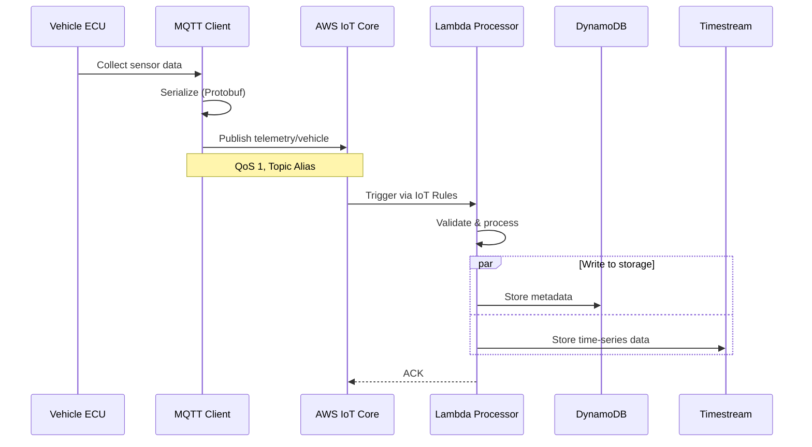

This shows the primary telemetry publishing flow with real-time sensor data collection, Protocol Buffers serialization, and parallel storage to DynamoDB and Timestream. Topic aliases provide 96% bandwidth savings.

**Detailed FMEA-Ready Diagrams:**

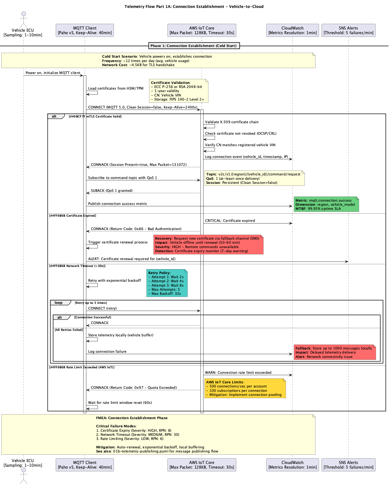
*Phase 1: Connection Establishment and Session Management*

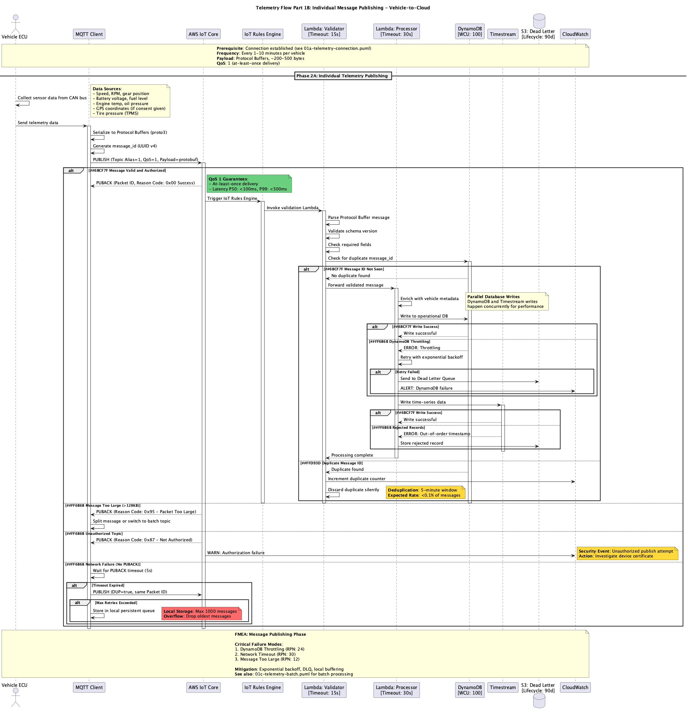
*Phase 2: Individual Message Publishing with Error Handling*

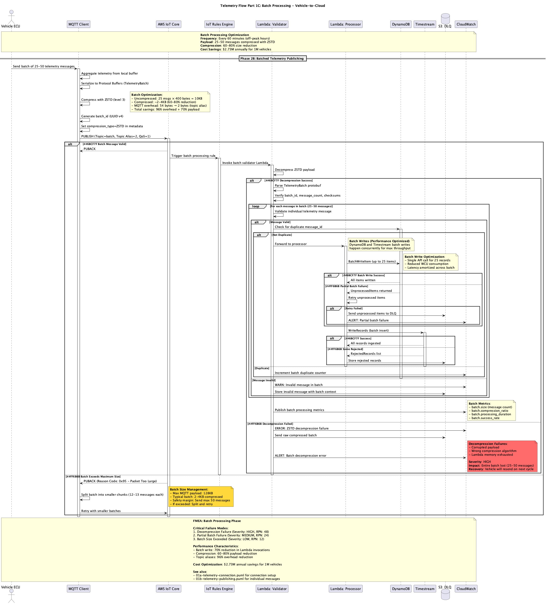
*Phase 3: Batch Processing for Bandwidth Optimization*

For complete failure mode analysis, see the PlantUML source files in `docs/sequence-diagrams/`

**Note:** For the complete FMEA-ready sequence diagram with all error scenarios, recovery mechanisms, batching optimization, and failure annotations, please refer to: `docs/sequence-diagrams/01-telemetry-flow.puml`

---

#### Overview

The telemetry protocol handles real-time and batched vehicle sensor data transmission.

**Message Types:**
- Individual telemetry (real-time)
- Batch telemetry (bandwidth optimized)

**Data Categories:**
- Powertrain (engine, transmission)
- Body (doors, lights, wipers)
- Chassis (suspension, brakes, steering)
- ADAS (cameras, radar, sensors)
- Infotainment (media, navigation)
- Electrical (battery, alternator)

**MQTT Topics:**
- Vehicle → Cloud: `v2c/v1/{region}/{vehicle_id}/telemetry/vehicle`
- Vehicle → Cloud: `v2c/v1/{region}/{vehicle_id}/telemetry/batch`

**QoS:** QoS 1 (at least once delivery)

#### Key Messages

##### VehicleTelemetry

Real-time vehicle sensor data.

| Field | Type | Number | Description |
|-------|------|--------|-------------|
| metadata | MessageMetadata | 1 | Message metadata |
| speed | float | 2 | Vehicle speed (km/h) |
| engine_rpm | int32 | 3 | Engine RPM |
| fuel_level | float | 4 | Fuel level (percentage) |
| battery_voltage | float | 5 | 12V battery voltage |
| coolant_temp | float | 6 | Engine coolant temperature (Celsius) |
| odometer | int64 | 7 | Odometer reading (km) |
| gear | string | 8 | Current gear position |
| throttle_position | float | 9 | Throttle position (percentage) |
| location | Location | 10 | GPS location |

##### TelemetryBatch

Aggregated telemetry messages for bandwidth optimization.

| Field | Type | Number | Description |
|-------|------|--------|-------------|
| batch_id | string | 1 | Unique batch identifier |
| batch_timestamp | int64 | 2 | Batch creation timestamp |
| message_count | int32 | 3 | Number of messages in batch |
| telemetry_messages | repeated VehicleTelemetry | 4 | Telemetry messages |
| compression | CompressionType | 5 | Compression algorithm used |
| time_range | TimeRange | 6 | Time range covered by batch |

---

## Related Documentation

- [Security Standards (ISO 21434 TARA)](security/ISO_21434_TARA.md)
- [Topic Naming Convention](standards/TOPIC_NAMING_CONVENTION.md)
- [QoS Selection Guide](standards/QOS_SELECTION_GUIDE.md)
- [FMEA: Remote Door Lock](fmea/FMEA_REMOTE_DOOR_LOCK.md)
- [MQTT 5.0 Specification](https://docs.oasis-open.org/mqtt/mqtt/v5.0/mqtt-v5.0.html)
- [Protocol Buffers Documentation](https://developers.google.com/protocol-buffers)

---

**Last Updated:** 2025-10-09
**API Version:** 1.0.0
**Support:** v2c-support@example.com
