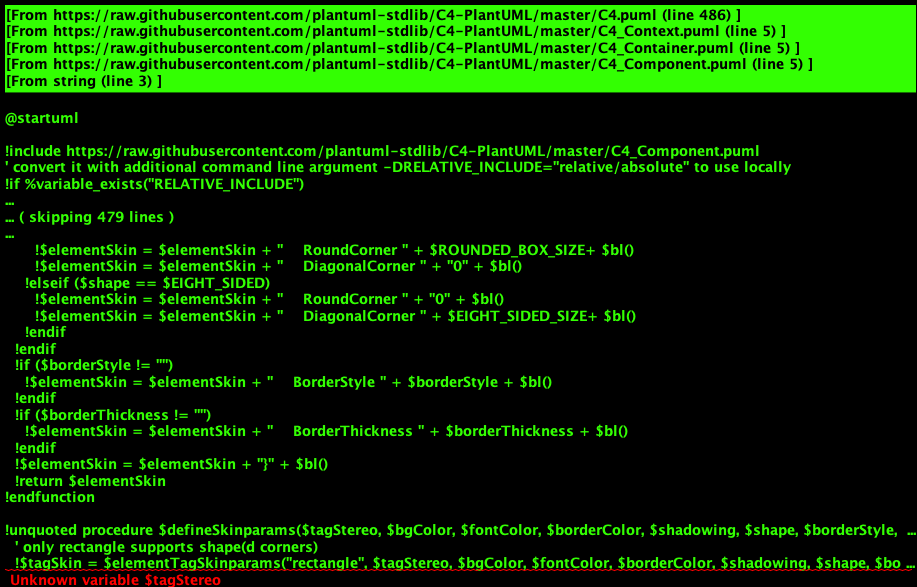
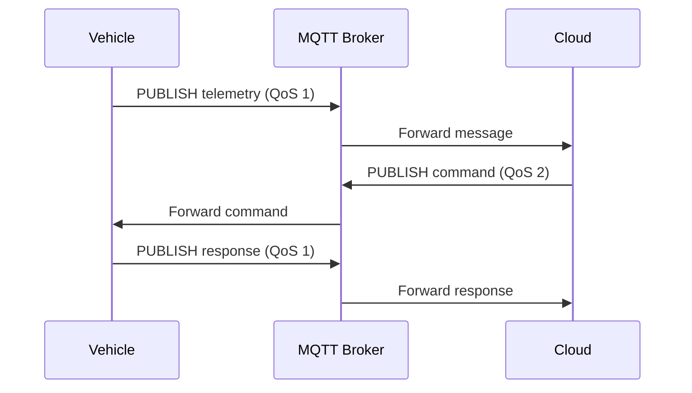

# Documentation Solutions for V2C MQTT/Proto Specs

**Problem Statement:** Proto files are being misidentified as "gRPC services" when they're actually MQTT message definitions. PlantUML diagrams aren't rendering. Need better presentation of API specs, message topics, and sequence diagrams.

---

## Table of Contents

1. [Current Issues](#current-issues)
2. [Solution 1: AsyncAPI (RECOMMENDED)](#solution-1-asyncapi-recommended)
3. [Solution 2: Protobuf Documentation Generators](#solution-2-protobuf-documentation-generators)
4. [Solution 3: PlantUML Diagram Rendering](#solution-3-plantuml-diagram-rendering)
5. [Solution 4: Custom Documentation Site](#solution-4-custom-documentation-site)
6. [Implementation Roadmap](#implementation-roadmap)

---

## Current Issues

### Issue 1: Proto Files Misidentified as gRPC

**Problem:**
- Repository shows "189 gRPC services"
- Proto files are MQTT message definitions using Protocol Buffers, NOT gRPC RPCs
- No gRPC service definitions (no `service` keyword in proto files)

**Why This Happens:**
```javascript
// API detection logic assumes proto = gRPC
if (filename.endsWith('.proto')) {
  apiTypes.hasGrpc = true;  // ❌ WRONG for MQTT protos
}
```

**Correct Classification:**
- These are **AsyncAPI/MQTT message schemas** using Protocol Buffers for serialization
- NOT synchronous request/response RPC services

### Issue 2: PlantUML Diagrams Not Rendering

**Problem:**
- Sequence diagrams exist in `docs/` but don't appear in catalog
- PlantUML `.puml` files need server-side rendering
- Static markdown can't display dynamic diagrams

**Affected Files:**
```
src/main/doc/puml/
├── C4_Project_Architecture.puml
├── HighLow.puml
├── VehicleMessageHeader.puml
├── mqtt_client_message_life_cycle.puml
└── aws_plant_example.puml
```

### Issue 3: No Interactive API Documentation

**Problem:**
- No browsable, searchable API documentation
- No "try it out" capability for MQTT topics
- Difficult to understand message flows and topic hierarchies

---

## Solution 1: AsyncAPI (RECOMMENDED) ✅

### Overview

**AsyncAPI** is the industry standard for documenting event-driven/message-based APIs. It's the "OpenAPI/Swagger for async protocols" (MQTT, Kafka, WebSocket, AMQP).

**Website:** https://www.asyncapi.com/

### Why AsyncAPI?

| Feature | AsyncAPI | gRPC Docs | Custom Docs |
|---------|----------|-----------|-------------|
| **MQTT Support** | ✅ Native | ❌ No | ⚠️ Manual |
| **Topic Hierarchy** | ✅ Built-in | ❌ No | ⚠️ Manual |
| **Pub/Sub Model** | ✅ Native | ❌ No | ⚠️ Manual |
| **Interactive UI** | ✅ Yes | ⚠️ Limited | ⚠️ Manual |
| **Message Examples** | ✅ Yes | ⚠️ Limited | ⚠️ Manual |
| **Protocol Buffers** | ✅ Supported | ✅ Yes | ⚠️ Manual |
| **Auto-generation** | ✅ Yes | ✅ Yes | ❌ No |
| **Industry Standard** | ✅ Yes | ⚠️ For RPC | ❌ No |

### What We've Created

**File:** `asyncapi.yaml` (470 lines)

**Contents:**
- 8 MQTT topics (telemetry, commands, OTA, diagnostics)
- 10 operations (publish/subscribe)
- Protocol Buffer message schemas
- AWS IoT Core server configuration
- mTLS security scheme
- Message examples with payloads
- QoS specifications per topic

### How to Use

#### Option A: AsyncAPI Studio (Web-based)

1. Visit https://studio.asyncapi.com/
2. Load `asyncapi.yaml`
3. Get instant interactive documentation

**Features:**
- Visual topic hierarchy
- Message payload viewer
- Security scheme documentation
- Server endpoint configuration
- Export to HTML/PDF

#### Option B: AsyncAPI Generator (Static Site)

```bash
# Install AsyncAPI generator
npm install -g @asyncapi/generator

# Generate HTML documentation
ag asyncapi.yaml @asyncapi/html-template -o docs/asyncapi-html

# Generate Markdown documentation
ag asyncapi.yaml @asyncapi/markdown-template -o docs/asyncapi-md

# Generate React component
ag asyncapi.yaml @asyncapi/react-template -o docs/asyncapi-react
```

**Output Example:**
```
docs/asyncapi-html/
├── index.html          # Main documentation page
├── css/
├── js/
└── assets/

View at: file:///path/to/docs/asyncapi-html/index.html
```

#### Option C: AsyncAPI React Component (Embedded)

```bash
# Install React component
npm install @asyncapi/react-component

# Embed in your app
import AsyncApiComponent from '@asyncapi/react-component';
import asyncapi from './asyncapi.yaml';

<AsyncApiComponent schema={asyncapi} />
```

#### Option D: AsyncAPI in Axiom Loom Catalog

**Update `src/api/dynamicApiDetection.js`:**

```javascript
// Add AsyncAPI detection
export const detectAsyncAPI = (repoPath) => {
  const asyncapiPath = path.join(repoPath, 'asyncapi.yaml');
  if (fs.existsSync(asyncapiPath)) {
    return {
      type: 'asyncapi',
      spec: yaml.load(fs.readFileSync(asyncapiPath, 'utf8')),
      path: asyncapiPath
    };
  }
  return null;
};
```

**Update repository metadata:**

```json
{
  "vehicle-to-cloud-communications-architecture": {
    "apiTypes": {
      "hasOpenAPI": false,
      "hasGraphQL": false,
      "hasGrpc": false,       // ❌ Change to false
      "hasAsyncAPI": true,    // ✅ Add this
      "hasPostman": false
    },
    "asyncApiSpec": "asyncapi.yaml"
  }
}
```

### AsyncAPI Documentation Preview

**What it looks like:**

```
┌─────────────────────────────────────────────────────────────┐
│  Vehicle-to-Cloud Communications API v1.0.0                 │
├─────────────────────────────────────────────────────────────┤
│  Servers                                                     │
│  ├─ production-us-east-1                                     │
│  │   └─ mqtts://a1b2c3d4.iot.us-east-1.amazonaws.com       │
│  └─ production-eu-west-1                                     │
│      └─ mqtts://h8i9j0k1.iot.eu-west-1.amazonaws.com       │
├─────────────────────────────────────────────────────────────┤
│  Channels                                                    │
│  ├─ v2c/v1/{region}/{vehicle_id}/telemetry/vehicle  (QoS 1) │
│  │   └─ Message: VehicleTelemetry                           │
│  ├─ v2c/v1/{region}/{vehicle_id}/telemetry/batch    (QoS 1) │
│  │   └─ Message: TelemetryBatch                             │
│  ├─ v2c/v1/{region}/{vehicle_id}/command/request    (QoS 1) │
│  │   └─ Message: RemoteCommandRequest                       │
│  ├─ v2c/v1/{region}/{vehicle_id}/ota/available      (QoS 2) │
│  │   └─ Message: OTAUpdateAvailable                         │
│  └─ ... (8 total channels)                                  │
├─────────────────────────────────────────────────────────────┤
│  Operations                                                  │
│  ├─ publishTelemetry (send)                                 │
│  │   └─ Channel: vehicleTelemetry                           │
│  ├─ receiveCommand (receive)                                │
│  │   └─ Channel: commandRequest                             │
│  └─ ... (10 total operations)                               │
└─────────────────────────────────────────────────────────────┘
```

---

## Solution 2: Protobuf Documentation Generators

### Option A: protoc-gen-doc

**Best for:** Professional HTML/Markdown documentation from proto files

```bash
# Install
go install github.com/pseudomuto/protoc-gen-doc/cmd/protoc-gen-doc@latest

# Generate HTML documentation
protoc --doc_out=./docs/proto-html \
       --doc_opt=html,index.html \
       src/main/proto/V2C/*.proto

# Generate Markdown documentation
protoc --doc_out=./docs/proto-md \
       --doc_opt=markdown,proto-spec.md \
       src/main/proto/V2C/*.proto
```

**Output Example:**

```markdown
# Protocol Documentation

## Table of Contents

- [OTA.proto](#ota-proto)
  - [OTAUpdateAvailable](#otaupdateavailable)
  - [OTAUpdateAccept](#otaupdateaccept)
  - [UpdateType](#updatetype)
  - [UpdatePriority](#updatepriority)

## OTA.proto

### OTAUpdateAvailable

Notifies vehicle that a software update is available

| Field | Type | Label | Description |
|-------|------|-------|-------------|
| update_id | string | | Unique update identifier (UUID) |
| version | string | | Human-readable version (e.g., "2.5.0") |
| update_type | UpdateType | | Update type |
| priority | UpdatePriority | | Update priority |
| size_bytes | int64 | | Package size in bytes |
```

**Customizable Templates:**

```bash
# Create custom template
cat > proto-template.tmpl << 'EOF'
# {{.Name}}

{{range .Messages}}
## {{.LongName}}

{{.Description}}

### Fields
{{range .Fields}}
- **{{.Name}}**: {{.Description}}
{{end}}
{{end}}
EOF

# Use custom template
protoc --doc_out=./docs \
       --doc_opt=proto-template.tmpl,index.md \
       src/main/proto/V2C/*.proto
```

### Option B: buf.build

**Best for:** Modern proto tooling with hosted documentation

```bash
# Install buf
brew install bufbuild/buf/buf

# Create buf.yaml
cat > buf.yaml << 'EOF'
version: v1
name: buf.build/jamesenki/v2c
deps:
  - buf.build/googleapis/googleapis
breaking:
  use:
    - FILE
lint:
  use:
    - DEFAULT
EOF

# Generate docs
buf generate

# Push to buf.build for hosted docs
buf push
```

**Hosted Docs URL:**
```
https://buf.build/jamesenki/v2c/docs/main:com.vehicle.v2c.ota.v1
```

### Option C: grpc-gateway (HTTP/JSON Proxy)

**Note:** Only useful if you want to expose MQTT messages via HTTP/REST

```protobuf
import "google/api/annotations.proto";

service VehicleTelemetryService {
  rpc SendTelemetry(VehicleTelemetry) returns (google.protobuf.Empty) {
    option (google.api.http) = {
      post: "/v1/telemetry"
      body: "*"
    };
  }
}
```

**Not Recommended:** This changes the architecture from MQTT to HTTP, defeating the purpose.

---

## Solution 3: PlantUML Diagram Rendering

### Problem

PlantUML diagrams (`.puml` files) need server-side rendering to display in browsers.

### Option A: Pre-render to PNG/SVG (RECOMMENDED)

```bash
# Install PlantUML
brew install plantuml

# Render all diagrams to PNG
cd src/main/doc/puml
for file in *.puml; do
  plantuml -tpng "$file"
done

# Render to SVG (scalable, better quality)
for file in *.puml; do
  plantuml -tsvg "$file"
done

# Output
C4_Project_Architecture.png
HighLow.png
VehicleMessageHeader.png
mqtt_client_message_life_cycle.png
```

**Advantages:**
- ✅ Works in any browser
- ✅ No server required
- ✅ Fast loading
- ✅ Can be embedded in markdown

**Update README.md:**

```markdown
## Architecture Diagrams

### Project Architecture


### MQTT Client Lifecycle

```

### Option B: PlantUML Server

**Best for:** Dynamic diagrams that change frequently

```bash
# Run PlantUML server with Docker
docker run -d -p 8080:8080 plantuml/plantuml-server:latest

# Access rendered diagrams
http://localhost:8080/png/[encoded-diagram]
```

**Embed in HTML:**

```html

```

### Option C: GitHub Actions Auto-render

**Automate diagram rendering on every commit:**

```yaml
# .github/workflows/render-diagrams.yml
name: Render PlantUML Diagrams

on:
  push:
    paths:
      - '**.puml'

jobs:
  render:
    runs-on: ubuntu-latest
    steps:
      - uses: actions/checkout@v3

      - name: Render PlantUML
        uses: grassedge/generate-plantuml-action@v1.5
        with:
          path: src/main/doc/puml
          message: "Auto-render PlantUML diagrams"

      - name: Commit rendered images
        uses: stefanzweifel/git-auto-commit-action@v4
        with:
          commit_message: "chore: Auto-render PlantUML diagrams"
```

**Result:** Every `.puml` edit automatically generates PNG/SVG

### Option D: Mermaid (Alternative to PlantUML)

**Advantages:**
- Native GitHub/GitLab rendering
- No server required
- Simpler syntax

**Convert PlantUML to Mermaid:**



**Embed in Markdown:**

```markdown
```mermaid
sequenceDiagram
    ...
```
```

**Renders automatically on GitHub!**

---

## Solution 4: Custom Documentation Site

### Option A: Docusaurus (Facebook)

**Best for:** Comprehensive documentation site with versioning

```bash
# Create Docusaurus site
npx create-docusaurus@latest docs-site classic

# Add AsyncAPI plugin
cd docs-site
npm install @docusaurus/preset-classic
npm install @asyncapi/react-component

# Configure
cat > docusaurus.config.js << 'EOF'
module.exports = {
  title: 'V2C API Documentation',
  tagline: 'Vehicle-to-Cloud Communications',
  url: 'https://v2c-api-docs.com',
  baseUrl: '/',
  presets: [
    ['@docusaurus/preset-classic', {
      docs: {
        sidebarPath: require.resolve('./sidebars.js'),
      },
    }],
  ],
};
EOF

# Build
npm run build

# Deploy to GitHub Pages
npm run deploy
```

**Features:**
- ✅ Versioned docs
- ✅ Search
- ✅ Dark mode
- ✅ Mobile-friendly
- ✅ MDX support (React components in markdown)

### Option B: MkDocs (Python)

**Best for:** Markdown-first documentation

```bash
# Install
pip install mkdocs mkdocs-material

# Create site
mkdocs new docs-site
cd docs-site

# Configure
cat > mkdocs.yml << 'EOF'
site_name: V2C API Documentation
theme:
  name: material
  features:
    - navigation.tabs
    - navigation.sections
    - toc.integrate

nav:
  - Home: index.md
  - API Reference:
    - Overview: api/overview.md
    - Telemetry: api/telemetry.md
    - Commands: api/commands.md
    - OTA Updates: api/ota.md
    - Diagnostics: api/diagnostics.md
  - Proto Specs:
    - OTA.proto: proto/ota.md
    - Commands.proto: proto/commands.md
  - Diagrams:
    - Architecture: diagrams/architecture.md
    - Sequences: diagrams/sequences.md

markdown_extensions:
  - pymdownx.superfences:
      custom_fences:
        - name: mermaid
          class: mermaid
          format: !!python/name:pymdownx.superfences.fence_code_format
EOF

# Build
mkdocs build

# Serve locally
mkdocs serve

# Deploy to GitHub Pages
mkdocs gh-deploy
```

**Deployment URL:**
```
https://jamesenki.github.io/vehicle-to-cloud-communications-architecture/
```

### Option C: Redocly

**Best for:** API-first documentation with AsyncAPI support

```bash
# Install
npm install -g @redocly/cli

# Generate docs from AsyncAPI
redocly build-docs asyncapi.yaml

# Output: dist/index.html
```

---

## Implementation Roadmap

### Phase 1: Quick Wins (1-2 hours)

1. **Pre-render PlantUML diagrams to PNG**
```bash
cd src/main/doc/puml
for file in *.puml; do plantuml -tpng "$file"; done
```

2. **Update repository metadata**
```json
{
  "apiTypes": {
    "hasGrpc": false,
    "hasAsyncAPI": true
  },
  "asyncApiSpec": "asyncapi.yaml"
}
```

3. **Commit AsyncAPI spec**
```bash
git add asyncapi.yaml
git commit -m "feat: Add AsyncAPI 3.0 specification for MQTT topics"
git push
```

### Phase 2: AsyncAPI Integration (2-4 hours)

1. **Generate static HTML docs**
```bash
npx @asyncapi/generator asyncapi.yaml @asyncapi/html-template -o docs/asyncapi
```

2. **Add AsyncAPI viewer to catalog**
```javascript
// src/components/AsyncAPIViewer.tsx
import AsyncApiComponent from '@asyncapi/react-component';

export const AsyncAPIViewer = ({ repoName }) => {
  const [spec, setSpec] = useState(null);

  useEffect(() => {
    fetch(`/api/repo/${repoName}/asyncapi.yaml`)
      .then(res => res.text())
      .then(yaml => setSpec(yaml));
  }, [repoName]);

  return spec ? <AsyncApiComponent schema={spec} /> : <Loading />;
};
```

3. **Update routing**
```typescript
<Route path="/asyncapi/:repoName" element={<AsyncAPIViewer />} />
```

### Phase 3: Proto Documentation (2-3 hours)

1. **Install protoc-gen-doc**
```bash
go install github.com/pseudomuto/protoc-gen-doc/cmd/protoc-gen-doc@latest
```

2. **Generate proto docs**
```bash
protoc --doc_out=./docs/proto \
       --doc_opt=html,index.html \
       src/main/proto/V2C/*.proto
```

3. **Link from AsyncAPI**
```yaml
externalDocs:
  description: Detailed Protocol Buffer Message Specifications
  url: /docs/proto/index.html
```

### Phase 4: Full Documentation Site (4-8 hours)

1. **Create Docusaurus site**
```bash
npx create-docusaurus@latest v2c-docs classic
```

2. **Add content**
- API reference (from API_REFERENCE.md)
- Proto specs (generated)
- Sequence diagrams (rendered PNG)
- Security docs (CERTIFICATE_LIFECYCLE.md, ISO_21434_TARA.md)

3. **Deploy to GitHub Pages**
```bash
npm run deploy
```

---

## Recommended Solution

**✅ Immediate (Day 1):**
1. Add `asyncapi.yaml` to repository ✅ (Already done)
2. Pre-render PlantUML diagrams to PNG
3. Update repository metadata to show AsyncAPI instead of gRPC

**✅ Short-term (Week 1):**
1. Generate AsyncAPI HTML documentation
2. Add AsyncAPI viewer to Axiom Loom Catalog
3. Generate protobuf HTML docs with protoc-gen-doc

**✅ Long-term (Month 1):**
1. Create full Docusaurus documentation site
2. Automate diagram rendering with GitHub Actions
3. Deploy to GitHub Pages

---

## Comparison Matrix

| Solution | Setup Time | Maintenance | Interactive | Standards-based | GitHub Integration |
|----------|------------|-------------|-------------|-----------------|-------------------|
| **AsyncAPI** | ⚡ 1 hour | ⭐ Low | ✅ Yes | ✅ Industry standard | ✅ Excellent |
| **protoc-gen-doc** | ⚡ 30 min | ⭐ Low | ❌ No | ⚠️ Proto-specific | ✅ Good |
| **PlantUML PNG** | ⚡ 15 min | ⭐ Low | ❌ No | ⚠️ Diagrams only | ✅ Perfect |
| **Docusaurus** | ⏱️ 4 hours | ⭐⭐ Medium | ✅ Yes | ⚠️ Custom | ✅ Excellent |
| **MkDocs** | ⏱️ 2 hours | ⭐ Low | ❌ No | ⚠️ Custom | ✅ Good |

---

## Next Steps

1. ✅ Review `asyncapi.yaml` specification
2. ⏳ Pre-render PlantUML diagrams
3. ⏳ Update repository metadata
4. ⏳ Generate AsyncAPI HTML docs
5. ⏳ Add AsyncAPI viewer to catalog

**Let me know which solution you'd like to implement first!**
