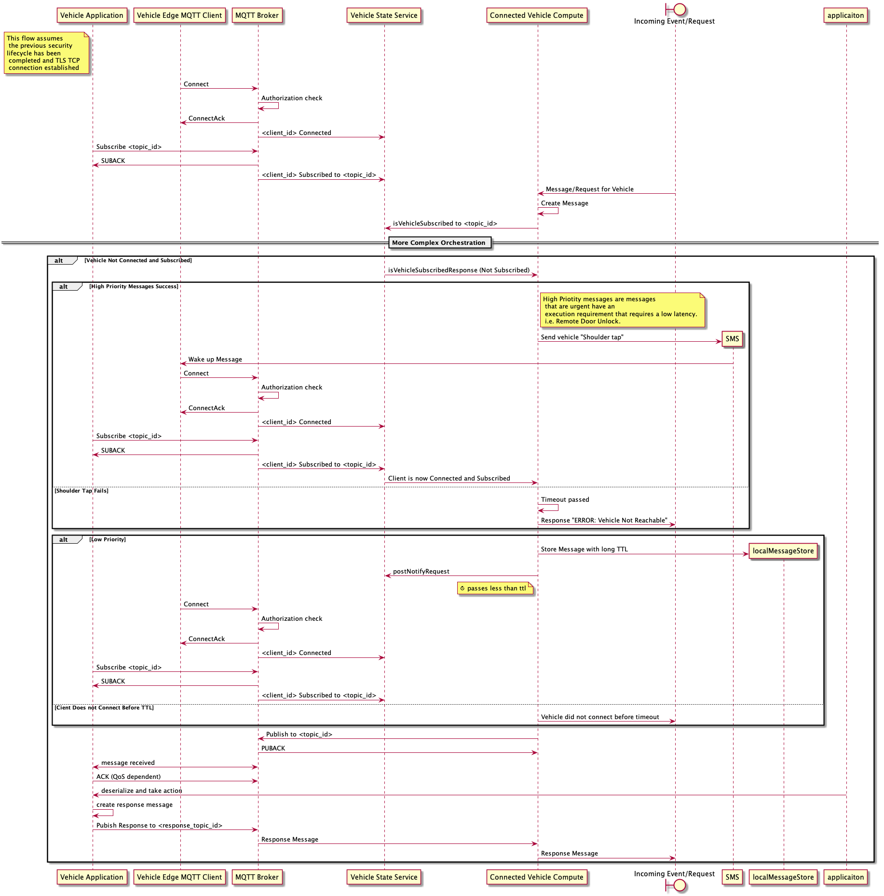
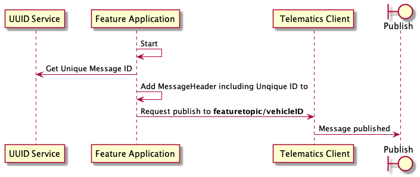
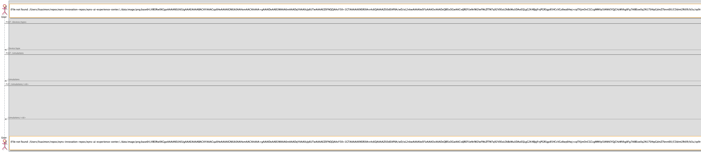

# Protocol Buffer Message Specifications

> Vehicle-to-Cloud Communications Architecture - MQTT Message Definitions

## Overview

This document provides comprehensive documentation for all Protocol Buffer message definitions used in the Vehicle-to-Cloud communications architecture. These messages are serialized and transmitted over MQTT 5.0 protocol as defined in the AsyncAPI specification.

## MQTT Topics

The following MQTT topics are used for publishing and subscribing to vehicle messages:

| Topic Pattern | QoS | Direction | Description |
|--------------|-----|-----------|-------------|
| `v2c/v1/{region}/{vehicle_id}/telemetry/vehicle` | 1 | Publish | Real-time vehicle sensor data published by the vehicle |
| `v2c/v1/{region}/{vehicle_id}/telemetry/batch` | 1 | Publish | Aggregated telemetry messages for bandwidth optimization (96% savings) |
| `v2c/v1/{region}/{vehicle_id}/command/request` | 1 | Subscribe | Cloud sends remote commands to vehicle (lock doors, start climate, etc.) |
| `v2c/v1/{region}/{vehicle_id}/command/response` | 1 | Publish | Vehicle acknowledges and reports command execution status |
| `v2c/v1/{region}/{vehicle_id}/ota/available` | 2 | Subscribe | Cloud notifies vehicle that a software update is available |
| `v2c/v1/{region}/{vehicle_id}/ota/accept` | 1 | Publish | Vehicle accepts or defers the update offer |
| `v2c/v1/{region}/{vehicle_id}/ota/progress` | 1 | Publish | Vehicle reports download and installation progress |
| `v2c/v1/{region}/{vehicle_id}/diagnostics/dtc` | 1 | Publish | Vehicle reports active or stored DTCs with freeze frames |

## Architecture Diagrams

### C4 Project Architecture


### HighLow



### VehicleMessageHeader



### Aws Plant Example



### Mqtt Client Message Life Cycle


## Message Definitions

### Package: `com.vehicle.v2c.commandcancellation.v1`

#### Enum: CancellationReason

| Name | Value | Description |
|------|-------|-------------|
| CANCELLATION_REASON_UNKNOWN | 0 |  |
| USER_CANCELLED | 1 | User manually cancelled |
| TIMEOUT | 2 | Command timed out |
| UNSAFE_CONDITION | 3 | Unsafe condition detected |
| VEHICLE_STATE_CHANGED | 4 | Vehicle state changed |
| SYSTEM_ERROR | 5 | System error |
| SYSTEM_RECOVERY | 6 | Application restart/recovery |
| SUPERSEDED | 7 | Superseded by newer command |
| INVALID_COMMAND | 8 | Invalid command parameters |

#### Enum: CancellationPriority

| Name | Value | Description |
|------|-------|-------------|
| CANCELLATION_PRIORITY_UNKNOWN | 0 |  |
| NORMAL | 1 | Normal priority |
| HIGH | 2 | High priority (safety-related) |
| EMERGENCY | 3 | Emergency stop |

#### Enum: CancellationStatus

| Name | Value | Description |
|------|-------|-------------|
| CANCELLATION_STATUS_UNKNOWN | 0 |  |
| CANCELLED | 1 | Cancellation successful, command stopped |
| ALREADY_COMPLETED | 2 | Command already completed, cannot cancel |
| COMMAND_NOT_FOUND | 3 | Command not found (may have already finished) |
| FAILED | 4 | Cancellation failed |
| IN_PROGRESS | 5 | Cancellation in progress |
| PARTIAL_CANCELLATION | 6 | Partial cancellation (some actions irreversible) |

#### Enum: ExecutionStatus

| Name | Value | Description |
|------|-------|-------------|
| EXECUTION_STATUS_UNKNOWN | 0 |  |
| QUEUED | 1 |  |
| IN_PROGRESS | 2 |  |
| COMPLETED | 3 |  |
| FAILED | 4 |  |

#### Enum: CleanupActionType

| Name | Value | Description |
|------|-------|-------------|
| CLEANUP_ACTION_UNKNOWN | 0 |  |
| ROLLBACK | 1 | Rolled back partial changes |
| RELEASE_RESOURCES | 2 | Released resources (locks, connections) |
| RESET_ACTUATORS | 3 | Reset actuators to safe state |
| CLEAR_STATE | 4 | Cleared internal state |
| LOG_EVENT | 5 | Logged cancellation event |
| NOTIFY_SYSTEMS | 6 | Notified other systems |

#### Enum: ReversalReason

| Name | Value | Description |
|------|-------|-------------|
| REVERSAL_REASON_UNKNOWN | 0 |  |
| USER_CHANGED_MIND | 1 | User changed mind |
| INCORRECT_EXECUTION | 2 | Command executed incorrectly |
| UNINTENDED_CONSEQUENCE | 3 | Unintended consequence |
| TEST_REVERSAL | 4 | Testing/development |
| SAFETY_REVERSAL | 5 | Safety reason |

#### Enum: ReversalStatus

| Name | Value | Description |
|------|-------|-------------|
| REVERSAL_STATUS_UNKNOWN | 0 |  |
| REVERSED | 1 | Successfully reversed |
| REVERSAL_COMMAND_CREATED | 2 | Reversal command created and queued |
| NOT_REVERSIBLE | 3 | Original command not reversible |
| COMMAND_NOT_FOUND | 4 | Original command not found |
| FAILED | 5 | Reversal failed |
| PARTIAL_REVERSAL | 6 | Partial reversal |

#### Message: CancelCommandRequest

# Command Cancellation Protocol  This file defines the protocol for canceling in-flight remote commands and handling partial execution cleanup.  ## Use Cases - User changes mind after initiating command - Command taking longer than expected - Safety condition changed (e.g., vehicle started moving) - System detected unsafe condition - Timeout occurred - Application crash/restart recovery  ## Cancellation Behavior - Commands can be cancelled while QUEUED or IN_PROGRESS - Already COMPLETED commands cannot be cancelled (but may be reversed) - Vehicle performs best-effort cancellation and cleanup - Partial execution may occur (e.g., door unlocked before cancellation) - Cancellation is idempotent (duplicate cancellations are safe)  ## MQTT Topics - Cloud → Vehicle: v2c/v1/{region}/{vehicle_id}/command/cancel - Vehicle → Cloud: v2c/v1/{region}/{vehicle_id}/command/cancel/ack  ## QoS Recommendations - Cancellation request: QoS 2 (exactly once, safety-critical) - Cancellation acknowledgment: QoS 1  ===== Command Cancellation Request ===== Cloud requests cancellation of a command

**Fields:**

| Field | Type | Number | Modifier | Description |
|-------|------|--------|----------|-------------|
| cancellation_id | `string` | 1 | - | Unique cancellation request ID |
| command_id | `string` | 2 | - | Command ID to cancel |
| user_id | `string` | 3 | - | User who initiated cancellation |
| reason | `CancellationReason` | 4 | - | Reason for cancellation |
| priority | `CancellationPriority` | 5 | - | Cancellation priority |
| cleanup_required | `bool` | 6 | - | Whether to perform cleanup/rollback |
| timeout_seconds | `int32` | 7 | - | Maximum time to wait for cancellation (seconds) |
| force_cancel | `bool` | 8 | - | Force cancellation even if risky |

#### Message: CancelCommandResponse

===== Command Cancellation Response ===== Vehicle acknowledges cancellation request

**Fields:**

| Field | Type | Number | Modifier | Description |
|-------|------|--------|----------|-------------|
| cancellation_id | `string` | 1 | - | Cancellation ID from request |
| command_id | `string` | 2 | - | Command ID that was cancelled |
| status | `CancellationStatus` | 3 | - | Cancellation status |
| command_state | `CommandStateAtCancellation` | 4 | - | Command state when cancellation received |
| cleanup_actions | `CleanupAction` | 5 | repeated | Cleanup actions performed |
| cancellation_time_ms | `int32` | 6 | - | Time taken to cancel (milliseconds) |
| partial_execution_occurred | `bool` | 7 | - | Whether partial execution occurred |
| partial_state_description | `string` | 8 | - | Description of partial state (if any) |

#### Message: CommandStateAtCancellation

**Fields:**

| Field | Type | Number | Modifier | Description |
|-------|------|--------|----------|-------------|
| execution_status | `ExecutionStatus` | 1 | - | Command execution status when cancelled |
| progress_percent | `int32` | 2 | - | Progress percentage when cancelled (0-100) |
| completed_actions | `string` | 3 | repeated | Actions completed before cancellation |
| pending_actions | `string` | 4 | repeated | Actions pending at cancellation |

#### Message: CleanupAction

**Fields:**

| Field | Type | Number | Modifier | Description |
|-------|------|--------|----------|-------------|
| action_type | `CleanupActionType` | 1 | - | Action type |
| description | `string` | 2 | - | Action description |
| success | `bool` | 3 | - | Whether cleanup was successful |
| error_message | `string` | 4 | - | If failed, error message |

#### Message: TimeoutConfiguration

===== Timeout Management ===== Cloud configures command timeout policies

**Fields:**

| Field | Type | Number | Modifier | Description |
|-------|------|--------|----------|-------------|
| default_timeout_seconds | `int32` | 1 | - | Default timeout for all commands (seconds) |
| auto_cancel_on_timeout | `bool` | 3 | - | Enable auto-cancellation on timeout |
| retry_before_cancel | `bool` | 4 | - | Retry before cancellation |
| max_retry_attempts | `int32` | 5 | - | Maximum retry attempts |
| retry_delay_seconds | `int32` | 6 | - | Retry delay (seconds) |

#### Message: CommandTimeoutEvent

Vehicle reports command timeout

**Fields:**

| Field | Type | Number | Modifier | Description |
|-------|------|--------|----------|-------------|
| event_id | `string` | 1 | - | Event identifier |
| command_id | `string` | 2 | - | Command ID that timed out |
| timeout_timestamp | `int64` | 3 | - | When timeout occurred |
| configured_timeout_seconds | `int32` | 4 | - | Configured timeout (seconds) |
| actual_execution_seconds | `int32` | 5 | - | Actual execution time (seconds) |
| command_state | `CommandStateAtCancellation` | 6 | - | Command state at timeout |
| auto_cancelled | `bool` | 7 | - | Auto-cancelled or requires manual cancellation |

#### Message: BulkCancelRequest

===== Bulk Cancellation ===== Cancel multiple commands at once

**Fields:**

| Field | Type | Number | Modifier | Description |
|-------|------|--------|----------|-------------|
| bulk_cancellation_id | `string` | 1 | - | Unique bulk cancellation ID |
| command_ids | `string` | 2 | repeated | Command IDs to cancel |
| user_id | `string` | 3 | - | User who initiated bulk cancellation |
| reason | `CancellationReason` | 4 | - | Reason for bulk cancellation |
| timeout_seconds | `int32` | 5 | - | Maximum time for bulk operation (seconds) |
| continue_on_failure | `bool` | 6 | - | Continue on individual failures |

#### Message: BulkCancelResponse

Bulk cancellation response

**Fields:**

| Field | Type | Number | Modifier | Description |
|-------|------|--------|----------|-------------|
| bulk_cancellation_id | `string` | 1 | - | Bulk cancellation ID from request |
| results | `CancelCommandResponse` | 2 | repeated | Individual cancellation results |
| summary | `BulkCancellationSummary` | 3 | - | Summary statistics |
| total_time_seconds | `int32` | 4 | - | Total time taken (seconds) |

#### Message: BulkCancellationSummary

**Fields:**

| Field | Type | Number | Modifier | Description |
|-------|------|--------|----------|-------------|
| total_requested | `int32` | 1 | - | Total commands requested to cancel |
| successfully_cancelled | `int32` | 2 | - | Successfully cancelled |
| already_completed | `int32` | 3 | - | Already completed |
| not_found | `int32` | 4 | - | Not found |
| failed | `int32` | 5 | - | Failed to cancel |
| partial | `int32` | 6 | - | Partial cancellations |

#### Message: CancelAllCommandsRequest

===== Cancel All Commands ===== Cancel all pending commands for this vehicle

**Fields:**

| Field | Type | Number | Modifier | Description |
|-------|------|--------|----------|-------------|
| request_id | `string` | 1 | - | Unique request ID |
| user_id | `string` | 2 | - | User who initiated |
| reason | `CancellationReason` | 3 | - | Reason for cancelling all |
| command_type_filter | `string` | 4 | repeated | Filter by command type (optional) |
| priority_filter | `int32` | 5 | repeated | Filter by priority (optional) |
| max_age_seconds | `int32` | 6 | - | Maximum age of commands to cancel (seconds) Only cancel commands younger than this |

#### Message: CancelAllCommandsResponse

Cancel all response

**Fields:**

| Field | Type | Number | Modifier | Description |
|-------|------|--------|----------|-------------|
| request_id | `string` | 1 | - | Request ID |
| commands_found | `int32` | 2 | - | Number of commands found |
| commands_cancelled | `int32` | 3 | - | Number successfully cancelled |
| individual_results | `CancelCommandResponse` | 4 | repeated | Individual results |

#### Message: ReverseCommandRequest

===== Command Reversal ===== For commands that completed but need to be reversed (e.g., door locked, but user wants it unlocked)

**Fields:**

| Field | Type | Number | Modifier | Description |
|-------|------|--------|----------|-------------|
| reversal_id | `string` | 1 | - | Unique reversal request ID |
| original_command_id | `string` | 2 | - | Original command ID to reverse |
| user_id | `string` | 3 | - | User who initiated reversal |
| reason | `ReversalReason` | 4 | - | Reason for reversal |
| create_reversal_command | `bool` | 5 | - | Create new command for reversal or best-effort undo |

#### Message: ReverseCommandResponse

Reversal response

**Fields:**

| Field | Type | Number | Modifier | Description |
|-------|------|--------|----------|-------------|
| reversal_id | `string` | 1 | - | Reversal ID from request |
| original_command_id | `string` | 2 | - | Original command ID |
| status | `ReversalStatus` | 3 | - | Reversal status |
| new_command_id | `string` | 4 | - | New command ID if reversal created new command |
| reversal_actions | `CleanupAction` | 5 | repeated | Actions taken to reverse |

#### Message: CancellationAuditRecord

===== Cancellation Audit Trail ===== Comprehensive audit record for cancellation

**Fields:**

| Field | Type | Number | Modifier | Description |
|-------|------|--------|----------|-------------|
| audit_id | `string` | 1 | - | Audit record ID |
| cancellation_id | `string` | 2 | - | Cancellation ID |
| command_id | `string` | 3 | - | Command ID |
| user_id | `string` | 4 | - | User who cancelled |
| timestamp | `int64` | 5 | - | Cancellation timestamp |
| reason | `CancellationReason` | 6 | - | Cancellation reason |
| original_command | `OriginalCommandDetails` | 7 | - | Original command details |
| result | `CancellationStatus` | 8 | - | Cancellation result |
| partial_execution_details | `string` | 9 | - | Partial execution details |
| cleanup_actions | `CleanupAction` | 10 | repeated | Cleanup actions performed |
| source_ip | `string` | 11 | - | IP address of cancellation request |
| source_application | `string` | 12 | - | Application/client that requested |

#### Message: OriginalCommandDetails

**Fields:**

| Field | Type | Number | Modifier | Description |
|-------|------|--------|----------|-------------|
| command_type | `string` | 1 | - | Command type |
| sent_at | `int64` | 2 | - | When command was originally sent |
| started_at | `int64` | 3 | - | When command started executing |
| priority | `int32` | 4 | - | Command priority |
| original_user_id | `string` | 5 | - | Original user who sent command |

### Package: `com.vehicle.v2c.commands.v1`

#### Enum: CommandPriority

| Name | Value | Description |
|------|-------|-------------|
| PRIORITY_UNKNOWN | 0 |  |
| NORMAL | 1 | Normal user-initiated command |
| HIGH | 2 | High priority (emergency assistance) |
| CRITICAL | 3 | Critical (stolen vehicle recovery) |

#### Enum: DoorSelection

| Name | Value | Description |
|------|-------|-------------|
| DOOR_SELECTION_UNKNOWN | 0 |  |
| ALL_DOORS | 1 | Unlock all doors |
| DRIVER_ONLY | 2 | Unlock driver door only |
| FRONT_ONLY | 3 | Unlock driver and front passenger |
| SPECIFIC_DOOR | 4 | Unlock specific door |

#### Enum: ClimateMode

| Name | Value | Description |
|------|-------|-------------|
| CLIMATE_MODE_UNKNOWN | 0 |  |
| AUTO | 1 |  |
| COOL | 2 |  |
| HEAT | 3 |  |
| DEFROST | 4 |  |
| VENTILATE | 5 |  |

#### Enum: HornPattern

| Name | Value | Description |
|------|-------|-------------|
| HORN_PATTERN_UNKNOWN | 0 |  |
| HORN_OFF | 1 |  |
| HORN_SINGLE_SHORT | 2 |  |
| HORN_DOUBLE_SHORT | 3 |  |
| HORN_CONTINUOUS | 4 |  |

#### Enum: LightPattern

| Name | Value | Description |
|------|-------|-------------|
| LIGHT_PATTERN_UNKNOWN | 0 |  |
| LIGHTS_OFF | 1 |  |
| LIGHTS_FLASH_ONCE | 2 |  |
| LIGHTS_FLASH_CONTINUOUS | 3 |  |
| HAZARDS_ON | 4 |  |

#### Enum: ChargeAction

| Name | Value | Description |
|------|-------|-------------|
| CHARGE_ACTION_UNKNOWN | 0 |  |
| START_CHARGE | 1 | Start charging immediately |
| STOP_CHARGE | 2 | Stop charging |
| SCHEDULE_CHARGE | 3 | Set scheduled charging |
| UNLOCK_CHARGE_PORT | 4 | Unlock charge port |

#### Enum: CompartmentSelection

| Name | Value | Description |
|------|-------|-------------|
| COMPARTMENT_UNKNOWN | 0 |  |
| TRUNK | 1 |  |
| FRUNK | 2 |  |
| BOTH | 3 |  |

#### Enum: WindowAction

| Name | Value | Description |
|------|-------|-------------|
| WINDOW_ACTION_UNKNOWN | 0 |  |
| WINDOW_OPEN | 1 |  |
| WINDOW_CLOSE | 2 |  |
| WINDOW_VENT | 3 |  |

#### Enum: WindowSelection

| Name | Value | Description |
|------|-------|-------------|
| WINDOW_SELECTION_UNKNOWN | 0 |  |
| ALL_WINDOWS | 1 |  |
| DRIVER_WINDOW | 2 |  |
| FRONT_WINDOWS | 3 |  |
| REAR_WINDOWS | 4 |  |

#### Enum: ResponseStatus

| Name | Value | Description |
|------|-------|-------------|
| RESPONSE_STATUS_UNKNOWN | 0 |  |
| ACCEPTED | 1 | Command accepted, will execute |
| REJECTED | 2 | Command rejected due to preconditions |
| FAILED | 3 | Command execution failed |
| COMPLETED | 4 | Command completed successfully |
| DUPLICATE | 5 | Command already in progress (duplicate) |
| EXPIRED | 6 | Command expired before execution |
| CANCELLED | 7 | Command cancelled |

#### Enum: GearPosition

| Name | Value | Description |
|------|-------|-------------|
| GEAR_UNKNOWN | 0 |  |
| PARK | 1 |  |
| REVERSE | 2 |  |
| NEUTRAL | 3 |  |
| DRIVE | 4 |  |

#### Enum: ExecutionStatus

| Name | Value | Description |
|------|-------|-------------|
| EXECUTION_STATUS_UNKNOWN | 0 |  |
| QUEUED | 1 | Command queued for execution |
| IN_PROGRESS | 2 | Command executing |
| COMPLETED | 3 | Command completed successfully |
| FAILED | 4 | Command failed during execution |
| CANCELLED | 5 | Command cancelled by user or system |
| TIMED_OUT | 6 | Command timed out |

#### Message: RemoteCommandRequest

# Remote Vehicle Command Protocol  This file defines the complete remote command protocol for sending actionable commands from cloud to vehicle. The protocol supports: - Idempotency for reliable command execution - State validation before command execution - Progress tracking and status reporting - Timeout and cancellation support - Security audit trail for all commands  ## Security Requirements - All commands MUST be authenticated with valid JWT token - Commands MUST be logged to audit trail with user attribution - Vehicle MUST validate command safety before execution - Critical commands (remote start) require additional authorization - Rate limiting: max 10 commands per vehicle per minute  ## MQTT Topics - Cloud → Vehicle: v2c/v1/{region}/{vehicle_id}/command/request - Vehicle → Cloud: v2c/v1/{region}/{vehicle_id}/command/response - Vehicle → Cloud: v2c/v1/{region}/{vehicle_id}/command/status  ## QoS Recommendations - Door lock/unlock: QoS 1 (at least once) - Climate control: QoS 1 - Remote start: QoS 2 (exactly once, safety-critical) - Horn/lights: QoS 1 - Charge control: QoS 2 (prevent battery damage)  ===== Remote Command Request ===== Cloud sends command to vehicle

**Fields:**

| Field | Type | Number | Modifier | Description |
|-------|------|--------|----------|-------------|
| command_id | `string` | 1 | - | Unique command identifier (UUID) Used for idempotency - duplicate commands with same ID are ignored |
| user_id | `string` | 2 | - | User who initiated the command |
| lock_doors | `LockDoorsCommand` | 10 | - |  |
| unlock_doors | `UnlockDoorsCommand` | 11 | - |  |
| start_climate | `StartClimateCommand` | 12 | - |  |
| stop_climate | `StopClimateCommand` | 13 | - |  |
| horn_lights | `HornLightsCommand` | 14 | - |  |
| remote_start | `RemoteStartCommand` | 15 | - |  |
| charge_control | `ChargeControlCommand` | 16 | - |  |
| valet_mode | `ValetModeCommand` | 17 | - |  |
| trunk_release | `TrunkReleaseCommand` | 18 | - |  |
| window_control | `WindowControlCommand` | 19 | - |  |
| priority | `CommandPriority` | 20 | - | Command priority |
| timeout_seconds | `int32` | 21 | - | Maximum time to wait for execution (seconds) Command expires if not executed within this time |
| expires_at | `int64` | 22 | - | Command expiry timestamp (EPOCH milliseconds) After this time, command should not be executed |
| authorization_token | `string` | 23 | - | Authorization token for critical commands Required for remote_start, trunk_release |

#### Message: LockDoorsCommand

===== Command Types ===== Lock all vehicle doors

**Fields:**

| Field | Type | Number | Modifier | Description |
|-------|------|--------|----------|-------------|
| lock_trunk | `bool` | 1 | - | Lock all doors including trunk |
| enable_alarm | `bool` | 2 | - | Enable alarm system after locking |
| flash_lights | `bool` | 3 | - | Flash lights to confirm lock |
| honk_horn | `bool` | 4 | - | Honk horn to confirm lock |

#### Message: UnlockDoorsCommand

Unlock vehicle doors

**Fields:**

| Field | Type | Number | Modifier | Description |
|-------|------|--------|----------|-------------|
| door_selection | `DoorSelection` | 1 | - | Which doors to unlock |
| disable_alarm | `bool` | 2 | - | Disable alarm system after unlocking |
| flash_lights | `bool` | 3 | - | Flash lights to confirm unlock |
| auto_relock | `bool` | 4 | - | Auto re-lock if no door opened within timeout |
| auto_relock_timeout_sec | `int32` | 5 | - | Auto re-lock timeout (seconds, default 30) |

#### Message: StartClimateCommand

Start climate control system

**Fields:**

| Field | Type | Number | Modifier | Description |
|-------|------|--------|----------|-------------|
| target_temperature_celsius | `float` | 1 | - | Target cabin temperature (Celsius) Range: 15-30°C |
| mode | `ClimateMode` | 2 | - | Climate mode |
| fan_speed | `int32` | 3 | - | Fan speed (0-7, 0=auto) |
| seat_heater_enabled | `bool` | 4 | - | Enable seat heater |
| seat_heater_level | `int32` | 5 | - | Seat heater level (1-3) |
| steering_wheel_heater_enabled | `bool` | 6 | - | Enable steering wheel heater |
| auto_shutoff_minutes | `int32` | 7 | - | Auto shut-off time (minutes, max 30) |
| recirculation_enabled | `bool` | 8 | - | Recirculation mode |

#### Message: StopClimateCommand

Stop climate control system

**Fields:**

| Field | Type | Number | Modifier | Description |
|-------|------|--------|----------|-------------|
| disable_seat_heaters | `bool` | 1 | - | Turn off seat heaters |
| disable_steering_wheel_heater | `bool` | 2 | - | Turn off steering wheel heater |

#### Message: HornLightsCommand

Activate horn and/or lights

**Fields:**

| Field | Type | Number | Modifier | Description |
|-------|------|--------|----------|-------------|
| horn_pattern | `HornPattern` | 1 | - | Horn pattern |
| light_pattern | `LightPattern` | 2 | - | Light pattern |
| duration_seconds | `int32` | 3 | - | Duration (seconds, max 30) |
| repetitions | `int32` | 4 | - | Number of repetitions (max 10) |

#### Message: RemoteStartCommand

Remote engine/motor start

**Fields:**

| Field | Type | Number | Modifier | Description |
|-------|------|--------|----------|-------------|
| climate_settings | `StartClimateCommand` | 1 | - | Climate control settings (optional) |
| auto_shutoff_minutes | `int32` | 2 | - | Auto shut-off time (minutes, max 30) |
| battery_preconditioning_enabled | `bool` | 3 | - | For EVs: enable battery preconditioning |
| pin_code | `string` | 4 | - | PIN code for additional security (if configured) |

#### Message: ChargeControlCommand

Control vehicle charging (EVs only)

**Fields:**

| Field | Type | Number | Modifier | Description |
|-------|------|--------|----------|-------------|
| action | `ChargeAction` | 1 | - | Charge action |
| target_soc_percent | `int32` | 2 | - | Target state of charge percentage (10-100) |
| max_charge_current_amps | `int32` | 3 | - | Maximum charge current (Amps) |
| scheduled_departure_time | `int64` | 4 | - | Scheduled departure time (EPOCH milliseconds) Vehicle will optimize charging to complete by this time |
| off_peak_only | `bool` | 5 | - | Off-peak charging only |

#### Message: ValetModeCommand

Enable/disable valet mode

**Fields:**

| Field | Type | Number | Modifier | Description |
|-------|------|--------|----------|-------------|
| enable | `bool` | 1 | - | Enable or disable |
| speed_limit_kmh | `int32` | 2 | - | Speed limit (km/h) when valet mode active |
| range_limit_km | `int32` | 3 | - | Maximum range limit (km) |
| disable_trunk_access | `bool` | 4 | - | Disable access to trunk |
| disable_glovebox_access | `bool` | 5 | - | Disable access to glovebox |
| exit_pin_code | `string` | 6 | - | PIN code to exit valet mode |

#### Message: TrunkReleaseCommand

Release trunk/frunk

**Fields:**

| Field | Type | Number | Modifier | Description |
|-------|------|--------|----------|-------------|
| compartment | `CompartmentSelection` | 1 | - | Which compartment to open |
| auto_close_timeout_sec | `int32` | 2 | - | Auto close after timeout (seconds) |

#### Message: WindowControlCommand

Control windows

**Fields:**

| Field | Type | Number | Modifier | Description |
|-------|------|--------|----------|-------------|
| action | `WindowAction` | 1 | - | Window action |
| window_selection | `WindowSelection` | 2 | - | Which windows to control |
| vent_mode | `bool` | 3 | - | Vent mode (open slightly) |

#### Message: RemoteCommandResponse

===== Command Response ===== Vehicle acknowledges command receipt

**Fields:**

| Field | Type | Number | Modifier | Description |
|-------|------|--------|----------|-------------|
| command_id | `string` | 1 | - | Command ID from request |
| status | `ResponseStatus` | 2 | - | Response status |
| reason | `string` | 3 | - | If status = REJECTED or FAILED, reason code |
| estimated_execution_seconds | `int32` | 4 | - | If status = ACCEPTED, estimated execution time |
| vehicle_state | `VehicleCommandState` | 5 | - | Current vehicle state at time of command |

#### Message: VehicleCommandState

Vehicle state relevant for command validation

**Fields:**

| Field | Type | Number | Modifier | Description |
|-------|------|--------|----------|-------------|
| speed_kmh | `float` | 1 | - | Vehicle speed (km/h) |
| ignition_on | `bool` | 2 | - | Ignition state |
| doors_open | `bool` | 3 | - | Any door is open |
| locked | `bool` | 4 | - | Vehicle is locked |
| battery_level | `int32` | 5 | - | Battery/fuel level (percentage) |
| parking_brake_engaged | `bool` | 6 | - | Parking brake engaged |
| gear_position | `GearPosition` | 7 | - | Gear position |
| charging | `bool` | 8 | - | Charging status (EVs) |
| charge_port_connected | `bool` | 9 | - | Charge port connected (EVs) |

#### Message: RemoteCommandStatus

===== Command Status Updates ===== Vehicle reports command execution status

**Fields:**

| Field | Type | Number | Modifier | Description |
|-------|------|--------|----------|-------------|
| command_id | `string` | 1 | - | Command ID |
| status | `ExecutionStatus` | 2 | - | Execution status |
| progress_percent | `int32` | 3 | - | Progress percentage (0-100) |
| status_message | `string` | 4 | - | Status description |
| completed_at | `int64` | 6 | - | Command completion timestamp (if completed) |

#### Message: CommandPreconditions

===== Command Validation ===== Preconditions for command execution These are checked by vehicle before executing command

**Fields:**

| Field | Type | Number | Modifier | Description |
|-------|------|--------|----------|-------------|
| max_speed_kmh | `float` | 1 | - | Maximum vehicle speed allowed (km/h) |
| min_battery_level | `int32` | 2 | - | Minimum battery/fuel level required (percentage) |
| requires_ignition_off | `bool` | 3 | - | Ignition must be off |
| requires_park_gear | `bool` | 4 | - | Vehicle must be in PARK |
| requires_doors_closed | `bool` | 5 | - | All doors must be closed |
| requires_parking_brake | `bool` | 6 | - | Parking brake must be engaged |
| requires_authorization_token | `bool` | 7 | - | Additional authorization required |
| requires_pin_code | `bool` | 8 | - | PIN code required |

#### Message: CommandHistoryRequest

Command-specific precondition mappings (documented for reference)  LockDoorsCommand: - No preconditions (can lock at any time)  UnlockDoorsCommand: - max_speed_kmh: 5 (vehicle must be stationary or slow)  StartClimateCommand: - min_battery_level: 20 (prevent battery drain) - requires_ignition_off: true (or already running)  RemoteStartCommand: - requires_park_gear: true - requires_doors_closed: true - min_battery_level: 30 - requires_authorization_token: true (high-value vehicles) - requires_pin_code: true (if configured)  ChargeControlCommand (START_CHARGE): - requires_park_gear: true - requires_charge_port_connected: true  TrunkReleaseCommand: - max_speed_kmh: 5 - requires_authorization_token: true  WindowControlCommand (CLOSE): - max_speed_kmh: 100 (can close at highway speed for safety)  WindowControlCommand (OPEN): - No preconditions  ===== Command History ===== Query command history

**Fields:**

| Field | Type | Number | Modifier | Description |
|-------|------|--------|----------|-------------|
| start_time | `int64` | 1 | - | Filter by time range |
| end_time | `int64` | 2 | - |  |
| command_types | `string` | 3 | repeated | Filter by command type |
| statuses | `ExecutionStatus` | 4 | repeated | Filter by status |
| limit | `int32` | 5 | - | Maximum number of records to return |

#### Message: CommandHistoryResponse

**Fields:**

| Field | Type | Number | Modifier | Description |
|-------|------|--------|----------|-------------|
| commands | `CommandHistoryEntry` | 1 | repeated | Historical commands |
| total_count | `int32` | 2 | - | Total count (may be more than returned if limit applied) |

#### Message: CommandHistoryEntry

**Fields:**

| Field | Type | Number | Modifier | Description |
|-------|------|--------|----------|-------------|
| command_id | `string` | 1 | - | Command ID |
| command_type | `string` | 2 | - | Command type |
| user_id | `string` | 3 | - | User who initiated |
| sent_at | `int64` | 4 | - | Timestamp when command was sent |
| executed_at | `int64` | 5 | - | Timestamp when command was executed |
| status | `ExecutionStatus` | 6 | - | Final status |
| duration_seconds | `int32` | 7 | - | Execution duration (seconds) |
| error_message | `string` | 8 | - | Error message if failed |

#### Message: RateLimitInfo

===== Rate Limiting ===== Cloud checks rate limits before sending command

**Fields:**

| Field | Type | Number | Modifier | Description |
|-------|------|--------|----------|-------------|
| commands_sent | `int32` | 1 | - | Commands sent in current window |
| max_commands | `int32` | 2 | - | Maximum commands allowed per window |
| window_seconds | `int32` | 3 | - | Window duration (seconds) |
| reset_in_seconds | `int32` | 4 | - | Time until window resets (seconds) |

#### Message: RateLimitExceeded

Rate limit exceeded response

**Fields:**

| Field | Type | Number | Modifier | Description |
|-------|------|--------|----------|-------------|
| reset_at | `int64` | 1 | - | When rate limit will reset |
| retry_after_seconds | `int32` | 2 | - | Retry after (seconds) |
| rate_limit_info | `RateLimitInfo` | 3 | - | Current rate limit info |

### Package: `com.vehicle.v2c.common.v1`

#### Enum: ErrorCode

## ErrorCode Enum  Comprehensive error code taxonomy covering all failure modes identified in FMEA. 

| Name | Value | Description |
|------|-------|-------------|
| SUCCESS | 0 | ========== Success and Informational (0-99) ========== Operation completed successfully |
| ACCEPTED | 1 | Operation accepted but processing is asynchronous |
| PARTIAL_SUCCESS | 2 | Operation partially completed (some sub-operations failed) |
| DEVICE_OFFLINE | 100 | ========== Client Errors (100-199) ========== Vehicle device is offline or unreachable Retryable: Yes (after network recovery) Mitigation: SMS shoulder tap, wait for vehicle to connect |
| TIMEOUT | 101 | Request timeout - vehicle did not respond within expected time Retryable: Yes (with exponential backoff) Mitigation: Increase timeout, check vehicle connectivity |
| COMMAND_REJECTED | 102 | Vehicle rejected the command (e.g., safety conditions not met) Retryable: No (requires state change) Mitigation: Check preconditions, notify user |
| INVALID_STATE | 103 | Vehicle is in wrong state for this operation (e.g., door unlock while driving) Retryable: No (wait for state change) Mitigation: Check vehicle state before retry |
| HARDWARE_FAILURE | 104 | Hardware failure on vehicle (e.g., door actuator malfunction) Retryable: No (requires physical repair) Mitigation: Log DTC, schedule service appointment |
| VEHICLE_SOFTWARE_ERROR | 105 | Software error on vehicle (e.g., unhandled exception) Retryable: Maybe (after restart) Mitigation: Log error, potential OTA update |
| BATTERY_TOO_LOW | 106 | Battery too low to execute command (e.g., remote start with 5% SoC) Retryable: Yes (after charging) Mitigation: Notify user, suggest charging |
| GPS_UNAVAILABLE | 107 | GPS/GNSS unavailable (e.g., underground parking) Retryable: Yes (after vehicle moves to open area) Mitigation: Return last known location with timestamp |
| DUPLICATE_MESSAGE | 108 | Duplicate message received (idempotency check failed) Retryable: No (original already processed) Mitigation: Return original response if cached |
| INTERNAL_SERVER_ERROR | 200 | ========== Server Errors (200-299) ========== Internal server error (unhandled exception) Retryable: Yes (transient issue) Mitigation: Alert on-call, check logs |
| SERVICE_UNAVAILABLE | 201 | Service temporarily unavailable (e.g., during deployment) Retryable: Yes (after backoff) Mitigation: Return 503, client should retry |
| DATABASE_ERROR | 202 | Database connection failed Retryable: Yes (after reconnection) Mitigation: Use connection pool, circuit breaker |
| MESSAGE_QUEUE_ERROR | 203 | Message queue (MQTT broker) error Retryable: Yes (after broker recovery) Mitigation: Use dead letter queue |
| EXTERNAL_SERVICE_ERROR | 204 | External service dependency failed (e.g., weather API) Retryable: Yes (with circuit breaker) Mitigation: Use cached data or degraded mode |
| CONFIGURATION_ERROR | 205 | Configuration error (e.g., missing environment variable) Retryable: No (requires deployment fix) Mitigation: Alert DevOps, rollback deployment |
| NETWORK_ERROR | 300 | ========== Network and Connectivity (300-399) ========== Network connection lost during operation Retryable: Yes (after reconnection) Mitigation: Resume from last checkpoint |
| DNS_ERROR | 301 | DNS resolution failed Retryable: Yes (with different DNS server) Mitigation: Check DNS configuration |
| TLS_HANDSHAKE_FAILED | 302 | TLS/SSL handshake failed Retryable: No (certificate or crypto issue) Mitigation: Check certificate validity, crypto suite |
| CERTIFICATE_EXPIRED | 303 | Certificate expired Retryable: No (requires certificate rotation) Mitigation: Trigger certificate renewal workflow |
| MESSAGE_TOO_LARGE | 304 | Message too large for network transmission Retryable: No (requires message splitting) Mitigation: Implement chunking or compression |
| NETWORK_PARTITION | 305 | Network partition detected (split-brain scenario) Retryable: Yes (after partition heals) Mitigation: Use leader election, consensus protocol |
| UNAUTHORIZED | 400 | ========== Security and Authorization (400-499) ========== Authentication failed (invalid credentials) Retryable: No (requires credential update) Mitigation: Log security event, lock account after N attempts |
| FORBIDDEN | 401 | Authorization failed (insufficient permissions) Retryable: No (requires permission grant) Mitigation: Log access attempt, review ACLs |
| TOKEN_EXPIRED | 402 | Invalid or expired authentication token Retryable: Yes (after token refresh) Mitigation: Refresh JWT token, re-authenticate |
| CERTIFICATE_REVOKED | 403 | Certificate revoked (CRL/OCSP check failed) Retryable: No (requires new certificate) Mitigation: Block device, investigate compromise |
| SECURITY_POLICY_VIOLATION | 404 | Security policy violation (e.g., rate limit, geo-fence) Retryable: Maybe (after policy compliance) Mitigation: Log security event, notify security team |
| ENCRYPTION_ERROR | 405 | Encryption/decryption error Retryable: No (protocol or key issue) Mitigation: Check key rotation, protocol version |
| INVALID_MESSAGE_FORMAT | 500 | ========== Data Validation and Protocol (500-599) ========== Invalid message format (protobuf parsing failed) Retryable: No (sender must fix message) Mitigation: Log malformed message, return schema |
| MISSING_REQUIRED_FIELD | 501 | Required field missing in message Retryable: No (sender must provide field) Mitigation: Return list of missing fields |
| INVALID_FIELD_VALUE | 502 | Field value out of valid range Retryable: No (sender must correct value) Mitigation: Return valid range in error details |
| PROTOCOL_VERSION_MISMATCH | 503 | Protocol version mismatch (incompatible client/server versions) Retryable: No (requires upgrade) Mitigation: Return supported versions, trigger OTA |
| SCHEMA_VALIDATION_FAILED | 504 | Message schema validation failed Retryable: No (schema incompatibility) Mitigation: Check protobuf schema, version negotiation |
| CORRELATION_ID_NOT_FOUND | 505 | Correlation ID not found (orphaned response) Retryable: No (original request lost) Mitigation: Log warning, discard message |
| RATE_LIMIT_EXCEEDED | 600 | ========== Resource Exhaustion (600-699) ========== Rate limit exceeded (too many requests) Retryable: Yes (after backoff period) Mitigation: Implement token bucket, return retry_after |
| QUOTA_EXCEEDED | 601 | Quota exceeded (monthly/daily limit reached) Retryable: No (until quota reset) Mitigation: Notify user, upgrade plan |
| CONNECTION_POOL_EXHAUSTED | 602 | Connection pool exhausted (no available connections) Retryable: Yes (after connection release) Mitigation: Increase pool size, implement backpressure |
| MEMORY_LIMIT_EXCEEDED | 603 | Memory limit exceeded (OOM risk) Retryable: Yes (after garbage collection) Mitigation: Reduce payload size, scale up instance |
| DISK_FULL | 604 | Disk space exhausted Retryable: No (requires cleanup or scaling) Mitigation: Purge old data, alert operations |
| CPU_THROTTLED | 605 | CPU throttling active (performance degradation) Retryable: Yes (after load reduction) Mitigation: Scale horizontally, optimize algorithms |
| VEHICLE_NOT_FOUND | 700 | ========== Business Logic Errors (700-799) ========== Vehicle not found in database Retryable: No (provisioning issue) Mitigation: Check vehicle provisioning status |
| FEATURE_NOT_AVAILABLE | 701 | Feature not available for this vehicle model/trim Retryable: No (hardware limitation) Mitigation: Return available features, suggest upgrade |
| SUBSCRIPTION_EXPIRED | 702 | Subscription expired or not active Retryable: No (requires subscription renewal) Mitigation: Redirect to subscription portal |
| GEOFENCE_VIOLATION | 703 | Geofence violation (operation not allowed in this region) Retryable: No (wait for vehicle to move) Mitigation: Notify user, show allowed regions |
| OPERATION_CONFLICT | 704 | Concurrent operation conflict (another operation in progress) Retryable: Yes (after current operation completes) Mitigation: Implement operation queue |
| MAINTENANCE_MODE | 705 | Maintenance mode active (system undergoing maintenance) Retryable: Yes (after maintenance window) Mitigation: Display maintenance banner, return ETA |
| OTA_IN_PROGRESS | 706 | OTA update in progress (cannot execute other commands) Retryable: Yes (after update completes) Mitigation: Show update progress, estimate completion time |

#### Enum: ErrorSeverity

## ErrorSeverity Enum  Severity classification for monitoring, alerting, and incident response. 

| Name | Value | Description |
|------|-------|-------------|
| INFO | 0 | Informational - no user impact |
| WARNING | 1 | Warning - degraded functionality but operation continues |
| ERROR | 2 | Error - operation failed but system is stable |
| CRITICAL | 3 | Critical - system instability, requires immediate attention |
| FATAL | 4 | Fatal - system failure, service down |

#### Enum: MessageDirection

## MessageDirection Enum  Categorizes message flow direction for routing and monitoring. 

| Name | Value | Description |
|------|-------|-------------|
| UNKNOWN_DIRECTION | 0 |  |
| VEHICLE_TO_CLOUD | 1 |  |
| CLOUD_TO_VEHICLE | 2 |  |
| BIDIRECTIONAL | 3 |  |

#### Enum: QosLevel

## QosLevel Enum  MQTT Quality of Service levels with semantic descriptions. 

| Name | Value | Description |
|------|-------|-------------|
| QOS_0 | 0 | At most once delivery (fire and forget) Use for: Non-critical telemetry (e.g., periodic location) |
| QOS_1 | 1 | At least once delivery (acknowledged) Use for: Important telemetry, most commands |
| QOS_2 | 2 | Exactly once delivery (guaranteed) Use for: Safety-critical commands, billing events |

#### Enum: VehicleState

## VehicleState Enum  Vehicle power and connectivity states for precondition checking. 

| Name | Value | Description |
|------|-------|-------------|
| UNKNOWN_STATE | 0 |  |
| OFF | 1 |  |
| ACCESSORY | 2 |  |
| IGNITION_ON | 3 |  |
| ENGINE_RUNNING | 4 |  |
| CHARGING | 5 |  |
| SLEEPING | 6 |  |
| CONNECTED | 7 |  |
| DISCONNECTED | 8 |  |

#### Enum: Status

Overall health status

| Name | Value | Description |
|------|-------|-------------|
| HEALTHY | 0 |  |
| DEGRADED | 1 |  |
| UNHEALTHY | 2 |  |

#### Message: V2CError

# Common Types and Error Taxonomy  This file defines common types, enums, and error handling structures used across the Vehicle-to-Cloud (V2C) communications system. The error taxonomy is designed to support FMEA (Failure Mode and Effects Analysis) and enable systematic error handling, monitoring, and recovery.  ## Design Principles 1. **Comprehensive Coverage**: All failure modes have distinct error codes 2. **Actionable**: Each error code has clear retry and recovery guidance 3. **Observable**: Errors are categorized for monitoring and alerting 4. **ISO 21434 Compliant**: Security-related errors are explicitly classified  ## Error Code Ranges - 0-99:       Success and informational - 100-199:    Client errors (vehicle-side issues) - 200-299:    Server errors (cloud-side issues) - 300-399:    Network and connectivity errors - 400-499:    Security and authorization errors - 500-599:    Data validation and protocol errors - 600-699:    Resource exhaustion errors - 700-799:    Business logic errors  ## V2CError Message  Standard error structure returned in all failure scenarios. This message should be included in response messages to provide detailed error information.  ### Usage Example ```proto message RemoteCommandResponse { bool success = 1; V2CError error = 2;  // Populated only if success == false // ... other fields } ``` 

**Fields:**

| Field | Type | Number | Modifier | Description |
|-------|------|--------|----------|-------------|
| code | `ErrorCode` | 1 | - | Error code from ErrorCode enum |
| message | `string` | 2 | - | Human-readable error message (English, can be localized client-side) |
| timestamp | `int64` | 4 | - | Timestamp when error occurred (EPOCH milliseconds) |
| trace_id | `string` | 5 | - | Trace ID for distributed tracing (128-bit UUID as hex string) |
| retryable | `bool` | 6 | - | Whether this error is retryable (client should retry) |
| severity | `ErrorSeverity` | 7 | - | Severity level of the error |

#### Message: RetryPolicy

## RetryPolicy Message  Defines retry behavior for failed operations. 

**Fields:**

| Field | Type | Number | Modifier | Description |
|-------|------|--------|----------|-------------|
| max_attempts | `int32` | 1 | - | Maximum number of retry attempts |
| initial_backoff_ms | `int32` | 2 | - | Initial backoff delay in milliseconds |
| backoff_multiplier | `double` | 3 | - | Backoff multiplier for exponential backoff |
| max_backoff_ms | `int32` | 4 | - | Maximum backoff delay in milliseconds |
| total_timeout_ms | `int32` | 5 | - | Total timeout for all retries in milliseconds |

#### Message: StandardRetryPolicy

## StandardRetryPolicy Message  Predefined retry policies for common scenarios. 

**Fields:**

| Field | Type | Number | Modifier | Description |
|-------|------|--------|----------|-------------|
| conservative | `RetryPolicy` | 1 | - | Conservative: 3 attempts, 1s initial, 2x multiplier, 10s max Use for: Rate limit errors, transient network issues |
| aggressive | `RetryPolicy` | 2 | - | Aggressive: 5 attempts, 500ms initial, 1.5x multiplier, 5s max Use for: Connection errors, database timeouts |
| patient | `RetryPolicy` | 3 | - | Patient: 10 attempts, 5s initial, 2x multiplier, 60s max Use for: Vehicle offline, waiting for state change |

#### Message: HealthStatus

## HealthStatus Message  Health check response for monitoring and load balancing. 

#### Message: MessageMetadata

## MessageMetadata  Metadata for all messages (distributed tracing, observability). 

**Fields:**

| Field | Type | Number | Modifier | Description |
|-------|------|--------|----------|-------------|
| message_id | `string` | 1 | - | Unique message ID (UUID) |
| correlation_id | `string` | 2 | - | Correlation ID for request/response (UUID) |
| trace_id | `string` | 3 | - | Distributed tracing trace ID (128-bit hex) |
| span_id | `string` | 4 | - | Distributed tracing span ID (64-bit hex) |
| timestamp | `int64` | 5 | - | Timestamp when message was created (EPOCH milliseconds) |
| protocol_version | `string` | 6 | - | Protocol version (e.g., "1.0", "2.0") |
| topic | `string` | 7 | - | MQTT topic where message was published |
| qos | `QosLevel` | 8 | - | QoS level used for this message |

### Package: `com.vehicle.v2c.diagnostics.v1`

#### Enum: DTCReportType

| Name | Value | Description |
|------|-------|-------------|
| DTC_REPORT_TYPE_UNKNOWN | 0 |  |
| ACTIVE_DTCS | 1 | Currently active DTCs |
| STORED_DTCS | 2 | Stored/historical DTCs |
| PENDING_DTCS | 3 | Pending DTCs (detected but not confirmed) |
| PERMANENT_DTCS | 4 | Permanent DTCs (emissions-related) |
| ALL_DTCS | 5 | All DTCs |

#### Enum: DTCSeverity

| Name | Value | Description |
|------|-------|-------------|
| DTC_SEVERITY_UNKNOWN | 0 |  |
| INFO | 1 | Informational only, no action required |
| LOW | 2 | Minor issue, service recommended |
| MEDIUM | 3 | Moderate issue, service soon |
| HIGH | 4 | Serious issue, service immediately |
| CRITICAL | 5 | Critical issue, do not drive |

#### Enum: DTCCategory

| Name | Value | Description |
|------|-------|-------------|
| DTC_CATEGORY_UNKNOWN | 0 |  |
| POWERTRAIN | 1 | Powertrain (P-codes) |
| CHASSIS | 2 | Chassis (C-codes) |
| BODY | 3 | Body (B-codes) |
| NETWORK | 4 | Network/Communication (U-codes) |
| MANUFACTURER | 5 | Manufacturer-specific |

#### Enum: DTCStatus

| Name | Value | Description |
|------|-------|-------------|
| DTC_STATUS_UNKNOWN | 0 |  |
| ACTIVE | 1 | Currently active |
| STORED | 2 | Stored (occurred in past, not active) |
| PENDING | 3 | Pending (detected but not confirmed) |
| PERMANENT | 4 | Permanent (emissions-related, cannot be cleared) |
| CLEARED | 5 | Cleared by technician |

#### Enum: SnapshotReason

| Name | Value | Description |
|------|-------|-------------|
| SNAPSHOT_REASON_UNKNOWN | 0 |  |
| MANUAL_REQUEST | 1 | Manual request from cloud |
| DTC_TRIGGERED | 2 | Triggered by DTC |
| CRASH_DETECTED | 3 | Triggered by crash/collision |
| PERIODIC | 4 | Scheduled periodic snapshot |
| ANOMALY_DETECTED | 5 | Triggered by abnormal behavior |
| OTA_UPDATE | 6 | Before/after OTA update |
| SUPPORT_REQUEST | 7 | Customer support request |

#### Enum: HealthStatus

| Name | Value | Description |
|------|-------|-------------|
| HEALTH_STATUS_UNKNOWN | 0 |  |
| HEALTHY | 1 |  |
| DEGRADED | 2 |  |
| UNHEALTHY | 3 |  |
| OFFLINE | 4 |  |

#### Enum: TireStatus

| Name | Value | Description |
|------|-------|-------------|
| TIRE_STATUS_UNKNOWN | 0 |  |
| NORMAL | 1 |  |
| LOW_PRESSURE | 2 |  |
| HIGH_PRESSURE | 3 |  |
| CRITICALLY_LOW | 4 |  |
| SENSOR_FAULT | 5 |  |

#### Enum: SessionType

| Name | Value | Description |
|------|-------|-------------|
| SESSION_TYPE_UNKNOWN | 0 |  |
| READ_DTCS | 1 | Read DTCs only |
| CLEAR_DTCS | 2 | Clear DTCs |
| SNAPSHOT | 3 | Full snapshot |
| CONTINUOUS_MONITORING | 4 | Continuous monitoring |
| LOG_UPLOAD | 5 | Log upload |
| ECU_HEALTH | 6 | ECU health check |
| COMPREHENSIVE | 7 | Comprehensive (all of above) |

#### Enum: DiagnosticType

| Name | Value | Description |
|------|-------|-------------|
| DIAGNOSTIC_TYPE_UNKNOWN | 0 |  |
| DTCS | 1 |  |
| FREEZE_FRAMES | 2 |  |
| ECU_HEALTH | 3 |  |
| CAN_BUS_STATS | 4 |  |
| BATTERY_HEALTH | 5 |  |
| TPMS | 6 |  |
| FLUID_LEVELS | 7 |  |
| SENSOR_DATA | 8 |  |
| ACTUATOR_TESTS | 9 |  |

#### Enum: SessionPriority

| Name | Value | Description |
|------|-------|-------------|
| SESSION_PRIORITY_UNKNOWN | 0 |  |
| LOW | 1 |  |
| NORMAL | 2 |  |
| HIGH | 3 |  |
| URGENT | 4 |  |

#### Enum: SessionStatus

| Name | Value | Description |
|------|-------|-------------|
| SESSION_STATUS_UNKNOWN | 0 |  |
| STARTED | 1 |  |
| IN_PROGRESS | 2 |  |
| COMPLETED | 3 |  |
| FAILED | 4 |  |
| CANCELLED | 5 |  |
| TIMED_OUT | 6 |  |

#### Enum: LogType

| Name | Value | Description |
|------|-------|-------------|
| LOG_TYPE_UNKNOWN | 0 |  |
| APPLICATION | 1 | Application logs |
| SYSTEM | 2 | System logs |
| CAN_BUS | 3 | CAN bus logs |
| NETWORK | 4 | Network logs |
| SECURITY | 5 | Security logs |
| ALL | 6 | All logs |

#### Enum: LogSeverity

| Name | Value | Description |
|------|-------|-------------|
| LOG_SEVERITY_UNKNOWN | 0 |  |
| DEBUG | 1 |  |
| INFO | 2 |  |
| WARNING | 3 |  |
| ERROR | 4 |  |
| CRITICAL | 5 |  |

#### Enum: CompressionType

| Name | Value | Description |
|------|-------|-------------|
| COMPRESSION_UNKNOWN | 0 |  |
| NONE | 1 |  |
| GZIP | 2 |  |
| ZSTD | 3 |  |

#### Enum: UploadStatus

| Name | Value | Description |
|------|-------|-------------|
| UPLOAD_STATUS_UNKNOWN | 0 |  |
| PREPARING | 1 |  |
| UPLOADING | 2 |  |
| COMPLETED | 3 |  |
| FAILED | 4 |  |
| CANCELLED | 5 |  |

#### Enum: UrgencyLevel

| Name | Value | Description |
|------|-------|-------------|
| URGENCY_UNKNOWN | 0 |  |
| SCHEDULE_SOON | 1 |  |
| SCHEDULE_NEXT_SERVICE | 2 |  |
| IMMEDIATE_ATTENTION | 3 |  |
| CRITICAL | 4 |  |

#### Message: DTCReport

# Vehicle Diagnostics Collection Protocol  This file defines the protocol for collecting and reporting comprehensive vehicle diagnostic data including DTCs, ECU health, snapshots, and logs.  ## Use Cases - Remote diagnostics and troubleshooting - Predictive maintenance (detect issues before failure) - Fleet health monitoring - Warranty claim validation - Engineering analysis (field data collection) - Customer support assistance  ## MQTT Topics - Cloud → Vehicle: v2c/v1/{region}/{vehicle_id}/diagnostics/request - Vehicle → Cloud: v2c/v1/{region}/{vehicle_id}/diagnostics/dtc - Vehicle → Cloud: v2c/v1/{region}/{vehicle_id}/diagnostics/snapshot - Vehicle → Cloud: v2c/v1/{region}/{vehicle_id}/diagnostics/logs - Vehicle → Cloud: v2c/v1/{region}/{vehicle_id}/diagnostics/health  ## QoS Recommendations - DTC reports: QoS 1 (important for maintenance) - Snapshots: QoS 1 - Log uploads: QoS 1 - Health reports: QoS 1  ===== Diagnostic Trouble Codes (DTCs) ===== Vehicle reports active or stored DTCs

**Fields:**

| Field | Type | Number | Modifier | Description |
|-------|------|--------|----------|-------------|
| report_id | `string` | 1 | - | Report identifier |
| timestamp | `int64` | 2 | - | Report timestamp |
| report_type | `DTCReportType` | 3 | - | Report type |
| dtcs | `DiagnosticTroubleCode` | 4 | repeated | Diagnostic trouble codes |
| total_dtc_count | `int32` | 5 | - | Total DTC count |
| source_ecu | `string` | 6 | - | ECU that generated this report |
| mileage_km | `int64` | 7 | - | Vehicle mileage when report generated (km) |

#### Message: DiagnosticTroubleCode

Individual DTC details

**Fields:**

| Field | Type | Number | Modifier | Description |
|-------|------|--------|----------|-------------|
| code | `string` | 1 | - | DTC code (e.g., "P0171", "C0035") |
| description | `string` | 2 | - | DTC description |
| severity | `DTCSeverity` | 3 | - | DTC severity |
| category | `DTCCategory` | 4 | - | DTC category |
| status | `DTCStatus` | 5 | - | DTC status |
| first_occurrence | `int64` | 6 | - | When DTC first occurred |
| last_occurrence | `int64` | 7 | - | When DTC last occurred |
| occurrence_count | `int32` | 8 | - | Number of occurrences |
| freeze_frame | `FreezeFrame` | 9 | - | Freeze frame data (snapshot when DTC set) |
| affected_system | `string` | 10 | - | Affected system/component |
| recommended_action | `string` | 11 | - | Recommended action |
| mileage_at_first_occurrence_km | `int64` | 12 | - | Mileage when DTC first set (km) |
| mileage_at_last_occurrence_km | `int64` | 13 | - | Mileage when DTC last occurred (km) |

#### Message: FreezeFrame

Freeze frame captures vehicle state when DTC set

**Fields:**

| Field | Type | Number | Modifier | Description |
|-------|------|--------|----------|-------------|
| frame_id | `int32` | 1 | - | Freeze frame ID |
| timestamp | `int64` | 2 | - | Timestamp when freeze frame captured |
| engine_rpm | `int32` | 3 | - | Engine RPM |
| speed_kmh | `float` | 4 | - | Vehicle speed (km/h) |
| coolant_temp_celsius | `float` | 5 | - | Engine coolant temperature (Celsius) |
| intake_air_temp_celsius | `float` | 6 | - | Intake air temperature (Celsius) |
| throttle_position_percent | `float` | 7 | - | Throttle position (percentage) |
| engine_load_percent | `float` | 8 | - | Engine load (percentage) |
| fuel_trim_short_percent | `float` | 9 | - | Fuel trim short term (percentage) |
| fuel_trim_long_percent | `float` | 10 | - | Fuel trim long term (percentage) |
| manifold_pressure_kpa | `float` | 11 | - | Intake manifold pressure (kPa) |
| battery_voltage | `float` | 12 | - | Battery voltage (V) |
| fuel_level_percent | `float` | 13 | - | Fuel level (percentage) |

#### Message: VehicleSnapshot

===== Vehicle Snapshot ===== Complete vehicle state capture

**Fields:**

| Field | Type | Number | Modifier | Description |
|-------|------|--------|----------|-------------|
| snapshot_id | `string` | 1 | - | Snapshot identifier |
| timestamp | `int64` | 2 | - | Snapshot timestamp |
| reason | `SnapshotReason` | 3 | - | Reason for snapshot |
| trigger | `string` | 4 | - | Trigger (what caused snapshot) |
| active_dtcs | `DiagnosticTroubleCode` | 6 | repeated | All active DTCs |
| ecu_health | `ECUHealth` | 7 | repeated | ECU health status |
| can_bus_stats | `CANBusStatistics` | 8 | repeated | CAN bus statistics |
| battery_health | `BatteryHealth` | 9 | - | Battery health |
| tpms | `TirePressureMonitoring` | 10 | - | Tire pressure monitoring |
| fluid_levels | `FluidLevels` | 11 | - | Fluid levels |

#### Message: ECUHealth

ECU health information

**Fields:**

| Field | Type | Number | Modifier | Description |
|-------|------|--------|----------|-------------|
| ecu_id | `string` | 1 | - | ECU identifier |
| ecu_name | `string` | 2 | - | ECU name/description |
| health_status | `HealthStatus` | 3 | - | Health status |
| cpu_utilization_percent | `float` | 4 | - | CPU utilization (percentage) |
| memory_utilization_percent | `float` | 5 | - | Memory utilization (percentage) |
| temperature_celsius | `float` | 6 | - | Temperature (Celsius) |
| voltage | `float` | 7 | - | Voltage (V) |
| boot_count | `int32` | 8 | - | Boot count |
| uptime_seconds | `int64` | 9 | - | Uptime (seconds) |
| error_count | `int32` | 10 | - | Error count |
| warning_count | `int32` | 11 | - | Warning count |
| software_version | `string` | 12 | - | Software version |
| hardware_version | `string` | 13 | - | Hardware version |

#### Message: CANBusStatistics

CAN bus statistics

**Fields:**

| Field | Type | Number | Modifier | Description |
|-------|------|--------|----------|-------------|
| bus_id | `string` | 1 | - | CAN bus identifier |
| bus_name | `string` | 2 | - | Bus name |
| utilization_percent | `float` | 3 | - | Bus utilization (percentage) |
| message_rate | `float` | 4 | - | Message rate (messages/second) |
| error_frame_count | `int32` | 5 | - | Error frames count |
| bus_off_count | `int32` | 6 | - | Bus off count |
| rx_error_count | `int32` | 7 | - | RX error count |
| tx_error_count | `int32` | 8 | - | TX error count |

#### Message: BatteryHealth

Battery health (12V and high-voltage for EVs)

**Fields:**

| Field | Type | Number | Modifier | Description |
|-------|------|--------|----------|-------------|
| voltage_12v | `float` | 1 | - | 12V battery voltage (V) |
| soc_12v_percent | `float` | 2 | - | 12V battery state of charge (percentage) |
| soh_12v_percent | `float` | 3 | - | 12V battery state of health (percentage) |
| temperature_12v_celsius | `float` | 4 | - | 12V battery temperature (Celsius) |
| hv_battery | `HighVoltageBattery` | 5 | - | High-voltage battery details (EVs only) |

#### Message: HighVoltageBattery

**Fields:**

| Field | Type | Number | Modifier | Description |
|-------|------|--------|----------|-------------|
| pack_voltage | `float` | 1 | - | Pack voltage (V) |
| pack_current | `float` | 2 | - | Pack current (A) |
| soc_percent | `float` | 3 | - | State of charge (percentage) |
| soh_percent | `float` | 4 | - | State of health (percentage) |
| pack_temperature_celsius | `float` | 5 | - | Pack temperature (Celsius) |
| cell_voltage_min | `float` | 6 | - | Cell voltage min (V) |
| cell_voltage_max | `float` | 7 | - | Cell voltage max (V) |
| cell_voltage_delta | `float` | 8 | - | Cell voltage delta (V) |
| cell_temp_min_celsius | `float` | 9 | - | Cell temperature min (Celsius) |
| cell_temp_max_celsius | `float` | 10 | - | Cell temperature max (Celsius) |
| charge_cycles | `int32` | 11 | - | Number of charge cycles |
| total_energy_kwh | `float` | 12 | - | Total energy throughput (kWh) |

#### Message: TirePressureMonitoring

Tire pressure monitoring

**Fields:**

| Field | Type | Number | Modifier | Description |
|-------|------|--------|----------|-------------|
| front_left | `TireData` | 1 | - | Front left tire |
| front_right | `TireData` | 2 | - | Front right tire |
| rear_left | `TireData` | 3 | - | Rear left tire |
| rear_right | `TireData` | 4 | - | Rear right tire |
| spare | `TireData` | 5 | - | Spare tire (if equipped) |

#### Message: TireData

**Fields:**

| Field | Type | Number | Modifier | Description |
|-------|------|--------|----------|-------------|
| pressure_kpa | `float` | 1 | - | Tire pressure (kPa) |
| temperature_celsius | `float` | 2 | - | Tire temperature (Celsius) |
| status | `TireStatus` | 3 | - | Tire status |
| pressure_deviation_percent | `float` | 4 | - | Pressure deviation from recommended (percentage) |

#### Message: FluidLevels

Fluid levels

**Fields:**

| Field | Type | Number | Modifier | Description |
|-------|------|--------|----------|-------------|
| engine_oil_percent | `float` | 1 | - | Engine oil level (percentage) |
| engine_oil_quality_percent | `float` | 2 | - | Engine oil quality (percentage, 100=new) |
| coolant_percent | `float` | 3 | - | Coolant level (percentage) |
| brake_fluid_percent | `float` | 4 | - | Brake fluid level (percentage) |
| washer_fluid_percent | `float` | 5 | - | Washer fluid level (percentage) |
| transmission_fluid_percent | `float` | 6 | - | Transmission fluid level (percentage) |
| def_percent | `float` | 7 | - | DEF/AdBlue level (percentage, diesel vehicles) |

#### Message: DiagnosticSessionRequest

===== Diagnostic Session ===== Cloud initiates diagnostic session

**Fields:**

| Field | Type | Number | Modifier | Description |
|-------|------|--------|----------|-------------|
| session_id | `string` | 1 | - | Session identifier |
| session_type | `SessionType` | 2 | - | Session type |
| requested_diagnostics | `DiagnosticType` | 3 | repeated | Requested diagnostics |
| max_duration_seconds | `int32` | 4 | - | Maximum session duration (seconds) |
| priority | `SessionPriority` | 5 | - | Session priority |

#### Message: DiagnosticSessionResponse

Vehicle reports diagnostic session results

**Fields:**

| Field | Type | Number | Modifier | Description |
|-------|------|--------|----------|-------------|
| session_id | `string` | 1 | - | Session ID from request |
| status | `SessionStatus` | 2 | - | Session status |
| dtc_report | `DTCReport` | 3 | - | DTC report (if requested) |
| snapshot | `VehicleSnapshot` | 4 | - | Snapshot (if requested) |
| log_info | `LogUploadInfo` | 5 | - | Log information (if requested) |
| duration_seconds | `int32` | 6 | - | Session duration (seconds) |

#### Message: LogUploadRequest

===== Log Upload ===== Vehicle uploads diagnostic logs

**Fields:**

| Field | Type | Number | Modifier | Description |
|-------|------|--------|----------|-------------|
| upload_id | `string` | 1 | - | Upload request identifier |
| log_type | `LogType` | 2 | - | Log type |
| time_range | `TimeRange` | 3 | - | Time range for logs |
| severity_filter | `LogSeverity` | 4 | repeated | Log severity filter |
| ecu_filter | `string` | 5 | repeated | ECU filter (specific ECUs) |
| max_size_bytes | `int64` | 6 | - | Maximum log size (bytes) |
| compression | `CompressionType` | 7 | - | Compression type |

#### Message: TimeRange

**Fields:**

| Field | Type | Number | Modifier | Description |
|-------|------|--------|----------|-------------|
| start_time | `int64` | 1 | - |  |
| end_time | `int64` | 2 | - |  |

#### Message: LogUploadInfo

Log upload information

**Fields:**

| Field | Type | Number | Modifier | Description |
|-------|------|--------|----------|-------------|
| upload_id | `string` | 1 | - | Upload identifier |
| status | `UploadStatus` | 2 | - | Upload status |
| upload_url | `string` | 3 | - | Presigned S3 URL for upload |
| file_size_bytes | `int64` | 4 | - | Log file size (bytes) |
| compressed_size_bytes | `int64` | 5 | - | Compressed size (bytes) |
| entry_count | `int64` | 6 | - | Number of log entries |
| time_range | `TimeRange` | 7 | - | Time range covered |
| expires_at | `int64` | 8 | - | Upload expiry time |

#### Message: PredictiveMaintenanceReport

===== Predictive Maintenance ===== Vehicle reports predictive maintenance insights

**Fields:**

| Field | Type | Number | Modifier | Description |
|-------|------|--------|----------|-------------|
| report_id | `string` | 1 | - | Report identifier |
| timestamp | `int64` | 2 | - | Report timestamp |
| maintenance_items | `MaintenanceItem` | 3 | repeated | Predicted maintenance items |
| health_score | `int32` | 4 | - | Vehicle health score (0-100) |

#### Message: MaintenanceItem

**Fields:**

| Field | Type | Number | Modifier | Description |
|-------|------|--------|----------|-------------|
| component | `string` | 1 | - | Component name |
| failure_probability | `int32` | 2 | - | Predicted failure probability (0-100%) |
| remaining_life_km | `int64` | 3 | - | Estimated remaining life (km) |
| remaining_days | `int32` | 4 | - | Estimated remaining time (days) |
| recommended_action | `string` | 5 | - | Recommended action |
| urgency | `UrgencyLevel` | 6 | - | Urgency level |
| evidence | `string` | 7 | repeated | Supporting evidence |

### Package: `com.vehicle.v2c.ota.v1`

#### Enum: UpdateType

| Name | Value | Description |
|------|-------|-------------|
| UPDATE_TYPE_UNKNOWN | 0 |  |
| FULL_SYSTEM | 1 | Full system image replacement |
| DELTA | 2 | Incremental delta update (smaller download) |
| SECURITY_PATCH | 3 | Security patch only |
| FEATURE | 4 | Feature update (new functionality) |
| BUGFIX | 5 | Bug fix |
| CONFIG | 6 | Configuration change only (no code) |

#### Enum: UpdatePriority

| Name | Value | Description |
|------|-------|-------------|
| PRIORITY_UNKNOWN | 0 |  |
| LOW | 1 | Can be deferred by user |
| MEDIUM | 2 | Should be installed soon |
| HIGH | 3 | Important security or bug fix |
| CRITICAL | 4 | Critical security vulnerability, mandatory |

#### Enum: AcceptanceStatus

| Name | Value | Description |
|------|-------|-------------|
| ACCEPTANCE_UNKNOWN | 0 |  |
| ACCEPTED | 1 | Vehicle ready to download immediately |
| DEFERRED | 2 | User postponed installation |
| REJECTED | 3 | User declined update |
| PRECONDITIONS_NOT_MET | 4 | Vehicle conditions not met (battery, storage) |

#### Enum: PowerState

| Name | Value | Description |
|------|-------|-------------|
| POWER_STATE_UNKNOWN | 0 |  |
| OFF | 1 |  |
| ACCESSORY | 2 |  |
| IGNITION_ON | 3 |  |
| ENGINE_RUNNING | 4 |  |
| CHARGING | 5 |  |

#### Enum: DownloadStatus

| Name | Value | Description |
|------|-------|-------------|
| DOWNLOAD_STATUS_UNKNOWN | 0 |  |
| STARTED | 1 | Download initiated |
| IN_PROGRESS | 2 | Downloading in progress |
| PAUSED | 3 | Download paused (can be resumed) |
| COMPLETED | 4 | Download completed successfully |
| FAILED | 5 | Download failed |
| VERIFYING | 6 | Verifying checksum |

#### Enum: InstallMode

| Name | Value | Description |
|------|-------|-------------|
| INSTALL_MODE_UNKNOWN | 0 |  |
| IMMEDIATE | 1 | Install immediately |
| NEXT_POWER_OFF | 2 | Install when vehicle is next powered off |
| SCHEDULED | 3 | Install at specific time |
| IDLE | 4 | Install when vehicle is idle (parked, charged) |

#### Enum: InstallStatus

| Name | Value | Description |
|------|-------|-------------|
| INSTALL_STATUS_UNKNOWN | 0 |  |
| STARTED | 1 | Installation started |
| IN_PROGRESS | 2 | Installing in progress |
| COMPLETED | 3 | Installation completed successfully |
| FAILED | 4 | Installation failed |
| VERIFYING | 5 | Running post-installation verification |
| VERIFIED | 6 | Verification passed |
| ROLLBACK_IN_PROGRESS | 7 | Verification failed, rolling back |
| ROLLED_BACK | 8 | Rolled back to previous version |

#### Enum: InstallPhase

| Name | Value | Description |
|------|-------|-------------|
| INSTALL_PHASE_UNKNOWN | 0 |  |
| PRE_INSTALL_CHECKS | 1 | Pre-installation checks |
| BACKUP_CREATION | 2 | Creating backup |
| EXTRACTION | 3 | Extracting update package |
| APPLYING_UPDATE | 4 | Applying firmware update |
| BOOTLOADER_UPDATE | 5 | Updating bootloader |
| REBOOTING | 6 | Rebooting system |
| POST_INSTALL_VERIFICATION | 7 | Post-installation verification |
| CLEANUP | 8 | Cleanup temporary files |

#### Enum: CompletionStatus

| Name | Value | Description |
|------|-------|-------------|
| COMPLETION_STATUS_UNKNOWN | 0 |  |
| SUCCESS | 1 | Installation successful, all tests passed |
| FAILED | 2 | Installation failed |
| SUCCESS_WITH_WARNINGS | 3 | Installation succeeded but verification failed |
| ROLLED_BACK | 4 | Rolled back to previous version |

#### Enum: RollbackReason

| Name | Value | Description |
|------|-------|-------------|
| ROLLBACK_REASON_UNKNOWN | 0 |  |
| VERIFICATION_FAILED | 1 | Post-installation tests failed |
| CRITICAL_BUG | 2 | Critical bug found in new version |
| USER_REQUEST | 3 | User requested rollback |
| SYSTEM_INSTABILITY | 4 | System instability detected |
| FLEET_ROLLBACK | 5 | Fleet-wide rollback directive |

#### Enum: RollbackStatus

| Name | Value | Description |
|------|-------|-------------|
| ROLLBACK_STATUS_UNKNOWN | 0 |  |
| STARTED | 1 | Rollback initiated |
| IN_PROGRESS | 2 | Rollback in progress |
| COMPLETED | 3 | Rollback completed successfully |
| FAILED | 4 | Rollback failed (vehicle may be bricked!) |

#### Enum: HealthStatus

| Name | Value | Description |
|------|-------|-------------|
| HEALTH_STATUS_UNKNOWN | 0 |  |
| HEALTHY | 1 |  |
| DEGRADED | 2 |  |
| UNHEALTHY | 3 |  |

#### Enum: RolloutType

| Name | Value | Description |
|------|-------|-------------|
| ROLLOUT_TYPE_UNKNOWN | 0 |  |
| ALL_AT_ONCE | 1 | All vehicles simultaneously |
| PERCENTAGE | 2 | Percentage-based gradual rollout |
| BATCHED | 3 | Fixed-size batches |
| CANARY | 4 | Canary deployment (test group first) |

#### Enum: CampaignStatus

| Name | Value | Description |
|------|-------|-------------|
| CAMPAIGN_STATUS_UNKNOWN | 0 |  |
| DRAFT | 1 |  |
| SCHEDULED | 2 |  |
| ACTIVE | 3 |  |
| PAUSED | 4 |  |
| COMPLETED | 5 |  |
| CANCELLED | 6 |  |

#### Message: OTAUpdateAvailable

# Over-The-Air (OTA) Update Protocol  This file defines the complete OTA update orchestration protocol for vehicle firmware and software updates. The protocol supports: - Update availability notification - User consent and scheduling - Secure download with resume capability - Installation with rollback support - Progress tracking and status reporting  ## Security Requirements - All update packages MUST be signed with HSM-backed private key - Vehicle MUST verify signature before installation - Download URLs MUST be time-limited (presigned, 1-hour expiry) - Installation MUST be atomic (all-or-nothing)  ## MQTT Topics - Cloud → Vehicle: v2c/v1/{region}/{vehicle_id}/ota/available - Cloud → Vehicle: v2c/v1/{region}/{vehicle_id}/ota/download - Cloud → Vehicle: v2c/v1/{region}/{vehicle_id}/ota/install - Cloud → Vehicle: v2c/v1/{region}/{vehicle_id}/ota/rollback - Vehicle → Cloud: v2c/v1/{region}/{vehicle_id}/ota/accept - Vehicle → Cloud: v2c/v1/{region}/{vehicle_id}/ota/progress - Vehicle → Cloud: v2c/v1/{region}/{vehicle_id}/ota/complete  ===== OTA Update Availability ===== Notifies vehicle that a software update is available

**Fields:**

| Field | Type | Number | Modifier | Description |
|-------|------|--------|----------|-------------|
| update_id | `string` | 1 | - | Unique update identifier (UUID) |
| version | `string` | 2 | - | Human-readable update version (e.g., "2.5.0") |
| update_type | `UpdateType` | 3 | - | Update type (determines installation behavior) |
| priority | `UpdatePriority` | 4 | - | Update priority (affects scheduling) |
| size_bytes | `int64` | 5 | - | Package size in bytes |
| release_notes | `string` | 6 | - | Release notes (markdown format, max 5KB) |
| min_battery_level | `int32` | 7 | - | Minimum battery level required (percentage) |
| can_install_while_driving | `bool` | 8 | - | Update can be installed while driving |
| estimated_install_time_sec | `int32` | 9 | - | Estimated installation time (seconds) |
| expires_at | `int64` | 10 | - | Update expiry timestamp (EPOCH milliseconds) After this time, update is no longer valid |

#### Message: OTAUpdateAccept

===== OTA Update Acceptance ===== Vehicle accepts or rejects the update offer

**Fields:**

| Field | Type | Number | Modifier | Description |
|-------|------|--------|----------|-------------|
| update_id | `string` | 1 | - | Update ID from OTAUpdateAvailable |
| status | `AcceptanceStatus` | 2 | - | User/vehicle decision |
| reason | `string` | 3 | - | If DEFERRED or REJECTED, reason code |
| scheduled_install_time | `int64` | 4 | - | If DEFERRED, proposed installation time |
| vehicle_state | `VehicleState` | 5 | - | Current vehicle state |
| battery_level | `int32` | 6 | - | Current battery level (percentage) |
| available_storage_bytes | `int64` | 7 | - | Available storage space (bytes) |

#### Message: VehicleState

**Fields:**

| Field | Type | Number | Modifier | Description |
|-------|------|--------|----------|-------------|
| power_state | `PowerState` | 1 | - | Vehicle power state |
| is_moving | `bool` | 2 | - | Vehicle in motion |
| ignition_on | `bool` | 3 | - | Ignition state |
| parking_brake_engaged | `bool` | 4 | - | Parking brake engaged |

#### Message: OTADownloadRequest

===== OTA Download ===== Initiates firmware download to vehicle

**Fields:**

| Field | Type | Number | Modifier | Description |
|-------|------|--------|----------|-------------|
| update_id | `string` | 1 | - | Update ID |
| download_url | `string` | 2 | - | Presigned download URL (S3, CloudFront) URL expires in 1 hour |
| checksum_sha256 | `string` | 3 | - | SHA-256 checksum of complete file |
| signature | `bytes` | 4 | - | Digital signature (signed with OTA signing key) |
| size_bytes | `int64` | 5 | - | Package size in bytes |
| supports_resume | `bool` | 6 | - | Support for resume (HTTP Range requests) |
| chunk_size_bytes | `int32` | 7 | - | Recommended chunk size for download (bytes) |
| max_download_time_sec | `int32` | 8 | - | Maximum download time before timeout (seconds) |

#### Message: OTADownloadProgress

Vehicle reports download progress

**Fields:**

| Field | Type | Number | Modifier | Description |
|-------|------|--------|----------|-------------|
| update_id | `string` | 1 | - | Update ID |
| status | `DownloadStatus` | 2 | - | Download status |
| bytes_downloaded | `int64` | 3 | - | Bytes downloaded so far |
| total_bytes | `int64` | 4 | - | Total bytes to download |
| speed_bps | `int64` | 5 | - | Download speed (bytes per second) |
| eta_seconds | `int32` | 6 | - | Estimated time remaining (seconds) |

#### Message: OTAInstallRequest

===== OTA Installation ===== Instructs vehicle to begin installation

**Fields:**

| Field | Type | Number | Modifier | Description |
|-------|------|--------|----------|-------------|
| update_id | `string` | 1 | - | Update ID |
| install_mode | `InstallMode` | 2 | - | Installation mode |
| force_install | `bool` | 3 | - | Force installation even if preconditions not met |
| create_backup | `bool` | 4 | - | Create backup of current firmware before install |
| auto_rollback_on_failure | `bool` | 5 | - | Automatically rollback if installation fails |
| max_install_time_sec | `int32` | 6 | - | Maximum installation time (seconds) |
| verification_tests | `string` | 7 | repeated | Post-installation verification tests to run |

#### Message: OTAInstallProgress

Vehicle reports installation progress

**Fields:**

| Field | Type | Number | Modifier | Description |
|-------|------|--------|----------|-------------|
| update_id | `string` | 1 | - | Update ID |
| status | `InstallStatus` | 2 | - | Installation status |
| progress_percent | `int32` | 3 | - | Installation progress (0-100%) |
| current_phase | `InstallPhase` | 4 | - | Current installation phase |
| eta_seconds | `int32` | 5 | - | Estimated time remaining (seconds) |

#### Message: OTAInstallComplete

Installation completion report

**Fields:**

| Field | Type | Number | Modifier | Description |
|-------|------|--------|----------|-------------|
| update_id | `string` | 1 | - | Update ID |
| status | `CompletionStatus` | 2 | - | Final status |
| installed_version | `string` | 3 | - | Installed firmware version |
| previous_version | `string` | 4 | - | Previous firmware version (for rollback reference) |
| duration_seconds | `int32` | 5 | - | Installation duration (seconds) |
| verification_results | `VerificationResult` | 6 | repeated | Verification test results |

#### Message: VerificationResult

**Fields:**

| Field | Type | Number | Modifier | Description |
|-------|------|--------|----------|-------------|
| test_name | `string` | 1 | - | Test name |
| passed | `bool` | 2 | - | Test result |
| duration_ms | `int32` | 3 | - | Test duration (milliseconds) |
| error_message | `string` | 4 | - | Error message if failed |

#### Message: OTARollbackRequest

===== OTA Rollback ===== Instructs vehicle to rollback to previous firmware version

**Fields:**

| Field | Type | Number | Modifier | Description |
|-------|------|--------|----------|-------------|
| update_id | `string` | 1 | - | Update ID that should be rolled back |
| reason | `RollbackReason` | 2 | - | Reason for rollback |
| target_version | `string` | 3 | - | Target version to roll back to |
| force_rollback | `bool` | 4 | - | Force rollback even if risky |

#### Message: OTARollbackProgress

Vehicle reports rollback progress

**Fields:**

| Field | Type | Number | Modifier | Description |
|-------|------|--------|----------|-------------|
| update_id | `string` | 1 | - | Update ID being rolled back |
| status | `RollbackStatus` | 2 | - | Rollback status |
| progress_percent | `int32` | 3 | - | Progress percentage (0-100%) |

#### Message: OTAStatusRequest

===== OTA Status Query ===== Cloud requests current OTA status from vehicle

**Fields:**

| Field | Type | Number | Modifier | Description |
|-------|------|--------|----------|-------------|
| include_download_history | `bool` | 1 | - | Include download history |
| include_install_history | `bool` | 2 | - | Include installation history |

#### Message: OTAStatusResponse

Vehicle reports current OTA status

**Fields:**

| Field | Type | Number | Modifier | Description |
|-------|------|--------|----------|-------------|
| current_version | `string` | 1 | - | Current firmware version |
| previous_version | `string` | 2 | - | Previous firmware version (if any) |
| active_update | `ActiveUpdate` | 3 | - | Active update (if any) |
| update_history | `UpdateHistoryEntry` | 4 | repeated | Recent update history |
| system_health | `SystemHealth` | 5 | - | System health after last update |

#### Message: ActiveUpdate

**Fields:**

| Field | Type | Number | Modifier | Description |
|-------|------|--------|----------|-------------|
| update_id | `string` | 1 | - | Update ID |
| status | `string` | 2 | - | Current status |
| progress_percent | `int32` | 3 | - | Progress percentage (0-100%) |
| started_at | `int64` | 4 | - | Started timestamp |

#### Message: UpdateHistoryEntry

**Fields:**

| Field | Type | Number | Modifier | Description |
|-------|------|--------|----------|-------------|
| update_id | `string` | 1 | - | Update ID |
| from_version | `string` | 2 | - | From version |
| to_version | `string` | 3 | - | To version |
| updated_at | `int64` | 4 | - | Update timestamp |
| status | `string` | 5 | - | Final status |
| duration_seconds | `int32` | 6 | - | Duration (seconds) |

#### Message: SystemHealth

**Fields:**

| Field | Type | Number | Modifier | Description |
|-------|------|--------|----------|-------------|
| health_status | `HealthStatus` | 1 | - | Overall health status |
| boot_count | `int32` | 2 | - | Boot count since last update |
| crash_count | `int32` | 3 | - | Crash count since last update |
| uptime_seconds | `int64` | 4 | - | System uptime (seconds) |
| error_count | `int32` | 5 | - | Critical errors logged |

#### Message: OTACampaign

===== OTA Campaign Management ===== Defines an OTA campaign targeting a fleet segment

**Fields:**

| Field | Type | Number | Modifier | Description |
|-------|------|--------|----------|-------------|
| campaign_id | `string` | 1 | - | Unique campaign identifier |
| campaign_name | `string` | 2 | - | Campaign name |
| update_id | `string` | 3 | - | Update ID to deploy |
| target_filter | `string` | 4 | - | Target vehicle filter (SQL-like expression) Example: "model = 'Accord' AND year >= 2023" |
| rollout_strategy | `RolloutStrategy` | 5 | - | Rollout strategy |
| start_time | `int64` | 6 | - | Campaign start time |
| end_time | `int64` | 7 | - | Campaign end time |
| max_failures | `int32` | 8 | - | Maximum failures before auto-pause |
| status | `CampaignStatus` | 9 | - | Campaign status |

#### Message: RolloutStrategy

**Fields:**

| Field | Type | Number | Modifier | Description |
|-------|------|--------|----------|-------------|
| type | `RolloutType` | 1 | - | Rollout type |
| percentage | `int32` | 2 | - | Percentage of fleet (for PERCENTAGE type) |
| batch_size | `int32` | 3 | - | Number of vehicles per batch (for BATCHED type) |
| batch_delay_seconds | `int32` | 4 | - | Delay between batches (seconds) |
| canary_size | `int32` | 5 | - | Canary group size (vehicles to test first) |
| canary_observation_period_seconds | `int32` | 6 | - | Canary observation period (seconds) |

### Package: `com.vehicle.v2c.telemetrybatch.v1`

#### Enum: CompressionType

| Name | Value | Description |
|------|-------|-------------|
| COMPRESSION_UNKNOWN | 0 |  |
| NONE | 1 | No compression applied |
| GZIP | 2 | GZIP compression (widely supported, moderate ratio) |
| ZSTD | 3 | Zstandard compression (better ratio, faster) |
| LZ4 | 4 | LZ4 compression (fastest, lower ratio) |

#### Enum: NetworkCondition

| Name | Value | Description |
|------|-------|-------------|
| NETWORK_CONDITION_UNKNOWN | 0 |  |
| EXCELLENT | 1 | Excellent network (WiFi, low latency) |
| GOOD | 2 | Good network (LTE, normal latency) |
| FAIR | 3 | Fair network (3G, higher latency) |
| POOR | 4 | Poor network (2G, high latency/packet loss) |
| OFFLINE | 5 | No network (offline mode) |

#### Enum: AckStatus

| Name | Value | Description |
|------|-------|-------------|
| ACK_STATUS_UNKNOWN | 0 |  |
| SUCCESS | 1 | All messages processed successfully |
| PARTIAL_SUCCESS | 2 | Some messages failed validation |
| FAILED | 3 | Entire batch failed |
| DUPLICATE | 4 | Batch rejected due to duplicate batch_id |
| REJECTED | 5 | Batch rejected due to size/format issues |

#### Enum: QueueStatus

| Name | Value | Description |
|------|-------|-------------|
| QUEUE_STATUS_UNKNOWN | 0 |  |
| HEALTHY | 1 | Queue healthy, space available |
| WARNING | 2 | Queue filling up (>80% capacity) |
| FULL | 3 | Queue full, dropping messages |
| DISABLED | 4 | Queue disabled |

#### Enum: FlushReason

| Name | Value | Description |
|------|-------|-------------|
| FLUSH_REASON_UNKNOWN | 0 |  |
| MANUAL | 1 | Manual flush requested by operator |
| CONFIG_CHANGE | 2 | Configuration change requires fresh data |
| DIAGNOSTIC_SESSION | 3 | Diagnostic session initiated |
| OFFLINE_MODE | 4 | Vehicle entering offline mode (park, sleep) |
| URGENT_DATA_REQUEST | 5 | Critical data needed immediately |

#### Message: TelemetryBatch

# Bulk Telemetry Batching Protocol  This file defines the protocol for batching multiple telemetry messages into a single MQTT publish to optimize network usage and reduce costs.  ## Benefits of Batching - Reduces MQTT message overhead (96% reduction with 25 messages/batch) - Lowers AWS IoT Core costs ($1/million messages → $0.04/million with 25x batch) - Decreases cellular data usage (important for vehicles without WiFi) - Improves throughput by reducing protocol overhead  ## Batching Strategy - Vehicle buffers telemetry messages for up to 30 seconds OR until 25 messages - High-priority messages (alerts, errors) are sent immediately without batching - Messages are ordered by timestamp within batch - Optional compression reduces payload size by additional 60-80%  ## MQTT Topics - Vehicle → Cloud: v2c/v1/{region}/{vehicle_id}/telemetry/batch - QoS: 1 (at least once delivery)  ## Size Limits - Maximum batch size: 128KB (AWS IoT Core limit) - Recommended batch size: 25-50 messages - Maximum compression time: 100ms (to prevent vehicle ECU overload)  ===== Telemetry Batch ===== Container for multiple telemetry messages

**Fields:**

| Field | Type | Number | Modifier | Description |
|-------|------|--------|----------|-------------|
| batch_id | `string` | 1 | - | Unique batch identifier (UUID) |
| batch_timestamp | `int64` | 2 | - | Timestamp when batch was created (EPOCH milliseconds) |
| message_count | `int32` | 3 | - | Number of messages in this batch |
| compression | `CompressionType` | 5 | - | Compression algorithm applied to messages |
| uncompressed_size_bytes | `int64` | 6 | - | Original size before compression (bytes) |
| compressed_size_bytes | `int64` | 7 | - | Compressed size (bytes) |
| time_range | `TimeRange` | 8 | - | Time range covered by this batch |
| batch_metrics | `BatchMetrics` | 9 | - | Batch quality metrics |

#### Message: TimeRange

**Fields:**

| Field | Type | Number | Modifier | Description |
|-------|------|--------|----------|-------------|
| start_time | `int64` | 1 | - | Earliest message timestamp in batch |
| end_time | `int64` | 2 | - | Latest message timestamp in batch |
| duration_ms | `int64` | 3 | - | Duration covered (milliseconds) |

#### Message: BatchMetrics

**Fields:**

| Field | Type | Number | Modifier | Description |
|-------|------|--------|----------|-------------|
| collection_time_ms | `int32` | 1 | - | Time spent collecting messages (milliseconds) |
| compression_time_ms | `int32` | 2 | - | Time spent compressing batch (milliseconds) |
| serialization_time_ms | `int32` | 3 | - | Time spent serializing protobuf (milliseconds) |
| total_preparation_time_ms | `int32` | 4 | - | Total batch preparation time (milliseconds) |
| compression_ratio | `float` | 5 | - | Compression ratio (0.0-1.0, e.g., 0.3 = 70% reduction) |
| messages_dropped | `int32` | 6 | - | Number of messages dropped due to size limits |

#### Message: BatchConfiguration

===== Batch Configuration ===== Cloud can configure batching behavior for each vehicle

**Fields:**

| Field | Type | Number | Modifier | Description |
|-------|------|--------|----------|-------------|
| batching_enabled | `bool` | 1 | - | Enable or disable batching |
| max_messages_per_batch | `int32` | 2 | - | Maximum messages per batch |
| max_batch_age_seconds | `int32` | 3 | - | Maximum batch age before forced publish (seconds) |
| max_batch_size_bytes | `int32` | 4 | - | Maximum batch size (bytes) |
| compression_type | `CompressionType` | 5 | - | Compression type to use |
| immediate_message_types | `string` | 6 | repeated | Message types that should NEVER be batched (always immediate) |
| min_batchable_priority | `int32` | 7 | - | Minimum message priority level to batch Messages with higher priority are sent immediately |
| adaptive_batching_enabled | `bool` | 8 | - | Enable adaptive batching based on network conditions |

#### Message: AdaptiveBatchingState

===== Adaptive Batching ===== Vehicle can adjust batching parameters based on network conditions

**Fields:**

| Field | Type | Number | Modifier | Description |
|-------|------|--------|----------|-------------|
| network_condition | `NetworkCondition` | 1 | - | Current network condition |
| active_config | `BatchConfiguration` | 2 | - | Active batch configuration |
| network_metrics | `NetworkQualityMetrics` | 3 | - | Network quality metrics |
| updated_at | `int64` | 4 | - | Timestamp when state was updated |

#### Message: NetworkQualityMetrics

**Fields:**

| Field | Type | Number | Modifier | Description |
|-------|------|--------|----------|-------------|
| signal_strength_dbm | `int32` | 1 | - | Signal strength (RSSI in dBm) |
| network_type | `string` | 2 | - | Network type (LTE, 5G, WiFi) |
| average_rtt_ms | `int32` | 3 | - | Average round-trip time (milliseconds) |
| packet_loss_percent | `float` | 4 | - | Packet loss percentage (0-100) |
| bandwidth_kbps | `int32` | 5 | - | Available bandwidth (kbps) |
| jitter_ms | `int32` | 6 | - | Jitter (milliseconds) |

#### Message: TelemetryBatchAck

Adaptive batching algorithm suggestions:  EXCELLENT (WiFi): - max_messages_per_batch: 10 - max_batch_age_seconds: 10 - compression: NONE (overhead not worth it)  GOOD (LTE): - max_messages_per_batch: 25 - max_batch_age_seconds: 30 - compression: ZSTD  FAIR (3G): - max_messages_per_batch: 50 - max_batch_age_seconds: 60 - compression: ZSTD  POOR (2G): - max_messages_per_batch: 100 - max_batch_age_seconds: 120 - compression: GZIP  OFFLINE: - Queue messages to local storage - Flush when network available  ===== Batch Acknowledgment ===== Cloud acknowledges receipt of telemetry batch

**Fields:**

| Field | Type | Number | Modifier | Description |
|-------|------|--------|----------|-------------|
| batch_id | `string` | 1 | - | Batch ID being acknowledged |
| status | `AckStatus` | 2 | - | Acknowledgment status |
| messages_processed | `int32` | 3 | - | Number of messages successfully processed |
| messages_failed | `int32` | 4 | - | Number of messages that failed validation |
| failed_message_indices | `int32` | 5 | repeated | Failed message indices (if any) |
| received_at | `int64` | 7 | - | Timestamp when batch was received |
| processed_at | `int64` | 8 | - | Timestamp when batch processing completed |
| processing_duration_ms | `int32` | 9 | - | Processing duration (milliseconds) |

#### Message: BatchingStatistics

===== Batch Statistics ===== Cloud provides batching effectiveness statistics to vehicle

**Fields:**

| Field | Type | Number | Modifier | Description |
|-------|------|--------|----------|-------------|
| statistics_period | `TimeRange` | 1 | - | Time period for these statistics |
| total_batches | `int32` | 2 | - | Total batches sent |
| total_messages | `int64` | 3 | - | Total individual messages sent |
| avg_messages_per_batch | `float` | 4 | - | Average messages per batch |
| avg_compression_ratio | `float` | 5 | - | Average compression ratio |
| total_data_sent_bytes | `int64` | 6 | - | Total data sent (compressed, bytes) |
| estimated_unbatched_data_bytes | `int64` | 7 | - | Estimated data without batching (bytes) |
| data_saved_bytes | `int64` | 8 | - | Data savings from batching (bytes) |
| savings_percent | `float` | 9 | - | Data savings percentage |
| estimated_cost_savings_usd | `float` | 10 | - | Estimated cost savings (USD) |
| failed_batches | `int32` | 11 | - | Batches that failed |
| failed_messages | `int64` | 12 | - | Messages that failed validation |

#### Message: OfflineQueueStatus

===== Offline Queuing ===== Vehicle reports offline queue status

**Fields:**

| Field | Type | Number | Modifier | Description |
|-------|------|--------|----------|-------------|
| queued_message_count | `int32` | 1 | - | Number of messages queued |
| oldest_message_timestamp | `int64` | 2 | - | Oldest queued message timestamp |
| queue_size_bytes | `int64` | 3 | - | Queue size in bytes |
| available_storage_bytes | `int64` | 4 | - | Available storage for queue (bytes) |
| status | `QueueStatus` | 5 | - | Queue status |
| estimated_flush_time_seconds | `int32` | 6 | - | Estimated flush time when online (seconds) |

#### Message: FlushBatchesRequest

===== Flush Control ===== Cloud can request immediate flush of pending batches

**Fields:**

| Field | Type | Number | Modifier | Description |
|-------|------|--------|----------|-------------|
| reason | `FlushReason` | 1 | - | Reason for flush request |
| timeout_seconds | `int32` | 2 | - | Maximum time to wait for flush (seconds) |
| include_offline_queue | `bool` | 3 | - | Flush all queued messages (even if offline queue) |

#### Message: FlushBatchesResponse

Vehicle reports flush completion

**Fields:**

| Field | Type | Number | Modifier | Description |
|-------|------|--------|----------|-------------|
| batches_flushed | `int32` | 1 | - | Number of batches flushed |
| messages_flushed | `int64` | 2 | - | Number of messages flushed |
| data_sent_bytes | `int64` | 3 | - | Total data sent (bytes) |
| flush_duration_seconds | `int32` | 4 | - | Flush duration (seconds) |
| flush_successful | `bool` | 5 | - | Whether flush completed successfully |
| remaining_queued_messages | `int32` | 6 | - | Remaining queued messages (if any) |

### Package: `com.vehicle.v2c.header.v1`

#### Message: VehicleMessageHeader

# Vehicle Message Header  This message defines an application message header for messages past across the system. This is useful because the standard MQTT message headers are typically local to the broker of the system, so while the MQTT headers are useful for QoS assurances and message debugging they do not necessarily correlate the messages to the services deeper in the vehicle or the cloud services.  ## Message Orchestration <!-- HeaderMessage diagram not available -->  ## MQTT Topic Design | Direction        | Subscribe Topic | Publish Topic | | -----------      | -----           | --------      | | Vehicle to Cloud | No Topic        | No Topic      | | -----------      | -----           | --------      | | Cloud to Vehicle | No Topic        |  No Topic     |  

**Fields:**

| Field | Type | Number | Modifier | Description |
|-------|------|--------|----------|-------------|
| message_id | `int32` | 1 | - |  |
| correlation_id | `int32` | 2 | - |  |
| vehile_identity | `VehicleVehicleIdentification` | 3 | - |  |
| vehicle_device_id | `string` | 7 | - |  |
| message_timestamp | `int64` | 4 | - |  |
| protocol_version | `double` | 5 | - |  |
| location | `lat_long` | 6 | - |  |

#### Message: lat_long

**Fields:**

| Field | Type | Number | Modifier | Description |
|-------|------|--------|----------|-------------|
| latitude | `double` | 1 | - |  |
| longitude | `double` | 2 | - |  |

### Package: `com.vehicle.v2c.telemetry.v1`

#### Message: Vehicle

**Fields:**

| Field | Type | Number | Modifier | Description |
|-------|------|--------|----------|-------------|
| VersionVSS | `VehicleVersionVSS` | 1 | - |  |
| VehicleIdentification | `VehicleVehicleIdentification` | 2 | - |  |
| LowVoltageSystemState | `string` | 3 | - |  |
| LowVoltageBattery | `VehicleLowVoltageBattery` | 4 | - |  |
| Speed | `float` | 5 | - |  |
| TravelledDistance | `float` | 6 | - |  |
| TripMeterReading | `float` | 7 | - |  |
| IsBrokenDown | `bool` | 8 | - |  |
| IsMoving | `bool` | 9 | - |  |
| AverageSpeed | `float` | 10 | - |  |
| Acceleration | `VehicleAcceleration` | 11 | - |  |
| AngularVelocity | `VehicleAngularVelocity` | 12 | - |  |
| RoofLoad | `int32` | 13 | - |  |
| CargoVolume | `float` | 14 | - |  |
| EmissionsCO2 | `int32` | 15 | - |  |
| CurrentOverallWeight | `uint32` | 16 | - |  |
| CurbWeight | `uint32` | 17 | - |  |
| GrossWeight | `uint32` | 18 | - |  |
| MaxTowWeight | `uint32` | 19 | - |  |
| MaxTowBallWeight | `uint32` | 20 | - |  |
| Length | `uint32` | 21 | - |  |
| Height | `uint32` | 22 | - |  |
| Width | `uint32` | 23 | - |  |
| Trailer | `VehicleTrailer` | 24 | - |  |
| CurrentLocation | `VehicleCurrentLocation` | 25 | - |  |
| Powertrain | `VehiclePowertrain` | 26 | - |  |
| Body | `VehicleBody` | 27 | - |  |
| Cabin | `VehicleCabin` | 28 | - |  |
| ADAS | `VehicleADAS` | 29 | - |  |
| Chassis | `VehicleChassis` | 30 | - |  |
| OBD | `VehicleOBD` | 31 | - |  |
| Driver | `VehicleDriver` | 32 | - |  |
| Exterior | `VehicleExterior` | 33 | - |  |
| Service | `VehicleService` | 34 | - |  |
| Connectivity | `VehicleConnectivity` | 35 | - |  |

#### Message: VehicleVersionVSS

**Fields:**

| Field | Type | Number | Modifier | Description |
|-------|------|--------|----------|-------------|
| Major | `uint32` | 1 | - |  |
| Minor | `uint32` | 2 | - |  |
| Patch | `uint32` | 3 | - |  |
| Label | `string` | 4 | - |  |

#### Message: VehicleVehicleIdentification

**Fields:**

| Field | Type | Number | Modifier | Description |
|-------|------|--------|----------|-------------|
| VIN | `string` | 1 | - |  |
| WMI | `string` | 2 | - |  |
| Brand | `string` | 3 | - |  |
| Model | `string` | 4 | - |  |
| Year | `uint32` | 5 | - |  |
| AcrissCode | `string` | 6 | - |  |
| BodyType | `string` | 7 | - |  |
| DateVehicleFirstRegistered | `string` | 8 | - |  |
| MeetsEmissionStandard | `string` | 9 | - |  |
| ProductionDate | `string` | 10 | - |  |
| PurchaseDate | `string` | 11 | - |  |
| VehicleModelDate | `string` | 12 | - |  |
| VehicleConfiguration | `string` | 13 | - |  |
| VehicleSeatingCapacity | `uint32` | 14 | - |  |
| VehicleSpecialUsage | `string` | 15 | - |  |
| VehicleInteriorColor | `string` | 16 | - |  |
| VehicleInteriorType | `string` | 17 | - |  |
| KnownVehicleDamages | `string` | 18 | - |  |

#### Message: VehicleLowVoltageBattery

**Fields:**

| Field | Type | Number | Modifier | Description |
|-------|------|--------|----------|-------------|
| NominalVoltage | `uint32` | 1 | - |  |
| NominalCapacity | `uint32` | 2 | - |  |
| CurrentVoltage | `float` | 3 | - |  |
| CurrentCurrent | `float` | 4 | - |  |

#### Message: VehicleAcceleration

**Fields:**

| Field | Type | Number | Modifier | Description |
|-------|------|--------|----------|-------------|
| Longitudinal | `float` | 1 | - |  |
| Lateral | `float` | 2 | - |  |
| Vertical | `float` | 3 | - |  |

#### Message: VehicleAngularVelocity

**Fields:**

| Field | Type | Number | Modifier | Description |
|-------|------|--------|----------|-------------|
| Roll | `float` | 1 | - |  |
| Pitch | `float` | 2 | - |  |
| Yaw | `float` | 3 | - |  |

#### Message: VehicleTrailer

**Fields:**

| Field | Type | Number | Modifier | Description |
|-------|------|--------|----------|-------------|
| IsConnected | `bool` | 1 | - |  |

#### Message: VehicleCurrentLocation

**Fields:**

| Field | Type | Number | Modifier | Description |
|-------|------|--------|----------|-------------|
| Timestamp | `string` | 1 | - |  |
| Latitude | `double` | 2 | - |  |
| Longitude | `double` | 3 | - |  |
| Heading | `double` | 4 | - |  |
| HorizontalAccuracy | `double` | 5 | - |  |
| Altitude | `double` | 6 | - |  |
| VerticalAccuracy | `double` | 7 | - |  |
| GNSSReceiver | `VehicleCurrentLocationGNSSReceiver` | 8 | - |  |

#### Message: VehicleCurrentLocationGNSSReceiver

**Fields:**

| Field | Type | Number | Modifier | Description |
|-------|------|--------|----------|-------------|
| FixType | `string` | 1 | - |  |
| MountingPosition | `VehicleCurrentLocationGNSSReceiverMountingPosition` | 2 | - |  |

#### Message: VehicleCurrentLocationGNSSReceiverMountingPosition

**Fields:**

| Field | Type | Number | Modifier | Description |
|-------|------|--------|----------|-------------|
| X | `int32` | 1 | - |  |
| Y | `int32` | 2 | - |  |
| Z | `int32` | 3 | - |  |

#### Message: VehiclePowertrain

**Fields:**

| Field | Type | Number | Modifier | Description |
|-------|------|--------|----------|-------------|
| AccumulatedBrakingEnergy | `float` | 1 | - |  |
| Range | `uint32` | 2 | - |  |
| Type | `string` | 3 | - |  |
| CombustionEngine | `VehiclePowertrainCombustionEngine` | 4 | - |  |
| Transmission | `VehiclePowertrainTransmission` | 5 | - |  |
| ElectricMotor | `VehiclePowertrainElectricMotor` | 6 | - |  |
| TractionBattery | `VehiclePowertrainTractionBattery` | 7 | - |  |
| FuelSystem | `VehiclePowertrainFuelSystem` | 8 | - |  |

#### Message: VehiclePowertrainCombustionEngine

**Fields:**

| Field | Type | Number | Modifier | Description |
|-------|------|--------|----------|-------------|
| EngineCode | `string` | 1 | - |  |
| Displacement | `uint32` | 2 | - |  |
| StrokeLength | `float` | 3 | - |  |
| Bore | `float` | 4 | - |  |
| Configuration | `string` | 5 | - |  |
| NumberOfCylinders | `uint32` | 6 | - |  |
| NumberOfValvesPerCylinder | `uint32` | 7 | - |  |
| CompressionRatio | `string` | 8 | - |  |
| EngineOilCapacity | `float` | 9 | - |  |
| EngineCoolantCapacity | `float` | 10 | - |  |
| MaxPower | `uint32` | 11 | - |  |
| MaxTorque | `uint32` | 12 | - |  |
| AspirationType | `string` | 13 | - |  |
| EngineOilLevel | `string` | 14 | - |  |
| OilLifeRemaining | `int32` | 15 | - |  |
| IsRunning | `bool` | 16 | - |  |
| Speed | `uint32` | 17 | - |  |
| EngineHours | `float` | 18 | - |  |
| IdleHours | `float` | 19 | - |  |
| ECT | `int32` | 20 | - |  |
| EOT | `int32` | 21 | - |  |
| MAP | `uint32` | 22 | - |  |
| MAF | `uint32` | 23 | - |  |
| TPS | `uint32` | 24 | - |  |
| EOP | `uint32` | 25 | - |  |
| Power | `uint32` | 26 | - |  |
| Torque | `uint32` | 27 | - |  |
| DieselExhaustFluid | `VehiclePowertrainCombustionEngineDieselExhaustFluid` | 28 | - |  |
| DieselParticulateFilter | `VehiclePowertrainCombustionEngineDieselParticulateFilter` | 29 | - |  |

#### Message: VehiclePowertrainCombustionEngineDieselExhaustFluid

**Fields:**

| Field | Type | Number | Modifier | Description |
|-------|------|--------|----------|-------------|
| Capacity | `float` | 1 | - |  |
| Level | `uint32` | 2 | - |  |
| Range | `uint32` | 3 | - |  |
| IsLevelLow | `bool` | 4 | - |  |

#### Message: VehiclePowertrainCombustionEngineDieselParticulateFilter

**Fields:**

| Field | Type | Number | Modifier | Description |
|-------|------|--------|----------|-------------|
| InletTemperature | `float` | 1 | - |  |
| OutletTemperature | `float` | 2 | - |  |
| DeltaPressure | `float` | 3 | - |  |

#### Message: VehiclePowertrainTransmission

**Fields:**

| Field | Type | Number | Modifier | Description |
|-------|------|--------|----------|-------------|
| Type | `string` | 1 | - |  |
| GearCount | `int32` | 2 | - |  |
| DriveType | `string` | 3 | - |  |
| TravelledDistance | `float` | 4 | - |  |
| CurrentGear | `int32` | 5 | - |  |
| SelectedGear | `int32` | 6 | - |  |
| IsParkLockEngaged | `bool` | 7 | - |  |
| IsLowRangeEngaged | `bool` | 8 | - |  |
| IsElectricalPowertrainEngaged | `bool` | 9 | - |  |
| PerformanceMode | `string` | 10 | - |  |
| GearChangeMode | `string` | 11 | - |  |
| Temperature | `int32` | 12 | - |  |
| ClutchEngagement | `float` | 13 | - |  |
| ClutchWear | `uint32` | 14 | - |  |
| DiffLockFrontEngagement | `float` | 15 | - |  |
| DiffLockRearEngagement | `float` | 16 | - |  |
| TorqueDistribution | `float` | 17 | - |  |

#### Message: VehiclePowertrainElectricMotor

**Fields:**

| Field | Type | Number | Modifier | Description |
|-------|------|--------|----------|-------------|
| EngineCode | `string` | 1 | - |  |
| MaxPower | `uint32` | 2 | - |  |
| MaxTorque | `uint32` | 3 | - |  |
| MaxRegenPower | `uint32` | 4 | - |  |
| MaxRegenTorque | `uint32` | 5 | - |  |
| Speed | `int32` | 6 | - |  |
| Temperature | `int32` | 7 | - |  |
| CoolantTemperature | `int32` | 8 | - |  |
| Power | `int32` | 9 | - |  |
| Torque | `int32` | 10 | - |  |

#### Message: VehiclePowertrainTractionBattery

**Fields:**

| Field | Type | Number | Modifier | Description |
|-------|------|--------|----------|-------------|
| Id | `string` | 1 | - |  |
| ProductionDate | `string` | 2 | - |  |
| IsPowerConnected | `bool` | 3 | - |  |
| IsGroundConnected | `bool` | 4 | - |  |
| Temperature | `VehiclePowertrainTractionBatteryTemperature` | 5 | - |  |
| GrossCapacity | `uint32` | 6 | - |  |
| NetCapacity | `uint32` | 7 | - |  |
| StateOfHealth | `float` | 8 | - |  |
| StateOfCharge | `VehiclePowertrainTractionBatteryStateOfCharge` | 9 | - |  |
| NominalVoltage | `uint32` | 10 | - |  |
| MaxVoltage | `uint32` | 11 | - |  |
| CurrentVoltage | `float` | 12 | - |  |
| CurrentCurrent | `float` | 13 | - |  |
| CurrentPower | `float` | 14 | - |  |
| AccumulatedChargedEnergy | `float` | 15 | - |  |
| AccumulatedConsumedEnergy | `float` | 16 | - |  |
| AccumulatedChargedThroughput | `float` | 17 | - |  |
| AccumulatedConsumedThroughput | `float` | 18 | - |  |
| PowerLoss | `float` | 19 | - |  |
| Range | `uint32` | 20 | - |  |
| Charging | `VehiclePowertrainTractionBatteryCharging` | 21 | - |  |
| DCDC | `VehiclePowertrainTractionBatteryDCDC` | 22 | - |  |

#### Message: VehiclePowertrainTractionBatteryTemperature

**Fields:**

| Field | Type | Number | Modifier | Description |
|-------|------|--------|----------|-------------|
| Average | `float` | 1 | - |  |
| Min | `float` | 2 | - |  |
| Max | `float` | 3 | - |  |

#### Message: VehiclePowertrainTractionBatteryStateOfCharge

**Fields:**

| Field | Type | Number | Modifier | Description |
|-------|------|--------|----------|-------------|
| Current | `float` | 1 | - |  |
| Displayed | `float` | 2 | - |  |

#### Message: VehiclePowertrainTractionBatteryCharging

**Fields:**

| Field | Type | Number | Modifier | Description |
|-------|------|--------|----------|-------------|
| ChargeLimit | `uint32` | 1 | - |  |
| MaximumChargingCurrent | `VehiclePowertrainTractionBatteryChargingMaximumChargingCurrent` | 2 | - |  |
| ChargePortFlap | `string` | 3 | - |  |
| IsChargingCableConnected | `bool` | 4 | - |  |
| IsChargingCableLocked | `bool` | 5 | - |  |
| ChargePlugType | `string` | 6 | repeated |  |
| Mode | `string` | 7 | - |  |
| IsCharging | `bool` | 8 | - |  |
| IsDischarging | `bool` | 9 | - |  |
| StartStopCharging | `string` | 10 | - |  |
| ChargeCurrent | `VehiclePowertrainTractionBatteryChargingChargeCurrent` | 11 | - |  |
| ChargeVoltage | `VehiclePowertrainTractionBatteryChargingChargeVoltage` | 12 | - |  |
| PowerLoss | `float` | 13 | - |  |
| Temperature | `float` | 14 | - |  |
| ChargeRate | `float` | 15 | - |  |
| TimeToComplete | `uint32` | 16 | - |  |
| Timer | `VehiclePowertrainTractionBatteryChargingTimer` | 17 | - |  |

#### Message: VehiclePowertrainTractionBatteryChargingMaximumChargingCurrent

**Fields:**

| Field | Type | Number | Modifier | Description |
|-------|------|--------|----------|-------------|
| DC | `float` | 1 | - |  |
| Phase1 | `float` | 2 | - |  |
| Phase2 | `float` | 3 | - |  |
| Phase3 | `float` | 4 | - |  |

#### Message: VehiclePowertrainTractionBatteryChargingChargeCurrent

**Fields:**

| Field | Type | Number | Modifier | Description |
|-------|------|--------|----------|-------------|
| DC | `float` | 1 | - |  |
| Phase1 | `float` | 2 | - |  |
| Phase2 | `float` | 3 | - |  |
| Phase3 | `float` | 4 | - |  |

#### Message: VehiclePowertrainTractionBatteryChargingChargeVoltage

**Fields:**

| Field | Type | Number | Modifier | Description |
|-------|------|--------|----------|-------------|
| DC | `float` | 1 | - |  |
| Phase1 | `float` | 2 | - |  |
| Phase2 | `float` | 3 | - |  |
| Phase3 | `float` | 4 | - |  |

#### Message: VehiclePowertrainTractionBatteryChargingTimer

**Fields:**

| Field | Type | Number | Modifier | Description |
|-------|------|--------|----------|-------------|
| Mode | `string` | 1 | - |  |
| Time | `string` | 2 | - |  |

#### Message: VehiclePowertrainTractionBatteryDCDC

**Fields:**

| Field | Type | Number | Modifier | Description |
|-------|------|--------|----------|-------------|
| PowerLoss | `float` | 1 | - |  |
| Temperature | `float` | 2 | - |  |

#### Message: VehiclePowertrainFuelSystem

**Fields:**

| Field | Type | Number | Modifier | Description |
|-------|------|--------|----------|-------------|
| SupportedFuelTypes | `string` | 1 | repeated |  |
| SupportedFuel | `string` | 2 | repeated |  |
| HybridType | `string` | 3 | - |  |
| TankCapacity | `float` | 4 | - |  |
| Level | `uint32` | 5 | - |  |
| Range | `uint32` | 6 | - |  |
| InstantConsumption | `float` | 7 | - |  |
| AverageConsumption | `float` | 8 | - |  |
| ConsumptionSinceStart | `float` | 9 | - |  |
| TimeSinceStart | `uint32` | 10 | - |  |
| IsEngineStopStartEnabled | `bool` | 11 | - |  |
| IsFuelLevelLow | `bool` | 12 | - |  |

#### Message: VehicleBody

**Fields:**

| Field | Type | Number | Modifier | Description |
|-------|------|--------|----------|-------------|
| BodyType | `string` | 1 | - |  |
| RefuelPosition | `string` | 2 | - |  |
| Hood | `VehicleBodyHood` | 3 | - |  |
| Trunk | `VehicleBodyTrunk` | 4 | - |  |
| Horn | `VehicleBodyHorn` | 5 | - |  |
| Raindetection | `VehicleBodyRaindetection` | 6 | - |  |
| Windshield | `VehicleBodyWindshield` | 7 | - |  |
| Lights | `VehicleBodyLights` | 8 | - |  |
| Mirrors | `VehicleBodyMirrors` | 9 | - |  |
| RearMainSpoilerPosition | `float` | 10 | - |  |

#### Message: VehicleBodyHood

**Fields:**

| Field | Type | Number | Modifier | Description |
|-------|------|--------|----------|-------------|
| IsOpen | `bool` | 1 | - |  |

#### Message: VehicleBodyTrunk

**Fields:**

| Field | Type | Number | Modifier | Description |
|-------|------|--------|----------|-------------|
| Front | `VehicleBodyTrunkFront` | 1 | - |  |
| Rear | `VehicleBodyTrunkRear` | 2 | - |  |

#### Message: VehicleBodyTrunkFront

**Fields:**

| Field | Type | Number | Modifier | Description |
|-------|------|--------|----------|-------------|
| IsOpen | `bool` | 1 | - |  |
| IsLocked | `bool` | 2 | - |  |

#### Message: VehicleBodyTrunkRear

**Fields:**

| Field | Type | Number | Modifier | Description |
|-------|------|--------|----------|-------------|
| IsOpen | `bool` | 1 | - |  |
| IsLocked | `bool` | 2 | - |  |

#### Message: VehicleBodyHorn

**Fields:**

| Field | Type | Number | Modifier | Description |
|-------|------|--------|----------|-------------|
| IsActive | `bool` | 1 | - |  |

#### Message: VehicleBodyRaindetection

**Fields:**

| Field | Type | Number | Modifier | Description |
|-------|------|--------|----------|-------------|
| Intensity | `uint32` | 1 | - |  |

#### Message: VehicleBodyWindshield

**Fields:**

| Field | Type | Number | Modifier | Description |
|-------|------|--------|----------|-------------|
| Front | `VehicleBodyWindshieldFront` | 1 | - |  |
| Rear | `VehicleBodyWindshieldRear` | 2 | - |  |

#### Message: VehicleBodyWindshieldFront

**Fields:**

| Field | Type | Number | Modifier | Description |
|-------|------|--------|----------|-------------|
| Wiping | `VehicleBodyWindshieldFrontWiping` | 1 | - |  |
| IsHeatingOn | `bool` | 2 | - |  |
| WasherFluid | `VehicleBodyWindshieldFrontWasherFluid` | 3 | - |  |

#### Message: VehicleBodyWindshieldFrontWiping

**Fields:**

| Field | Type | Number | Modifier | Description |
|-------|------|--------|----------|-------------|
| Mode | `string` | 1 | - |  |
| Intensity | `uint32` | 2 | - |  |
| System | `VehicleBodyWindshieldFrontWipingSystem` | 3 | - |  |
| WiperWear | `uint32` | 4 | - |  |
| IsWipersWorn | `bool` | 5 | - |  |

#### Message: VehicleBodyWindshieldFrontWipingSystem

**Fields:**

| Field | Type | Number | Modifier | Description |
|-------|------|--------|----------|-------------|
| Mode | `string` | 1 | - |  |
| Frequency | `uint32` | 2 | - |  |
| TargetPosition | `float` | 3 | - |  |
| ActualPosition | `float` | 4 | - |  |
| DriveCurrent | `float` | 5 | - |  |
| IsWiping | `bool` | 6 | - |  |
| IsEndingWipeCycle | `bool` | 7 | - |  |
| IsWiperError | `bool` | 8 | - |  |
| IsPositionReached | `bool` | 9 | - |  |
| IsBlocked | `bool` | 10 | - |  |
| IsOverheated | `bool` | 11 | - |  |

#### Message: VehicleBodyWindshieldFrontWasherFluid

**Fields:**

| Field | Type | Number | Modifier | Description |
|-------|------|--------|----------|-------------|
| IsLevelLow | `bool` | 1 | - |  |
| Level | `uint32` | 2 | - |  |

#### Message: VehicleBodyWindshieldRear

**Fields:**

| Field | Type | Number | Modifier | Description |
|-------|------|--------|----------|-------------|
| Wiping | `VehicleBodyWindshieldRearWiping` | 1 | - |  |
| IsHeatingOn | `bool` | 2 | - |  |
| WasherFluid | `VehicleBodyWindshieldRearWasherFluid` | 3 | - |  |

#### Message: VehicleBodyWindshieldRearWiping

**Fields:**

| Field | Type | Number | Modifier | Description |
|-------|------|--------|----------|-------------|
| Mode | `string` | 1 | - |  |
| Intensity | `uint32` | 2 | - |  |
| System | `VehicleBodyWindshieldRearWipingSystem` | 3 | - |  |
| WiperWear | `uint32` | 4 | - |  |
| IsWipersWorn | `bool` | 5 | - |  |

#### Message: VehicleBodyWindshieldRearWipingSystem

**Fields:**

| Field | Type | Number | Modifier | Description |
|-------|------|--------|----------|-------------|
| Mode | `string` | 1 | - |  |
| Frequency | `uint32` | 2 | - |  |
| TargetPosition | `float` | 3 | - |  |
| ActualPosition | `float` | 4 | - |  |
| DriveCurrent | `float` | 5 | - |  |
| IsWiping | `bool` | 6 | - |  |
| IsEndingWipeCycle | `bool` | 7 | - |  |
| IsWiperError | `bool` | 8 | - |  |
| IsPositionReached | `bool` | 9 | - |  |
| IsBlocked | `bool` | 10 | - |  |
| IsOverheated | `bool` | 11 | - |  |

#### Message: VehicleBodyWindshieldRearWasherFluid

**Fields:**

| Field | Type | Number | Modifier | Description |
|-------|------|--------|----------|-------------|
| IsLevelLow | `bool` | 1 | - |  |
| Level | `uint32` | 2 | - |  |

#### Message: VehicleBodyLights

**Fields:**

| Field | Type | Number | Modifier | Description |
|-------|------|--------|----------|-------------|
| LightSwitch | `string` | 1 | - |  |
| IsHighBeamSwitchOn | `bool` | 2 | - |  |
| Beam | `VehicleBodyLightsBeam` | 3 | - |  |
| Running | `VehicleBodyLightsRunning` | 4 | - |  |
| Backup | `VehicleBodyLightsBackup` | 5 | - |  |
| Parking | `VehicleBodyLightsParking` | 6 | - |  |
| Fog | `VehicleBodyLightsFog` | 7 | - |  |
| LicensePlate | `VehicleBodyLightsLicensePlate` | 8 | - |  |
| Brake | `VehicleBodyLightsBrake` | 9 | - |  |
| Hazard | `VehicleBodyLightsHazard` | 10 | - |  |
| DirectionIndicator | `VehicleBodyLightsDirectionIndicator` | 11 | - |  |

#### Message: VehicleBodyLightsBeam

**Fields:**

| Field | Type | Number | Modifier | Description |
|-------|------|--------|----------|-------------|
| Low | `VehicleBodyLightsBeamLow` | 1 | - |  |
| High | `VehicleBodyLightsBeamHigh` | 2 | - |  |

#### Message: VehicleBodyLightsBeamLow

**Fields:**

| Field | Type | Number | Modifier | Description |
|-------|------|--------|----------|-------------|
| IsOn | `bool` | 1 | - |  |
| IsDefect | `bool` | 2 | - |  |

#### Message: VehicleBodyLightsBeamHigh

**Fields:**

| Field | Type | Number | Modifier | Description |
|-------|------|--------|----------|-------------|
| IsOn | `bool` | 1 | - |  |
| IsDefect | `bool` | 2 | - |  |

#### Message: VehicleBodyLightsRunning

**Fields:**

| Field | Type | Number | Modifier | Description |
|-------|------|--------|----------|-------------|
| IsOn | `bool` | 1 | - |  |
| IsDefect | `bool` | 2 | - |  |

#### Message: VehicleBodyLightsBackup

**Fields:**

| Field | Type | Number | Modifier | Description |
|-------|------|--------|----------|-------------|
| IsOn | `bool` | 1 | - |  |
| IsDefect | `bool` | 2 | - |  |

#### Message: VehicleBodyLightsParking

**Fields:**

| Field | Type | Number | Modifier | Description |
|-------|------|--------|----------|-------------|
| IsOn | `bool` | 1 | - |  |
| IsDefect | `bool` | 2 | - |  |

#### Message: VehicleBodyLightsFog

**Fields:**

| Field | Type | Number | Modifier | Description |
|-------|------|--------|----------|-------------|
| Rear | `VehicleBodyLightsFogRear` | 1 | - |  |
| Front | `VehicleBodyLightsFogFront` | 2 | - |  |

#### Message: VehicleBodyLightsFogRear

**Fields:**

| Field | Type | Number | Modifier | Description |
|-------|------|--------|----------|-------------|
| IsOn | `bool` | 1 | - |  |
| IsDefect | `bool` | 2 | - |  |

#### Message: VehicleBodyLightsFogFront

**Fields:**

| Field | Type | Number | Modifier | Description |
|-------|------|--------|----------|-------------|
| IsOn | `bool` | 1 | - |  |
| IsDefect | `bool` | 2 | - |  |

#### Message: VehicleBodyLightsLicensePlate

**Fields:**

| Field | Type | Number | Modifier | Description |
|-------|------|--------|----------|-------------|
| IsOn | `bool` | 1 | - |  |
| IsDefect | `bool` | 2 | - |  |

#### Message: VehicleBodyLightsBrake

**Fields:**

| Field | Type | Number | Modifier | Description |
|-------|------|--------|----------|-------------|
| IsActive | `string` | 1 | - |  |
| IsDefect | `bool` | 2 | - |  |

#### Message: VehicleBodyLightsHazard

**Fields:**

| Field | Type | Number | Modifier | Description |
|-------|------|--------|----------|-------------|
| IsSignaling | `bool` | 1 | - |  |
| IsDefect | `bool` | 2 | - |  |

#### Message: VehicleBodyLightsDirectionIndicator

**Fields:**

| Field | Type | Number | Modifier | Description |
|-------|------|--------|----------|-------------|
| Left | `VehicleBodyLightsDirectionIndicatorLeft` | 1 | - |  |
| Right | `VehicleBodyLightsDirectionIndicatorRight` | 2 | - |  |

#### Message: VehicleBodyLightsDirectionIndicatorLeft

**Fields:**

| Field | Type | Number | Modifier | Description |
|-------|------|--------|----------|-------------|
| IsSignaling | `bool` | 1 | - |  |
| IsDefect | `bool` | 2 | - |  |

#### Message: VehicleBodyLightsDirectionIndicatorRight

**Fields:**

| Field | Type | Number | Modifier | Description |
|-------|------|--------|----------|-------------|
| IsSignaling | `bool` | 1 | - |  |
| IsDefect | `bool` | 2 | - |  |

#### Message: VehicleBodyMirrors

**Fields:**

| Field | Type | Number | Modifier | Description |
|-------|------|--------|----------|-------------|
| Left | `VehicleBodyMirrorsLeft` | 1 | - |  |
| Right | `VehicleBodyMirrorsRight` | 2 | - |  |

#### Message: VehicleBodyMirrorsLeft

**Fields:**

| Field | Type | Number | Modifier | Description |
|-------|------|--------|----------|-------------|
| Tilt | `int32` | 1 | - |  |
| Pan | `int32` | 2 | - |  |
| IsHeatingOn | `bool` | 3 | - |  |

#### Message: VehicleBodyMirrorsRight

**Fields:**

| Field | Type | Number | Modifier | Description |
|-------|------|--------|----------|-------------|
| Tilt | `int32` | 1 | - |  |
| Pan | `int32` | 2 | - |  |
| IsHeatingOn | `bool` | 3 | - |  |

#### Message: VehicleCabin

**Fields:**

| Field | Type | Number | Modifier | Description |
|-------|------|--------|----------|-------------|
| RearShade | `VehicleCabinRearShade` | 1 | - |  |
| HVAC | `VehicleCabinHVAC` | 2 | - |  |
| Infotainment | `VehicleCabinInfotainment` | 3 | - |  |
| Sunroof | `VehicleCabinSunroof` | 4 | - |  |
| RearviewMirror | `VehicleCabinRearviewMirror` | 5 | - |  |
| Lights | `VehicleCabinLights` | 6 | - |  |
| Door | `VehicleCabinDoor` | 7 | - |  |
| DoorCount | `uint32` | 8 | - |  |
| Seat | `VehicleCabinSeat` | 9 | - |  |
| DriverPosition | `uint32` | 10 | - |  |
| SeatRowCount | `uint32` | 11 | - |  |
| SeatPosCount | `uint32` | 12 | repeated |  |
| Convertible | `VehicleCabinConvertible` | 13 | - |  |

#### Message: VehicleCabinRearShade

**Fields:**

| Field | Type | Number | Modifier | Description |
|-------|------|--------|----------|-------------|
| Switch | `string` | 1 | - |  |
| Position | `uint32` | 2 | - |  |

#### Message: VehicleCabinHVAC

**Fields:**

| Field | Type | Number | Modifier | Description |
|-------|------|--------|----------|-------------|
| Station | `VehicleCabinHVACStation` | 1 | - |  |
| IsRecirculationActive | `bool` | 2 | - |  |
| IsFrontDefrosterActive | `bool` | 3 | - |  |
| IsRearDefrosterActive | `bool` | 4 | - |  |
| IsAirConditioningActive | `bool` | 5 | - |  |
| AmbientAirTemperature | `float` | 6 | - |  |

#### Message: VehicleCabinHVACStation

**Fields:**

| Field | Type | Number | Modifier | Description |
|-------|------|--------|----------|-------------|
| Row1 | `VehicleCabinHVACStationRow1` | 1 | - |  |
| Row2 | `VehicleCabinHVACStationRow2` | 2 | - |  |
| Row3 | `VehicleCabinHVACStationRow3` | 3 | - |  |
| Row4 | `VehicleCabinHVACStationRow4` | 4 | - |  |

#### Message: VehicleCabinHVACStationRow1

**Fields:**

| Field | Type | Number | Modifier | Description |
|-------|------|--------|----------|-------------|
| Left | `VehicleCabinHVACStationRow1Left` | 1 | - |  |
| Right | `VehicleCabinHVACStationRow1Right` | 2 | - |  |

#### Message: VehicleCabinHVACStationRow1Left

**Fields:**

| Field | Type | Number | Modifier | Description |
|-------|------|--------|----------|-------------|
| FanSpeed | `uint32` | 1 | - |  |
| Temperature | `int32` | 2 | - |  |
| AirDistribution | `string` | 3 | - |  |

#### Message: VehicleCabinHVACStationRow1Right

**Fields:**

| Field | Type | Number | Modifier | Description |
|-------|------|--------|----------|-------------|
| FanSpeed | `uint32` | 1 | - |  |
| Temperature | `int32` | 2 | - |  |
| AirDistribution | `string` | 3 | - |  |

#### Message: VehicleCabinHVACStationRow2

**Fields:**

| Field | Type | Number | Modifier | Description |
|-------|------|--------|----------|-------------|
| Left | `VehicleCabinHVACStationRow2Left` | 1 | - |  |
| Right | `VehicleCabinHVACStationRow2Right` | 2 | - |  |

#### Message: VehicleCabinHVACStationRow2Left

**Fields:**

| Field | Type | Number | Modifier | Description |
|-------|------|--------|----------|-------------|
| FanSpeed | `uint32` | 1 | - |  |
| Temperature | `int32` | 2 | - |  |
| AirDistribution | `string` | 3 | - |  |

#### Message: VehicleCabinHVACStationRow2Right

**Fields:**

| Field | Type | Number | Modifier | Description |
|-------|------|--------|----------|-------------|
| FanSpeed | `uint32` | 1 | - |  |
| Temperature | `int32` | 2 | - |  |
| AirDistribution | `string` | 3 | - |  |

#### Message: VehicleCabinHVACStationRow3

**Fields:**

| Field | Type | Number | Modifier | Description |
|-------|------|--------|----------|-------------|
| Left | `VehicleCabinHVACStationRow3Left` | 1 | - |  |
| Right | `VehicleCabinHVACStationRow3Right` | 2 | - |  |

#### Message: VehicleCabinHVACStationRow3Left

**Fields:**

| Field | Type | Number | Modifier | Description |
|-------|------|--------|----------|-------------|
| FanSpeed | `uint32` | 1 | - |  |
| Temperature | `int32` | 2 | - |  |
| AirDistribution | `string` | 3 | - |  |

#### Message: VehicleCabinHVACStationRow3Right

**Fields:**

| Field | Type | Number | Modifier | Description |
|-------|------|--------|----------|-------------|
| FanSpeed | `uint32` | 1 | - |  |
| Temperature | `int32` | 2 | - |  |
| AirDistribution | `string` | 3 | - |  |

#### Message: VehicleCabinHVACStationRow4

**Fields:**

| Field | Type | Number | Modifier | Description |
|-------|------|--------|----------|-------------|
| Left | `VehicleCabinHVACStationRow4Left` | 1 | - |  |
| Right | `VehicleCabinHVACStationRow4Right` | 2 | - |  |

#### Message: VehicleCabinHVACStationRow4Left

**Fields:**

| Field | Type | Number | Modifier | Description |
|-------|------|--------|----------|-------------|
| FanSpeed | `uint32` | 1 | - |  |
| Temperature | `int32` | 2 | - |  |
| AirDistribution | `string` | 3 | - |  |

#### Message: VehicleCabinHVACStationRow4Right

**Fields:**

| Field | Type | Number | Modifier | Description |
|-------|------|--------|----------|-------------|
| FanSpeed | `uint32` | 1 | - |  |
| Temperature | `int32` | 2 | - |  |
| AirDistribution | `string` | 3 | - |  |

#### Message: VehicleCabinInfotainment

**Fields:**

| Field | Type | Number | Modifier | Description |
|-------|------|--------|----------|-------------|
| Media | `VehicleCabinInfotainmentMedia` | 1 | - |  |
| Navigation | `VehicleCabinInfotainmentNavigation` | 2 | - |  |
| HMI | `VehicleCabinInfotainmentHMI` | 3 | - |  |
| SmartphoneProjection | `VehicleCabinInfotainmentSmartphoneProjection` | 4 | - |  |

#### Message: VehicleCabinInfotainmentMedia

**Fields:**

| Field | Type | Number | Modifier | Description |
|-------|------|--------|----------|-------------|
| Action | `string` | 1 | - |  |
| Played | `VehicleCabinInfotainmentMediaPlayed` | 2 | - |  |
| DeclinedURI | `string` | 3 | - |  |
| SelectedURI | `string` | 4 | - |  |
| Volume | `uint32` | 5 | - |  |

#### Message: VehicleCabinInfotainmentMediaPlayed

**Fields:**

| Field | Type | Number | Modifier | Description |
|-------|------|--------|----------|-------------|
| Source | `string` | 1 | - |  |
| Artist | `string` | 2 | - |  |
| Album | `string` | 3 | - |  |
| Track | `string` | 4 | - |  |
| URI | `string` | 5 | - |  |
| PlaybackRate | `float` | 6 | - |  |

#### Message: VehicleCabinInfotainmentNavigation

**Fields:**

| Field | Type | Number | Modifier | Description |
|-------|------|--------|----------|-------------|
| DestinationSet | `VehicleCabinInfotainmentNavigationDestinationSet` | 1 | - |  |
| Mute | `string` | 2 | - |  |
| Volume | `uint32` | 3 | - |  |

#### Message: VehicleCabinInfotainmentNavigationDestinationSet

**Fields:**

| Field | Type | Number | Modifier | Description |
|-------|------|--------|----------|-------------|
| Latitude | `double` | 1 | - |  |
| Longitude | `double` | 2 | - |  |

#### Message: VehicleCabinInfotainmentHMI

**Fields:**

| Field | Type | Number | Modifier | Description |
|-------|------|--------|----------|-------------|
| CurrentLanguage | `string` | 1 | - |  |
| DateFormat | `string` | 2 | - |  |
| TimeFormat | `string` | 3 | - |  |
| DistanceUnit | `string` | 4 | - |  |
| FuelVolumeUnit | `string` | 5 | - |  |
| FuelEconomyUnits | `string` | 6 | - |  |
| EVEconomyUnits | `string` | 7 | - |  |
| TemperatureUnit | `string` | 8 | - |  |
| TirePressureUnit | `string` | 9 | - |  |
| Brightness | `float` | 10 | - |  |
| DayNightMode | `string` | 11 | - |  |

#### Message: VehicleCabinInfotainmentSmartphoneProjection

**Fields:**

| Field | Type | Number | Modifier | Description |
|-------|------|--------|----------|-------------|
| Active | `string` | 1 | - |  |
| Source | `string` | 2 | - |  |
| SupportedMode | `string` | 3 | repeated |  |

#### Message: VehicleCabinSunroof

**Fields:**

| Field | Type | Number | Modifier | Description |
|-------|------|--------|----------|-------------|
| Position | `int32` | 1 | - |  |
| Switch | `string` | 2 | - |  |
| Shade | `VehicleCabinSunroofShade` | 3 | - |  |

#### Message: VehicleCabinSunroofShade

**Fields:**

| Field | Type | Number | Modifier | Description |
|-------|------|--------|----------|-------------|
| Switch | `string` | 1 | - |  |
| Position | `uint32` | 2 | - |  |

#### Message: VehicleCabinRearviewMirror

**Fields:**

| Field | Type | Number | Modifier | Description |
|-------|------|--------|----------|-------------|
| DimmingLevel | `uint32` | 1 | - |  |

#### Message: VehicleCabinLights

**Fields:**

| Field | Type | Number | Modifier | Description |
|-------|------|--------|----------|-------------|
| IsGloveBoxOn | `bool` | 1 | - |  |
| IsTrunkOn | `bool` | 2 | - |  |
| IsDomeOn | `bool` | 3 | - |  |
| AmbientLight | `uint32` | 4 | - |  |
| LightIntensity | `uint32` | 5 | - |  |
| Spotlight | `VehicleCabinLightsSpotlight` | 6 | - |  |

#### Message: VehicleCabinLightsSpotlight

**Fields:**

| Field | Type | Number | Modifier | Description |
|-------|------|--------|----------|-------------|
| Row1 | `VehicleCabinLightsSpotlightRow1` | 1 | - |  |
| Row2 | `VehicleCabinLightsSpotlightRow2` | 2 | - |  |
| Row3 | `VehicleCabinLightsSpotlightRow3` | 3 | - |  |
| Row4 | `VehicleCabinLightsSpotlightRow4` | 4 | - |  |

#### Message: VehicleCabinLightsSpotlightRow1

**Fields:**

| Field | Type | Number | Modifier | Description |
|-------|------|--------|----------|-------------|
| IsSharedOn | `bool` | 1 | - |  |
| IsLeftOn | `bool` | 2 | - |  |
| IsRightOn | `bool` | 3 | - |  |

#### Message: VehicleCabinLightsSpotlightRow2

**Fields:**

| Field | Type | Number | Modifier | Description |
|-------|------|--------|----------|-------------|
| IsSharedOn | `bool` | 1 | - |  |
| IsLeftOn | `bool` | 2 | - |  |
| IsRightOn | `bool` | 3 | - |  |

#### Message: VehicleCabinLightsSpotlightRow3

**Fields:**

| Field | Type | Number | Modifier | Description |
|-------|------|--------|----------|-------------|
| IsSharedOn | `bool` | 1 | - |  |
| IsLeftOn | `bool` | 2 | - |  |
| IsRightOn | `bool` | 3 | - |  |

#### Message: VehicleCabinLightsSpotlightRow4

**Fields:**

| Field | Type | Number | Modifier | Description |
|-------|------|--------|----------|-------------|
| IsSharedOn | `bool` | 1 | - |  |
| IsLeftOn | `bool` | 2 | - |  |
| IsRightOn | `bool` | 3 | - |  |

#### Message: VehicleCabinDoor

**Fields:**

| Field | Type | Number | Modifier | Description |
|-------|------|--------|----------|-------------|
| Row1 | `VehicleCabinDoorRow1` | 1 | - |  |
| Row2 | `VehicleCabinDoorRow2` | 2 | - |  |

#### Message: VehicleCabinDoorRow1

**Fields:**

| Field | Type | Number | Modifier | Description |
|-------|------|--------|----------|-------------|
| Left | `VehicleCabinDoorRow1Left` | 1 | - |  |
| Right | `VehicleCabinDoorRow1Right` | 2 | - |  |

#### Message: VehicleCabinDoorRow1Left

**Fields:**

| Field | Type | Number | Modifier | Description |
|-------|------|--------|----------|-------------|
| IsOpen | `bool` | 1 | - |  |
| IsLocked | `bool` | 2 | - |  |
| Window | `VehicleCabinDoorRow1LeftWindow` | 3 | - |  |
| IsChildLockActive | `bool` | 4 | - |  |
| Shade | `VehicleCabinDoorRow1LeftShade` | 5 | - |  |

#### Message: VehicleCabinDoorRow1LeftWindow

**Fields:**

| Field | Type | Number | Modifier | Description |
|-------|------|--------|----------|-------------|
| IsOpen | `bool` | 1 | - |  |
| Position | `uint32` | 2 | - |  |
| IsChildLockEngaged | `bool` | 3 | - |  |
| Switch | `string` | 4 | - |  |

#### Message: VehicleCabinDoorRow1LeftShade

**Fields:**

| Field | Type | Number | Modifier | Description |
|-------|------|--------|----------|-------------|
| Switch | `string` | 1 | - |  |
| Position | `uint32` | 2 | - |  |

#### Message: VehicleCabinDoorRow1Right

**Fields:**

| Field | Type | Number | Modifier | Description |
|-------|------|--------|----------|-------------|
| IsOpen | `bool` | 1 | - |  |
| IsLocked | `bool` | 2 | - |  |
| Window | `VehicleCabinDoorRow1RightWindow` | 3 | - |  |
| IsChildLockActive | `bool` | 4 | - |  |
| Shade | `VehicleCabinDoorRow1RightShade` | 5 | - |  |

#### Message: VehicleCabinDoorRow1RightWindow

**Fields:**

| Field | Type | Number | Modifier | Description |
|-------|------|--------|----------|-------------|
| IsOpen | `bool` | 1 | - |  |
| Position | `uint32` | 2 | - |  |
| IsChildLockEngaged | `bool` | 3 | - |  |
| Switch | `string` | 4 | - |  |

#### Message: VehicleCabinDoorRow1RightShade

**Fields:**

| Field | Type | Number | Modifier | Description |
|-------|------|--------|----------|-------------|
| Switch | `string` | 1 | - |  |
| Position | `uint32` | 2 | - |  |

#### Message: VehicleCabinDoorRow2

**Fields:**

| Field | Type | Number | Modifier | Description |
|-------|------|--------|----------|-------------|
| Left | `VehicleCabinDoorRow2Left` | 1 | - |  |
| Right | `VehicleCabinDoorRow2Right` | 2 | - |  |

#### Message: VehicleCabinDoorRow2Left

**Fields:**

| Field | Type | Number | Modifier | Description |
|-------|------|--------|----------|-------------|
| IsOpen | `bool` | 1 | - |  |
| IsLocked | `bool` | 2 | - |  |
| Window | `VehicleCabinDoorRow2LeftWindow` | 3 | - |  |
| IsChildLockActive | `bool` | 4 | - |  |
| Shade | `VehicleCabinDoorRow2LeftShade` | 5 | - |  |

#### Message: VehicleCabinDoorRow2LeftWindow

**Fields:**

| Field | Type | Number | Modifier | Description |
|-------|------|--------|----------|-------------|
| IsOpen | `bool` | 1 | - |  |
| Position | `uint32` | 2 | - |  |
| IsChildLockEngaged | `bool` | 3 | - |  |
| Switch | `string` | 4 | - |  |

#### Message: VehicleCabinDoorRow2LeftShade

**Fields:**

| Field | Type | Number | Modifier | Description |
|-------|------|--------|----------|-------------|
| Switch | `string` | 1 | - |  |
| Position | `uint32` | 2 | - |  |

#### Message: VehicleCabinDoorRow2Right

**Fields:**

| Field | Type | Number | Modifier | Description |
|-------|------|--------|----------|-------------|
| IsOpen | `bool` | 1 | - |  |
| IsLocked | `bool` | 2 | - |  |
| Window | `VehicleCabinDoorRow2RightWindow` | 3 | - |  |
| IsChildLockActive | `bool` | 4 | - |  |
| Shade | `VehicleCabinDoorRow2RightShade` | 5 | - |  |

#### Message: VehicleCabinDoorRow2RightWindow

**Fields:**

| Field | Type | Number | Modifier | Description |
|-------|------|--------|----------|-------------|
| IsOpen | `bool` | 1 | - |  |
| Position | `uint32` | 2 | - |  |
| IsChildLockEngaged | `bool` | 3 | - |  |
| Switch | `string` | 4 | - |  |

#### Message: VehicleCabinDoorRow2RightShade

**Fields:**

| Field | Type | Number | Modifier | Description |
|-------|------|--------|----------|-------------|
| Switch | `string` | 1 | - |  |
| Position | `uint32` | 2 | - |  |

#### Message: VehicleCabinSeat

**Fields:**

| Field | Type | Number | Modifier | Description |
|-------|------|--------|----------|-------------|
| Row1 | `VehicleCabinSeatRow1` | 1 | - |  |
| Row2 | `VehicleCabinSeatRow2` | 2 | - |  |

#### Message: VehicleCabinSeatRow1

**Fields:**

| Field | Type | Number | Modifier | Description |
|-------|------|--------|----------|-------------|
| Pos1 | `VehicleCabinSeatRow1Pos1` | 1 | - |  |
| Pos2 | `VehicleCabinSeatRow1Pos2` | 2 | - |  |
| Pos3 | `VehicleCabinSeatRow1Pos3` | 3 | - |  |

#### Message: VehicleCabinSeatRow1Pos1

**Fields:**

| Field | Type | Number | Modifier | Description |
|-------|------|--------|----------|-------------|
| IsOccupied | `bool` | 1 | - |  |
| Occupant | `VehicleCabinSeatRow1Pos1Occupant` | 2 | - |  |
| IsBelted | `bool` | 3 | - |  |
| Heating | `int32` | 4 | - |  |
| Massage | `uint32` | 5 | - |  |
| Position | `uint32` | 6 | - |  |
| Height | `uint32` | 7 | - |  |
| Tilt | `float` | 8 | - |  |
| Backrest | `VehicleCabinSeatRow1Pos1Backrest` | 9 | - |  |
| Seating | `VehicleCabinSeatRow1Pos1Seating` | 10 | - |  |
| Headrest | `VehicleCabinSeatRow1Pos1Headrest` | 11 | - |  |
| Airbag | `VehicleCabinSeatRow1Pos1Airbag` | 12 | - |  |
| Switch | `VehicleCabinSeatRow1Pos1Switch` | 13 | - |  |

#### Message: VehicleCabinSeatRow1Pos1Occupant

**Fields:**

| Field | Type | Number | Modifier | Description |
|-------|------|--------|----------|-------------|
| Identifier | `VehicleCabinSeatRow1Pos1OccupantIdentifier` | 1 | - |  |

#### Message: VehicleCabinSeatRow1Pos1OccupantIdentifier

**Fields:**

| Field | Type | Number | Modifier | Description |
|-------|------|--------|----------|-------------|
| Subject | `string` | 1 | - |  |
| Issuer | `string` | 2 | - |  |

#### Message: VehicleCabinSeatRow1Pos1Backrest

**Fields:**

| Field | Type | Number | Modifier | Description |
|-------|------|--------|----------|-------------|
| Recline | `float` | 1 | - |  |
| Lumbar | `VehicleCabinSeatRow1Pos1BackrestLumbar` | 2 | - |  |
| SideBolster | `VehicleCabinSeatRow1Pos1BackrestSideBolster` | 3 | - |  |

#### Message: VehicleCabinSeatRow1Pos1BackrestLumbar

**Fields:**

| Field | Type | Number | Modifier | Description |
|-------|------|--------|----------|-------------|
| Support | `float` | 1 | - |  |
| Height | `uint32` | 2 | - |  |

#### Message: VehicleCabinSeatRow1Pos1BackrestSideBolster

**Fields:**

| Field | Type | Number | Modifier | Description |
|-------|------|--------|----------|-------------|
| Support | `float` | 1 | - |  |

#### Message: VehicleCabinSeatRow1Pos1Seating

**Fields:**

| Field | Type | Number | Modifier | Description |
|-------|------|--------|----------|-------------|
| Length | `uint32` | 1 | - |  |

#### Message: VehicleCabinSeatRow1Pos1Headrest

**Fields:**

| Field | Type | Number | Modifier | Description |
|-------|------|--------|----------|-------------|
| Height | `uint32` | 1 | - |  |
| Angle | `float` | 2 | - |  |

#### Message: VehicleCabinSeatRow1Pos1Airbag

**Fields:**

| Field | Type | Number | Modifier | Description |
|-------|------|--------|----------|-------------|
| IsDeployed | `bool` | 1 | - |  |

#### Message: VehicleCabinSeatRow1Pos1Switch

**Fields:**

| Field | Type | Number | Modifier | Description |
|-------|------|--------|----------|-------------|
| IsWarmerEngaged | `bool` | 1 | - |  |
| IsCoolerEngaged | `bool` | 2 | - |  |
| IsForwardEngaged | `bool` | 3 | - |  |
| IsBackwardEngaged | `bool` | 4 | - |  |
| IsUpEngaged | `bool` | 5 | - |  |
| IsDownEngaged | `bool` | 6 | - |  |
| IsTiltForwardEngaged | `bool` | 7 | - |  |
| IsTiltBackwardEngaged | `bool` | 8 | - |  |
| Backrest | `VehicleCabinSeatRow1Pos1SwitchBackrest` | 9 | - |  |
| Seating | `VehicleCabinSeatRow1Pos1SwitchSeating` | 10 | - |  |
| Headrest | `VehicleCabinSeatRow1Pos1SwitchHeadrest` | 11 | - |  |
| Massage | `VehicleCabinSeatRow1Pos1SwitchMassage` | 12 | - |  |

#### Message: VehicleCabinSeatRow1Pos1SwitchBackrest

**Fields:**

| Field | Type | Number | Modifier | Description |
|-------|------|--------|----------|-------------|
| IsReclineForwardEngaged | `bool` | 1 | - |  |
| IsReclineBackwardEngaged | `bool` | 2 | - |  |
| Lumbar | `VehicleCabinSeatRow1Pos1SwitchBackrestLumbar` | 3 | - |  |
| SideBolster | `VehicleCabinSeatRow1Pos1SwitchBackrestSideBolster` | 4 | - |  |

#### Message: VehicleCabinSeatRow1Pos1SwitchBackrestLumbar

**Fields:**

| Field | Type | Number | Modifier | Description |
|-------|------|--------|----------|-------------|
| IsMoreSupportEngaged | `bool` | 1 | - |  |
| IsLessSupportEngaged | `bool` | 2 | - |  |
| IsUpEngaged | `bool` | 3 | - |  |
| IsDownEngaged | `bool` | 4 | - |  |

#### Message: VehicleCabinSeatRow1Pos1SwitchBackrestSideBolster

**Fields:**

| Field | Type | Number | Modifier | Description |
|-------|------|--------|----------|-------------|
| IsMoreSupportEngaged | `bool` | 1 | - |  |
| IsLessSupportEngaged | `bool` | 2 | - |  |

#### Message: VehicleCabinSeatRow1Pos1SwitchSeating

**Fields:**

| Field | Type | Number | Modifier | Description |
|-------|------|--------|----------|-------------|
| IsForwardEngaged | `bool` | 1 | - |  |
| IsBackwardEngaged | `bool` | 2 | - |  |

#### Message: VehicleCabinSeatRow1Pos1SwitchHeadrest

**Fields:**

| Field | Type | Number | Modifier | Description |
|-------|------|--------|----------|-------------|
| IsUpEngaged | `bool` | 1 | - |  |
| IsDownEngaged | `bool` | 2 | - |  |
| IsForwardEngaged | `bool` | 3 | - |  |
| IsBackwardEngaged | `bool` | 4 | - |  |

#### Message: VehicleCabinSeatRow1Pos1SwitchMassage

**Fields:**

| Field | Type | Number | Modifier | Description |
|-------|------|--------|----------|-------------|
| IsIncreaseEngaged | `bool` | 1 | - |  |
| IsDecreaseEngaged | `bool` | 2 | - |  |

#### Message: VehicleCabinSeatRow1Pos2

**Fields:**

| Field | Type | Number | Modifier | Description |
|-------|------|--------|----------|-------------|
| IsOccupied | `bool` | 1 | - |  |
| Occupant | `VehicleCabinSeatRow1Pos2Occupant` | 2 | - |  |
| IsBelted | `bool` | 3 | - |  |
| Heating | `int32` | 4 | - |  |
| Massage | `uint32` | 5 | - |  |
| Position | `uint32` | 6 | - |  |
| Height | `uint32` | 7 | - |  |
| Tilt | `float` | 8 | - |  |
| Backrest | `VehicleCabinSeatRow1Pos2Backrest` | 9 | - |  |
| Seating | `VehicleCabinSeatRow1Pos2Seating` | 10 | - |  |
| Headrest | `VehicleCabinSeatRow1Pos2Headrest` | 11 | - |  |
| Airbag | `VehicleCabinSeatRow1Pos2Airbag` | 12 | - |  |
| Switch | `VehicleCabinSeatRow1Pos2Switch` | 13 | - |  |

#### Message: VehicleCabinSeatRow1Pos2Occupant

**Fields:**

| Field | Type | Number | Modifier | Description |
|-------|------|--------|----------|-------------|
| Identifier | `VehicleCabinSeatRow1Pos2OccupantIdentifier` | 1 | - |  |

#### Message: VehicleCabinSeatRow1Pos2OccupantIdentifier

**Fields:**

| Field | Type | Number | Modifier | Description |
|-------|------|--------|----------|-------------|
| Subject | `string` | 1 | - |  |
| Issuer | `string` | 2 | - |  |

#### Message: VehicleCabinSeatRow1Pos2Backrest

**Fields:**

| Field | Type | Number | Modifier | Description |
|-------|------|--------|----------|-------------|
| Recline | `float` | 1 | - |  |
| Lumbar | `VehicleCabinSeatRow1Pos2BackrestLumbar` | 2 | - |  |
| SideBolster | `VehicleCabinSeatRow1Pos2BackrestSideBolster` | 3 | - |  |

#### Message: VehicleCabinSeatRow1Pos2BackrestLumbar

**Fields:**

| Field | Type | Number | Modifier | Description |
|-------|------|--------|----------|-------------|
| Support | `float` | 1 | - |  |
| Height | `uint32` | 2 | - |  |

#### Message: VehicleCabinSeatRow1Pos2BackrestSideBolster

**Fields:**

| Field | Type | Number | Modifier | Description |
|-------|------|--------|----------|-------------|
| Support | `float` | 1 | - |  |

#### Message: VehicleCabinSeatRow1Pos2Seating

**Fields:**

| Field | Type | Number | Modifier | Description |
|-------|------|--------|----------|-------------|
| Length | `uint32` | 1 | - |  |

#### Message: VehicleCabinSeatRow1Pos2Headrest

**Fields:**

| Field | Type | Number | Modifier | Description |
|-------|------|--------|----------|-------------|
| Height | `uint32` | 1 | - |  |
| Angle | `float` | 2 | - |  |

#### Message: VehicleCabinSeatRow1Pos2Airbag

**Fields:**

| Field | Type | Number | Modifier | Description |
|-------|------|--------|----------|-------------|
| IsDeployed | `bool` | 1 | - |  |

#### Message: VehicleCabinSeatRow1Pos2Switch

**Fields:**

| Field | Type | Number | Modifier | Description |
|-------|------|--------|----------|-------------|
| IsWarmerEngaged | `bool` | 1 | - |  |
| IsCoolerEngaged | `bool` | 2 | - |  |
| IsForwardEngaged | `bool` | 3 | - |  |
| IsBackwardEngaged | `bool` | 4 | - |  |
| IsUpEngaged | `bool` | 5 | - |  |
| IsDownEngaged | `bool` | 6 | - |  |
| IsTiltForwardEngaged | `bool` | 7 | - |  |
| IsTiltBackwardEngaged | `bool` | 8 | - |  |
| Backrest | `VehicleCabinSeatRow1Pos2SwitchBackrest` | 9 | - |  |
| Seating | `VehicleCabinSeatRow1Pos2SwitchSeating` | 10 | - |  |
| Headrest | `VehicleCabinSeatRow1Pos2SwitchHeadrest` | 11 | - |  |
| Massage | `VehicleCabinSeatRow1Pos2SwitchMassage` | 12 | - |  |

#### Message: VehicleCabinSeatRow1Pos2SwitchBackrest

**Fields:**

| Field | Type | Number | Modifier | Description |
|-------|------|--------|----------|-------------|
| IsReclineForwardEngaged | `bool` | 1 | - |  |
| IsReclineBackwardEngaged | `bool` | 2 | - |  |
| Lumbar | `VehicleCabinSeatRow1Pos2SwitchBackrestLumbar` | 3 | - |  |
| SideBolster | `VehicleCabinSeatRow1Pos2SwitchBackrestSideBolster` | 4 | - |  |

#### Message: VehicleCabinSeatRow1Pos2SwitchBackrestLumbar

**Fields:**

| Field | Type | Number | Modifier | Description |
|-------|------|--------|----------|-------------|
| IsMoreSupportEngaged | `bool` | 1 | - |  |
| IsLessSupportEngaged | `bool` | 2 | - |  |
| IsUpEngaged | `bool` | 3 | - |  |
| IsDownEngaged | `bool` | 4 | - |  |

#### Message: VehicleCabinSeatRow1Pos2SwitchBackrestSideBolster

**Fields:**

| Field | Type | Number | Modifier | Description |
|-------|------|--------|----------|-------------|
| IsMoreSupportEngaged | `bool` | 1 | - |  |
| IsLessSupportEngaged | `bool` | 2 | - |  |

#### Message: VehicleCabinSeatRow1Pos2SwitchSeating

**Fields:**

| Field | Type | Number | Modifier | Description |
|-------|------|--------|----------|-------------|
| IsForwardEngaged | `bool` | 1 | - |  |
| IsBackwardEngaged | `bool` | 2 | - |  |

#### Message: VehicleCabinSeatRow1Pos2SwitchHeadrest

**Fields:**

| Field | Type | Number | Modifier | Description |
|-------|------|--------|----------|-------------|
| IsUpEngaged | `bool` | 1 | - |  |
| IsDownEngaged | `bool` | 2 | - |  |
| IsForwardEngaged | `bool` | 3 | - |  |
| IsBackwardEngaged | `bool` | 4 | - |  |

#### Message: VehicleCabinSeatRow1Pos2SwitchMassage

**Fields:**

| Field | Type | Number | Modifier | Description |
|-------|------|--------|----------|-------------|
| IsIncreaseEngaged | `bool` | 1 | - |  |
| IsDecreaseEngaged | `bool` | 2 | - |  |

#### Message: VehicleCabinSeatRow1Pos3

**Fields:**

| Field | Type | Number | Modifier | Description |
|-------|------|--------|----------|-------------|
| IsOccupied | `bool` | 1 | - |  |
| Occupant | `VehicleCabinSeatRow1Pos3Occupant` | 2 | - |  |
| IsBelted | `bool` | 3 | - |  |
| Heating | `int32` | 4 | - |  |
| Massage | `uint32` | 5 | - |  |
| Position | `uint32` | 6 | - |  |
| Height | `uint32` | 7 | - |  |
| Tilt | `float` | 8 | - |  |
| Backrest | `VehicleCabinSeatRow1Pos3Backrest` | 9 | - |  |
| Seating | `VehicleCabinSeatRow1Pos3Seating` | 10 | - |  |
| Headrest | `VehicleCabinSeatRow1Pos3Headrest` | 11 | - |  |
| Airbag | `VehicleCabinSeatRow1Pos3Airbag` | 12 | - |  |
| Switch | `VehicleCabinSeatRow1Pos3Switch` | 13 | - |  |

#### Message: VehicleCabinSeatRow1Pos3Occupant

**Fields:**

| Field | Type | Number | Modifier | Description |
|-------|------|--------|----------|-------------|
| Identifier | `VehicleCabinSeatRow1Pos3OccupantIdentifier` | 1 | - |  |

#### Message: VehicleCabinSeatRow1Pos3OccupantIdentifier

**Fields:**

| Field | Type | Number | Modifier | Description |
|-------|------|--------|----------|-------------|
| Subject | `string` | 1 | - |  |
| Issuer | `string` | 2 | - |  |

#### Message: VehicleCabinSeatRow1Pos3Backrest

**Fields:**

| Field | Type | Number | Modifier | Description |
|-------|------|--------|----------|-------------|
| Recline | `float` | 1 | - |  |
| Lumbar | `VehicleCabinSeatRow1Pos3BackrestLumbar` | 2 | - |  |
| SideBolster | `VehicleCabinSeatRow1Pos3BackrestSideBolster` | 3 | - |  |

#### Message: VehicleCabinSeatRow1Pos3BackrestLumbar

**Fields:**

| Field | Type | Number | Modifier | Description |
|-------|------|--------|----------|-------------|
| Support | `float` | 1 | - |  |
| Height | `uint32` | 2 | - |  |

#### Message: VehicleCabinSeatRow1Pos3BackrestSideBolster

**Fields:**

| Field | Type | Number | Modifier | Description |
|-------|------|--------|----------|-------------|
| Support | `float` | 1 | - |  |

#### Message: VehicleCabinSeatRow1Pos3Seating

**Fields:**

| Field | Type | Number | Modifier | Description |
|-------|------|--------|----------|-------------|
| Length | `uint32` | 1 | - |  |

#### Message: VehicleCabinSeatRow1Pos3Headrest

**Fields:**

| Field | Type | Number | Modifier | Description |
|-------|------|--------|----------|-------------|
| Height | `uint32` | 1 | - |  |
| Angle | `float` | 2 | - |  |

#### Message: VehicleCabinSeatRow1Pos3Airbag

**Fields:**

| Field | Type | Number | Modifier | Description |
|-------|------|--------|----------|-------------|
| IsDeployed | `bool` | 1 | - |  |

#### Message: VehicleCabinSeatRow1Pos3Switch

**Fields:**

| Field | Type | Number | Modifier | Description |
|-------|------|--------|----------|-------------|
| IsWarmerEngaged | `bool` | 1 | - |  |
| IsCoolerEngaged | `bool` | 2 | - |  |
| IsForwardEngaged | `bool` | 3 | - |  |
| IsBackwardEngaged | `bool` | 4 | - |  |
| IsUpEngaged | `bool` | 5 | - |  |
| IsDownEngaged | `bool` | 6 | - |  |
| IsTiltForwardEngaged | `bool` | 7 | - |  |
| IsTiltBackwardEngaged | `bool` | 8 | - |  |
| Backrest | `VehicleCabinSeatRow1Pos3SwitchBackrest` | 9 | - |  |
| Seating | `VehicleCabinSeatRow1Pos3SwitchSeating` | 10 | - |  |
| Headrest | `VehicleCabinSeatRow1Pos3SwitchHeadrest` | 11 | - |  |
| Massage | `VehicleCabinSeatRow1Pos3SwitchMassage` | 12 | - |  |

#### Message: VehicleCabinSeatRow1Pos3SwitchBackrest

**Fields:**

| Field | Type | Number | Modifier | Description |
|-------|------|--------|----------|-------------|
| IsReclineForwardEngaged | `bool` | 1 | - |  |
| IsReclineBackwardEngaged | `bool` | 2 | - |  |
| Lumbar | `VehicleCabinSeatRow1Pos3SwitchBackrestLumbar` | 3 | - |  |
| SideBolster | `VehicleCabinSeatRow1Pos3SwitchBackrestSideBolster` | 4 | - |  |

#### Message: VehicleCabinSeatRow1Pos3SwitchBackrestLumbar

**Fields:**

| Field | Type | Number | Modifier | Description |
|-------|------|--------|----------|-------------|
| IsMoreSupportEngaged | `bool` | 1 | - |  |
| IsLessSupportEngaged | `bool` | 2 | - |  |
| IsUpEngaged | `bool` | 3 | - |  |
| IsDownEngaged | `bool` | 4 | - |  |

#### Message: VehicleCabinSeatRow1Pos3SwitchBackrestSideBolster

**Fields:**

| Field | Type | Number | Modifier | Description |
|-------|------|--------|----------|-------------|
| IsMoreSupportEngaged | `bool` | 1 | - |  |
| IsLessSupportEngaged | `bool` | 2 | - |  |

#### Message: VehicleCabinSeatRow1Pos3SwitchSeating

**Fields:**

| Field | Type | Number | Modifier | Description |
|-------|------|--------|----------|-------------|
| IsForwardEngaged | `bool` | 1 | - |  |
| IsBackwardEngaged | `bool` | 2 | - |  |

#### Message: VehicleCabinSeatRow1Pos3SwitchHeadrest

**Fields:**

| Field | Type | Number | Modifier | Description |
|-------|------|--------|----------|-------------|
| IsUpEngaged | `bool` | 1 | - |  |
| IsDownEngaged | `bool` | 2 | - |  |
| IsForwardEngaged | `bool` | 3 | - |  |
| IsBackwardEngaged | `bool` | 4 | - |  |

#### Message: VehicleCabinSeatRow1Pos3SwitchMassage

**Fields:**

| Field | Type | Number | Modifier | Description |
|-------|------|--------|----------|-------------|
| IsIncreaseEngaged | `bool` | 1 | - |  |
| IsDecreaseEngaged | `bool` | 2 | - |  |

#### Message: VehicleCabinSeatRow2

**Fields:**

| Field | Type | Number | Modifier | Description |
|-------|------|--------|----------|-------------|
| Pos1 | `VehicleCabinSeatRow2Pos1` | 1 | - |  |
| Pos2 | `VehicleCabinSeatRow2Pos2` | 2 | - |  |
| Pos3 | `VehicleCabinSeatRow2Pos3` | 3 | - |  |

#### Message: VehicleCabinSeatRow2Pos1

**Fields:**

| Field | Type | Number | Modifier | Description |
|-------|------|--------|----------|-------------|
| IsOccupied | `bool` | 1 | - |  |
| Occupant | `VehicleCabinSeatRow2Pos1Occupant` | 2 | - |  |
| IsBelted | `bool` | 3 | - |  |
| Heating | `int32` | 4 | - |  |
| Massage | `uint32` | 5 | - |  |
| Position | `uint32` | 6 | - |  |
| Height | `uint32` | 7 | - |  |
| Tilt | `float` | 8 | - |  |
| Backrest | `VehicleCabinSeatRow2Pos1Backrest` | 9 | - |  |
| Seating | `VehicleCabinSeatRow2Pos1Seating` | 10 | - |  |
| Headrest | `VehicleCabinSeatRow2Pos1Headrest` | 11 | - |  |
| Airbag | `VehicleCabinSeatRow2Pos1Airbag` | 12 | - |  |
| Switch | `VehicleCabinSeatRow2Pos1Switch` | 13 | - |  |

#### Message: VehicleCabinSeatRow2Pos1Occupant

**Fields:**

| Field | Type | Number | Modifier | Description |
|-------|------|--------|----------|-------------|
| Identifier | `VehicleCabinSeatRow2Pos1OccupantIdentifier` | 1 | - |  |

#### Message: VehicleCabinSeatRow2Pos1OccupantIdentifier

**Fields:**

| Field | Type | Number | Modifier | Description |
|-------|------|--------|----------|-------------|
| Subject | `string` | 1 | - |  |
| Issuer | `string` | 2 | - |  |

#### Message: VehicleCabinSeatRow2Pos1Backrest

**Fields:**

| Field | Type | Number | Modifier | Description |
|-------|------|--------|----------|-------------|
| Recline | `float` | 1 | - |  |
| Lumbar | `VehicleCabinSeatRow2Pos1BackrestLumbar` | 2 | - |  |
| SideBolster | `VehicleCabinSeatRow2Pos1BackrestSideBolster` | 3 | - |  |

#### Message: VehicleCabinSeatRow2Pos1BackrestLumbar

**Fields:**

| Field | Type | Number | Modifier | Description |
|-------|------|--------|----------|-------------|
| Support | `float` | 1 | - |  |
| Height | `uint32` | 2 | - |  |

#### Message: VehicleCabinSeatRow2Pos1BackrestSideBolster

**Fields:**

| Field | Type | Number | Modifier | Description |
|-------|------|--------|----------|-------------|
| Support | `float` | 1 | - |  |

#### Message: VehicleCabinSeatRow2Pos1Seating

**Fields:**

| Field | Type | Number | Modifier | Description |
|-------|------|--------|----------|-------------|
| Length | `uint32` | 1 | - |  |

#### Message: VehicleCabinSeatRow2Pos1Headrest

**Fields:**

| Field | Type | Number | Modifier | Description |
|-------|------|--------|----------|-------------|
| Height | `uint32` | 1 | - |  |
| Angle | `float` | 2 | - |  |

#### Message: VehicleCabinSeatRow2Pos1Airbag

**Fields:**

| Field | Type | Number | Modifier | Description |
|-------|------|--------|----------|-------------|
| IsDeployed | `bool` | 1 | - |  |

#### Message: VehicleCabinSeatRow2Pos1Switch

**Fields:**

| Field | Type | Number | Modifier | Description |
|-------|------|--------|----------|-------------|
| IsWarmerEngaged | `bool` | 1 | - |  |
| IsCoolerEngaged | `bool` | 2 | - |  |
| IsForwardEngaged | `bool` | 3 | - |  |
| IsBackwardEngaged | `bool` | 4 | - |  |
| IsUpEngaged | `bool` | 5 | - |  |
| IsDownEngaged | `bool` | 6 | - |  |
| IsTiltForwardEngaged | `bool` | 7 | - |  |
| IsTiltBackwardEngaged | `bool` | 8 | - |  |
| Backrest | `VehicleCabinSeatRow2Pos1SwitchBackrest` | 9 | - |  |
| Seating | `VehicleCabinSeatRow2Pos1SwitchSeating` | 10 | - |  |
| Headrest | `VehicleCabinSeatRow2Pos1SwitchHeadrest` | 11 | - |  |
| Massage | `VehicleCabinSeatRow2Pos1SwitchMassage` | 12 | - |  |

#### Message: VehicleCabinSeatRow2Pos1SwitchBackrest

**Fields:**

| Field | Type | Number | Modifier | Description |
|-------|------|--------|----------|-------------|
| IsReclineForwardEngaged | `bool` | 1 | - |  |
| IsReclineBackwardEngaged | `bool` | 2 | - |  |
| Lumbar | `VehicleCabinSeatRow2Pos1SwitchBackrestLumbar` | 3 | - |  |
| SideBolster | `VehicleCabinSeatRow2Pos1SwitchBackrestSideBolster` | 4 | - |  |

#### Message: VehicleCabinSeatRow2Pos1SwitchBackrestLumbar

**Fields:**

| Field | Type | Number | Modifier | Description |
|-------|------|--------|----------|-------------|
| IsMoreSupportEngaged | `bool` | 1 | - |  |
| IsLessSupportEngaged | `bool` | 2 | - |  |
| IsUpEngaged | `bool` | 3 | - |  |
| IsDownEngaged | `bool` | 4 | - |  |

#### Message: VehicleCabinSeatRow2Pos1SwitchBackrestSideBolster

**Fields:**

| Field | Type | Number | Modifier | Description |
|-------|------|--------|----------|-------------|
| IsMoreSupportEngaged | `bool` | 1 | - |  |
| IsLessSupportEngaged | `bool` | 2 | - |  |

#### Message: VehicleCabinSeatRow2Pos1SwitchSeating

**Fields:**

| Field | Type | Number | Modifier | Description |
|-------|------|--------|----------|-------------|
| IsForwardEngaged | `bool` | 1 | - |  |
| IsBackwardEngaged | `bool` | 2 | - |  |

#### Message: VehicleCabinSeatRow2Pos1SwitchHeadrest

**Fields:**

| Field | Type | Number | Modifier | Description |
|-------|------|--------|----------|-------------|
| IsUpEngaged | `bool` | 1 | - |  |
| IsDownEngaged | `bool` | 2 | - |  |
| IsForwardEngaged | `bool` | 3 | - |  |
| IsBackwardEngaged | `bool` | 4 | - |  |

#### Message: VehicleCabinSeatRow2Pos1SwitchMassage

**Fields:**

| Field | Type | Number | Modifier | Description |
|-------|------|--------|----------|-------------|
| IsIncreaseEngaged | `bool` | 1 | - |  |
| IsDecreaseEngaged | `bool` | 2 | - |  |

#### Message: VehicleCabinSeatRow2Pos2

**Fields:**

| Field | Type | Number | Modifier | Description |
|-------|------|--------|----------|-------------|
| IsOccupied | `bool` | 1 | - |  |
| Occupant | `VehicleCabinSeatRow2Pos2Occupant` | 2 | - |  |
| IsBelted | `bool` | 3 | - |  |
| Heating | `int32` | 4 | - |  |
| Massage | `uint32` | 5 | - |  |
| Position | `uint32` | 6 | - |  |
| Height | `uint32` | 7 | - |  |
| Tilt | `float` | 8 | - |  |
| Backrest | `VehicleCabinSeatRow2Pos2Backrest` | 9 | - |  |
| Seating | `VehicleCabinSeatRow2Pos2Seating` | 10 | - |  |
| Headrest | `VehicleCabinSeatRow2Pos2Headrest` | 11 | - |  |
| Airbag | `VehicleCabinSeatRow2Pos2Airbag` | 12 | - |  |
| Switch | `VehicleCabinSeatRow2Pos2Switch` | 13 | - |  |

#### Message: VehicleCabinSeatRow2Pos2Occupant

**Fields:**

| Field | Type | Number | Modifier | Description |
|-------|------|--------|----------|-------------|
| Identifier | `VehicleCabinSeatRow2Pos2OccupantIdentifier` | 1 | - |  |

#### Message: VehicleCabinSeatRow2Pos2OccupantIdentifier

**Fields:**

| Field | Type | Number | Modifier | Description |
|-------|------|--------|----------|-------------|
| Subject | `string` | 1 | - |  |
| Issuer | `string` | 2 | - |  |

#### Message: VehicleCabinSeatRow2Pos2Backrest

**Fields:**

| Field | Type | Number | Modifier | Description |
|-------|------|--------|----------|-------------|
| Recline | `float` | 1 | - |  |
| Lumbar | `VehicleCabinSeatRow2Pos2BackrestLumbar` | 2 | - |  |
| SideBolster | `VehicleCabinSeatRow2Pos2BackrestSideBolster` | 3 | - |  |

#### Message: VehicleCabinSeatRow2Pos2BackrestLumbar

**Fields:**

| Field | Type | Number | Modifier | Description |
|-------|------|--------|----------|-------------|
| Support | `float` | 1 | - |  |
| Height | `uint32` | 2 | - |  |

#### Message: VehicleCabinSeatRow2Pos2BackrestSideBolster

**Fields:**

| Field | Type | Number | Modifier | Description |
|-------|------|--------|----------|-------------|
| Support | `float` | 1 | - |  |

#### Message: VehicleCabinSeatRow2Pos2Seating

**Fields:**

| Field | Type | Number | Modifier | Description |
|-------|------|--------|----------|-------------|
| Length | `uint32` | 1 | - |  |

#### Message: VehicleCabinSeatRow2Pos2Headrest

**Fields:**

| Field | Type | Number | Modifier | Description |
|-------|------|--------|----------|-------------|
| Height | `uint32` | 1 | - |  |
| Angle | `float` | 2 | - |  |

#### Message: VehicleCabinSeatRow2Pos2Airbag

**Fields:**

| Field | Type | Number | Modifier | Description |
|-------|------|--------|----------|-------------|
| IsDeployed | `bool` | 1 | - |  |

#### Message: VehicleCabinSeatRow2Pos2Switch

**Fields:**

| Field | Type | Number | Modifier | Description |
|-------|------|--------|----------|-------------|
| IsWarmerEngaged | `bool` | 1 | - |  |
| IsCoolerEngaged | `bool` | 2 | - |  |
| IsForwardEngaged | `bool` | 3 | - |  |
| IsBackwardEngaged | `bool` | 4 | - |  |
| IsUpEngaged | `bool` | 5 | - |  |
| IsDownEngaged | `bool` | 6 | - |  |
| IsTiltForwardEngaged | `bool` | 7 | - |  |
| IsTiltBackwardEngaged | `bool` | 8 | - |  |
| Backrest | `VehicleCabinSeatRow2Pos2SwitchBackrest` | 9 | - |  |
| Seating | `VehicleCabinSeatRow2Pos2SwitchSeating` | 10 | - |  |
| Headrest | `VehicleCabinSeatRow2Pos2SwitchHeadrest` | 11 | - |  |
| Massage | `VehicleCabinSeatRow2Pos2SwitchMassage` | 12 | - |  |

#### Message: VehicleCabinSeatRow2Pos2SwitchBackrest

**Fields:**

| Field | Type | Number | Modifier | Description |
|-------|------|--------|----------|-------------|
| IsReclineForwardEngaged | `bool` | 1 | - |  |
| IsReclineBackwardEngaged | `bool` | 2 | - |  |
| Lumbar | `VehicleCabinSeatRow2Pos2SwitchBackrestLumbar` | 3 | - |  |
| SideBolster | `VehicleCabinSeatRow2Pos2SwitchBackrestSideBolster` | 4 | - |  |

#### Message: VehicleCabinSeatRow2Pos2SwitchBackrestLumbar

**Fields:**

| Field | Type | Number | Modifier | Description |
|-------|------|--------|----------|-------------|
| IsMoreSupportEngaged | `bool` | 1 | - |  |
| IsLessSupportEngaged | `bool` | 2 | - |  |
| IsUpEngaged | `bool` | 3 | - |  |
| IsDownEngaged | `bool` | 4 | - |  |

#### Message: VehicleCabinSeatRow2Pos2SwitchBackrestSideBolster

**Fields:**

| Field | Type | Number | Modifier | Description |
|-------|------|--------|----------|-------------|
| IsMoreSupportEngaged | `bool` | 1 | - |  |
| IsLessSupportEngaged | `bool` | 2 | - |  |

#### Message: VehicleCabinSeatRow2Pos2SwitchSeating

**Fields:**

| Field | Type | Number | Modifier | Description |
|-------|------|--------|----------|-------------|
| IsForwardEngaged | `bool` | 1 | - |  |
| IsBackwardEngaged | `bool` | 2 | - |  |

#### Message: VehicleCabinSeatRow2Pos2SwitchHeadrest

**Fields:**

| Field | Type | Number | Modifier | Description |
|-------|------|--------|----------|-------------|
| IsUpEngaged | `bool` | 1 | - |  |
| IsDownEngaged | `bool` | 2 | - |  |
| IsForwardEngaged | `bool` | 3 | - |  |
| IsBackwardEngaged | `bool` | 4 | - |  |

#### Message: VehicleCabinSeatRow2Pos2SwitchMassage

**Fields:**

| Field | Type | Number | Modifier | Description |
|-------|------|--------|----------|-------------|
| IsIncreaseEngaged | `bool` | 1 | - |  |
| IsDecreaseEngaged | `bool` | 2 | - |  |

#### Message: VehicleCabinSeatRow2Pos3

**Fields:**

| Field | Type | Number | Modifier | Description |
|-------|------|--------|----------|-------------|
| IsOccupied | `bool` | 1 | - |  |
| Occupant | `VehicleCabinSeatRow2Pos3Occupant` | 2 | - |  |
| IsBelted | `bool` | 3 | - |  |
| Heating | `int32` | 4 | - |  |
| Massage | `uint32` | 5 | - |  |
| Position | `uint32` | 6 | - |  |
| Height | `uint32` | 7 | - |  |
| Tilt | `float` | 8 | - |  |
| Backrest | `VehicleCabinSeatRow2Pos3Backrest` | 9 | - |  |
| Seating | `VehicleCabinSeatRow2Pos3Seating` | 10 | - |  |
| Headrest | `VehicleCabinSeatRow2Pos3Headrest` | 11 | - |  |
| Airbag | `VehicleCabinSeatRow2Pos3Airbag` | 12 | - |  |
| Switch | `VehicleCabinSeatRow2Pos3Switch` | 13 | - |  |

#### Message: VehicleCabinSeatRow2Pos3Occupant

**Fields:**

| Field | Type | Number | Modifier | Description |
|-------|------|--------|----------|-------------|
| Identifier | `VehicleCabinSeatRow2Pos3OccupantIdentifier` | 1 | - |  |

#### Message: VehicleCabinSeatRow2Pos3OccupantIdentifier

**Fields:**

| Field | Type | Number | Modifier | Description |
|-------|------|--------|----------|-------------|
| Subject | `string` | 1 | - |  |
| Issuer | `string` | 2 | - |  |

#### Message: VehicleCabinSeatRow2Pos3Backrest

**Fields:**

| Field | Type | Number | Modifier | Description |
|-------|------|--------|----------|-------------|
| Recline | `float` | 1 | - |  |
| Lumbar | `VehicleCabinSeatRow2Pos3BackrestLumbar` | 2 | - |  |
| SideBolster | `VehicleCabinSeatRow2Pos3BackrestSideBolster` | 3 | - |  |

#### Message: VehicleCabinSeatRow2Pos3BackrestLumbar

**Fields:**

| Field | Type | Number | Modifier | Description |
|-------|------|--------|----------|-------------|
| Support | `float` | 1 | - |  |
| Height | `uint32` | 2 | - |  |

#### Message: VehicleCabinSeatRow2Pos3BackrestSideBolster

**Fields:**

| Field | Type | Number | Modifier | Description |
|-------|------|--------|----------|-------------|
| Support | `float` | 1 | - |  |

#### Message: VehicleCabinSeatRow2Pos3Seating

**Fields:**

| Field | Type | Number | Modifier | Description |
|-------|------|--------|----------|-------------|
| Length | `uint32` | 1 | - |  |

#### Message: VehicleCabinSeatRow2Pos3Headrest

**Fields:**

| Field | Type | Number | Modifier | Description |
|-------|------|--------|----------|-------------|
| Height | `uint32` | 1 | - |  |
| Angle | `float` | 2 | - |  |

#### Message: VehicleCabinSeatRow2Pos3Airbag

**Fields:**

| Field | Type | Number | Modifier | Description |
|-------|------|--------|----------|-------------|
| IsDeployed | `bool` | 1 | - |  |

#### Message: VehicleCabinSeatRow2Pos3Switch

**Fields:**

| Field | Type | Number | Modifier | Description |
|-------|------|--------|----------|-------------|
| IsWarmerEngaged | `bool` | 1 | - |  |
| IsCoolerEngaged | `bool` | 2 | - |  |
| IsForwardEngaged | `bool` | 3 | - |  |
| IsBackwardEngaged | `bool` | 4 | - |  |
| IsUpEngaged | `bool` | 5 | - |  |
| IsDownEngaged | `bool` | 6 | - |  |
| IsTiltForwardEngaged | `bool` | 7 | - |  |
| IsTiltBackwardEngaged | `bool` | 8 | - |  |
| Backrest | `VehicleCabinSeatRow2Pos3SwitchBackrest` | 9 | - |  |
| Seating | `VehicleCabinSeatRow2Pos3SwitchSeating` | 10 | - |  |
| Headrest | `VehicleCabinSeatRow2Pos3SwitchHeadrest` | 11 | - |  |
| Massage | `VehicleCabinSeatRow2Pos3SwitchMassage` | 12 | - |  |

#### Message: VehicleCabinSeatRow2Pos3SwitchBackrest

**Fields:**

| Field | Type | Number | Modifier | Description |
|-------|------|--------|----------|-------------|
| IsReclineForwardEngaged | `bool` | 1 | - |  |
| IsReclineBackwardEngaged | `bool` | 2 | - |  |
| Lumbar | `VehicleCabinSeatRow2Pos3SwitchBackrestLumbar` | 3 | - |  |
| SideBolster | `VehicleCabinSeatRow2Pos3SwitchBackrestSideBolster` | 4 | - |  |

#### Message: VehicleCabinSeatRow2Pos3SwitchBackrestLumbar

**Fields:**

| Field | Type | Number | Modifier | Description |
|-------|------|--------|----------|-------------|
| IsMoreSupportEngaged | `bool` | 1 | - |  |
| IsLessSupportEngaged | `bool` | 2 | - |  |
| IsUpEngaged | `bool` | 3 | - |  |
| IsDownEngaged | `bool` | 4 | - |  |

#### Message: VehicleCabinSeatRow2Pos3SwitchBackrestSideBolster

**Fields:**

| Field | Type | Number | Modifier | Description |
|-------|------|--------|----------|-------------|
| IsMoreSupportEngaged | `bool` | 1 | - |  |
| IsLessSupportEngaged | `bool` | 2 | - |  |

#### Message: VehicleCabinSeatRow2Pos3SwitchSeating

**Fields:**

| Field | Type | Number | Modifier | Description |
|-------|------|--------|----------|-------------|
| IsForwardEngaged | `bool` | 1 | - |  |
| IsBackwardEngaged | `bool` | 2 | - |  |

#### Message: VehicleCabinSeatRow2Pos3SwitchHeadrest

**Fields:**

| Field | Type | Number | Modifier | Description |
|-------|------|--------|----------|-------------|
| IsUpEngaged | `bool` | 1 | - |  |
| IsDownEngaged | `bool` | 2 | - |  |
| IsForwardEngaged | `bool` | 3 | - |  |
| IsBackwardEngaged | `bool` | 4 | - |  |

#### Message: VehicleCabinSeatRow2Pos3SwitchMassage

**Fields:**

| Field | Type | Number | Modifier | Description |
|-------|------|--------|----------|-------------|
| IsIncreaseEngaged | `bool` | 1 | - |  |
| IsDecreaseEngaged | `bool` | 2 | - |  |

#### Message: VehicleCabinConvertible

**Fields:**

| Field | Type | Number | Modifier | Description |
|-------|------|--------|----------|-------------|
| Status | `string` | 1 | - |  |

#### Message: VehicleADAS

**Fields:**

| Field | Type | Number | Modifier | Description |
|-------|------|--------|----------|-------------|
| ActiveAutonomyLevel | `string` | 1 | - |  |
| SupportedAutonomyLevel | `string` | 2 | - |  |
| CruiseControl | `VehicleADASCruiseControl` | 3 | - |  |
| LaneDepartureDetection | `VehicleADASLaneDepartureDetection` | 4 | - |  |
| ObstacleDetection | `VehicleADASObstacleDetection` | 5 | - |  |
| ABS | `VehicleADASABS` | 6 | - |  |
| TCS | `VehicleADASTCS` | 7 | - |  |
| ESC | `VehicleADASESC` | 8 | - |  |
| EBD | `VehicleADASEBD` | 9 | - |  |
| EBA | `VehicleADASEBA` | 10 | - |  |

#### Message: VehicleADASCruiseControl

**Fields:**

| Field | Type | Number | Modifier | Description |
|-------|------|--------|----------|-------------|
| IsEnabled | `bool` | 1 | - |  |
| IsActive | `bool` | 2 | - |  |
| SpeedSet | `float` | 3 | - |  |
| IsError | `bool` | 4 | - |  |

#### Message: VehicleADASLaneDepartureDetection

**Fields:**

| Field | Type | Number | Modifier | Description |
|-------|------|--------|----------|-------------|
| IsEnabled | `bool` | 1 | - |  |
| IsWarning | `bool` | 2 | - |  |
| IsError | `bool` | 3 | - |  |

#### Message: VehicleADASObstacleDetection

**Fields:**

| Field | Type | Number | Modifier | Description |
|-------|------|--------|----------|-------------|
| IsEnabled | `bool` | 1 | - |  |
| IsWarning | `bool` | 2 | - |  |
| IsError | `bool` | 3 | - |  |

#### Message: VehicleADASABS

**Fields:**

| Field | Type | Number | Modifier | Description |
|-------|------|--------|----------|-------------|
| IsEnabled | `bool` | 1 | - |  |
| IsError | `bool` | 2 | - |  |
| IsEngaged | `bool` | 3 | - |  |

#### Message: VehicleADASTCS

**Fields:**

| Field | Type | Number | Modifier | Description |
|-------|------|--------|----------|-------------|
| IsEnabled | `bool` | 1 | - |  |
| IsError | `bool` | 2 | - |  |
| IsEngaged | `bool` | 3 | - |  |

#### Message: VehicleADASESC

**Fields:**

| Field | Type | Number | Modifier | Description |
|-------|------|--------|----------|-------------|
| IsEnabled | `bool` | 1 | - |  |
| IsError | `bool` | 2 | - |  |
| IsEngaged | `bool` | 3 | - |  |
| IsStrongCrossWindDetected | `bool` | 4 | - |  |
| RoadFriction | `VehicleADASESCRoadFriction` | 5 | - |  |

#### Message: VehicleADASESCRoadFriction

**Fields:**

| Field | Type | Number | Modifier | Description |
|-------|------|--------|----------|-------------|
| MostProbable | `float` | 1 | - |  |
| LowerBound | `float` | 2 | - |  |
| UpperBound | `float` | 3 | - |  |

#### Message: VehicleADASEBD

**Fields:**

| Field | Type | Number | Modifier | Description |
|-------|------|--------|----------|-------------|
| IsEnabled | `bool` | 1 | - |  |
| IsError | `bool` | 2 | - |  |
| IsEngaged | `bool` | 3 | - |  |

#### Message: VehicleADASEBA

**Fields:**

| Field | Type | Number | Modifier | Description |
|-------|------|--------|----------|-------------|
| IsEnabled | `bool` | 1 | - |  |
| IsError | `bool` | 2 | - |  |
| IsEngaged | `bool` | 3 | - |  |

#### Message: VehicleChassis

**Fields:**

| Field | Type | Number | Modifier | Description |
|-------|------|--------|----------|-------------|
| Wheelbase | `uint32` | 1 | - |  |
| Track | `uint32` | 2 | - |  |
| Axle | `VehicleChassisAxle` | 3 | - |  |
| AxleCount | `uint32` | 4 | - |  |
| ParkingBrake | `VehicleChassisParkingBrake` | 5 | - |  |
| SteeringWheel | `VehicleChassisSteeringWheel` | 6 | - |  |
| Accelerator | `VehicleChassisAccelerator` | 7 | - |  |
| Brake | `VehicleChassisBrake` | 8 | - |  |

#### Message: VehicleChassisAxle

**Fields:**

| Field | Type | Number | Modifier | Description |
|-------|------|--------|----------|-------------|
| Row1 | `VehicleChassisAxleRow1` | 1 | - |  |
| Row2 | `VehicleChassisAxleRow2` | 2 | - |  |

#### Message: VehicleChassisAxleRow1

**Fields:**

| Field | Type | Number | Modifier | Description |
|-------|------|--------|----------|-------------|
| WheelCount | `uint32` | 1 | - |  |
| WheelDiameter | `float` | 2 | - |  |
| WheelWidth | `float` | 3 | - |  |
| TireDiameter | `float` | 4 | - |  |
| TireWidth | `uint32` | 5 | - |  |
| TireAspectRatio | `uint32` | 6 | - |  |
| Wheel | `VehicleChassisAxleRow1Wheel` | 7 | - |  |

#### Message: VehicleChassisAxleRow1Wheel

**Fields:**

| Field | Type | Number | Modifier | Description |
|-------|------|--------|----------|-------------|
| Left | `VehicleChassisAxleRow1WheelLeft` | 1 | - |  |
| Right | `VehicleChassisAxleRow1WheelRight` | 2 | - |  |

#### Message: VehicleChassisAxleRow1WheelLeft

**Fields:**

| Field | Type | Number | Modifier | Description |
|-------|------|--------|----------|-------------|
| Brake | `VehicleChassisAxleRow1WheelLeftBrake` | 1 | - |  |
| Tire | `VehicleChassisAxleRow1WheelLeftTire` | 2 | - |  |
| Speed | `float` | 3 | - |  |

#### Message: VehicleChassisAxleRow1WheelLeftBrake

**Fields:**

| Field | Type | Number | Modifier | Description |
|-------|------|--------|----------|-------------|
| FluidLevel | `uint32` | 1 | - |  |
| IsFluidLevelLow | `bool` | 2 | - |  |
| PadWear | `uint32` | 3 | - |  |
| IsBrakesWorn | `bool` | 4 | - |  |

#### Message: VehicleChassisAxleRow1WheelLeftTire

**Fields:**

| Field | Type | Number | Modifier | Description |
|-------|------|--------|----------|-------------|
| Pressure | `uint32` | 1 | - |  |
| IsPressureLow | `bool` | 2 | - |  |
| Temperature | `float` | 3 | - |  |

#### Message: VehicleChassisAxleRow1WheelRight

**Fields:**

| Field | Type | Number | Modifier | Description |
|-------|------|--------|----------|-------------|
| Brake | `VehicleChassisAxleRow1WheelRightBrake` | 1 | - |  |
| Tire | `VehicleChassisAxleRow1WheelRightTire` | 2 | - |  |
| Speed | `float` | 3 | - |  |

#### Message: VehicleChassisAxleRow1WheelRightBrake

**Fields:**

| Field | Type | Number | Modifier | Description |
|-------|------|--------|----------|-------------|
| FluidLevel | `uint32` | 1 | - |  |
| IsFluidLevelLow | `bool` | 2 | - |  |
| PadWear | `uint32` | 3 | - |  |
| IsBrakesWorn | `bool` | 4 | - |  |

#### Message: VehicleChassisAxleRow1WheelRightTire

**Fields:**

| Field | Type | Number | Modifier | Description |
|-------|------|--------|----------|-------------|
| Pressure | `uint32` | 1 | - |  |
| IsPressureLow | `bool` | 2 | - |  |
| Temperature | `float` | 3 | - |  |

#### Message: VehicleChassisAxleRow2

**Fields:**

| Field | Type | Number | Modifier | Description |
|-------|------|--------|----------|-------------|
| WheelCount | `uint32` | 1 | - |  |
| WheelDiameter | `float` | 2 | - |  |
| WheelWidth | `float` | 3 | - |  |
| TireDiameter | `float` | 4 | - |  |
| TireWidth | `uint32` | 5 | - |  |
| TireAspectRatio | `uint32` | 6 | - |  |
| Wheel | `VehicleChassisAxleRow2Wheel` | 7 | - |  |

#### Message: VehicleChassisAxleRow2Wheel

**Fields:**

| Field | Type | Number | Modifier | Description |
|-------|------|--------|----------|-------------|
| Left | `VehicleChassisAxleRow2WheelLeft` | 1 | - |  |
| Right | `VehicleChassisAxleRow2WheelRight` | 2 | - |  |

#### Message: VehicleChassisAxleRow2WheelLeft

**Fields:**

| Field | Type | Number | Modifier | Description |
|-------|------|--------|----------|-------------|
| Brake | `VehicleChassisAxleRow2WheelLeftBrake` | 1 | - |  |
| Tire | `VehicleChassisAxleRow2WheelLeftTire` | 2 | - |  |
| Speed | `float` | 3 | - |  |

#### Message: VehicleChassisAxleRow2WheelLeftBrake

**Fields:**

| Field | Type | Number | Modifier | Description |
|-------|------|--------|----------|-------------|
| FluidLevel | `uint32` | 1 | - |  |
| IsFluidLevelLow | `bool` | 2 | - |  |
| PadWear | `uint32` | 3 | - |  |
| IsBrakesWorn | `bool` | 4 | - |  |

#### Message: VehicleChassisAxleRow2WheelLeftTire

**Fields:**

| Field | Type | Number | Modifier | Description |
|-------|------|--------|----------|-------------|
| Pressure | `uint32` | 1 | - |  |
| IsPressureLow | `bool` | 2 | - |  |
| Temperature | `float` | 3 | - |  |

#### Message: VehicleChassisAxleRow2WheelRight

**Fields:**

| Field | Type | Number | Modifier | Description |
|-------|------|--------|----------|-------------|
| Brake | `VehicleChassisAxleRow2WheelRightBrake` | 1 | - |  |
| Tire | `VehicleChassisAxleRow2WheelRightTire` | 2 | - |  |
| Speed | `float` | 3 | - |  |

#### Message: VehicleChassisAxleRow2WheelRightBrake

**Fields:**

| Field | Type | Number | Modifier | Description |
|-------|------|--------|----------|-------------|
| FluidLevel | `uint32` | 1 | - |  |
| IsFluidLevelLow | `bool` | 2 | - |  |
| PadWear | `uint32` | 3 | - |  |
| IsBrakesWorn | `bool` | 4 | - |  |

#### Message: VehicleChassisAxleRow2WheelRightTire

**Fields:**

| Field | Type | Number | Modifier | Description |
|-------|------|--------|----------|-------------|
| Pressure | `uint32` | 1 | - |  |
| IsPressureLow | `bool` | 2 | - |  |
| Temperature | `float` | 3 | - |  |

#### Message: VehicleChassisParkingBrake

**Fields:**

| Field | Type | Number | Modifier | Description |
|-------|------|--------|----------|-------------|
| IsEngaged | `bool` | 1 | - |  |

#### Message: VehicleChassisSteeringWheel

**Fields:**

| Field | Type | Number | Modifier | Description |
|-------|------|--------|----------|-------------|
| Angle | `int32` | 1 | - |  |
| Tilt | `uint32` | 2 | - |  |
| Extension | `uint32` | 3 | - |  |
| Position | `string` | 4 | - |  |

#### Message: VehicleChassisAccelerator

**Fields:**

| Field | Type | Number | Modifier | Description |
|-------|------|--------|----------|-------------|
| PedalPosition | `uint32` | 1 | - |  |

#### Message: VehicleChassisBrake

**Fields:**

| Field | Type | Number | Modifier | Description |
|-------|------|--------|----------|-------------|
| PedalPosition | `uint32` | 1 | - |  |
| IsDriverEmergencyBrakingDetected | `bool` | 2 | - |  |

#### Message: VehicleOBD

**Fields:**

| Field | Type | Number | Modifier | Description |
|-------|------|--------|----------|-------------|
| PidsA | `uint32` | 1 | - |  |
| Status | `VehicleOBDStatus` | 2 | - |  |
| DTCList | `string` | 3 | repeated |  |
| FreezeDTC | `string` | 4 | - |  |
| FuelStatus | `string` | 5 | - |  |
| EngineLoad | `float` | 6 | - |  |
| CoolantTemperature | `float` | 7 | - |  |
| ShortTermFuelTrim1 | `float` | 8 | - |  |
| LongTermFuelTrim1 | `float` | 9 | - |  |
| ShortTermFuelTrim2 | `float` | 10 | - |  |
| LongTermFuelTrim2 | `float` | 11 | - |  |
| FuelPressure | `float` | 12 | - |  |
| MAP | `float` | 13 | - |  |
| EngineSpeed | `float` | 14 | - |  |
| Speed | `float` | 15 | - |  |
| TimingAdvance | `float` | 16 | - |  |
| IntakeTemp | `float` | 17 | - |  |
| MAF | `float` | 18 | - |  |
| ThrottlePosition | `float` | 19 | - |  |
| AirStatus | `string` | 20 | - |  |
| OxygenSensorsIn2Banks | `uint32` | 21 | - |  |
| O2 | `VehicleOBDO2` | 22 | - |  |
| OBDStandards | `uint32` | 23 | - |  |
| OxygenSensorsIn4Banks | `uint32` | 24 | - |  |
| IsPTOActive | `bool` | 25 | - |  |
| RunTime | `float` | 26 | - |  |
| PidsB | `uint32` | 27 | - |  |
| DistanceWithMIL | `float` | 28 | - |  |
| FuelRailPressureVac | `float` | 29 | - |  |
| FuelRailPressureDirect | `float` | 30 | - |  |
| O2WR | `VehicleOBDO2WR` | 31 | - |  |
| CommandedEGR | `float` | 32 | - |  |
| EGRError | `float` | 33 | - |  |
| CommandedEVAP | `float` | 34 | - |  |
| FuelLevel | `float` | 35 | - |  |
| WarmupsSinceDTCClear | `uint32` | 36 | - |  |
| DistanceSinceDTCClear | `float` | 37 | - |  |
| EVAPVaporPressure | `float` | 38 | - |  |
| BarometricPressure | `float` | 39 | - |  |
| Catalyst | `VehicleOBDCatalyst` | 40 | - |  |
| PidsC | `uint32` | 41 | - |  |
| DriveCycleStatus | `VehicleOBDDriveCycleStatus` | 42 | - |  |
| ControlModuleVoltage | `float` | 43 | - |  |
| AbsoluteLoad | `float` | 44 | - |  |
| CommandedEquivalenceRatio | `float` | 45 | - |  |
| RelativeThrottlePosition | `float` | 46 | - |  |
| AmbientAirTemperature | `float` | 47 | - |  |
| ThrottlePositionB | `float` | 48 | - |  |
| ThrottlePositionC | `float` | 49 | - |  |
| AcceleratorPositionD | `float` | 50 | - |  |
| AcceleratorPositionE | `float` | 51 | - |  |
| AcceleratorPositionF | `float` | 52 | - |  |
| ThrottleActuator | `float` | 53 | - |  |
| RunTimeMIL | `float` | 54 | - |  |
| TimeSinceDTCCleared | `float` | 55 | - |  |
| MaxMAF | `float` | 56 | - |  |
| FuelType | `string` | 57 | - |  |
| EthanolPercent | `float` | 58 | - |  |
| EVAPVaporPressureAbsolute | `float` | 59 | - |  |
| EVAPVaporPressureAlternate | `float` | 60 | - |  |
| ShortTermO2Trim1 | `float` | 61 | - |  |
| ShortTermO2Trim3 | `float` | 62 | - |  |
| LongTermO2Trim1 | `float` | 63 | - |  |
| LongTermO2Trim3 | `float` | 64 | - |  |
| ShortTermO2Trim2 | `float` | 65 | - |  |
| ShortTermO2Trim4 | `float` | 66 | - |  |
| LongTermO2Trim2 | `float` | 67 | - |  |
| LongTermO2Trim4 | `float` | 68 | - |  |
| FuelRailPressureAbsolute | `float` | 69 | - |  |
| RelativeAcceleratorPosition | `float` | 70 | - |  |
| HybridBatteryRemaining | `float` | 71 | - |  |
| OilTemperature | `float` | 72 | - |  |
| FuelInjectionTiming | `float` | 73 | - |  |
| FuelRate | `float` | 74 | - |  |

#### Message: VehicleOBDStatus

**Fields:**

| Field | Type | Number | Modifier | Description |
|-------|------|--------|----------|-------------|
| IsMILOn | `bool` | 1 | - |  |
| DTCCount | `uint32` | 2 | - |  |
| IgnitionType | `string` | 3 | - |  |

#### Message: VehicleOBDO2

**Fields:**

| Field | Type | Number | Modifier | Description |
|-------|------|--------|----------|-------------|
| Sensor1 | `VehicleOBDO2Sensor1` | 1 | - |  |
| Sensor2 | `VehicleOBDO2Sensor2` | 2 | - |  |
| Sensor3 | `VehicleOBDO2Sensor3` | 3 | - |  |
| Sensor4 | `VehicleOBDO2Sensor4` | 4 | - |  |
| Sensor5 | `VehicleOBDO2Sensor5` | 5 | - |  |
| Sensor6 | `VehicleOBDO2Sensor6` | 6 | - |  |
| Sensor7 | `VehicleOBDO2Sensor7` | 7 | - |  |
| Sensor8 | `VehicleOBDO2Sensor8` | 8 | - |  |

#### Message: VehicleOBDO2Sensor1

**Fields:**

| Field | Type | Number | Modifier | Description |
|-------|------|--------|----------|-------------|
| Voltage | `float` | 1 | - |  |
| ShortTermFuelTrim | `float` | 2 | - |  |

#### Message: VehicleOBDO2Sensor2

**Fields:**

| Field | Type | Number | Modifier | Description |
|-------|------|--------|----------|-------------|
| Voltage | `float` | 1 | - |  |
| ShortTermFuelTrim | `float` | 2 | - |  |

#### Message: VehicleOBDO2Sensor3

**Fields:**

| Field | Type | Number | Modifier | Description |
|-------|------|--------|----------|-------------|
| Voltage | `float` | 1 | - |  |
| ShortTermFuelTrim | `float` | 2 | - |  |

#### Message: VehicleOBDO2Sensor4

**Fields:**

| Field | Type | Number | Modifier | Description |
|-------|------|--------|----------|-------------|
| Voltage | `float` | 1 | - |  |
| ShortTermFuelTrim | `float` | 2 | - |  |

#### Message: VehicleOBDO2Sensor5

**Fields:**

| Field | Type | Number | Modifier | Description |
|-------|------|--------|----------|-------------|
| Voltage | `float` | 1 | - |  |
| ShortTermFuelTrim | `float` | 2 | - |  |

#### Message: VehicleOBDO2Sensor6

**Fields:**

| Field | Type | Number | Modifier | Description |
|-------|------|--------|----------|-------------|
| Voltage | `float` | 1 | - |  |
| ShortTermFuelTrim | `float` | 2 | - |  |

#### Message: VehicleOBDO2Sensor7

**Fields:**

| Field | Type | Number | Modifier | Description |
|-------|------|--------|----------|-------------|
| Voltage | `float` | 1 | - |  |
| ShortTermFuelTrim | `float` | 2 | - |  |

#### Message: VehicleOBDO2Sensor8

**Fields:**

| Field | Type | Number | Modifier | Description |
|-------|------|--------|----------|-------------|
| Voltage | `float` | 1 | - |  |
| ShortTermFuelTrim | `float` | 2 | - |  |

#### Message: VehicleOBDO2WR

**Fields:**

| Field | Type | Number | Modifier | Description |
|-------|------|--------|----------|-------------|
| Sensor1 | `VehicleOBDO2WRSensor1` | 1 | - |  |
| Sensor2 | `VehicleOBDO2WRSensor2` | 2 | - |  |
| Sensor3 | `VehicleOBDO2WRSensor3` | 3 | - |  |
| Sensor4 | `VehicleOBDO2WRSensor4` | 4 | - |  |
| Sensor5 | `VehicleOBDO2WRSensor5` | 5 | - |  |
| Sensor6 | `VehicleOBDO2WRSensor6` | 6 | - |  |
| Sensor7 | `VehicleOBDO2WRSensor7` | 7 | - |  |
| Sensor8 | `VehicleOBDO2WRSensor8` | 8 | - |  |

#### Message: VehicleOBDO2WRSensor1

**Fields:**

| Field | Type | Number | Modifier | Description |
|-------|------|--------|----------|-------------|
| Lambda | `float` | 1 | - |  |
| Voltage | `float` | 2 | - |  |
| Current | `float` | 3 | - |  |

#### Message: VehicleOBDO2WRSensor2

**Fields:**

| Field | Type | Number | Modifier | Description |
|-------|------|--------|----------|-------------|
| Lambda | `float` | 1 | - |  |
| Voltage | `float` | 2 | - |  |
| Current | `float` | 3 | - |  |

#### Message: VehicleOBDO2WRSensor3

**Fields:**

| Field | Type | Number | Modifier | Description |
|-------|------|--------|----------|-------------|
| Lambda | `float` | 1 | - |  |
| Voltage | `float` | 2 | - |  |
| Current | `float` | 3 | - |  |

#### Message: VehicleOBDO2WRSensor4

**Fields:**

| Field | Type | Number | Modifier | Description |
|-------|------|--------|----------|-------------|
| Lambda | `float` | 1 | - |  |
| Voltage | `float` | 2 | - |  |
| Current | `float` | 3 | - |  |

#### Message: VehicleOBDO2WRSensor5

**Fields:**

| Field | Type | Number | Modifier | Description |
|-------|------|--------|----------|-------------|
| Lambda | `float` | 1 | - |  |
| Voltage | `float` | 2 | - |  |
| Current | `float` | 3 | - |  |

#### Message: VehicleOBDO2WRSensor6

**Fields:**

| Field | Type | Number | Modifier | Description |
|-------|------|--------|----------|-------------|
| Lambda | `float` | 1 | - |  |
| Voltage | `float` | 2 | - |  |
| Current | `float` | 3 | - |  |

#### Message: VehicleOBDO2WRSensor7

**Fields:**

| Field | Type | Number | Modifier | Description |
|-------|------|--------|----------|-------------|
| Lambda | `float` | 1 | - |  |
| Voltage | `float` | 2 | - |  |
| Current | `float` | 3 | - |  |

#### Message: VehicleOBDO2WRSensor8

**Fields:**

| Field | Type | Number | Modifier | Description |
|-------|------|--------|----------|-------------|
| Lambda | `float` | 1 | - |  |
| Voltage | `float` | 2 | - |  |
| Current | `float` | 3 | - |  |

#### Message: VehicleOBDCatalyst

**Fields:**

| Field | Type | Number | Modifier | Description |
|-------|------|--------|----------|-------------|
| Bank1 | `VehicleOBDCatalystBank1` | 1 | - |  |
| Bank2 | `VehicleOBDCatalystBank2` | 2 | - |  |

#### Message: VehicleOBDCatalystBank1

**Fields:**

| Field | Type | Number | Modifier | Description |
|-------|------|--------|----------|-------------|
| Temperature1 | `float` | 1 | - |  |
| Temperature2 | `float` | 2 | - |  |

#### Message: VehicleOBDCatalystBank2

**Fields:**

| Field | Type | Number | Modifier | Description |
|-------|------|--------|----------|-------------|
| Temperature1 | `float` | 1 | - |  |
| Temperature2 | `float` | 2 | - |  |

#### Message: VehicleOBDDriveCycleStatus

**Fields:**

| Field | Type | Number | Modifier | Description |
|-------|------|--------|----------|-------------|
| IsMILOn | `bool` | 1 | - |  |
| DTCCount | `uint32` | 2 | - |  |
| IgnitionType | `string` | 3 | - |  |

#### Message: VehicleDriver

**Fields:**

| Field | Type | Number | Modifier | Description |
|-------|------|--------|----------|-------------|
| Identifier | `VehicleDriverIdentifier` | 1 | - |  |
| DistractionLevel | `float` | 2 | - |  |
| IsEyesOnRoad | `bool` | 3 | - |  |
| AttentiveProbability | `float` | 4 | - |  |
| FatigueLevel | `float` | 5 | - |  |
| HeartRate | `uint32` | 6 | - |  |

#### Message: VehicleDriverIdentifier

**Fields:**

| Field | Type | Number | Modifier | Description |
|-------|------|--------|----------|-------------|
| Subject | `string` | 1 | - |  |
| Issuer | `string` | 2 | - |  |

#### Message: VehicleExterior

**Fields:**

| Field | Type | Number | Modifier | Description |
|-------|------|--------|----------|-------------|
| AirTemperature | `float` | 1 | - |  |
| Humidity | `float` | 2 | - |  |
| LightIntensity | `float` | 3 | - |  |

#### Message: VehicleService

**Fields:**

| Field | Type | Number | Modifier | Description |
|-------|------|--------|----------|-------------|
| IsServiceDue | `bool` | 1 | - |  |
| DistanceToService | `float` | 2 | - |  |
| TimeToService | `int32` | 3 | - |  |

#### Message: VehicleConnectivity

**Fields:**

| Field | Type | Number | Modifier | Description |
|-------|------|--------|----------|-------------|
| IsConnectivityAvailable | `bool` | 1 | - |  |

### Package: `com.vehicle.v2c.vss.v1`

#### Message: Vehicle

**Fields:**

| Field | Type | Number | Modifier | Description |
|-------|------|--------|----------|-------------|
| VersionVSS | `VehicleVersionVSS` | 1 | - |  |
| VehicleIdentification | `VehicleVehicleIdentification` | 2 | - |  |
| LowVoltageSystemState | `string` | 3 | - |  |
| LowVoltageBattery | `VehicleLowVoltageBattery` | 4 | - |  |
| Speed | `float` | 5 | - |  |
| TravelledDistance | `float` | 6 | - |  |
| TripMeterReading | `float` | 7 | - |  |
| IsBrokenDown | `bool` | 8 | - |  |
| IsMoving | `bool` | 9 | - |  |
| AverageSpeed | `float` | 10 | - |  |
| Acceleration | `VehicleAcceleration` | 11 | - |  |
| AngularVelocity | `VehicleAngularVelocity` | 12 | - |  |
| RoofLoad | `int32` | 13 | - |  |
| CargoVolume | `float` | 14 | - |  |
| EmissionsCO2 | `int32` | 15 | - |  |
| CurrentOverallWeight | `uint32` | 16 | - |  |
| CurbWeight | `uint32` | 17 | - |  |
| GrossWeight | `uint32` | 18 | - |  |
| MaxTowWeight | `uint32` | 19 | - |  |
| MaxTowBallWeight | `uint32` | 20 | - |  |
| Length | `uint32` | 21 | - |  |
| Height | `uint32` | 22 | - |  |
| Width | `uint32` | 23 | - |  |
| Trailer | `VehicleTrailer` | 24 | - |  |
| CurrentLocation | `VehicleCurrentLocation` | 25 | - |  |
| Powertrain | `VehiclePowertrain` | 26 | - |  |
| Body | `VehicleBody` | 27 | - |  |
| Cabin | `VehicleCabin` | 28 | - |  |
| ADAS | `VehicleADAS` | 29 | - |  |
| Chassis | `VehicleChassis` | 30 | - |  |
| OBD | `VehicleOBD` | 31 | - |  |
| Driver | `VehicleDriver` | 32 | - |  |
| Exterior | `VehicleExterior` | 33 | - |  |
| Service | `VehicleService` | 34 | - |  |
| Connectivity | `VehicleConnectivity` | 35 | - |  |

#### Message: VehicleVersionVSS

**Fields:**

| Field | Type | Number | Modifier | Description |
|-------|------|--------|----------|-------------|
| Major | `uint32` | 1 | - |  |
| Minor | `uint32` | 2 | - |  |
| Patch | `uint32` | 3 | - |  |
| Label | `string` | 4 | - |  |

#### Message: VehicleVehicleIdentification

**Fields:**

| Field | Type | Number | Modifier | Description |
|-------|------|--------|----------|-------------|
| VIN | `string` | 1 | - |  |
| WMI | `string` | 2 | - |  |
| Brand | `string` | 3 | - |  |
| Model | `string` | 4 | - |  |
| Year | `uint32` | 5 | - |  |
| AcrissCode | `string` | 6 | - |  |
| BodyType | `string` | 7 | - |  |
| DateVehicleFirstRegistered | `string` | 8 | - |  |
| MeetsEmissionStandard | `string` | 9 | - |  |
| ProductionDate | `string` | 10 | - |  |
| PurchaseDate | `string` | 11 | - |  |
| VehicleModelDate | `string` | 12 | - |  |
| VehicleConfiguration | `string` | 13 | - |  |
| VehicleSeatingCapacity | `uint32` | 14 | - |  |
| VehicleSpecialUsage | `string` | 15 | - |  |
| VehicleInteriorColor | `string` | 16 | - |  |
| VehicleInteriorType | `string` | 17 | - |  |
| KnownVehicleDamages | `string` | 18 | - |  |

#### Message: VehicleLowVoltageBattery

**Fields:**

| Field | Type | Number | Modifier | Description |
|-------|------|--------|----------|-------------|
| NominalVoltage | `uint32` | 1 | - |  |
| NominalCapacity | `uint32` | 2 | - |  |
| CurrentVoltage | `float` | 3 | - |  |
| CurrentCurrent | `float` | 4 | - |  |

#### Message: VehicleAcceleration

**Fields:**

| Field | Type | Number | Modifier | Description |
|-------|------|--------|----------|-------------|
| Longitudinal | `float` | 1 | - |  |
| Lateral | `float` | 2 | - |  |
| Vertical | `float` | 3 | - |  |

#### Message: VehicleAngularVelocity

**Fields:**

| Field | Type | Number | Modifier | Description |
|-------|------|--------|----------|-------------|
| Roll | `float` | 1 | - |  |
| Pitch | `float` | 2 | - |  |
| Yaw | `float` | 3 | - |  |

#### Message: VehicleTrailer

**Fields:**

| Field | Type | Number | Modifier | Description |
|-------|------|--------|----------|-------------|
| IsConnected | `bool` | 1 | - |  |

#### Message: VehicleCurrentLocation

**Fields:**

| Field | Type | Number | Modifier | Description |
|-------|------|--------|----------|-------------|
| Timestamp | `string` | 1 | - |  |
| Latitude | `double` | 2 | - |  |
| Longitude | `double` | 3 | - |  |
| Heading | `double` | 4 | - |  |
| HorizontalAccuracy | `double` | 5 | - |  |
| Altitude | `double` | 6 | - |  |
| VerticalAccuracy | `double` | 7 | - |  |
| GNSSReceiver | `VehicleCurrentLocationGNSSReceiver` | 8 | - |  |

#### Message: VehicleCurrentLocationGNSSReceiver

**Fields:**

| Field | Type | Number | Modifier | Description |
|-------|------|--------|----------|-------------|
| FixType | `string` | 1 | - |  |
| MountingPosition | `VehicleCurrentLocationGNSSReceiverMountingPosition` | 2 | - |  |

#### Message: VehicleCurrentLocationGNSSReceiverMountingPosition

**Fields:**

| Field | Type | Number | Modifier | Description |
|-------|------|--------|----------|-------------|
| X | `int32` | 1 | - |  |
| Y | `int32` | 2 | - |  |
| Z | `int32` | 3 | - |  |

#### Message: VehiclePowertrain

**Fields:**

| Field | Type | Number | Modifier | Description |
|-------|------|--------|----------|-------------|
| AccumulatedBrakingEnergy | `float` | 1 | - |  |
| Range | `uint32` | 2 | - |  |
| Type | `string` | 3 | - |  |
| CombustionEngine | `VehiclePowertrainCombustionEngine` | 4 | - |  |
| Transmission | `VehiclePowertrainTransmission` | 5 | - |  |
| ElectricMotor | `VehiclePowertrainElectricMotor` | 6 | - |  |
| TractionBattery | `VehiclePowertrainTractionBattery` | 7 | - |  |
| FuelSystem | `VehiclePowertrainFuelSystem` | 8 | - |  |

#### Message: VehiclePowertrainCombustionEngine

**Fields:**

| Field | Type | Number | Modifier | Description |
|-------|------|--------|----------|-------------|
| EngineCode | `string` | 1 | - |  |
| Displacement | `uint32` | 2 | - |  |
| StrokeLength | `float` | 3 | - |  |
| Bore | `float` | 4 | - |  |
| Configuration | `string` | 5 | - |  |
| NumberOfCylinders | `uint32` | 6 | - |  |
| NumberOfValvesPerCylinder | `uint32` | 7 | - |  |
| CompressionRatio | `string` | 8 | - |  |
| EngineOilCapacity | `float` | 9 | - |  |
| EngineCoolantCapacity | `float` | 10 | - |  |
| MaxPower | `uint32` | 11 | - |  |
| MaxTorque | `uint32` | 12 | - |  |
| AspirationType | `string` | 13 | - |  |
| EngineOilLevel | `string` | 14 | - |  |
| OilLifeRemaining | `int32` | 15 | - |  |
| IsRunning | `bool` | 16 | - |  |
| Speed | `uint32` | 17 | - |  |
| EngineHours | `float` | 18 | - |  |
| IdleHours | `float` | 19 | - |  |
| ECT | `int32` | 20 | - |  |
| EOT | `int32` | 21 | - |  |
| MAP | `uint32` | 22 | - |  |
| MAF | `uint32` | 23 | - |  |
| TPS | `uint32` | 24 | - |  |
| EOP | `uint32` | 25 | - |  |
| Power | `uint32` | 26 | - |  |
| Torque | `uint32` | 27 | - |  |
| DieselExhaustFluid | `VehiclePowertrainCombustionEngineDieselExhaustFluid` | 28 | - |  |
| DieselParticulateFilter | `VehiclePowertrainCombustionEngineDieselParticulateFilter` | 29 | - |  |

#### Message: VehiclePowertrainCombustionEngineDieselExhaustFluid

**Fields:**

| Field | Type | Number | Modifier | Description |
|-------|------|--------|----------|-------------|
| Capacity | `float` | 1 | - |  |
| Level | `uint32` | 2 | - |  |
| Range | `uint32` | 3 | - |  |
| IsLevelLow | `bool` | 4 | - |  |

#### Message: VehiclePowertrainCombustionEngineDieselParticulateFilter

**Fields:**

| Field | Type | Number | Modifier | Description |
|-------|------|--------|----------|-------------|
| InletTemperature | `float` | 1 | - |  |
| OutletTemperature | `float` | 2 | - |  |
| DeltaPressure | `float` | 3 | - |  |

#### Message: VehiclePowertrainTransmission

**Fields:**

| Field | Type | Number | Modifier | Description |
|-------|------|--------|----------|-------------|
| Type | `string` | 1 | - |  |
| GearCount | `int32` | 2 | - |  |
| DriveType | `string` | 3 | - |  |
| TravelledDistance | `float` | 4 | - |  |
| CurrentGear | `int32` | 5 | - |  |
| SelectedGear | `int32` | 6 | - |  |
| IsParkLockEngaged | `bool` | 7 | - |  |
| IsLowRangeEngaged | `bool` | 8 | - |  |
| IsElectricalPowertrainEngaged | `bool` | 9 | - |  |
| PerformanceMode | `string` | 10 | - |  |
| GearChangeMode | `string` | 11 | - |  |
| Temperature | `int32` | 12 | - |  |
| ClutchEngagement | `float` | 13 | - |  |
| ClutchWear | `uint32` | 14 | - |  |
| DiffLockFrontEngagement | `float` | 15 | - |  |
| DiffLockRearEngagement | `float` | 16 | - |  |
| TorqueDistribution | `float` | 17 | - |  |

#### Message: VehiclePowertrainElectricMotor

**Fields:**

| Field | Type | Number | Modifier | Description |
|-------|------|--------|----------|-------------|
| EngineCode | `string` | 1 | - |  |
| MaxPower | `uint32` | 2 | - |  |
| MaxTorque | `uint32` | 3 | - |  |
| MaxRegenPower | `uint32` | 4 | - |  |
| MaxRegenTorque | `uint32` | 5 | - |  |
| Speed | `int32` | 6 | - |  |
| Temperature | `int32` | 7 | - |  |
| CoolantTemperature | `int32` | 8 | - |  |
| Power | `int32` | 9 | - |  |
| Torque | `int32` | 10 | - |  |

#### Message: VehiclePowertrainTractionBattery

**Fields:**

| Field | Type | Number | Modifier | Description |
|-------|------|--------|----------|-------------|
| Id | `string` | 1 | - |  |
| ProductionDate | `string` | 2 | - |  |
| IsPowerConnected | `bool` | 3 | - |  |
| IsGroundConnected | `bool` | 4 | - |  |
| Temperature | `VehiclePowertrainTractionBatteryTemperature` | 5 | - |  |
| GrossCapacity | `uint32` | 6 | - |  |
| NetCapacity | `uint32` | 7 | - |  |
| StateOfHealth | `float` | 8 | - |  |
| StateOfCharge | `VehiclePowertrainTractionBatteryStateOfCharge` | 9 | - |  |
| NominalVoltage | `uint32` | 10 | - |  |
| MaxVoltage | `uint32` | 11 | - |  |
| CurrentVoltage | `float` | 12 | - |  |
| CurrentCurrent | `float` | 13 | - |  |
| CurrentPower | `float` | 14 | - |  |
| AccumulatedChargedEnergy | `float` | 15 | - |  |
| AccumulatedConsumedEnergy | `float` | 16 | - |  |
| AccumulatedChargedThroughput | `float` | 17 | - |  |
| AccumulatedConsumedThroughput | `float` | 18 | - |  |
| PowerLoss | `float` | 19 | - |  |
| Range | `uint32` | 20 | - |  |
| Charging | `VehiclePowertrainTractionBatteryCharging` | 21 | - |  |
| DCDC | `VehiclePowertrainTractionBatteryDCDC` | 22 | - |  |

#### Message: VehiclePowertrainTractionBatteryTemperature

**Fields:**

| Field | Type | Number | Modifier | Description |
|-------|------|--------|----------|-------------|
| Average | `float` | 1 | - |  |
| Min | `float` | 2 | - |  |
| Max | `float` | 3 | - |  |

#### Message: VehiclePowertrainTractionBatteryStateOfCharge

**Fields:**

| Field | Type | Number | Modifier | Description |
|-------|------|--------|----------|-------------|
| Current | `float` | 1 | - |  |
| Displayed | `float` | 2 | - |  |

#### Message: VehiclePowertrainTractionBatteryCharging

**Fields:**

| Field | Type | Number | Modifier | Description |
|-------|------|--------|----------|-------------|
| ChargeLimit | `uint32` | 1 | - |  |
| MaximumChargingCurrent | `VehiclePowertrainTractionBatteryChargingMaximumChargingCurrent` | 2 | - |  |
| ChargePortFlap | `string` | 3 | - |  |
| IsChargingCableConnected | `bool` | 4 | - |  |
| IsChargingCableLocked | `bool` | 5 | - |  |
| ChargePlugType | `string` | 6 | repeated |  |
| Mode | `string` | 7 | - |  |
| IsCharging | `bool` | 8 | - |  |
| IsDischarging | `bool` | 9 | - |  |
| StartStopCharging | `string` | 10 | - |  |
| ChargeCurrent | `VehiclePowertrainTractionBatteryChargingChargeCurrent` | 11 | - |  |
| ChargeVoltage | `VehiclePowertrainTractionBatteryChargingChargeVoltage` | 12 | - |  |
| PowerLoss | `float` | 13 | - |  |
| Temperature | `float` | 14 | - |  |
| ChargeRate | `float` | 15 | - |  |
| TimeToComplete | `uint32` | 16 | - |  |
| Timer | `VehiclePowertrainTractionBatteryChargingTimer` | 17 | - |  |

#### Message: VehiclePowertrainTractionBatteryChargingMaximumChargingCurrent

**Fields:**

| Field | Type | Number | Modifier | Description |
|-------|------|--------|----------|-------------|
| DC | `float` | 1 | - |  |
| Phase1 | `float` | 2 | - |  |
| Phase2 | `float` | 3 | - |  |
| Phase3 | `float` | 4 | - |  |

#### Message: VehiclePowertrainTractionBatteryChargingChargeCurrent

**Fields:**

| Field | Type | Number | Modifier | Description |
|-------|------|--------|----------|-------------|
| DC | `float` | 1 | - |  |
| Phase1 | `float` | 2 | - |  |
| Phase2 | `float` | 3 | - |  |
| Phase3 | `float` | 4 | - |  |

#### Message: VehiclePowertrainTractionBatteryChargingChargeVoltage

**Fields:**

| Field | Type | Number | Modifier | Description |
|-------|------|--------|----------|-------------|
| DC | `float` | 1 | - |  |
| Phase1 | `float` | 2 | - |  |
| Phase2 | `float` | 3 | - |  |
| Phase3 | `float` | 4 | - |  |

#### Message: VehiclePowertrainTractionBatteryChargingTimer

**Fields:**

| Field | Type | Number | Modifier | Description |
|-------|------|--------|----------|-------------|
| Mode | `string` | 1 | - |  |
| Time | `string` | 2 | - |  |

#### Message: VehiclePowertrainTractionBatteryDCDC

**Fields:**

| Field | Type | Number | Modifier | Description |
|-------|------|--------|----------|-------------|
| PowerLoss | `float` | 1 | - |  |
| Temperature | `float` | 2 | - |  |

#### Message: VehiclePowertrainFuelSystem

**Fields:**

| Field | Type | Number | Modifier | Description |
|-------|------|--------|----------|-------------|
| SupportedFuelTypes | `string` | 1 | repeated |  |
| SupportedFuel | `string` | 2 | repeated |  |
| HybridType | `string` | 3 | - |  |
| TankCapacity | `float` | 4 | - |  |
| Level | `uint32` | 5 | - |  |
| Range | `uint32` | 6 | - |  |
| InstantConsumption | `float` | 7 | - |  |
| AverageConsumption | `float` | 8 | - |  |
| ConsumptionSinceStart | `float` | 9 | - |  |
| TimeSinceStart | `uint32` | 10 | - |  |
| IsEngineStopStartEnabled | `bool` | 11 | - |  |
| IsFuelLevelLow | `bool` | 12 | - |  |

#### Message: VehicleBody

**Fields:**

| Field | Type | Number | Modifier | Description |
|-------|------|--------|----------|-------------|
| BodyType | `string` | 1 | - |  |
| RefuelPosition | `string` | 2 | - |  |
| Hood | `VehicleBodyHood` | 3 | - |  |
| Trunk | `VehicleBodyTrunk` | 4 | - |  |
| Horn | `VehicleBodyHorn` | 5 | - |  |
| Raindetection | `VehicleBodyRaindetection` | 6 | - |  |
| Windshield | `VehicleBodyWindshield` | 7 | - |  |
| Lights | `VehicleBodyLights` | 8 | - |  |
| Mirrors | `VehicleBodyMirrors` | 9 | - |  |
| RearMainSpoilerPosition | `float` | 10 | - |  |

#### Message: VehicleBodyHood

**Fields:**

| Field | Type | Number | Modifier | Description |
|-------|------|--------|----------|-------------|
| IsOpen | `bool` | 1 | - |  |

#### Message: VehicleBodyTrunk

**Fields:**

| Field | Type | Number | Modifier | Description |
|-------|------|--------|----------|-------------|
| Front | `VehicleBodyTrunkFront` | 1 | - |  |
| Rear | `VehicleBodyTrunkRear` | 2 | - |  |

#### Message: VehicleBodyTrunkFront

**Fields:**

| Field | Type | Number | Modifier | Description |
|-------|------|--------|----------|-------------|
| IsOpen | `bool` | 1 | - |  |
| IsLocked | `bool` | 2 | - |  |

#### Message: VehicleBodyTrunkRear

**Fields:**

| Field | Type | Number | Modifier | Description |
|-------|------|--------|----------|-------------|
| IsOpen | `bool` | 1 | - |  |
| IsLocked | `bool` | 2 | - |  |

#### Message: VehicleBodyHorn

**Fields:**

| Field | Type | Number | Modifier | Description |
|-------|------|--------|----------|-------------|
| IsActive | `bool` | 1 | - |  |

#### Message: VehicleBodyRaindetection

**Fields:**

| Field | Type | Number | Modifier | Description |
|-------|------|--------|----------|-------------|
| Intensity | `uint32` | 1 | - |  |

#### Message: VehicleBodyWindshield

**Fields:**

| Field | Type | Number | Modifier | Description |
|-------|------|--------|----------|-------------|
| Front | `VehicleBodyWindshieldFront` | 1 | - |  |
| Rear | `VehicleBodyWindshieldRear` | 2 | - |  |

#### Message: VehicleBodyWindshieldFront

**Fields:**

| Field | Type | Number | Modifier | Description |
|-------|------|--------|----------|-------------|
| Wiping | `VehicleBodyWindshieldFrontWiping` | 1 | - |  |
| IsHeatingOn | `bool` | 2 | - |  |
| WasherFluid | `VehicleBodyWindshieldFrontWasherFluid` | 3 | - |  |

#### Message: VehicleBodyWindshieldFrontWiping

**Fields:**

| Field | Type | Number | Modifier | Description |
|-------|------|--------|----------|-------------|
| Mode | `string` | 1 | - |  |
| Intensity | `uint32` | 2 | - |  |
| System | `VehicleBodyWindshieldFrontWipingSystem` | 3 | - |  |
| WiperWear | `uint32` | 4 | - |  |
| IsWipersWorn | `bool` | 5 | - |  |

#### Message: VehicleBodyWindshieldFrontWipingSystem

**Fields:**

| Field | Type | Number | Modifier | Description |
|-------|------|--------|----------|-------------|
| Mode | `string` | 1 | - |  |
| Frequency | `uint32` | 2 | - |  |
| TargetPosition | `float` | 3 | - |  |
| ActualPosition | `float` | 4 | - |  |
| DriveCurrent | `float` | 5 | - |  |
| IsWiping | `bool` | 6 | - |  |
| IsEndingWipeCycle | `bool` | 7 | - |  |
| IsWiperError | `bool` | 8 | - |  |
| IsPositionReached | `bool` | 9 | - |  |
| IsBlocked | `bool` | 10 | - |  |
| IsOverheated | `bool` | 11 | - |  |

#### Message: VehicleBodyWindshieldFrontWasherFluid

**Fields:**

| Field | Type | Number | Modifier | Description |
|-------|------|--------|----------|-------------|
| IsLevelLow | `bool` | 1 | - |  |
| Level | `uint32` | 2 | - |  |

#### Message: VehicleBodyWindshieldRear

**Fields:**

| Field | Type | Number | Modifier | Description |
|-------|------|--------|----------|-------------|
| Wiping | `VehicleBodyWindshieldRearWiping` | 1 | - |  |
| IsHeatingOn | `bool` | 2 | - |  |
| WasherFluid | `VehicleBodyWindshieldRearWasherFluid` | 3 | - |  |

#### Message: VehicleBodyWindshieldRearWiping

**Fields:**

| Field | Type | Number | Modifier | Description |
|-------|------|--------|----------|-------------|
| Mode | `string` | 1 | - |  |
| Intensity | `uint32` | 2 | - |  |
| System | `VehicleBodyWindshieldRearWipingSystem` | 3 | - |  |
| WiperWear | `uint32` | 4 | - |  |
| IsWipersWorn | `bool` | 5 | - |  |

#### Message: VehicleBodyWindshieldRearWipingSystem

**Fields:**

| Field | Type | Number | Modifier | Description |
|-------|------|--------|----------|-------------|
| Mode | `string` | 1 | - |  |
| Frequency | `uint32` | 2 | - |  |
| TargetPosition | `float` | 3 | - |  |
| ActualPosition | `float` | 4 | - |  |
| DriveCurrent | `float` | 5 | - |  |
| IsWiping | `bool` | 6 | - |  |
| IsEndingWipeCycle | `bool` | 7 | - |  |
| IsWiperError | `bool` | 8 | - |  |
| IsPositionReached | `bool` | 9 | - |  |
| IsBlocked | `bool` | 10 | - |  |
| IsOverheated | `bool` | 11 | - |  |

#### Message: VehicleBodyWindshieldRearWasherFluid

**Fields:**

| Field | Type | Number | Modifier | Description |
|-------|------|--------|----------|-------------|
| IsLevelLow | `bool` | 1 | - |  |
| Level | `uint32` | 2 | - |  |

#### Message: VehicleBodyLights

**Fields:**

| Field | Type | Number | Modifier | Description |
|-------|------|--------|----------|-------------|
| LightSwitch | `string` | 1 | - |  |
| IsHighBeamSwitchOn | `bool` | 2 | - |  |
| Beam | `VehicleBodyLightsBeam` | 3 | - |  |
| Running | `VehicleBodyLightsRunning` | 4 | - |  |
| Backup | `VehicleBodyLightsBackup` | 5 | - |  |
| Parking | `VehicleBodyLightsParking` | 6 | - |  |
| Fog | `VehicleBodyLightsFog` | 7 | - |  |
| LicensePlate | `VehicleBodyLightsLicensePlate` | 8 | - |  |
| Brake | `VehicleBodyLightsBrake` | 9 | - |  |
| Hazard | `VehicleBodyLightsHazard` | 10 | - |  |
| DirectionIndicator | `VehicleBodyLightsDirectionIndicator` | 11 | - |  |

#### Message: VehicleBodyLightsBeam

**Fields:**

| Field | Type | Number | Modifier | Description |
|-------|------|--------|----------|-------------|
| Low | `VehicleBodyLightsBeamLow` | 1 | - |  |
| High | `VehicleBodyLightsBeamHigh` | 2 | - |  |

#### Message: VehicleBodyLightsBeamLow

**Fields:**

| Field | Type | Number | Modifier | Description |
|-------|------|--------|----------|-------------|
| IsOn | `bool` | 1 | - |  |
| IsDefect | `bool` | 2 | - |  |

#### Message: VehicleBodyLightsBeamHigh

**Fields:**

| Field | Type | Number | Modifier | Description |
|-------|------|--------|----------|-------------|
| IsOn | `bool` | 1 | - |  |
| IsDefect | `bool` | 2 | - |  |

#### Message: VehicleBodyLightsRunning

**Fields:**

| Field | Type | Number | Modifier | Description |
|-------|------|--------|----------|-------------|
| IsOn | `bool` | 1 | - |  |
| IsDefect | `bool` | 2 | - |  |

#### Message: VehicleBodyLightsBackup

**Fields:**

| Field | Type | Number | Modifier | Description |
|-------|------|--------|----------|-------------|
| IsOn | `bool` | 1 | - |  |
| IsDefect | `bool` | 2 | - |  |

#### Message: VehicleBodyLightsParking

**Fields:**

| Field | Type | Number | Modifier | Description |
|-------|------|--------|----------|-------------|
| IsOn | `bool` | 1 | - |  |
| IsDefect | `bool` | 2 | - |  |

#### Message: VehicleBodyLightsFog

**Fields:**

| Field | Type | Number | Modifier | Description |
|-------|------|--------|----------|-------------|
| Rear | `VehicleBodyLightsFogRear` | 1 | - |  |
| Front | `VehicleBodyLightsFogFront` | 2 | - |  |

#### Message: VehicleBodyLightsFogRear

**Fields:**

| Field | Type | Number | Modifier | Description |
|-------|------|--------|----------|-------------|
| IsOn | `bool` | 1 | - |  |
| IsDefect | `bool` | 2 | - |  |

#### Message: VehicleBodyLightsFogFront

**Fields:**

| Field | Type | Number | Modifier | Description |
|-------|------|--------|----------|-------------|
| IsOn | `bool` | 1 | - |  |
| IsDefect | `bool` | 2 | - |  |

#### Message: VehicleBodyLightsLicensePlate

**Fields:**

| Field | Type | Number | Modifier | Description |
|-------|------|--------|----------|-------------|
| IsOn | `bool` | 1 | - |  |
| IsDefect | `bool` | 2 | - |  |

#### Message: VehicleBodyLightsBrake

**Fields:**

| Field | Type | Number | Modifier | Description |
|-------|------|--------|----------|-------------|
| IsActive | `string` | 1 | - |  |
| IsDefect | `bool` | 2 | - |  |

#### Message: VehicleBodyLightsHazard

**Fields:**

| Field | Type | Number | Modifier | Description |
|-------|------|--------|----------|-------------|
| IsSignaling | `bool` | 1 | - |  |
| IsDefect | `bool` | 2 | - |  |

#### Message: VehicleBodyLightsDirectionIndicator

**Fields:**

| Field | Type | Number | Modifier | Description |
|-------|------|--------|----------|-------------|
| Left | `VehicleBodyLightsDirectionIndicatorLeft` | 1 | - |  |
| Right | `VehicleBodyLightsDirectionIndicatorRight` | 2 | - |  |

#### Message: VehicleBodyLightsDirectionIndicatorLeft

**Fields:**

| Field | Type | Number | Modifier | Description |
|-------|------|--------|----------|-------------|
| IsSignaling | `bool` | 1 | - |  |
| IsDefect | `bool` | 2 | - |  |

#### Message: VehicleBodyLightsDirectionIndicatorRight

**Fields:**

| Field | Type | Number | Modifier | Description |
|-------|------|--------|----------|-------------|
| IsSignaling | `bool` | 1 | - |  |
| IsDefect | `bool` | 2 | - |  |

#### Message: VehicleBodyMirrors

**Fields:**

| Field | Type | Number | Modifier | Description |
|-------|------|--------|----------|-------------|
| Left | `VehicleBodyMirrorsLeft` | 1 | - |  |
| Right | `VehicleBodyMirrorsRight` | 2 | - |  |

#### Message: VehicleBodyMirrorsLeft

**Fields:**

| Field | Type | Number | Modifier | Description |
|-------|------|--------|----------|-------------|
| Tilt | `int32` | 1 | - |  |
| Pan | `int32` | 2 | - |  |
| IsHeatingOn | `bool` | 3 | - |  |

#### Message: VehicleBodyMirrorsRight

**Fields:**

| Field | Type | Number | Modifier | Description |
|-------|------|--------|----------|-------------|
| Tilt | `int32` | 1 | - |  |
| Pan | `int32` | 2 | - |  |
| IsHeatingOn | `bool` | 3 | - |  |

#### Message: VehicleCabin

**Fields:**

| Field | Type | Number | Modifier | Description |
|-------|------|--------|----------|-------------|
| RearShade | `VehicleCabinRearShade` | 1 | - |  |
| HVAC | `VehicleCabinHVAC` | 2 | - |  |
| Infotainment | `VehicleCabinInfotainment` | 3 | - |  |
| Sunroof | `VehicleCabinSunroof` | 4 | - |  |
| RearviewMirror | `VehicleCabinRearviewMirror` | 5 | - |  |
| Lights | `VehicleCabinLights` | 6 | - |  |
| Door | `VehicleCabinDoor` | 7 | - |  |
| DoorCount | `uint32` | 8 | - |  |
| Seat | `VehicleCabinSeat` | 9 | - |  |
| DriverPosition | `uint32` | 10 | - |  |
| SeatRowCount | `uint32` | 11 | - |  |
| SeatPosCount | `uint32` | 12 | repeated |  |
| Convertible | `VehicleCabinConvertible` | 13 | - |  |

#### Message: VehicleCabinRearShade

**Fields:**

| Field | Type | Number | Modifier | Description |
|-------|------|--------|----------|-------------|
| Switch | `string` | 1 | - |  |
| Position | `uint32` | 2 | - |  |

#### Message: VehicleCabinHVAC

**Fields:**

| Field | Type | Number | Modifier | Description |
|-------|------|--------|----------|-------------|
| Station | `VehicleCabinHVACStation` | 1 | - |  |
| IsRecirculationActive | `bool` | 2 | - |  |
| IsFrontDefrosterActive | `bool` | 3 | - |  |
| IsRearDefrosterActive | `bool` | 4 | - |  |
| IsAirConditioningActive | `bool` | 5 | - |  |
| AmbientAirTemperature | `float` | 6 | - |  |

#### Message: VehicleCabinHVACStation

**Fields:**

| Field | Type | Number | Modifier | Description |
|-------|------|--------|----------|-------------|
| Row1 | `VehicleCabinHVACStationRow1` | 1 | - |  |
| Row2 | `VehicleCabinHVACStationRow2` | 2 | - |  |
| Row3 | `VehicleCabinHVACStationRow3` | 3 | - |  |
| Row4 | `VehicleCabinHVACStationRow4` | 4 | - |  |

#### Message: VehicleCabinHVACStationRow1

**Fields:**

| Field | Type | Number | Modifier | Description |
|-------|------|--------|----------|-------------|
| Left | `VehicleCabinHVACStationRow1Left` | 1 | - |  |
| Right | `VehicleCabinHVACStationRow1Right` | 2 | - |  |

#### Message: VehicleCabinHVACStationRow1Left

**Fields:**

| Field | Type | Number | Modifier | Description |
|-------|------|--------|----------|-------------|
| FanSpeed | `uint32` | 1 | - |  |
| Temperature | `int32` | 2 | - |  |
| AirDistribution | `string` | 3 | - |  |

#### Message: VehicleCabinHVACStationRow1Right

**Fields:**

| Field | Type | Number | Modifier | Description |
|-------|------|--------|----------|-------------|
| FanSpeed | `uint32` | 1 | - |  |
| Temperature | `int32` | 2 | - |  |
| AirDistribution | `string` | 3 | - |  |

#### Message: VehicleCabinHVACStationRow2

**Fields:**

| Field | Type | Number | Modifier | Description |
|-------|------|--------|----------|-------------|
| Left | `VehicleCabinHVACStationRow2Left` | 1 | - |  |
| Right | `VehicleCabinHVACStationRow2Right` | 2 | - |  |

#### Message: VehicleCabinHVACStationRow2Left

**Fields:**

| Field | Type | Number | Modifier | Description |
|-------|------|--------|----------|-------------|
| FanSpeed | `uint32` | 1 | - |  |
| Temperature | `int32` | 2 | - |  |
| AirDistribution | `string` | 3 | - |  |

#### Message: VehicleCabinHVACStationRow2Right

**Fields:**

| Field | Type | Number | Modifier | Description |
|-------|------|--------|----------|-------------|
| FanSpeed | `uint32` | 1 | - |  |
| Temperature | `int32` | 2 | - |  |
| AirDistribution | `string` | 3 | - |  |

#### Message: VehicleCabinHVACStationRow3

**Fields:**

| Field | Type | Number | Modifier | Description |
|-------|------|--------|----------|-------------|
| Left | `VehicleCabinHVACStationRow3Left` | 1 | - |  |
| Right | `VehicleCabinHVACStationRow3Right` | 2 | - |  |

#### Message: VehicleCabinHVACStationRow3Left

**Fields:**

| Field | Type | Number | Modifier | Description |
|-------|------|--------|----------|-------------|
| FanSpeed | `uint32` | 1 | - |  |
| Temperature | `int32` | 2 | - |  |
| AirDistribution | `string` | 3 | - |  |

#### Message: VehicleCabinHVACStationRow3Right

**Fields:**

| Field | Type | Number | Modifier | Description |
|-------|------|--------|----------|-------------|
| FanSpeed | `uint32` | 1 | - |  |
| Temperature | `int32` | 2 | - |  |
| AirDistribution | `string` | 3 | - |  |

#### Message: VehicleCabinHVACStationRow4

**Fields:**

| Field | Type | Number | Modifier | Description |
|-------|------|--------|----------|-------------|
| Left | `VehicleCabinHVACStationRow4Left` | 1 | - |  |
| Right | `VehicleCabinHVACStationRow4Right` | 2 | - |  |

#### Message: VehicleCabinHVACStationRow4Left

**Fields:**

| Field | Type | Number | Modifier | Description |
|-------|------|--------|----------|-------------|
| FanSpeed | `uint32` | 1 | - |  |
| Temperature | `int32` | 2 | - |  |
| AirDistribution | `string` | 3 | - |  |

#### Message: VehicleCabinHVACStationRow4Right

**Fields:**

| Field | Type | Number | Modifier | Description |
|-------|------|--------|----------|-------------|
| FanSpeed | `uint32` | 1 | - |  |
| Temperature | `int32` | 2 | - |  |
| AirDistribution | `string` | 3 | - |  |

#### Message: VehicleCabinInfotainment

**Fields:**

| Field | Type | Number | Modifier | Description |
|-------|------|--------|----------|-------------|
| Media | `VehicleCabinInfotainmentMedia` | 1 | - |  |
| Navigation | `VehicleCabinInfotainmentNavigation` | 2 | - |  |
| HMI | `VehicleCabinInfotainmentHMI` | 3 | - |  |
| SmartphoneProjection | `VehicleCabinInfotainmentSmartphoneProjection` | 4 | - |  |

#### Message: VehicleCabinInfotainmentMedia

**Fields:**

| Field | Type | Number | Modifier | Description |
|-------|------|--------|----------|-------------|
| Action | `string` | 1 | - |  |
| Played | `VehicleCabinInfotainmentMediaPlayed` | 2 | - |  |
| DeclinedURI | `string` | 3 | - |  |
| SelectedURI | `string` | 4 | - |  |
| Volume | `uint32` | 5 | - |  |

#### Message: VehicleCabinInfotainmentMediaPlayed

**Fields:**

| Field | Type | Number | Modifier | Description |
|-------|------|--------|----------|-------------|
| Source | `string` | 1 | - |  |
| Artist | `string` | 2 | - |  |
| Album | `string` | 3 | - |  |
| Track | `string` | 4 | - |  |
| URI | `string` | 5 | - |  |
| PlaybackRate | `float` | 6 | - |  |

#### Message: VehicleCabinInfotainmentNavigation

**Fields:**

| Field | Type | Number | Modifier | Description |
|-------|------|--------|----------|-------------|
| DestinationSet | `VehicleCabinInfotainmentNavigationDestinationSet` | 1 | - |  |
| Mute | `string` | 2 | - |  |
| Volume | `uint32` | 3 | - |  |

#### Message: VehicleCabinInfotainmentNavigationDestinationSet

**Fields:**

| Field | Type | Number | Modifier | Description |
|-------|------|--------|----------|-------------|
| Latitude | `double` | 1 | - |  |
| Longitude | `double` | 2 | - |  |

#### Message: VehicleCabinInfotainmentHMI

**Fields:**

| Field | Type | Number | Modifier | Description |
|-------|------|--------|----------|-------------|
| CurrentLanguage | `string` | 1 | - |  |
| DateFormat | `string` | 2 | - |  |
| TimeFormat | `string` | 3 | - |  |
| DistanceUnit | `string` | 4 | - |  |
| FuelVolumeUnit | `string` | 5 | - |  |
| FuelEconomyUnits | `string` | 6 | - |  |
| EVEconomyUnits | `string` | 7 | - |  |
| TemperatureUnit | `string` | 8 | - |  |
| TirePressureUnit | `string` | 9 | - |  |
| Brightness | `float` | 10 | - |  |
| DayNightMode | `string` | 11 | - |  |

#### Message: VehicleCabinInfotainmentSmartphoneProjection

**Fields:**

| Field | Type | Number | Modifier | Description |
|-------|------|--------|----------|-------------|
| Active | `string` | 1 | - |  |
| Source | `string` | 2 | - |  |
| SupportedMode | `string` | 3 | repeated |  |

#### Message: VehicleCabinSunroof

**Fields:**

| Field | Type | Number | Modifier | Description |
|-------|------|--------|----------|-------------|
| Position | `int32` | 1 | - |  |
| Switch | `string` | 2 | - |  |
| Shade | `VehicleCabinSunroofShade` | 3 | - |  |

#### Message: VehicleCabinSunroofShade

**Fields:**

| Field | Type | Number | Modifier | Description |
|-------|------|--------|----------|-------------|
| Switch | `string` | 1 | - |  |
| Position | `uint32` | 2 | - |  |

#### Message: VehicleCabinRearviewMirror

**Fields:**

| Field | Type | Number | Modifier | Description |
|-------|------|--------|----------|-------------|
| DimmingLevel | `uint32` | 1 | - |  |

#### Message: VehicleCabinLights

**Fields:**

| Field | Type | Number | Modifier | Description |
|-------|------|--------|----------|-------------|
| IsGloveBoxOn | `bool` | 1 | - |  |
| IsTrunkOn | `bool` | 2 | - |  |
| IsDomeOn | `bool` | 3 | - |  |
| AmbientLight | `uint32` | 4 | - |  |
| LightIntensity | `uint32` | 5 | - |  |
| Spotlight | `VehicleCabinLightsSpotlight` | 6 | - |  |

#### Message: VehicleCabinLightsSpotlight

**Fields:**

| Field | Type | Number | Modifier | Description |
|-------|------|--------|----------|-------------|
| Row1 | `VehicleCabinLightsSpotlightRow1` | 1 | - |  |
| Row2 | `VehicleCabinLightsSpotlightRow2` | 2 | - |  |
| Row3 | `VehicleCabinLightsSpotlightRow3` | 3 | - |  |
| Row4 | `VehicleCabinLightsSpotlightRow4` | 4 | - |  |

#### Message: VehicleCabinLightsSpotlightRow1

**Fields:**

| Field | Type | Number | Modifier | Description |
|-------|------|--------|----------|-------------|
| IsSharedOn | `bool` | 1 | - |  |
| IsLeftOn | `bool` | 2 | - |  |
| IsRightOn | `bool` | 3 | - |  |

#### Message: VehicleCabinLightsSpotlightRow2

**Fields:**

| Field | Type | Number | Modifier | Description |
|-------|------|--------|----------|-------------|
| IsSharedOn | `bool` | 1 | - |  |
| IsLeftOn | `bool` | 2 | - |  |
| IsRightOn | `bool` | 3 | - |  |

#### Message: VehicleCabinLightsSpotlightRow3

**Fields:**

| Field | Type | Number | Modifier | Description |
|-------|------|--------|----------|-------------|
| IsSharedOn | `bool` | 1 | - |  |
| IsLeftOn | `bool` | 2 | - |  |
| IsRightOn | `bool` | 3 | - |  |

#### Message: VehicleCabinLightsSpotlightRow4

**Fields:**

| Field | Type | Number | Modifier | Description |
|-------|------|--------|----------|-------------|
| IsSharedOn | `bool` | 1 | - |  |
| IsLeftOn | `bool` | 2 | - |  |
| IsRightOn | `bool` | 3 | - |  |

#### Message: VehicleCabinDoor

**Fields:**

| Field | Type | Number | Modifier | Description |
|-------|------|--------|----------|-------------|
| Row1 | `VehicleCabinDoorRow1` | 1 | - |  |
| Row2 | `VehicleCabinDoorRow2` | 2 | - |  |

#### Message: VehicleCabinDoorRow1

**Fields:**

| Field | Type | Number | Modifier | Description |
|-------|------|--------|----------|-------------|
| Left | `VehicleCabinDoorRow1Left` | 1 | - |  |
| Right | `VehicleCabinDoorRow1Right` | 2 | - |  |

#### Message: VehicleCabinDoorRow1Left

**Fields:**

| Field | Type | Number | Modifier | Description |
|-------|------|--------|----------|-------------|
| IsOpen | `bool` | 1 | - |  |
| IsLocked | `bool` | 2 | - |  |
| Window | `VehicleCabinDoorRow1LeftWindow` | 3 | - |  |
| IsChildLockActive | `bool` | 4 | - |  |
| Shade | `VehicleCabinDoorRow1LeftShade` | 5 | - |  |

#### Message: VehicleCabinDoorRow1LeftWindow

**Fields:**

| Field | Type | Number | Modifier | Description |
|-------|------|--------|----------|-------------|
| IsOpen | `bool` | 1 | - |  |
| Position | `uint32` | 2 | - |  |
| IsChildLockEngaged | `bool` | 3 | - |  |
| Switch | `string` | 4 | - |  |

#### Message: VehicleCabinDoorRow1LeftShade

**Fields:**

| Field | Type | Number | Modifier | Description |
|-------|------|--------|----------|-------------|
| Switch | `string` | 1 | - |  |
| Position | `uint32` | 2 | - |  |

#### Message: VehicleCabinDoorRow1Right

**Fields:**

| Field | Type | Number | Modifier | Description |
|-------|------|--------|----------|-------------|
| IsOpen | `bool` | 1 | - |  |
| IsLocked | `bool` | 2 | - |  |
| Window | `VehicleCabinDoorRow1RightWindow` | 3 | - |  |
| IsChildLockActive | `bool` | 4 | - |  |
| Shade | `VehicleCabinDoorRow1RightShade` | 5 | - |  |

#### Message: VehicleCabinDoorRow1RightWindow

**Fields:**

| Field | Type | Number | Modifier | Description |
|-------|------|--------|----------|-------------|
| IsOpen | `bool` | 1 | - |  |
| Position | `uint32` | 2 | - |  |
| IsChildLockEngaged | `bool` | 3 | - |  |
| Switch | `string` | 4 | - |  |

#### Message: VehicleCabinDoorRow1RightShade

**Fields:**

| Field | Type | Number | Modifier | Description |
|-------|------|--------|----------|-------------|
| Switch | `string` | 1 | - |  |
| Position | `uint32` | 2 | - |  |

#### Message: VehicleCabinDoorRow2

**Fields:**

| Field | Type | Number | Modifier | Description |
|-------|------|--------|----------|-------------|
| Left | `VehicleCabinDoorRow2Left` | 1 | - |  |
| Right | `VehicleCabinDoorRow2Right` | 2 | - |  |

#### Message: VehicleCabinDoorRow2Left

**Fields:**

| Field | Type | Number | Modifier | Description |
|-------|------|--------|----------|-------------|
| IsOpen | `bool` | 1 | - |  |
| IsLocked | `bool` | 2 | - |  |
| Window | `VehicleCabinDoorRow2LeftWindow` | 3 | - |  |
| IsChildLockActive | `bool` | 4 | - |  |
| Shade | `VehicleCabinDoorRow2LeftShade` | 5 | - |  |

#### Message: VehicleCabinDoorRow2LeftWindow

**Fields:**

| Field | Type | Number | Modifier | Description |
|-------|------|--------|----------|-------------|
| IsOpen | `bool` | 1 | - |  |
| Position | `uint32` | 2 | - |  |
| IsChildLockEngaged | `bool` | 3 | - |  |
| Switch | `string` | 4 | - |  |

#### Message: VehicleCabinDoorRow2LeftShade

**Fields:**

| Field | Type | Number | Modifier | Description |
|-------|------|--------|----------|-------------|
| Switch | `string` | 1 | - |  |
| Position | `uint32` | 2 | - |  |

#### Message: VehicleCabinDoorRow2Right

**Fields:**

| Field | Type | Number | Modifier | Description |
|-------|------|--------|----------|-------------|
| IsOpen | `bool` | 1 | - |  |
| IsLocked | `bool` | 2 | - |  |
| Window | `VehicleCabinDoorRow2RightWindow` | 3 | - |  |
| IsChildLockActive | `bool` | 4 | - |  |
| Shade | `VehicleCabinDoorRow2RightShade` | 5 | - |  |

#### Message: VehicleCabinDoorRow2RightWindow

**Fields:**

| Field | Type | Number | Modifier | Description |
|-------|------|--------|----------|-------------|
| IsOpen | `bool` | 1 | - |  |
| Position | `uint32` | 2 | - |  |
| IsChildLockEngaged | `bool` | 3 | - |  |
| Switch | `string` | 4 | - |  |

#### Message: VehicleCabinDoorRow2RightShade

**Fields:**

| Field | Type | Number | Modifier | Description |
|-------|------|--------|----------|-------------|
| Switch | `string` | 1 | - |  |
| Position | `uint32` | 2 | - |  |

#### Message: VehicleCabinSeat

**Fields:**

| Field | Type | Number | Modifier | Description |
|-------|------|--------|----------|-------------|
| Row1 | `VehicleCabinSeatRow1` | 1 | - |  |
| Row2 | `VehicleCabinSeatRow2` | 2 | - |  |

#### Message: VehicleCabinSeatRow1

**Fields:**

| Field | Type | Number | Modifier | Description |
|-------|------|--------|----------|-------------|
| Pos1 | `VehicleCabinSeatRow1Pos1` | 1 | - |  |
| Pos2 | `VehicleCabinSeatRow1Pos2` | 2 | - |  |
| Pos3 | `VehicleCabinSeatRow1Pos3` | 3 | - |  |

#### Message: VehicleCabinSeatRow1Pos1

**Fields:**

| Field | Type | Number | Modifier | Description |
|-------|------|--------|----------|-------------|
| IsOccupied | `bool` | 1 | - |  |
| Occupant | `VehicleCabinSeatRow1Pos1Occupant` | 2 | - |  |
| IsBelted | `bool` | 3 | - |  |
| Heating | `int32` | 4 | - |  |
| Massage | `uint32` | 5 | - |  |
| Position | `uint32` | 6 | - |  |
| Height | `uint32` | 7 | - |  |
| Tilt | `float` | 8 | - |  |
| Backrest | `VehicleCabinSeatRow1Pos1Backrest` | 9 | - |  |
| Seating | `VehicleCabinSeatRow1Pos1Seating` | 10 | - |  |
| Headrest | `VehicleCabinSeatRow1Pos1Headrest` | 11 | - |  |
| Airbag | `VehicleCabinSeatRow1Pos1Airbag` | 12 | - |  |
| Switch | `VehicleCabinSeatRow1Pos1Switch` | 13 | - |  |

#### Message: VehicleCabinSeatRow1Pos1Occupant

**Fields:**

| Field | Type | Number | Modifier | Description |
|-------|------|--------|----------|-------------|
| Identifier | `VehicleCabinSeatRow1Pos1OccupantIdentifier` | 1 | - |  |

#### Message: VehicleCabinSeatRow1Pos1OccupantIdentifier

**Fields:**

| Field | Type | Number | Modifier | Description |
|-------|------|--------|----------|-------------|
| Subject | `string` | 1 | - |  |
| Issuer | `string` | 2 | - |  |

#### Message: VehicleCabinSeatRow1Pos1Backrest

**Fields:**

| Field | Type | Number | Modifier | Description |
|-------|------|--------|----------|-------------|
| Recline | `float` | 1 | - |  |
| Lumbar | `VehicleCabinSeatRow1Pos1BackrestLumbar` | 2 | - |  |
| SideBolster | `VehicleCabinSeatRow1Pos1BackrestSideBolster` | 3 | - |  |

#### Message: VehicleCabinSeatRow1Pos1BackrestLumbar

**Fields:**

| Field | Type | Number | Modifier | Description |
|-------|------|--------|----------|-------------|
| Support | `float` | 1 | - |  |
| Height | `uint32` | 2 | - |  |

#### Message: VehicleCabinSeatRow1Pos1BackrestSideBolster

**Fields:**

| Field | Type | Number | Modifier | Description |
|-------|------|--------|----------|-------------|
| Support | `float` | 1 | - |  |

#### Message: VehicleCabinSeatRow1Pos1Seating

**Fields:**

| Field | Type | Number | Modifier | Description |
|-------|------|--------|----------|-------------|
| Length | `uint32` | 1 | - |  |

#### Message: VehicleCabinSeatRow1Pos1Headrest

**Fields:**

| Field | Type | Number | Modifier | Description |
|-------|------|--------|----------|-------------|
| Height | `uint32` | 1 | - |  |
| Angle | `float` | 2 | - |  |

#### Message: VehicleCabinSeatRow1Pos1Airbag

**Fields:**

| Field | Type | Number | Modifier | Description |
|-------|------|--------|----------|-------------|
| IsDeployed | `bool` | 1 | - |  |

#### Message: VehicleCabinSeatRow1Pos1Switch

**Fields:**

| Field | Type | Number | Modifier | Description |
|-------|------|--------|----------|-------------|
| IsWarmerEngaged | `bool` | 1 | - |  |
| IsCoolerEngaged | `bool` | 2 | - |  |
| IsForwardEngaged | `bool` | 3 | - |  |
| IsBackwardEngaged | `bool` | 4 | - |  |
| IsUpEngaged | `bool` | 5 | - |  |
| IsDownEngaged | `bool` | 6 | - |  |
| IsTiltForwardEngaged | `bool` | 7 | - |  |
| IsTiltBackwardEngaged | `bool` | 8 | - |  |
| Backrest | `VehicleCabinSeatRow1Pos1SwitchBackrest` | 9 | - |  |
| Seating | `VehicleCabinSeatRow1Pos1SwitchSeating` | 10 | - |  |
| Headrest | `VehicleCabinSeatRow1Pos1SwitchHeadrest` | 11 | - |  |
| Massage | `VehicleCabinSeatRow1Pos1SwitchMassage` | 12 | - |  |

#### Message: VehicleCabinSeatRow1Pos1SwitchBackrest

**Fields:**

| Field | Type | Number | Modifier | Description |
|-------|------|--------|----------|-------------|
| IsReclineForwardEngaged | `bool` | 1 | - |  |
| IsReclineBackwardEngaged | `bool` | 2 | - |  |
| Lumbar | `VehicleCabinSeatRow1Pos1SwitchBackrestLumbar` | 3 | - |  |
| SideBolster | `VehicleCabinSeatRow1Pos1SwitchBackrestSideBolster` | 4 | - |  |

#### Message: VehicleCabinSeatRow1Pos1SwitchBackrestLumbar

**Fields:**

| Field | Type | Number | Modifier | Description |
|-------|------|--------|----------|-------------|
| IsMoreSupportEngaged | `bool` | 1 | - |  |
| IsLessSupportEngaged | `bool` | 2 | - |  |
| IsUpEngaged | `bool` | 3 | - |  |
| IsDownEngaged | `bool` | 4 | - |  |

#### Message: VehicleCabinSeatRow1Pos1SwitchBackrestSideBolster

**Fields:**

| Field | Type | Number | Modifier | Description |
|-------|------|--------|----------|-------------|
| IsMoreSupportEngaged | `bool` | 1 | - |  |
| IsLessSupportEngaged | `bool` | 2 | - |  |

#### Message: VehicleCabinSeatRow1Pos1SwitchSeating

**Fields:**

| Field | Type | Number | Modifier | Description |
|-------|------|--------|----------|-------------|
| IsForwardEngaged | `bool` | 1 | - |  |
| IsBackwardEngaged | `bool` | 2 | - |  |

#### Message: VehicleCabinSeatRow1Pos1SwitchHeadrest

**Fields:**

| Field | Type | Number | Modifier | Description |
|-------|------|--------|----------|-------------|
| IsUpEngaged | `bool` | 1 | - |  |
| IsDownEngaged | `bool` | 2 | - |  |
| IsForwardEngaged | `bool` | 3 | - |  |
| IsBackwardEngaged | `bool` | 4 | - |  |

#### Message: VehicleCabinSeatRow1Pos1SwitchMassage

**Fields:**

| Field | Type | Number | Modifier | Description |
|-------|------|--------|----------|-------------|
| IsIncreaseEngaged | `bool` | 1 | - |  |
| IsDecreaseEngaged | `bool` | 2 | - |  |

#### Message: VehicleCabinSeatRow1Pos2

**Fields:**

| Field | Type | Number | Modifier | Description |
|-------|------|--------|----------|-------------|
| IsOccupied | `bool` | 1 | - |  |
| Occupant | `VehicleCabinSeatRow1Pos2Occupant` | 2 | - |  |
| IsBelted | `bool` | 3 | - |  |
| Heating | `int32` | 4 | - |  |
| Massage | `uint32` | 5 | - |  |
| Position | `uint32` | 6 | - |  |
| Height | `uint32` | 7 | - |  |
| Tilt | `float` | 8 | - |  |
| Backrest | `VehicleCabinSeatRow1Pos2Backrest` | 9 | - |  |
| Seating | `VehicleCabinSeatRow1Pos2Seating` | 10 | - |  |
| Headrest | `VehicleCabinSeatRow1Pos2Headrest` | 11 | - |  |
| Airbag | `VehicleCabinSeatRow1Pos2Airbag` | 12 | - |  |
| Switch | `VehicleCabinSeatRow1Pos2Switch` | 13 | - |  |

#### Message: VehicleCabinSeatRow1Pos2Occupant

**Fields:**

| Field | Type | Number | Modifier | Description |
|-------|------|--------|----------|-------------|
| Identifier | `VehicleCabinSeatRow1Pos2OccupantIdentifier` | 1 | - |  |

#### Message: VehicleCabinSeatRow1Pos2OccupantIdentifier

**Fields:**

| Field | Type | Number | Modifier | Description |
|-------|------|--------|----------|-------------|
| Subject | `string` | 1 | - |  |
| Issuer | `string` | 2 | - |  |

#### Message: VehicleCabinSeatRow1Pos2Backrest

**Fields:**

| Field | Type | Number | Modifier | Description |
|-------|------|--------|----------|-------------|
| Recline | `float` | 1 | - |  |
| Lumbar | `VehicleCabinSeatRow1Pos2BackrestLumbar` | 2 | - |  |
| SideBolster | `VehicleCabinSeatRow1Pos2BackrestSideBolster` | 3 | - |  |

#### Message: VehicleCabinSeatRow1Pos2BackrestLumbar

**Fields:**

| Field | Type | Number | Modifier | Description |
|-------|------|--------|----------|-------------|
| Support | `float` | 1 | - |  |
| Height | `uint32` | 2 | - |  |

#### Message: VehicleCabinSeatRow1Pos2BackrestSideBolster

**Fields:**

| Field | Type | Number | Modifier | Description |
|-------|------|--------|----------|-------------|
| Support | `float` | 1 | - |  |

#### Message: VehicleCabinSeatRow1Pos2Seating

**Fields:**

| Field | Type | Number | Modifier | Description |
|-------|------|--------|----------|-------------|
| Length | `uint32` | 1 | - |  |

#### Message: VehicleCabinSeatRow1Pos2Headrest

**Fields:**

| Field | Type | Number | Modifier | Description |
|-------|------|--------|----------|-------------|
| Height | `uint32` | 1 | - |  |
| Angle | `float` | 2 | - |  |

#### Message: VehicleCabinSeatRow1Pos2Airbag

**Fields:**

| Field | Type | Number | Modifier | Description |
|-------|------|--------|----------|-------------|
| IsDeployed | `bool` | 1 | - |  |

#### Message: VehicleCabinSeatRow1Pos2Switch

**Fields:**

| Field | Type | Number | Modifier | Description |
|-------|------|--------|----------|-------------|
| IsWarmerEngaged | `bool` | 1 | - |  |
| IsCoolerEngaged | `bool` | 2 | - |  |
| IsForwardEngaged | `bool` | 3 | - |  |
| IsBackwardEngaged | `bool` | 4 | - |  |
| IsUpEngaged | `bool` | 5 | - |  |
| IsDownEngaged | `bool` | 6 | - |  |
| IsTiltForwardEngaged | `bool` | 7 | - |  |
| IsTiltBackwardEngaged | `bool` | 8 | - |  |
| Backrest | `VehicleCabinSeatRow1Pos2SwitchBackrest` | 9 | - |  |
| Seating | `VehicleCabinSeatRow1Pos2SwitchSeating` | 10 | - |  |
| Headrest | `VehicleCabinSeatRow1Pos2SwitchHeadrest` | 11 | - |  |
| Massage | `VehicleCabinSeatRow1Pos2SwitchMassage` | 12 | - |  |

#### Message: VehicleCabinSeatRow1Pos2SwitchBackrest

**Fields:**

| Field | Type | Number | Modifier | Description |
|-------|------|--------|----------|-------------|
| IsReclineForwardEngaged | `bool` | 1 | - |  |
| IsReclineBackwardEngaged | `bool` | 2 | - |  |
| Lumbar | `VehicleCabinSeatRow1Pos2SwitchBackrestLumbar` | 3 | - |  |
| SideBolster | `VehicleCabinSeatRow1Pos2SwitchBackrestSideBolster` | 4 | - |  |

#### Message: VehicleCabinSeatRow1Pos2SwitchBackrestLumbar

**Fields:**

| Field | Type | Number | Modifier | Description |
|-------|------|--------|----------|-------------|
| IsMoreSupportEngaged | `bool` | 1 | - |  |
| IsLessSupportEngaged | `bool` | 2 | - |  |
| IsUpEngaged | `bool` | 3 | - |  |
| IsDownEngaged | `bool` | 4 | - |  |

#### Message: VehicleCabinSeatRow1Pos2SwitchBackrestSideBolster

**Fields:**

| Field | Type | Number | Modifier | Description |
|-------|------|--------|----------|-------------|
| IsMoreSupportEngaged | `bool` | 1 | - |  |
| IsLessSupportEngaged | `bool` | 2 | - |  |

#### Message: VehicleCabinSeatRow1Pos2SwitchSeating

**Fields:**

| Field | Type | Number | Modifier | Description |
|-------|------|--------|----------|-------------|
| IsForwardEngaged | `bool` | 1 | - |  |
| IsBackwardEngaged | `bool` | 2 | - |  |

#### Message: VehicleCabinSeatRow1Pos2SwitchHeadrest

**Fields:**

| Field | Type | Number | Modifier | Description |
|-------|------|--------|----------|-------------|
| IsUpEngaged | `bool` | 1 | - |  |
| IsDownEngaged | `bool` | 2 | - |  |
| IsForwardEngaged | `bool` | 3 | - |  |
| IsBackwardEngaged | `bool` | 4 | - |  |

#### Message: VehicleCabinSeatRow1Pos2SwitchMassage

**Fields:**

| Field | Type | Number | Modifier | Description |
|-------|------|--------|----------|-------------|
| IsIncreaseEngaged | `bool` | 1 | - |  |
| IsDecreaseEngaged | `bool` | 2 | - |  |

#### Message: VehicleCabinSeatRow1Pos3

**Fields:**

| Field | Type | Number | Modifier | Description |
|-------|------|--------|----------|-------------|
| IsOccupied | `bool` | 1 | - |  |
| Occupant | `VehicleCabinSeatRow1Pos3Occupant` | 2 | - |  |
| IsBelted | `bool` | 3 | - |  |
| Heating | `int32` | 4 | - |  |
| Massage | `uint32` | 5 | - |  |
| Position | `uint32` | 6 | - |  |
| Height | `uint32` | 7 | - |  |
| Tilt | `float` | 8 | - |  |
| Backrest | `VehicleCabinSeatRow1Pos3Backrest` | 9 | - |  |
| Seating | `VehicleCabinSeatRow1Pos3Seating` | 10 | - |  |
| Headrest | `VehicleCabinSeatRow1Pos3Headrest` | 11 | - |  |
| Airbag | `VehicleCabinSeatRow1Pos3Airbag` | 12 | - |  |
| Switch | `VehicleCabinSeatRow1Pos3Switch` | 13 | - |  |

#### Message: VehicleCabinSeatRow1Pos3Occupant

**Fields:**

| Field | Type | Number | Modifier | Description |
|-------|------|--------|----------|-------------|
| Identifier | `VehicleCabinSeatRow1Pos3OccupantIdentifier` | 1 | - |  |

#### Message: VehicleCabinSeatRow1Pos3OccupantIdentifier

**Fields:**

| Field | Type | Number | Modifier | Description |
|-------|------|--------|----------|-------------|
| Subject | `string` | 1 | - |  |
| Issuer | `string` | 2 | - |  |

#### Message: VehicleCabinSeatRow1Pos3Backrest

**Fields:**

| Field | Type | Number | Modifier | Description |
|-------|------|--------|----------|-------------|
| Recline | `float` | 1 | - |  |
| Lumbar | `VehicleCabinSeatRow1Pos3BackrestLumbar` | 2 | - |  |
| SideBolster | `VehicleCabinSeatRow1Pos3BackrestSideBolster` | 3 | - |  |

#### Message: VehicleCabinSeatRow1Pos3BackrestLumbar

**Fields:**

| Field | Type | Number | Modifier | Description |
|-------|------|--------|----------|-------------|
| Support | `float` | 1 | - |  |
| Height | `uint32` | 2 | - |  |

#### Message: VehicleCabinSeatRow1Pos3BackrestSideBolster

**Fields:**

| Field | Type | Number | Modifier | Description |
|-------|------|--------|----------|-------------|
| Support | `float` | 1 | - |  |

#### Message: VehicleCabinSeatRow1Pos3Seating

**Fields:**

| Field | Type | Number | Modifier | Description |
|-------|------|--------|----------|-------------|
| Length | `uint32` | 1 | - |  |

#### Message: VehicleCabinSeatRow1Pos3Headrest

**Fields:**

| Field | Type | Number | Modifier | Description |
|-------|------|--------|----------|-------------|
| Height | `uint32` | 1 | - |  |
| Angle | `float` | 2 | - |  |

#### Message: VehicleCabinSeatRow1Pos3Airbag

**Fields:**

| Field | Type | Number | Modifier | Description |
|-------|------|--------|----------|-------------|
| IsDeployed | `bool` | 1 | - |  |

#### Message: VehicleCabinSeatRow1Pos3Switch

**Fields:**

| Field | Type | Number | Modifier | Description |
|-------|------|--------|----------|-------------|
| IsWarmerEngaged | `bool` | 1 | - |  |
| IsCoolerEngaged | `bool` | 2 | - |  |
| IsForwardEngaged | `bool` | 3 | - |  |
| IsBackwardEngaged | `bool` | 4 | - |  |
| IsUpEngaged | `bool` | 5 | - |  |
| IsDownEngaged | `bool` | 6 | - |  |
| IsTiltForwardEngaged | `bool` | 7 | - |  |
| IsTiltBackwardEngaged | `bool` | 8 | - |  |
| Backrest | `VehicleCabinSeatRow1Pos3SwitchBackrest` | 9 | - |  |
| Seating | `VehicleCabinSeatRow1Pos3SwitchSeating` | 10 | - |  |
| Headrest | `VehicleCabinSeatRow1Pos3SwitchHeadrest` | 11 | - |  |
| Massage | `VehicleCabinSeatRow1Pos3SwitchMassage` | 12 | - |  |

#### Message: VehicleCabinSeatRow1Pos3SwitchBackrest

**Fields:**

| Field | Type | Number | Modifier | Description |
|-------|------|--------|----------|-------------|
| IsReclineForwardEngaged | `bool` | 1 | - |  |
| IsReclineBackwardEngaged | `bool` | 2 | - |  |
| Lumbar | `VehicleCabinSeatRow1Pos3SwitchBackrestLumbar` | 3 | - |  |
| SideBolster | `VehicleCabinSeatRow1Pos3SwitchBackrestSideBolster` | 4 | - |  |

#### Message: VehicleCabinSeatRow1Pos3SwitchBackrestLumbar

**Fields:**

| Field | Type | Number | Modifier | Description |
|-------|------|--------|----------|-------------|
| IsMoreSupportEngaged | `bool` | 1 | - |  |
| IsLessSupportEngaged | `bool` | 2 | - |  |
| IsUpEngaged | `bool` | 3 | - |  |
| IsDownEngaged | `bool` | 4 | - |  |

#### Message: VehicleCabinSeatRow1Pos3SwitchBackrestSideBolster

**Fields:**

| Field | Type | Number | Modifier | Description |
|-------|------|--------|----------|-------------|
| IsMoreSupportEngaged | `bool` | 1 | - |  |
| IsLessSupportEngaged | `bool` | 2 | - |  |

#### Message: VehicleCabinSeatRow1Pos3SwitchSeating

**Fields:**

| Field | Type | Number | Modifier | Description |
|-------|------|--------|----------|-------------|
| IsForwardEngaged | `bool` | 1 | - |  |
| IsBackwardEngaged | `bool` | 2 | - |  |

#### Message: VehicleCabinSeatRow1Pos3SwitchHeadrest

**Fields:**

| Field | Type | Number | Modifier | Description |
|-------|------|--------|----------|-------------|
| IsUpEngaged | `bool` | 1 | - |  |
| IsDownEngaged | `bool` | 2 | - |  |
| IsForwardEngaged | `bool` | 3 | - |  |
| IsBackwardEngaged | `bool` | 4 | - |  |

#### Message: VehicleCabinSeatRow1Pos3SwitchMassage

**Fields:**

| Field | Type | Number | Modifier | Description |
|-------|------|--------|----------|-------------|
| IsIncreaseEngaged | `bool` | 1 | - |  |
| IsDecreaseEngaged | `bool` | 2 | - |  |

#### Message: VehicleCabinSeatRow2

**Fields:**

| Field | Type | Number | Modifier | Description |
|-------|------|--------|----------|-------------|
| Pos1 | `VehicleCabinSeatRow2Pos1` | 1 | - |  |
| Pos2 | `VehicleCabinSeatRow2Pos2` | 2 | - |  |
| Pos3 | `VehicleCabinSeatRow2Pos3` | 3 | - |  |

#### Message: VehicleCabinSeatRow2Pos1

**Fields:**

| Field | Type | Number | Modifier | Description |
|-------|------|--------|----------|-------------|
| IsOccupied | `bool` | 1 | - |  |
| Occupant | `VehicleCabinSeatRow2Pos1Occupant` | 2 | - |  |
| IsBelted | `bool` | 3 | - |  |
| Heating | `int32` | 4 | - |  |
| Massage | `uint32` | 5 | - |  |
| Position | `uint32` | 6 | - |  |
| Height | `uint32` | 7 | - |  |
| Tilt | `float` | 8 | - |  |
| Backrest | `VehicleCabinSeatRow2Pos1Backrest` | 9 | - |  |
| Seating | `VehicleCabinSeatRow2Pos1Seating` | 10 | - |  |
| Headrest | `VehicleCabinSeatRow2Pos1Headrest` | 11 | - |  |
| Airbag | `VehicleCabinSeatRow2Pos1Airbag` | 12 | - |  |
| Switch | `VehicleCabinSeatRow2Pos1Switch` | 13 | - |  |

#### Message: VehicleCabinSeatRow2Pos1Occupant

**Fields:**

| Field | Type | Number | Modifier | Description |
|-------|------|--------|----------|-------------|
| Identifier | `VehicleCabinSeatRow2Pos1OccupantIdentifier` | 1 | - |  |

#### Message: VehicleCabinSeatRow2Pos1OccupantIdentifier

**Fields:**

| Field | Type | Number | Modifier | Description |
|-------|------|--------|----------|-------------|
| Subject | `string` | 1 | - |  |
| Issuer | `string` | 2 | - |  |

#### Message: VehicleCabinSeatRow2Pos1Backrest

**Fields:**

| Field | Type | Number | Modifier | Description |
|-------|------|--------|----------|-------------|
| Recline | `float` | 1 | - |  |
| Lumbar | `VehicleCabinSeatRow2Pos1BackrestLumbar` | 2 | - |  |
| SideBolster | `VehicleCabinSeatRow2Pos1BackrestSideBolster` | 3 | - |  |

#### Message: VehicleCabinSeatRow2Pos1BackrestLumbar

**Fields:**

| Field | Type | Number | Modifier | Description |
|-------|------|--------|----------|-------------|
| Support | `float` | 1 | - |  |
| Height | `uint32` | 2 | - |  |

#### Message: VehicleCabinSeatRow2Pos1BackrestSideBolster

**Fields:**

| Field | Type | Number | Modifier | Description |
|-------|------|--------|----------|-------------|
| Support | `float` | 1 | - |  |

#### Message: VehicleCabinSeatRow2Pos1Seating

**Fields:**

| Field | Type | Number | Modifier | Description |
|-------|------|--------|----------|-------------|
| Length | `uint32` | 1 | - |  |

#### Message: VehicleCabinSeatRow2Pos1Headrest

**Fields:**

| Field | Type | Number | Modifier | Description |
|-------|------|--------|----------|-------------|
| Height | `uint32` | 1 | - |  |
| Angle | `float` | 2 | - |  |

#### Message: VehicleCabinSeatRow2Pos1Airbag

**Fields:**

| Field | Type | Number | Modifier | Description |
|-------|------|--------|----------|-------------|
| IsDeployed | `bool` | 1 | - |  |

#### Message: VehicleCabinSeatRow2Pos1Switch

**Fields:**

| Field | Type | Number | Modifier | Description |
|-------|------|--------|----------|-------------|
| IsWarmerEngaged | `bool` | 1 | - |  |
| IsCoolerEngaged | `bool` | 2 | - |  |
| IsForwardEngaged | `bool` | 3 | - |  |
| IsBackwardEngaged | `bool` | 4 | - |  |
| IsUpEngaged | `bool` | 5 | - |  |
| IsDownEngaged | `bool` | 6 | - |  |
| IsTiltForwardEngaged | `bool` | 7 | - |  |
| IsTiltBackwardEngaged | `bool` | 8 | - |  |
| Backrest | `VehicleCabinSeatRow2Pos1SwitchBackrest` | 9 | - |  |
| Seating | `VehicleCabinSeatRow2Pos1SwitchSeating` | 10 | - |  |
| Headrest | `VehicleCabinSeatRow2Pos1SwitchHeadrest` | 11 | - |  |
| Massage | `VehicleCabinSeatRow2Pos1SwitchMassage` | 12 | - |  |

#### Message: VehicleCabinSeatRow2Pos1SwitchBackrest

**Fields:**

| Field | Type | Number | Modifier | Description |
|-------|------|--------|----------|-------------|
| IsReclineForwardEngaged | `bool` | 1 | - |  |
| IsReclineBackwardEngaged | `bool` | 2 | - |  |
| Lumbar | `VehicleCabinSeatRow2Pos1SwitchBackrestLumbar` | 3 | - |  |
| SideBolster | `VehicleCabinSeatRow2Pos1SwitchBackrestSideBolster` | 4 | - |  |

#### Message: VehicleCabinSeatRow2Pos1SwitchBackrestLumbar

**Fields:**

| Field | Type | Number | Modifier | Description |
|-------|------|--------|----------|-------------|
| IsMoreSupportEngaged | `bool` | 1 | - |  |
| IsLessSupportEngaged | `bool` | 2 | - |  |
| IsUpEngaged | `bool` | 3 | - |  |
| IsDownEngaged | `bool` | 4 | - |  |

#### Message: VehicleCabinSeatRow2Pos1SwitchBackrestSideBolster

**Fields:**

| Field | Type | Number | Modifier | Description |
|-------|------|--------|----------|-------------|
| IsMoreSupportEngaged | `bool` | 1 | - |  |
| IsLessSupportEngaged | `bool` | 2 | - |  |

#### Message: VehicleCabinSeatRow2Pos1SwitchSeating

**Fields:**

| Field | Type | Number | Modifier | Description |
|-------|------|--------|----------|-------------|
| IsForwardEngaged | `bool` | 1 | - |  |
| IsBackwardEngaged | `bool` | 2 | - |  |

#### Message: VehicleCabinSeatRow2Pos1SwitchHeadrest

**Fields:**

| Field | Type | Number | Modifier | Description |
|-------|------|--------|----------|-------------|
| IsUpEngaged | `bool` | 1 | - |  |
| IsDownEngaged | `bool` | 2 | - |  |
| IsForwardEngaged | `bool` | 3 | - |  |
| IsBackwardEngaged | `bool` | 4 | - |  |

#### Message: VehicleCabinSeatRow2Pos1SwitchMassage

**Fields:**

| Field | Type | Number | Modifier | Description |
|-------|------|--------|----------|-------------|
| IsIncreaseEngaged | `bool` | 1 | - |  |
| IsDecreaseEngaged | `bool` | 2 | - |  |

#### Message: VehicleCabinSeatRow2Pos2

**Fields:**

| Field | Type | Number | Modifier | Description |
|-------|------|--------|----------|-------------|
| IsOccupied | `bool` | 1 | - |  |
| Occupant | `VehicleCabinSeatRow2Pos2Occupant` | 2 | - |  |
| IsBelted | `bool` | 3 | - |  |
| Heating | `int32` | 4 | - |  |
| Massage | `uint32` | 5 | - |  |
| Position | `uint32` | 6 | - |  |
| Height | `uint32` | 7 | - |  |
| Tilt | `float` | 8 | - |  |
| Backrest | `VehicleCabinSeatRow2Pos2Backrest` | 9 | - |  |
| Seating | `VehicleCabinSeatRow2Pos2Seating` | 10 | - |  |
| Headrest | `VehicleCabinSeatRow2Pos2Headrest` | 11 | - |  |
| Airbag | `VehicleCabinSeatRow2Pos2Airbag` | 12 | - |  |
| Switch | `VehicleCabinSeatRow2Pos2Switch` | 13 | - |  |

#### Message: VehicleCabinSeatRow2Pos2Occupant

**Fields:**

| Field | Type | Number | Modifier | Description |
|-------|------|--------|----------|-------------|
| Identifier | `VehicleCabinSeatRow2Pos2OccupantIdentifier` | 1 | - |  |

#### Message: VehicleCabinSeatRow2Pos2OccupantIdentifier

**Fields:**

| Field | Type | Number | Modifier | Description |
|-------|------|--------|----------|-------------|
| Subject | `string` | 1 | - |  |
| Issuer | `string` | 2 | - |  |

#### Message: VehicleCabinSeatRow2Pos2Backrest

**Fields:**

| Field | Type | Number | Modifier | Description |
|-------|------|--------|----------|-------------|
| Recline | `float` | 1 | - |  |
| Lumbar | `VehicleCabinSeatRow2Pos2BackrestLumbar` | 2 | - |  |
| SideBolster | `VehicleCabinSeatRow2Pos2BackrestSideBolster` | 3 | - |  |

#### Message: VehicleCabinSeatRow2Pos2BackrestLumbar

**Fields:**

| Field | Type | Number | Modifier | Description |
|-------|------|--------|----------|-------------|
| Support | `float` | 1 | - |  |
| Height | `uint32` | 2 | - |  |

#### Message: VehicleCabinSeatRow2Pos2BackrestSideBolster

**Fields:**

| Field | Type | Number | Modifier | Description |
|-------|------|--------|----------|-------------|
| Support | `float` | 1 | - |  |

#### Message: VehicleCabinSeatRow2Pos2Seating

**Fields:**

| Field | Type | Number | Modifier | Description |
|-------|------|--------|----------|-------------|
| Length | `uint32` | 1 | - |  |

#### Message: VehicleCabinSeatRow2Pos2Headrest

**Fields:**

| Field | Type | Number | Modifier | Description |
|-------|------|--------|----------|-------------|
| Height | `uint32` | 1 | - |  |
| Angle | `float` | 2 | - |  |

#### Message: VehicleCabinSeatRow2Pos2Airbag

**Fields:**

| Field | Type | Number | Modifier | Description |
|-------|------|--------|----------|-------------|
| IsDeployed | `bool` | 1 | - |  |

#### Message: VehicleCabinSeatRow2Pos2Switch

**Fields:**

| Field | Type | Number | Modifier | Description |
|-------|------|--------|----------|-------------|
| IsWarmerEngaged | `bool` | 1 | - |  |
| IsCoolerEngaged | `bool` | 2 | - |  |
| IsForwardEngaged | `bool` | 3 | - |  |
| IsBackwardEngaged | `bool` | 4 | - |  |
| IsUpEngaged | `bool` | 5 | - |  |
| IsDownEngaged | `bool` | 6 | - |  |
| IsTiltForwardEngaged | `bool` | 7 | - |  |
| IsTiltBackwardEngaged | `bool` | 8 | - |  |
| Backrest | `VehicleCabinSeatRow2Pos2SwitchBackrest` | 9 | - |  |
| Seating | `VehicleCabinSeatRow2Pos2SwitchSeating` | 10 | - |  |
| Headrest | `VehicleCabinSeatRow2Pos2SwitchHeadrest` | 11 | - |  |
| Massage | `VehicleCabinSeatRow2Pos2SwitchMassage` | 12 | - |  |

#### Message: VehicleCabinSeatRow2Pos2SwitchBackrest

**Fields:**

| Field | Type | Number | Modifier | Description |
|-------|------|--------|----------|-------------|
| IsReclineForwardEngaged | `bool` | 1 | - |  |
| IsReclineBackwardEngaged | `bool` | 2 | - |  |
| Lumbar | `VehicleCabinSeatRow2Pos2SwitchBackrestLumbar` | 3 | - |  |
| SideBolster | `VehicleCabinSeatRow2Pos2SwitchBackrestSideBolster` | 4 | - |  |

#### Message: VehicleCabinSeatRow2Pos2SwitchBackrestLumbar

**Fields:**

| Field | Type | Number | Modifier | Description |
|-------|------|--------|----------|-------------|
| IsMoreSupportEngaged | `bool` | 1 | - |  |
| IsLessSupportEngaged | `bool` | 2 | - |  |
| IsUpEngaged | `bool` | 3 | - |  |
| IsDownEngaged | `bool` | 4 | - |  |

#### Message: VehicleCabinSeatRow2Pos2SwitchBackrestSideBolster

**Fields:**

| Field | Type | Number | Modifier | Description |
|-------|------|--------|----------|-------------|
| IsMoreSupportEngaged | `bool` | 1 | - |  |
| IsLessSupportEngaged | `bool` | 2 | - |  |

#### Message: VehicleCabinSeatRow2Pos2SwitchSeating

**Fields:**

| Field | Type | Number | Modifier | Description |
|-------|------|--------|----------|-------------|
| IsForwardEngaged | `bool` | 1 | - |  |
| IsBackwardEngaged | `bool` | 2 | - |  |

#### Message: VehicleCabinSeatRow2Pos2SwitchHeadrest

**Fields:**

| Field | Type | Number | Modifier | Description |
|-------|------|--------|----------|-------------|
| IsUpEngaged | `bool` | 1 | - |  |
| IsDownEngaged | `bool` | 2 | - |  |
| IsForwardEngaged | `bool` | 3 | - |  |
| IsBackwardEngaged | `bool` | 4 | - |  |

#### Message: VehicleCabinSeatRow2Pos2SwitchMassage

**Fields:**

| Field | Type | Number | Modifier | Description |
|-------|------|--------|----------|-------------|
| IsIncreaseEngaged | `bool` | 1 | - |  |
| IsDecreaseEngaged | `bool` | 2 | - |  |

#### Message: VehicleCabinSeatRow2Pos3

**Fields:**

| Field | Type | Number | Modifier | Description |
|-------|------|--------|----------|-------------|
| IsOccupied | `bool` | 1 | - |  |
| Occupant | `VehicleCabinSeatRow2Pos3Occupant` | 2 | - |  |
| IsBelted | `bool` | 3 | - |  |
| Heating | `int32` | 4 | - |  |
| Massage | `uint32` | 5 | - |  |
| Position | `uint32` | 6 | - |  |
| Height | `uint32` | 7 | - |  |
| Tilt | `float` | 8 | - |  |
| Backrest | `VehicleCabinSeatRow2Pos3Backrest` | 9 | - |  |
| Seating | `VehicleCabinSeatRow2Pos3Seating` | 10 | - |  |
| Headrest | `VehicleCabinSeatRow2Pos3Headrest` | 11 | - |  |
| Airbag | `VehicleCabinSeatRow2Pos3Airbag` | 12 | - |  |
| Switch | `VehicleCabinSeatRow2Pos3Switch` | 13 | - |  |

#### Message: VehicleCabinSeatRow2Pos3Occupant

**Fields:**

| Field | Type | Number | Modifier | Description |
|-------|------|--------|----------|-------------|
| Identifier | `VehicleCabinSeatRow2Pos3OccupantIdentifier` | 1 | - |  |

#### Message: VehicleCabinSeatRow2Pos3OccupantIdentifier

**Fields:**

| Field | Type | Number | Modifier | Description |
|-------|------|--------|----------|-------------|
| Subject | `string` | 1 | - |  |
| Issuer | `string` | 2 | - |  |

#### Message: VehicleCabinSeatRow2Pos3Backrest

**Fields:**

| Field | Type | Number | Modifier | Description |
|-------|------|--------|----------|-------------|
| Recline | `float` | 1 | - |  |
| Lumbar | `VehicleCabinSeatRow2Pos3BackrestLumbar` | 2 | - |  |
| SideBolster | `VehicleCabinSeatRow2Pos3BackrestSideBolster` | 3 | - |  |

#### Message: VehicleCabinSeatRow2Pos3BackrestLumbar

**Fields:**

| Field | Type | Number | Modifier | Description |
|-------|------|--------|----------|-------------|
| Support | `float` | 1 | - |  |
| Height | `uint32` | 2 | - |  |

#### Message: VehicleCabinSeatRow2Pos3BackrestSideBolster

**Fields:**

| Field | Type | Number | Modifier | Description |
|-------|------|--------|----------|-------------|
| Support | `float` | 1 | - |  |

#### Message: VehicleCabinSeatRow2Pos3Seating

**Fields:**

| Field | Type | Number | Modifier | Description |
|-------|------|--------|----------|-------------|
| Length | `uint32` | 1 | - |  |

#### Message: VehicleCabinSeatRow2Pos3Headrest

**Fields:**

| Field | Type | Number | Modifier | Description |
|-------|------|--------|----------|-------------|
| Height | `uint32` | 1 | - |  |
| Angle | `float` | 2 | - |  |

#### Message: VehicleCabinSeatRow2Pos3Airbag

**Fields:**

| Field | Type | Number | Modifier | Description |
|-------|------|--------|----------|-------------|
| IsDeployed | `bool` | 1 | - |  |

#### Message: VehicleCabinSeatRow2Pos3Switch

**Fields:**

| Field | Type | Number | Modifier | Description |
|-------|------|--------|----------|-------------|
| IsWarmerEngaged | `bool` | 1 | - |  |
| IsCoolerEngaged | `bool` | 2 | - |  |
| IsForwardEngaged | `bool` | 3 | - |  |
| IsBackwardEngaged | `bool` | 4 | - |  |
| IsUpEngaged | `bool` | 5 | - |  |
| IsDownEngaged | `bool` | 6 | - |  |
| IsTiltForwardEngaged | `bool` | 7 | - |  |
| IsTiltBackwardEngaged | `bool` | 8 | - |  |
| Backrest | `VehicleCabinSeatRow2Pos3SwitchBackrest` | 9 | - |  |
| Seating | `VehicleCabinSeatRow2Pos3SwitchSeating` | 10 | - |  |
| Headrest | `VehicleCabinSeatRow2Pos3SwitchHeadrest` | 11 | - |  |
| Massage | `VehicleCabinSeatRow2Pos3SwitchMassage` | 12 | - |  |

#### Message: VehicleCabinSeatRow2Pos3SwitchBackrest

**Fields:**

| Field | Type | Number | Modifier | Description |
|-------|------|--------|----------|-------------|
| IsReclineForwardEngaged | `bool` | 1 | - |  |
| IsReclineBackwardEngaged | `bool` | 2 | - |  |
| Lumbar | `VehicleCabinSeatRow2Pos3SwitchBackrestLumbar` | 3 | - |  |
| SideBolster | `VehicleCabinSeatRow2Pos3SwitchBackrestSideBolster` | 4 | - |  |

#### Message: VehicleCabinSeatRow2Pos3SwitchBackrestLumbar

**Fields:**

| Field | Type | Number | Modifier | Description |
|-------|------|--------|----------|-------------|
| IsMoreSupportEngaged | `bool` | 1 | - |  |
| IsLessSupportEngaged | `bool` | 2 | - |  |
| IsUpEngaged | `bool` | 3 | - |  |
| IsDownEngaged | `bool` | 4 | - |  |

#### Message: VehicleCabinSeatRow2Pos3SwitchBackrestSideBolster

**Fields:**

| Field | Type | Number | Modifier | Description |
|-------|------|--------|----------|-------------|
| IsMoreSupportEngaged | `bool` | 1 | - |  |
| IsLessSupportEngaged | `bool` | 2 | - |  |

#### Message: VehicleCabinSeatRow2Pos3SwitchSeating

**Fields:**

| Field | Type | Number | Modifier | Description |
|-------|------|--------|----------|-------------|
| IsForwardEngaged | `bool` | 1 | - |  |
| IsBackwardEngaged | `bool` | 2 | - |  |

#### Message: VehicleCabinSeatRow2Pos3SwitchHeadrest

**Fields:**

| Field | Type | Number | Modifier | Description |
|-------|------|--------|----------|-------------|
| IsUpEngaged | `bool` | 1 | - |  |
| IsDownEngaged | `bool` | 2 | - |  |
| IsForwardEngaged | `bool` | 3 | - |  |
| IsBackwardEngaged | `bool` | 4 | - |  |

#### Message: VehicleCabinSeatRow2Pos3SwitchMassage

**Fields:**

| Field | Type | Number | Modifier | Description |
|-------|------|--------|----------|-------------|
| IsIncreaseEngaged | `bool` | 1 | - |  |
| IsDecreaseEngaged | `bool` | 2 | - |  |

#### Message: VehicleCabinConvertible

**Fields:**

| Field | Type | Number | Modifier | Description |
|-------|------|--------|----------|-------------|
| Status | `string` | 1 | - |  |

#### Message: VehicleADAS

**Fields:**

| Field | Type | Number | Modifier | Description |
|-------|------|--------|----------|-------------|
| ActiveAutonomyLevel | `string` | 1 | - |  |
| SupportedAutonomyLevel | `string` | 2 | - |  |
| CruiseControl | `VehicleADASCruiseControl` | 3 | - |  |
| LaneDepartureDetection | `VehicleADASLaneDepartureDetection` | 4 | - |  |
| ObstacleDetection | `VehicleADASObstacleDetection` | 5 | - |  |
| ABS | `VehicleADASABS` | 6 | - |  |
| TCS | `VehicleADASTCS` | 7 | - |  |
| ESC | `VehicleADASESC` | 8 | - |  |
| EBD | `VehicleADASEBD` | 9 | - |  |
| EBA | `VehicleADASEBA` | 10 | - |  |

#### Message: VehicleADASCruiseControl

**Fields:**

| Field | Type | Number | Modifier | Description |
|-------|------|--------|----------|-------------|
| IsEnabled | `bool` | 1 | - |  |
| IsActive | `bool` | 2 | - |  |
| SpeedSet | `float` | 3 | - |  |
| IsError | `bool` | 4 | - |  |

#### Message: VehicleADASLaneDepartureDetection

**Fields:**

| Field | Type | Number | Modifier | Description |
|-------|------|--------|----------|-------------|
| IsEnabled | `bool` | 1 | - |  |
| IsWarning | `bool` | 2 | - |  |
| IsError | `bool` | 3 | - |  |

#### Message: VehicleADASObstacleDetection

**Fields:**

| Field | Type | Number | Modifier | Description |
|-------|------|--------|----------|-------------|
| IsEnabled | `bool` | 1 | - |  |
| IsWarning | `bool` | 2 | - |  |
| IsError | `bool` | 3 | - |  |

#### Message: VehicleADASABS

**Fields:**

| Field | Type | Number | Modifier | Description |
|-------|------|--------|----------|-------------|
| IsEnabled | `bool` | 1 | - |  |
| IsError | `bool` | 2 | - |  |
| IsEngaged | `bool` | 3 | - |  |

#### Message: VehicleADASTCS

**Fields:**

| Field | Type | Number | Modifier | Description |
|-------|------|--------|----------|-------------|
| IsEnabled | `bool` | 1 | - |  |
| IsError | `bool` | 2 | - |  |
| IsEngaged | `bool` | 3 | - |  |

#### Message: VehicleADASESC

**Fields:**

| Field | Type | Number | Modifier | Description |
|-------|------|--------|----------|-------------|
| IsEnabled | `bool` | 1 | - |  |
| IsError | `bool` | 2 | - |  |
| IsEngaged | `bool` | 3 | - |  |
| IsStrongCrossWindDetected | `bool` | 4 | - |  |
| RoadFriction | `VehicleADASESCRoadFriction` | 5 | - |  |

#### Message: VehicleADASESCRoadFriction

**Fields:**

| Field | Type | Number | Modifier | Description |
|-------|------|--------|----------|-------------|
| MostProbable | `float` | 1 | - |  |
| LowerBound | `float` | 2 | - |  |
| UpperBound | `float` | 3 | - |  |

#### Message: VehicleADASEBD

**Fields:**

| Field | Type | Number | Modifier | Description |
|-------|------|--------|----------|-------------|
| IsEnabled | `bool` | 1 | - |  |
| IsError | `bool` | 2 | - |  |
| IsEngaged | `bool` | 3 | - |  |

#### Message: VehicleADASEBA

**Fields:**

| Field | Type | Number | Modifier | Description |
|-------|------|--------|----------|-------------|
| IsEnabled | `bool` | 1 | - |  |
| IsError | `bool` | 2 | - |  |
| IsEngaged | `bool` | 3 | - |  |

#### Message: VehicleChassis

**Fields:**

| Field | Type | Number | Modifier | Description |
|-------|------|--------|----------|-------------|
| Wheelbase | `uint32` | 1 | - |  |
| Track | `uint32` | 2 | - |  |
| Axle | `VehicleChassisAxle` | 3 | - |  |
| AxleCount | `uint32` | 4 | - |  |
| ParkingBrake | `VehicleChassisParkingBrake` | 5 | - |  |
| SteeringWheel | `VehicleChassisSteeringWheel` | 6 | - |  |
| Accelerator | `VehicleChassisAccelerator` | 7 | - |  |
| Brake | `VehicleChassisBrake` | 8 | - |  |

#### Message: VehicleChassisAxle

**Fields:**

| Field | Type | Number | Modifier | Description |
|-------|------|--------|----------|-------------|
| Row1 | `VehicleChassisAxleRow1` | 1 | - |  |
| Row2 | `VehicleChassisAxleRow2` | 2 | - |  |

#### Message: VehicleChassisAxleRow1

**Fields:**

| Field | Type | Number | Modifier | Description |
|-------|------|--------|----------|-------------|
| WheelCount | `uint32` | 1 | - |  |
| WheelDiameter | `float` | 2 | - |  |
| WheelWidth | `float` | 3 | - |  |
| TireDiameter | `float` | 4 | - |  |
| TireWidth | `uint32` | 5 | - |  |
| TireAspectRatio | `uint32` | 6 | - |  |
| Wheel | `VehicleChassisAxleRow1Wheel` | 7 | - |  |

#### Message: VehicleChassisAxleRow1Wheel

**Fields:**

| Field | Type | Number | Modifier | Description |
|-------|------|--------|----------|-------------|
| Left | `VehicleChassisAxleRow1WheelLeft` | 1 | - |  |
| Right | `VehicleChassisAxleRow1WheelRight` | 2 | - |  |

#### Message: VehicleChassisAxleRow1WheelLeft

**Fields:**

| Field | Type | Number | Modifier | Description |
|-------|------|--------|----------|-------------|
| Brake | `VehicleChassisAxleRow1WheelLeftBrake` | 1 | - |  |
| Tire | `VehicleChassisAxleRow1WheelLeftTire` | 2 | - |  |
| Speed | `float` | 3 | - |  |

#### Message: VehicleChassisAxleRow1WheelLeftBrake

**Fields:**

| Field | Type | Number | Modifier | Description |
|-------|------|--------|----------|-------------|
| FluidLevel | `uint32` | 1 | - |  |
| IsFluidLevelLow | `bool` | 2 | - |  |
| PadWear | `uint32` | 3 | - |  |
| IsBrakesWorn | `bool` | 4 | - |  |

#### Message: VehicleChassisAxleRow1WheelLeftTire

**Fields:**

| Field | Type | Number | Modifier | Description |
|-------|------|--------|----------|-------------|
| Pressure | `uint32` | 1 | - |  |
| IsPressureLow | `bool` | 2 | - |  |
| Temperature | `float` | 3 | - |  |

#### Message: VehicleChassisAxleRow1WheelRight

**Fields:**

| Field | Type | Number | Modifier | Description |
|-------|------|--------|----------|-------------|
| Brake | `VehicleChassisAxleRow1WheelRightBrake` | 1 | - |  |
| Tire | `VehicleChassisAxleRow1WheelRightTire` | 2 | - |  |
| Speed | `float` | 3 | - |  |

#### Message: VehicleChassisAxleRow1WheelRightBrake

**Fields:**

| Field | Type | Number | Modifier | Description |
|-------|------|--------|----------|-------------|
| FluidLevel | `uint32` | 1 | - |  |
| IsFluidLevelLow | `bool` | 2 | - |  |
| PadWear | `uint32` | 3 | - |  |
| IsBrakesWorn | `bool` | 4 | - |  |

#### Message: VehicleChassisAxleRow1WheelRightTire

**Fields:**

| Field | Type | Number | Modifier | Description |
|-------|------|--------|----------|-------------|
| Pressure | `uint32` | 1 | - |  |
| IsPressureLow | `bool` | 2 | - |  |
| Temperature | `float` | 3 | - |  |

#### Message: VehicleChassisAxleRow2

**Fields:**

| Field | Type | Number | Modifier | Description |
|-------|------|--------|----------|-------------|
| WheelCount | `uint32` | 1 | - |  |
| WheelDiameter | `float` | 2 | - |  |
| WheelWidth | `float` | 3 | - |  |
| TireDiameter | `float` | 4 | - |  |
| TireWidth | `uint32` | 5 | - |  |
| TireAspectRatio | `uint32` | 6 | - |  |
| Wheel | `VehicleChassisAxleRow2Wheel` | 7 | - |  |

#### Message: VehicleChassisAxleRow2Wheel

**Fields:**

| Field | Type | Number | Modifier | Description |
|-------|------|--------|----------|-------------|
| Left | `VehicleChassisAxleRow2WheelLeft` | 1 | - |  |
| Right | `VehicleChassisAxleRow2WheelRight` | 2 | - |  |

#### Message: VehicleChassisAxleRow2WheelLeft

**Fields:**

| Field | Type | Number | Modifier | Description |
|-------|------|--------|----------|-------------|
| Brake | `VehicleChassisAxleRow2WheelLeftBrake` | 1 | - |  |
| Tire | `VehicleChassisAxleRow2WheelLeftTire` | 2 | - |  |
| Speed | `float` | 3 | - |  |

#### Message: VehicleChassisAxleRow2WheelLeftBrake

**Fields:**

| Field | Type | Number | Modifier | Description |
|-------|------|--------|----------|-------------|
| FluidLevel | `uint32` | 1 | - |  |
| IsFluidLevelLow | `bool` | 2 | - |  |
| PadWear | `uint32` | 3 | - |  |
| IsBrakesWorn | `bool` | 4 | - |  |

#### Message: VehicleChassisAxleRow2WheelLeftTire

**Fields:**

| Field | Type | Number | Modifier | Description |
|-------|------|--------|----------|-------------|
| Pressure | `uint32` | 1 | - |  |
| IsPressureLow | `bool` | 2 | - |  |
| Temperature | `float` | 3 | - |  |

#### Message: VehicleChassisAxleRow2WheelRight

**Fields:**

| Field | Type | Number | Modifier | Description |
|-------|------|--------|----------|-------------|
| Brake | `VehicleChassisAxleRow2WheelRightBrake` | 1 | - |  |
| Tire | `VehicleChassisAxleRow2WheelRightTire` | 2 | - |  |
| Speed | `float` | 3 | - |  |

#### Message: VehicleChassisAxleRow2WheelRightBrake

**Fields:**

| Field | Type | Number | Modifier | Description |
|-------|------|--------|----------|-------------|
| FluidLevel | `uint32` | 1 | - |  |
| IsFluidLevelLow | `bool` | 2 | - |  |
| PadWear | `uint32` | 3 | - |  |
| IsBrakesWorn | `bool` | 4 | - |  |

#### Message: VehicleChassisAxleRow2WheelRightTire

**Fields:**

| Field | Type | Number | Modifier | Description |
|-------|------|--------|----------|-------------|
| Pressure | `uint32` | 1 | - |  |
| IsPressureLow | `bool` | 2 | - |  |
| Temperature | `float` | 3 | - |  |

#### Message: VehicleChassisParkingBrake

**Fields:**

| Field | Type | Number | Modifier | Description |
|-------|------|--------|----------|-------------|
| IsEngaged | `bool` | 1 | - |  |

#### Message: VehicleChassisSteeringWheel

**Fields:**

| Field | Type | Number | Modifier | Description |
|-------|------|--------|----------|-------------|
| Angle | `int32` | 1 | - |  |
| Tilt | `uint32` | 2 | - |  |
| Extension | `uint32` | 3 | - |  |
| Position | `string` | 4 | - |  |

#### Message: VehicleChassisAccelerator

**Fields:**

| Field | Type | Number | Modifier | Description |
|-------|------|--------|----------|-------------|
| PedalPosition | `uint32` | 1 | - |  |

#### Message: VehicleChassisBrake

**Fields:**

| Field | Type | Number | Modifier | Description |
|-------|------|--------|----------|-------------|
| PedalPosition | `uint32` | 1 | - |  |
| IsDriverEmergencyBrakingDetected | `bool` | 2 | - |  |

#### Message: VehicleOBD

**Fields:**

| Field | Type | Number | Modifier | Description |
|-------|------|--------|----------|-------------|
| PidsA | `uint32` | 1 | - |  |
| Status | `VehicleOBDStatus` | 2 | - |  |
| DTCList | `string` | 3 | repeated |  |
| FreezeDTC | `string` | 4 | - |  |
| FuelStatus | `string` | 5 | - |  |
| EngineLoad | `float` | 6 | - |  |
| CoolantTemperature | `float` | 7 | - |  |
| ShortTermFuelTrim1 | `float` | 8 | - |  |
| LongTermFuelTrim1 | `float` | 9 | - |  |
| ShortTermFuelTrim2 | `float` | 10 | - |  |
| LongTermFuelTrim2 | `float` | 11 | - |  |
| FuelPressure | `float` | 12 | - |  |
| MAP | `float` | 13 | - |  |
| EngineSpeed | `float` | 14 | - |  |
| Speed | `float` | 15 | - |  |
| TimingAdvance | `float` | 16 | - |  |
| IntakeTemp | `float` | 17 | - |  |
| MAF | `float` | 18 | - |  |
| ThrottlePosition | `float` | 19 | - |  |
| AirStatus | `string` | 20 | - |  |
| OxygenSensorsIn2Banks | `uint32` | 21 | - |  |
| O2 | `VehicleOBDO2` | 22 | - |  |
| OBDStandards | `uint32` | 23 | - |  |
| OxygenSensorsIn4Banks | `uint32` | 24 | - |  |
| IsPTOActive | `bool` | 25 | - |  |
| RunTime | `float` | 26 | - |  |
| PidsB | `uint32` | 27 | - |  |
| DistanceWithMIL | `float` | 28 | - |  |
| FuelRailPressureVac | `float` | 29 | - |  |
| FuelRailPressureDirect | `float` | 30 | - |  |
| O2WR | `VehicleOBDO2WR` | 31 | - |  |
| CommandedEGR | `float` | 32 | - |  |
| EGRError | `float` | 33 | - |  |
| CommandedEVAP | `float` | 34 | - |  |
| FuelLevel | `float` | 35 | - |  |
| WarmupsSinceDTCClear | `uint32` | 36 | - |  |
| DistanceSinceDTCClear | `float` | 37 | - |  |
| EVAPVaporPressure | `float` | 38 | - |  |
| BarometricPressure | `float` | 39 | - |  |
| Catalyst | `VehicleOBDCatalyst` | 40 | - |  |
| PidsC | `uint32` | 41 | - |  |
| DriveCycleStatus | `VehicleOBDDriveCycleStatus` | 42 | - |  |
| ControlModuleVoltage | `float` | 43 | - |  |
| AbsoluteLoad | `float` | 44 | - |  |
| CommandedEquivalenceRatio | `float` | 45 | - |  |
| RelativeThrottlePosition | `float` | 46 | - |  |
| AmbientAirTemperature | `float` | 47 | - |  |
| ThrottlePositionB | `float` | 48 | - |  |
| ThrottlePositionC | `float` | 49 | - |  |
| AcceleratorPositionD | `float` | 50 | - |  |
| AcceleratorPositionE | `float` | 51 | - |  |
| AcceleratorPositionF | `float` | 52 | - |  |
| ThrottleActuator | `float` | 53 | - |  |
| RunTimeMIL | `float` | 54 | - |  |
| TimeSinceDTCCleared | `float` | 55 | - |  |
| MaxMAF | `float` | 56 | - |  |
| FuelType | `string` | 57 | - |  |
| EthanolPercent | `float` | 58 | - |  |
| EVAPVaporPressureAbsolute | `float` | 59 | - |  |
| EVAPVaporPressureAlternate | `float` | 60 | - |  |
| ShortTermO2Trim1 | `float` | 61 | - |  |
| ShortTermO2Trim3 | `float` | 62 | - |  |
| LongTermO2Trim1 | `float` | 63 | - |  |
| LongTermO2Trim3 | `float` | 64 | - |  |
| ShortTermO2Trim2 | `float` | 65 | - |  |
| ShortTermO2Trim4 | `float` | 66 | - |  |
| LongTermO2Trim2 | `float` | 67 | - |  |
| LongTermO2Trim4 | `float` | 68 | - |  |
| FuelRailPressureAbsolute | `float` | 69 | - |  |
| RelativeAcceleratorPosition | `float` | 70 | - |  |
| HybridBatteryRemaining | `float` | 71 | - |  |
| OilTemperature | `float` | 72 | - |  |
| FuelInjectionTiming | `float` | 73 | - |  |
| FuelRate | `float` | 74 | - |  |

#### Message: VehicleOBDStatus

**Fields:**

| Field | Type | Number | Modifier | Description |
|-------|------|--------|----------|-------------|
| IsMILOn | `bool` | 1 | - |  |
| DTCCount | `uint32` | 2 | - |  |
| IgnitionType | `string` | 3 | - |  |

#### Message: VehicleOBDO2

**Fields:**

| Field | Type | Number | Modifier | Description |
|-------|------|--------|----------|-------------|
| Sensor1 | `VehicleOBDO2Sensor1` | 1 | - |  |
| Sensor2 | `VehicleOBDO2Sensor2` | 2 | - |  |
| Sensor3 | `VehicleOBDO2Sensor3` | 3 | - |  |
| Sensor4 | `VehicleOBDO2Sensor4` | 4 | - |  |
| Sensor5 | `VehicleOBDO2Sensor5` | 5 | - |  |
| Sensor6 | `VehicleOBDO2Sensor6` | 6 | - |  |
| Sensor7 | `VehicleOBDO2Sensor7` | 7 | - |  |
| Sensor8 | `VehicleOBDO2Sensor8` | 8 | - |  |

#### Message: VehicleOBDO2Sensor1

**Fields:**

| Field | Type | Number | Modifier | Description |
|-------|------|--------|----------|-------------|
| Voltage | `float` | 1 | - |  |
| ShortTermFuelTrim | `float` | 2 | - |  |

#### Message: VehicleOBDO2Sensor2

**Fields:**

| Field | Type | Number | Modifier | Description |
|-------|------|--------|----------|-------------|
| Voltage | `float` | 1 | - |  |
| ShortTermFuelTrim | `float` | 2 | - |  |

#### Message: VehicleOBDO2Sensor3

**Fields:**

| Field | Type | Number | Modifier | Description |
|-------|------|--------|----------|-------------|
| Voltage | `float` | 1 | - |  |
| ShortTermFuelTrim | `float` | 2 | - |  |

#### Message: VehicleOBDO2Sensor4

**Fields:**

| Field | Type | Number | Modifier | Description |
|-------|------|--------|----------|-------------|
| Voltage | `float` | 1 | - |  |
| ShortTermFuelTrim | `float` | 2 | - |  |

#### Message: VehicleOBDO2Sensor5

**Fields:**

| Field | Type | Number | Modifier | Description |
|-------|------|--------|----------|-------------|
| Voltage | `float` | 1 | - |  |
| ShortTermFuelTrim | `float` | 2 | - |  |

#### Message: VehicleOBDO2Sensor6

**Fields:**

| Field | Type | Number | Modifier | Description |
|-------|------|--------|----------|-------------|
| Voltage | `float` | 1 | - |  |
| ShortTermFuelTrim | `float` | 2 | - |  |

#### Message: VehicleOBDO2Sensor7

**Fields:**

| Field | Type | Number | Modifier | Description |
|-------|------|--------|----------|-------------|
| Voltage | `float` | 1 | - |  |
| ShortTermFuelTrim | `float` | 2 | - |  |

#### Message: VehicleOBDO2Sensor8

**Fields:**

| Field | Type | Number | Modifier | Description |
|-------|------|--------|----------|-------------|
| Voltage | `float` | 1 | - |  |
| ShortTermFuelTrim | `float` | 2 | - |  |

#### Message: VehicleOBDO2WR

**Fields:**

| Field | Type | Number | Modifier | Description |
|-------|------|--------|----------|-------------|
| Sensor1 | `VehicleOBDO2WRSensor1` | 1 | - |  |
| Sensor2 | `VehicleOBDO2WRSensor2` | 2 | - |  |
| Sensor3 | `VehicleOBDO2WRSensor3` | 3 | - |  |
| Sensor4 | `VehicleOBDO2WRSensor4` | 4 | - |  |
| Sensor5 | `VehicleOBDO2WRSensor5` | 5 | - |  |
| Sensor6 | `VehicleOBDO2WRSensor6` | 6 | - |  |
| Sensor7 | `VehicleOBDO2WRSensor7` | 7 | - |  |
| Sensor8 | `VehicleOBDO2WRSensor8` | 8 | - |  |

#### Message: VehicleOBDO2WRSensor1

**Fields:**

| Field | Type | Number | Modifier | Description |
|-------|------|--------|----------|-------------|
| Lambda | `float` | 1 | - |  |
| Voltage | `float` | 2 | - |  |
| Current | `float` | 3 | - |  |

#### Message: VehicleOBDO2WRSensor2

**Fields:**

| Field | Type | Number | Modifier | Description |
|-------|------|--------|----------|-------------|
| Lambda | `float` | 1 | - |  |
| Voltage | `float` | 2 | - |  |
| Current | `float` | 3 | - |  |

#### Message: VehicleOBDO2WRSensor3

**Fields:**

| Field | Type | Number | Modifier | Description |
|-------|------|--------|----------|-------------|
| Lambda | `float` | 1 | - |  |
| Voltage | `float` | 2 | - |  |
| Current | `float` | 3 | - |  |

#### Message: VehicleOBDO2WRSensor4

**Fields:**

| Field | Type | Number | Modifier | Description |
|-------|------|--------|----------|-------------|
| Lambda | `float` | 1 | - |  |
| Voltage | `float` | 2 | - |  |
| Current | `float` | 3 | - |  |

#### Message: VehicleOBDO2WRSensor5

**Fields:**

| Field | Type | Number | Modifier | Description |
|-------|------|--------|----------|-------------|
| Lambda | `float` | 1 | - |  |
| Voltage | `float` | 2 | - |  |
| Current | `float` | 3 | - |  |

#### Message: VehicleOBDO2WRSensor6

**Fields:**

| Field | Type | Number | Modifier | Description |
|-------|------|--------|----------|-------------|
| Lambda | `float` | 1 | - |  |
| Voltage | `float` | 2 | - |  |
| Current | `float` | 3 | - |  |

#### Message: VehicleOBDO2WRSensor7

**Fields:**

| Field | Type | Number | Modifier | Description |
|-------|------|--------|----------|-------------|
| Lambda | `float` | 1 | - |  |
| Voltage | `float` | 2 | - |  |
| Current | `float` | 3 | - |  |

#### Message: VehicleOBDO2WRSensor8

**Fields:**

| Field | Type | Number | Modifier | Description |
|-------|------|--------|----------|-------------|
| Lambda | `float` | 1 | - |  |
| Voltage | `float` | 2 | - |  |
| Current | `float` | 3 | - |  |

#### Message: VehicleOBDCatalyst

**Fields:**

| Field | Type | Number | Modifier | Description |
|-------|------|--------|----------|-------------|
| Bank1 | `VehicleOBDCatalystBank1` | 1 | - |  |
| Bank2 | `VehicleOBDCatalystBank2` | 2 | - |  |

#### Message: VehicleOBDCatalystBank1

**Fields:**

| Field | Type | Number | Modifier | Description |
|-------|------|--------|----------|-------------|
| Temperature1 | `float` | 1 | - |  |
| Temperature2 | `float` | 2 | - |  |

#### Message: VehicleOBDCatalystBank2

**Fields:**

| Field | Type | Number | Modifier | Description |
|-------|------|--------|----------|-------------|
| Temperature1 | `float` | 1 | - |  |
| Temperature2 | `float` | 2 | - |  |

#### Message: VehicleOBDDriveCycleStatus

**Fields:**

| Field | Type | Number | Modifier | Description |
|-------|------|--------|----------|-------------|
| IsMILOn | `bool` | 1 | - |  |
| DTCCount | `uint32` | 2 | - |  |
| IgnitionType | `string` | 3 | - |  |

#### Message: VehicleDriver

**Fields:**

| Field | Type | Number | Modifier | Description |
|-------|------|--------|----------|-------------|
| Identifier | `VehicleDriverIdentifier` | 1 | - |  |
| DistractionLevel | `float` | 2 | - |  |
| IsEyesOnRoad | `bool` | 3 | - |  |
| AttentiveProbability | `float` | 4 | - |  |
| FatigueLevel | `float` | 5 | - |  |
| HeartRate | `uint32` | 6 | - |  |

#### Message: VehicleDriverIdentifier

**Fields:**

| Field | Type | Number | Modifier | Description |
|-------|------|--------|----------|-------------|
| Subject | `string` | 1 | - |  |
| Issuer | `string` | 2 | - |  |

#### Message: VehicleExterior

**Fields:**

| Field | Type | Number | Modifier | Description |
|-------|------|--------|----------|-------------|
| AirTemperature | `float` | 1 | - |  |
| Humidity | `float` | 2 | - |  |
| LightIntensity | `float` | 3 | - |  |

#### Message: VehicleService

**Fields:**

| Field | Type | Number | Modifier | Description |
|-------|------|--------|----------|-------------|
| IsServiceDue | `bool` | 1 | - |  |
| DistanceToService | `float` | 2 | - |  |
| TimeToService | `int32` | 3 | - |  |

#### Message: VehicleConnectivity

**Fields:**

| Field | Type | Number | Modifier | Description |
|-------|------|--------|----------|-------------|
| IsConnectivityAvailable | `bool` | 1 | - |  |

## Usage Examples

### Publishing Telemetry Data

```javascript
// Example: Publishing vehicle telemetry over MQTT
const telemetry = {
  header: {
    vehicleId: "VIN123456789",
    timestamp: Date.now(),
    messageType: "TELEMETRY"
  },
  speed: 65.5,
  engineRpm: 2500,
  fuelLevel: 75.0
};

const buffer = VehicleTelemetry.encode(telemetry).finish();
await mqttClient.publish('v2c/v1/us-west-2/VIN123456789/telemetry/vehicle', buffer, { qos: 1 });
```

### Subscribing to Commands

```javascript
// Example: Subscribing to remote commands
await mqttClient.subscribe('v2c/v1/us-west-2/VIN123456789/command/request', { qos: 1 });

mqttClient.on('message', (topic, message) => {
  const command = RemoteCommandRequest.decode(message);
  console.log('Received command:', command.commandType);
  // Process command...
});
```

---

*Generated on 2025-10-09T15:41:26.644Z*
*For complete API specifications, see [AsyncAPI](asyncapi.yaml)*
