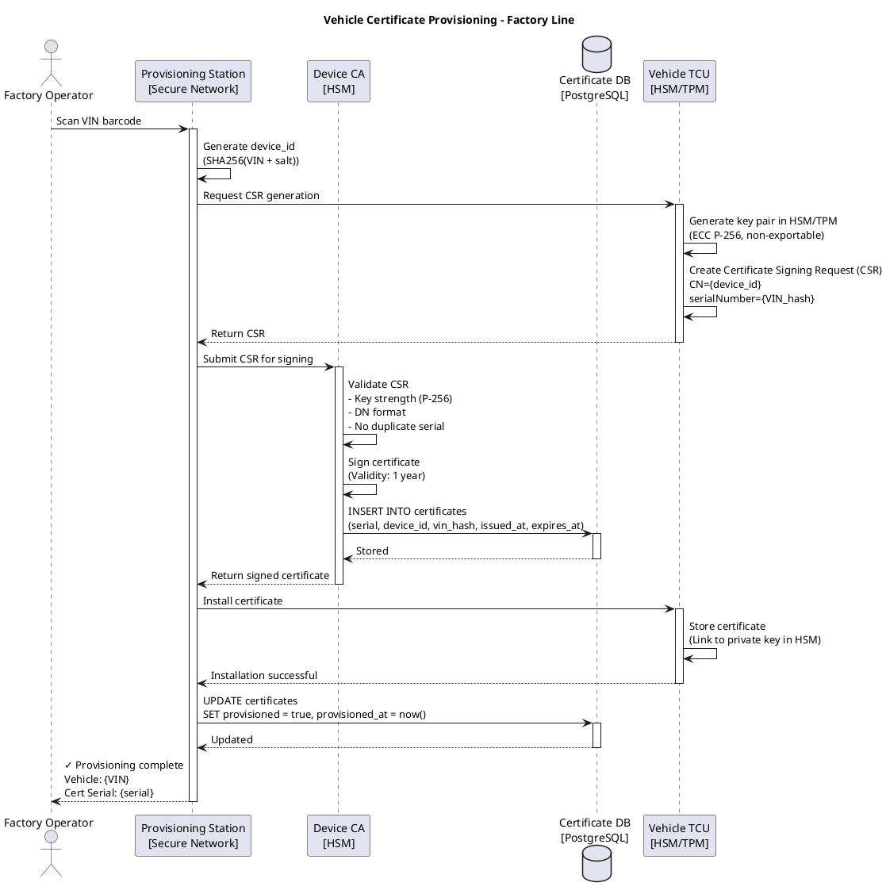
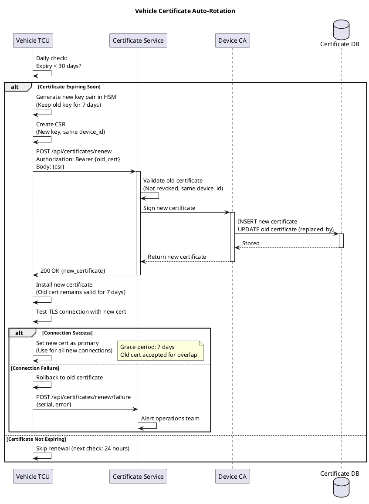
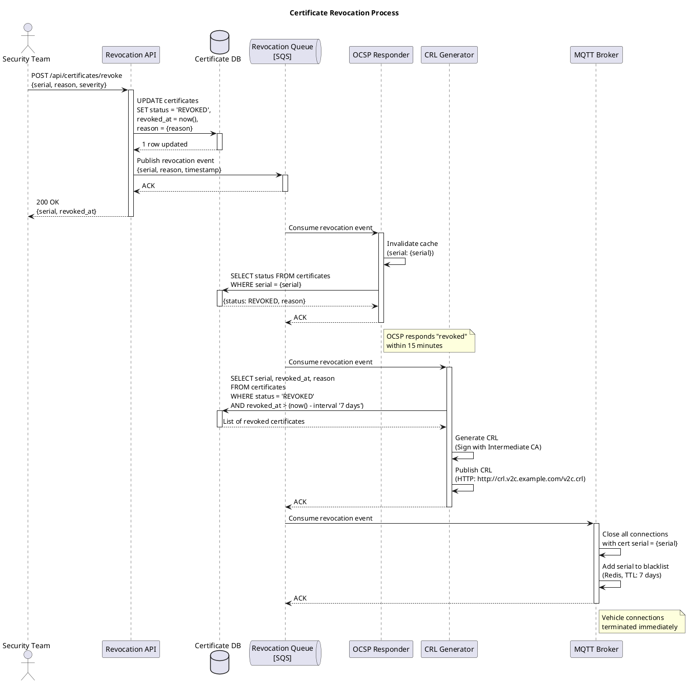

# Certificate Lifecycle Management Specification

**Version:** 1.0
**Status:** Draft
**Last Updated:** 2025-10-09
**Owner:** Security Architecture Team
**Standards Compliance:** ISO 21434, UN WP.29, X.509, OCSP, NIST SP 800-57

---

## Table of Contents

1. [Overview](#overview)
2. [Certificate Hierarchy](#certificate-hierarchy)
3. [Certificate Specifications](#certificate-specifications)
4. [Provisioning Workflow](#provisioning-workflow)
5. [Rotation Strategy](#rotation-strategy)
6. [Revocation Mechanism](#revocation-mechanism)
7. [Key Storage Requirements](#key-storage-requirements)
8. [Monitoring and Alerting](#monitoring-and-alerting)
9. [Incident Response](#incident-response)
10. [Compliance and Audit](#compliance-and-audit)
11. [Operational Procedures](#operational-procedures)
12. [References](#references)

---

## Overview

This document defines the complete lifecycle management for X.509 certificates used in the Vehicle-to-Cloud (V2C) communications system. Proper certificate management is critical for:

- **Security:** mTLS authentication protects against unauthorized access
- **Availability:** Certificate expiration causes fleet-wide outages
- **Compliance:** ISO 21434 and UN WP.29 mandate secure identity management
- **Operational Excellence:** Automated rotation prevents manual intervention

### Key Principles

1. **Defense in Depth:** Multi-layer PKI with offline root CA
2. **Automated Rotation:** Zero-touch certificate renewal
3. **Rapid Revocation:** 15-minute maximum revocation propagation
4. **Hardware-Backed Keys:** Vehicle keys stored in HSM/TPM
5. **Audit Trail:** Complete logging of all certificate operations

### Lifecycle Stages

```
Provisioning → Active Use → Renewal → Revocation → Expiry
     ↓            ↓           ↓           ↓          ↓
  Factory     Vehicle    Automated    Security   Archive
   Line      Operation   Rotation     Incident    Logs
```

---

## Certificate Hierarchy

### PKI Structure

```
┌─────────────────────────────────────────────────────┐
│ Root CA (Offline, Air-Gapped)                       │
│ - Validity: 20 years                                │
│ - Key: RSA 4096 / ECC P-384                         │
│ - Location: Hardware Security Module (HSM)          │
│ - Access: Ceremony-based, 3-of-5 key holders        │
└─────────────────────────────────────────────────────┘
                       │
         ┌─────────────┴─────────────┐
         ↓                           ↓
┌──────────────────────┐   ┌──────────────────────┐
│ Intermediate CA #1   │   │ Intermediate CA #2   │
│ (Online, Replicated) │   │ (Backup, Cold)       │
│ - Validity: 10 years │   │ - Validity: 10 years │
│ - Key: RSA 4096      │   │ - Key: RSA 4096      │
│ - Location: HSM      │   │ - Location: HSM      │
└──────────────────────┘   └──────────────────────┘
         │
         ├────────────────────┬────────────────────┐
         ↓                    ↓                    ↓
┌──────────────────┐ ┌──────────────────┐ ┌──────────────────┐
│ Device Issuing   │ │ Cloud Service    │ │ OCSP Responder   │
│ CA               │ │ CA               │ │ CA               │
│ - Validity: 5y   │ │ - Validity: 5y   │ │ - Validity: 3y   │
│ - Key: RSA 2048  │ │ - Key: RSA 2048  │ │ - Key: RSA 2048  │
└──────────────────┘ └──────────────────┘ └──────────────────┘
         │                    │
         ↓                    ↓
┌──────────────────┐ ┌──────────────────┐
│ Vehicle Device   │ │ MQTT Broker      │
│ Certificate      │ │ Certificate      │
│ - Validity: 1y   │ │ - Validity: 1y   │
│ - Key: ECC P-256 │ │ - Key: RSA 2048  │
│ - Auto-rotate    │ │ - Auto-rotate    │
└──────────────────┘ └──────────────────┘
```

### Certificate Roles

| Certificate Type | Purpose | Validity | Key Algorithm | Rotation |
|------------------|---------|----------|---------------|----------|
| Root CA | Trust anchor | 20 years | RSA 4096 | Manual ceremony |
| Intermediate CA | Issue sub-CAs | 10 years | RSA 4096 | Manual ceremony |
| Device Issuing CA | Issue vehicle certs | 5 years | RSA 2048 | Automated |
| Cloud Service CA | Issue broker certs | 5 years | RSA 2048 | Automated |
| OCSP Responder CA | Sign OCSP responses | 3 years | RSA 2048 | Automated |
| Vehicle Device Cert | mTLS client auth | 1 year | ECC P-256 | Automated |
| MQTT Broker Cert | mTLS server auth | 1 year | RSA 2048 | Automated |

---

## Certificate Specifications

### Root CA Certificate

**Distinguished Name (DN):**
```
CN=V2C Root CA
O=Automotive OEM
OU=Connected Vehicle Platform
C=US
```

**Key Usage:**
- Certificate Signing
- CRL Signing

**Extended Key Usage:** None (CA only)

**Constraints:**
- Basic Constraints: CA:TRUE, pathlen:2
- Key Identifier: SHA-256 hash of public key

**Validity:** 20 years (2025-2045)

**Key Storage:**
- HSM (Hardware Security Module)
- FIPS 140-2 Level 3 or higher
- Air-gapped network (no internet connectivity)

**Access Control:**
- Requires 3-of-5 key holder approval
- Ceremony-based access (physical presence)
- Annual audit of key holder list

---

### Intermediate CA Certificate

**Distinguished Name (DN):**
```
CN=V2C Intermediate CA
O=Automotive OEM
OU=Connected Vehicle Platform
C=US
```

**Key Usage:**
- Certificate Signing
- CRL Signing

**Extended Key Usage:** None (CA only)

**Constraints:**
- Basic Constraints: CA:TRUE, pathlen:1
- Name Constraints: Restrict to specific domains/IPs

**Validity:** 10 years

**Key Storage:**
- HSM (networked, replicated across regions)
- FIPS 140-2 Level 2 or higher

**Access Control:**
- Automated issuance (no manual approval)
- API-driven with audit logging
- Rate limiting: 1000 certs/hour

---

### Vehicle Device Certificate

**Distinguished Name (DN):**
```
CN={vehicle_device_id}
O=Automotive OEM
OU=Connected Vehicles
serialNumber={VIN_hash}
C=US
```

**Subject Alternative Names (SAN):**
- DNS: {vehicle_device_id}.v2c.example.com
- URI: urn:v2c:vehicle:{VIN_hash}

**Key Usage:**
- Digital Signature
- Key Encipherment
- Key Agreement

**Extended Key Usage:**
- TLS Client Authentication
- MQTT Client Authentication (custom OID: 1.3.6.1.4.1.99999.1)

**Constraints:**
- Basic Constraints: CA:FALSE
- Key Identifier: SHA-256 hash of public key

**Validity:** 1 year (365 days)

**Key Storage:**
- Hardware Security Module (HSM) or Trusted Platform Module (TPM) in vehicle
- Keys never leave hardware
- Private key extraction prevented

**Auto-Rotation:**
- Renew 30 days before expiry
- Fallback: Renew when vehicle connects if <7 days remaining
- Grace period: Old cert valid for 7 days post-rotation

---

### MQTT Broker Certificate

**Distinguished Name (DN):**
```
CN=mqtt-broker-{region}.v2c.example.com
O=Automotive OEM
OU=Cloud Platform
C=US
```

**Subject Alternative Names (SAN):**
- DNS: mqtt-broker-us-east.v2c.example.com
- DNS: mqtt-broker-us-east-1a.v2c.example.com
- DNS: mqtt-broker-us-east-1b.v2c.example.com
- IP: 10.0.1.10
- IP: 10.0.1.11

**Key Usage:**
- Digital Signature
- Key Encipherment
- Key Agreement

**Extended Key Usage:**
- TLS Server Authentication

**Validity:** 1 year

**Key Storage:**
- AWS KMS (or equivalent cloud HSM)
- Encrypted at rest
- Access via IAM role

**Auto-Rotation:**
- Renew 30 days before expiry
- Blue-green deployment (no downtime)

---

## Provisioning Workflow

### Factory Provisioning (Vehicle)

**Timing:** During vehicle manufacturing, after TCU installation



**Security Controls:**
1. Provisioning station on isolated network (no internet)
2. Certificate DB encrypted at rest (AES-256)
3. VIN-to-device_id mapping stored separately (encrypted)
4. Audit log of all certificate issuances
5. Rate limiting: 1 cert per TCU per day

**Failure Modes:**
- **CSR generation fails:** Retry 3 times, escalate to technician
- **CA signing fails:** Check CA health, use backup CA
- **Installation fails:** Reject TCU, replace hardware

---

### Cloud Service Provisioning (MQTT Broker)

**Timing:** During broker deployment (Terraform/Kubernetes)

```bash
# Automated via Terraform
resource "aws_acm_certificate" "mqtt_broker" {
  domain_name               = "mqtt-broker-${var.region}.v2c.example.com"
  subject_alternative_names = [
    "mqtt-broker-${var.region}-1a.v2c.example.com",
    "mqtt-broker-${var.region}-1b.v2c.example.com"
  ]

  validation_method = "DNS"

  lifecycle {
    create_before_destroy = true
  }
}

# Auto-renewal handled by AWS ACM
```

---

## Rotation Strategy

### Automated Rotation Timeline

```
Day 0        Day 335       Day 365       Day 372
|------------|-------------|-------------|-------------|
  Issued      Renewal        Expiry      Grace End
              Starts                     (Force Renewal)
              (30 days)                  (7 days)
```

### Vehicle Certificate Rotation

**Trigger:** 30 days before expiry

**Process:**



**Monitoring:**
```python
# Prometheus alert
- alert: VehicleCertificateRotationFailed
  expr: v2c_certificate_rotation_failures > 0
  for: 5m
  severity: P1
  description: "Vehicle {{ $labels.device_id }} failed certificate rotation"
```

---

### Broker Certificate Rotation (Blue-Green)

**Process:**

```bash
#!/bin/bash
# Blue-Green Certificate Rotation Script

# Step 1: Request new certificate
aws acm request-certificate \
  --domain-name mqtt-broker-us-east.v2c.example.com \
  --validation-method DNS \
  --tags Key=Environment,Value=production Key=Service,Value=mqtt-broker

NEW_CERT_ARN=$(aws acm list-certificates \
  --query 'CertificateSummaryList[?DomainName==`mqtt-broker-us-east.v2c.example.com`] | [0].CertificateArn' \
  --output text)

# Step 2: Wait for validation
aws acm wait certificate-validated --certificate-arn $NEW_CERT_ARN

# Step 3: Deploy new broker instances (green)
kubectl apply -f broker-green-deployment.yaml

# Step 4: Health check green instances
for i in {1..30}; do
  if kubectl get pods -l app=mqtt-broker,version=green -o jsonpath='{.items[*].status.phase}' | grep -q Running; then
    echo "Green instances healthy"
    break
  fi
  sleep 10
done

# Step 5: Update load balancer to green
kubectl patch service mqtt-broker -p '{"spec":{"selector":{"version":"green"}}}'

# Step 6: Monitor error rate
# If error rate > 0.1%, rollback
ERROR_RATE=$(prometheus-query "rate(mqtt_connection_errors[5m])")
if (( $(echo "$ERROR_RATE > 0.001" | bc -l) )); then
  echo "ERROR: High error rate, rolling back"
  kubectl patch service mqtt-broker -p '{"spec":{"selector":{"version":"blue"}}}'
  exit 1
fi

# Step 7: Delete blue instances after 24 hours
sleep 86400
kubectl delete deployment mqtt-broker-blue

echo "Certificate rotation complete"
```

---

## Revocation Mechanism

### Revocation Triggers

| Trigger | Severity | Max Response Time |
|---------|----------|-------------------|
| Private key compromise | P0 | 15 minutes |
| Vehicle theft | P1 | 1 hour |
| Security vulnerability | P1 | 4 hours |
| Decommissioned vehicle | P3 | 24 hours |
| Expired certificate | P4 | N/A (automatic) |

### OCSP (Online Certificate Status Protocol)

**Architecture:**

```
Vehicle → TLS Handshake → MQTT Broker
           ↓
    OCSP Status Request
           ↓
    OCSP Responder → Certificate DB
           ↓
    Response: good | revoked | unknown
```

**OCSP Responder Configuration:**

```yaml
# Kubernetes deployment
apiVersion: apps/v1
kind: Deployment
metadata:
  name: ocsp-responder
spec:
  replicas: 3
  selector:
    matchLabels:
      app: ocsp-responder
  template:
    spec:
      containers:
      - name: ocsp-responder
        image: v2c/ocsp-responder:1.0
        env:
        - name: DATABASE_URL
          valueFrom:
            secretKeyRef:
              name: ocsp-db-credentials
              key: connection-string
        - name: CACHE_TTL
          value: "300"  # 5 minutes
        - name: MAX_AGE
          value: "3600"  # 1 hour
        resources:
          requests:
            memory: "512Mi"
            cpu: "500m"
          limits:
            memory: "1Gi"
            cpu: "1000m"
        livenessProbe:
          httpGet:
            path: /health
            port: 8080
          initialDelaySeconds: 30
          periodSeconds: 10
```

**OCSP Stapling (Recommended):**

Broker fetches OCSP response and includes it in TLS handshake, reducing vehicle round-trips.

```
MQTT Broker (every 5 minutes):
  1. Request OCSP response for its own certificate
  2. Cache response
  3. Include in TLS ServerHello (OCSP Stapling extension)

Vehicle (TLS Client):
  1. Receive stapled OCSP response
  2. Validate signature
  3. Check status: good | revoked
  4. Proceed or reject connection
```

---

### Revocation Process



**Revocation API:**

```bash
curl -X POST https://api.v2c.example.com/certificates/revoke \
  -H "Authorization: Bearer {admin_token}" \
  -H "Content-Type: application/json" \
  -d '{
    "serial": "1A:2B:3C:4D:5E:6F",
    "reason": "KEY_COMPROMISE",
    "severity": "P0",
    "notes": "Private key found in GitHub repository"
  }'
```

---

## Key Storage Requirements

### Vehicle HSM/TPM Requirements

**Minimum Specifications:**
- **Standard:** FIPS 140-2 Level 2 or higher
- **Key Generation:** On-device (keys never leave hardware)
- **Key Export:** Prohibited (non-extractable flag)
- **Crypto Algorithms:** ECC P-256, RSA 2048 minimum
- **Physical Tampering:** Tamper-evident or tamper-responsive

**Recommended Modules:**
- Infineon OPTIGA TPM 2.0
- NXP EdgeLock SE050
- STMicroelectronics ST33

**Key Usage:**
```c
// Example: OpenSSL with TPM2 engine
ENGINE *tpm2_engine = ENGINE_by_id("tpm2");
ENGINE_init(tpm2_engine);

EVP_PKEY *private_key = ENGINE_load_private_key(
    tpm2_engine,
    "handle:0x81000001",  // TPM persistent key handle
    NULL,
    NULL
);

// Private key never leaves TPM
// All signing operations performed inside TPM
```

---

### Cloud HSM Requirements

**AWS CloudHSM:**
```terraform
resource "aws_cloudhsm_v2_cluster" "v2c_hsm" {
  hsm_type   = "hsm1.medium"
  subnet_ids = var.private_subnet_ids

  tags = {
    Name        = "V2C Certificate Authority HSM"
    Environment = "production"
  }
}

resource "aws_cloudhsm_v2_hsm" "hsm_az1" {
  cluster_id        = aws_cloudhsm_v2_cluster.v2c_hsm.id
  availability_zone = "us-east-1a"
}

resource "aws_cloudhsm_v2_hsm" "hsm_az2" {
  cluster_id        = aws_cloudhsm_v2_cluster.v2c_hsm.id
  availability_zone = "us-east-1b"
}
```

**Key Backup:**
- Daily encrypted backups to S3
- Backup encryption key stored in AWS KMS
- Cross-region replication
- 90-day retention

---

## Monitoring and Alerting

### Certificate Expiry Monitoring

```python
# Prometheus exporter
import datetime
from prometheus_client import Gauge

cert_expiry_days = Gauge(
    'v2c_certificate_expiry_days',
    'Days until certificate expiry',
    ['type', 'serial', 'subject']
)

def monitor_certificates():
    for cert in get_active_certificates():
        days_until_expiry = (cert.not_after - datetime.now()).days
        cert_expiry_days.labels(
            type=cert.type,
            serial=cert.serial,
            subject=cert.subject
        ).set(days_until_expiry)
```

**Alerts:**

```yaml
groups:
- name: certificate_expiry
  rules:
  - alert: CertificateExpiringSoon
    expr: v2c_certificate_expiry_days{type="vehicle"} < 30
    for: 24h
    severity: warning
    description: "Vehicle certificate {{ $labels.serial }} expires in {{ $value }} days"

  - alert: CertificateExpiryImminent
    expr: v2c_certificate_expiry_days < 7
    for: 1h
    severity: critical
    description: "Certificate {{ $labels.serial }} expires in {{ $value }} days - IMMEDIATE ACTION REQUIRED"

  - alert: CertificateRevocationBacklog
    expr: v2c_revocation_queue_depth > 100
    for: 5m
    severity: P1
    description: "Revocation queue has {{ $value }} pending revocations"
```

---

### Certificate Operations Dashboard

**Grafana Dashboard:**

```json
{
  "dashboard": {
    "title": "V2C Certificate Operations",
    "panels": [
      {
        "title": "Active Certificates by Type",
        "type": "graph",
        "targets": [{
          "expr": "v2c_certificates_active_total{type=\"vehicle\"}",
          "legendFormat": "Vehicle"
        }, {
          "expr": "v2c_certificates_active_total{type=\"broker\"}",
          "legendFormat": "Broker"
        }]
      },
      {
        "title": "Certificate Expiry Distribution",
        "type": "heatmap",
        "targets": [{
          "expr": "v2c_certificate_expiry_days"
        }]
      },
      {
        "title": "Rotation Success Rate",
        "type": "stat",
        "targets": [{
          "expr": "rate(v2c_certificate_rotation_success_total[24h]) / rate(v2c_certificate_rotation_attempts_total[24h])"
        }]
      },
      {
        "title": "OCSP Response Time P99",
        "type": "graph",
        "targets": [{
          "expr": "histogram_quantile(0.99, rate(v2c_ocsp_response_duration_seconds_bucket[5m]))"
        }]
      }
    ]
  }
}
```

---

## Incident Response

### Certificate Compromise Response Plan

**Phase 1: Detection (0-15 minutes)**

```bash
#!/bin/bash
# Incident Response Script

COMPROMISED_SERIAL="$1"
INCIDENT_ID="$(date +%Y%m%d-%H%M%S)"

echo "[$INCIDENT_ID] Certificate compromise detected: $COMPROMISED_SERIAL"

# Step 1: Immediate revocation
curl -X POST https://api.v2c.example.com/certificates/revoke \
  -H "Authorization: Bearer $ADMIN_TOKEN" \
  -d "{
    \"serial\": \"$COMPROMISED_SERIAL\",
    \"reason\": \"KEY_COMPROMISE\",
    \"severity\": \"P0\"
  }"

# Step 2: Notify security team
aws sns publish \
  --topic-arn arn:aws:sns:us-east-1:123456789012:security-alerts \
  --subject "URGENT: Certificate Compromise - $COMPROMISED_SERIAL" \
  --message "Immediate action required. Incident ID: $INCIDENT_ID"

# Step 3: Force connection termination
kubectl exec -n mqtt-broker mqtt-broker-0 -- \
  redis-cli SADD revoked_certificates "$COMPROMISED_SERIAL"
```

**Phase 2: Investigation (15 minutes - 4 hours)**
1. Identify all connections using compromised certificate
2. Analyze logs for unauthorized access
3. Determine scope of compromise
4. Identify root cause

**Phase 3: Remediation (4-24 hours)**
1. Issue new certificate to affected vehicle
2. Update vehicle firmware if vulnerability found
3. Conduct forensic analysis
4. Document lessons learned

**Phase 4: Post-Incident (24-72 hours)**
1. Complete incident report
2. Update runbooks
3. Implement preventive measures
4. Train operations team

---

## Compliance and Audit

### ISO 21434 Requirements

**Certificate Management Requirements:**

| Requirement | Implementation | Evidence |
|-------------|----------------|----------|
| [06-02] Secure key storage | HSM/TPM with FIPS 140-2 Level 2+ | HSM audit logs |
| [06-03] Key lifecycle management | Automated rotation, 1-year validity | Rotation success metrics |
| [06-04] Certificate validation | OCSP/CRL checking on all connections | OCSP response logs |
| [06-05] Revocation capability | 15-minute max revocation propagation | Revocation audit trail |
| [09-02] Cryptographic algorithms | ECC P-256, RSA 2048 minimum | Certificate inspection reports |

### UN WP.29 Compliance

**Regulation (EU) 2019/2144 - Cybersecurity Requirements:**

1. **Secure Software Update (Art. 11):**
   - OTA updates authenticated with vehicle certificate
   - Firmware signature verification using certificate chain

2. **Security by Design (Art. 12):**
   - Defense-in-depth PKI architecture
   - Automated rotation prevents manual errors

3. **Incident Response (Art. 13):**
   - 24-hour incident reporting
   - Certificate revocation within 15 minutes

---

### Audit Logging

**Required Log Fields:**

```json
{
  "timestamp": "2025-10-09T10:30:00Z",
  "event_type": "certificate_issued",
  "actor": "device-ca-service",
  "subject": {
    "device_id": "3A7F2B9E4C1D6F8A",
    "vin_hash": "abc123...",
    "serial": "1A:2B:3C:4D:5E:6F"
  },
  "result": "success",
  "metadata": {
    "validity": "365 days",
    "issuer": "Device Issuing CA",
    "key_algorithm": "ECC P-256"
  },
  "trace_id": "550e8400-e29b-41d4-a716-446655440000"
}
```

**Retention:**
- Certificate issuance logs: 7 years
- Revocation logs: Indefinite
- OCSP responses: 90 days
- Access logs: 1 year

---

## Operational Procedures

### Weekly Certificate Health Check

```bash
#!/bin/bash
# Run every Monday at 8:00 AM

echo "=== V2C Certificate Health Check ==="
echo "Date: $(date)"

# 1. Check expiring certificates (next 45 days)
echo "Certificates expiring in next 45 days:"
psql $DATABASE_URL -c "
  SELECT type, COUNT(*) as count
  FROM certificates
  WHERE status = 'ACTIVE'
    AND expires_at < NOW() + INTERVAL '45 days'
  GROUP BY type;
"

# 2. Check rotation failure rate
echo "Certificate rotation failures (last 7 days):"
prometheus-query "sum(v2c_certificate_rotation_failures_total{period='7d'})"

# 3. Check OCSP responder health
echo "OCSP responder P99 latency (last 24h):"
prometheus-query "histogram_quantile(0.99, v2c_ocsp_response_duration_seconds{period='24h'})"

# 4. Check revoked certificates count
echo "Revoked certificates (last 7 days):"
psql $DATABASE_URL -c "
  SELECT reason, COUNT(*) as count
  FROM certificates
  WHERE status = 'REVOKED'
    AND revoked_at > NOW() - INTERVAL '7 days'
  GROUP BY reason;
"

# 5. Generate report
echo "Generating weekly report..."
python generate_certificate_health_report.py --week=$(date +%Y-W%U)
```

---

### Root CA Ceremony Procedure

**Frequency:** Every 10 years (Intermediate CA renewal)

**Participants:**
- Chief Security Officer (CSO)
- Chief Information Security Officer (CISO)
- 3 Key Holders
- Legal Counsel
- External Auditor

**Steps:**

1. **Pre-Ceremony (T-30 days):**
   - Schedule ceremony
   - Verify key holder availability
   - Prepare HSM and ceremony scripts
   - Conduct dry-run

2. **Ceremony Day (T-0):**
   - Physical access to air-gapped facility
   - 3-of-5 key holders present
   - Video recording of entire ceremony
   - Execute ceremony script:
     ```bash
     # 1. Boot HSM
     # 2. Enter 3 key holder PINs
     # 3. Generate new Intermediate CA CSR
     # 4. Sign with Root CA
     # 5. Export signed certificate
     # 6. Verify certificate chain
     # 7. Power down HSM
     ```

3. **Post-Ceremony (T+7 days):**
   - Deploy new Intermediate CA
   - Archive old Intermediate CA
   - Update documentation
   - File audit report

---

## References

### Standards

- **ISO 21434:** Road vehicles - Cybersecurity engineering
- **UN WP.29:** Regulation on cybersecurity and software updates
- **NIST SP 800-57:** Recommendation for Key Management
- **FIPS 140-2:** Security Requirements for Cryptographic Modules
- **RFC 5280:** Internet X.509 Public Key Infrastructure Certificate and CRL Profile
- **RFC 6960:** X.509 Internet Public Key Infrastructure Online Certificate Status Protocol (OCSP)

### Industry Best Practices

- **AWS Certificate Manager Best Practices:** https://docs.aws.amazon.com/acm/latest/userguide/best-practices.html
- **OWASP Transport Layer Protection Cheat Sheet:** https://cheatsheetseries.owasp.org/cheatsheets/Transport_Layer_Protection_Cheat_Sheet.html

### Related Documentation

- [Topic Naming Convention](../standards/TOPIC_NAMING_CONVENTION.md)
- [Error Taxonomy (Common.proto)](../../src/main/proto/V2C/Common.proto)
- [ISO 21434 TARA](ISO_21434_TARA.md) - To be created

---

## Revision History

| Version | Date       | Author                     | Changes                          |
|---------|------------|----------------------------|----------------------------------|
| 1.0     | 2025-10-09 | Security Architecture Team | Initial specification            |

---

## Approval

| Role                          | Name                | Signature | Date       |
|-------------------------------|---------------------|-----------|------------|
| Chief Security Officer (CSO)  | ___________________ | _________ | __________ |
| Chief Information Security Officer (CISO) | _______ | _________ | __________ |
| ISO 21434 Compliance Officer  | ___________________ | _________ | __________ |
| Legal Counsel                 | ___________________ | _________ | __________ |

---

**Document Classification:** Confidential - Security Documentation
**Security Level:** Restricted
**Distribution:** Security Team, Operations Team, Executive Leadership
