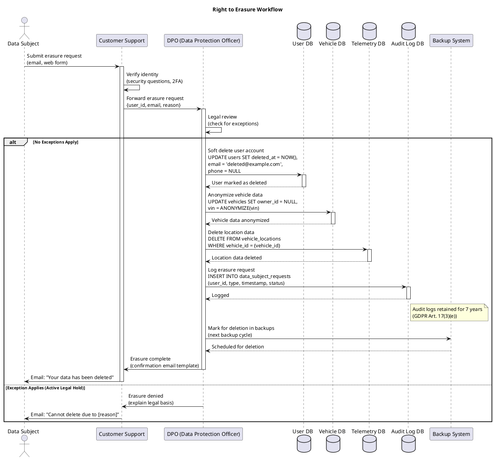

# PII Classification and Data Governance Specification

**Version:** 1.0
**Status:** Draft
**Last Updated:** 2025-10-09
**Owner:** Privacy & Data Governance Team
**Standards Compliance:** GDPR, CCPA, ISO/IEC 27701, ISO 21434

---

## Table of Contents

1. [Overview](#overview)
2. [Data Classification Schema](#data-classification-schema)
3. [PII Field Inventory](#pii-field-inventory)
4. [Data Retention Policies](#data-retention-policies)
5. [Right to Erasure Implementation](#right-to-erasure-implementation)
6. [Data Residency Requirements](#data-residency-requirements)
7. [Anonymization and Pseudonymization](#anonymization-and-pseudonymization)
8. [Consent Management](#consent-management)
9. [Data Subject Rights](#data-subject-rights)
10. [Data Processing Register](#data-processing-register)
11. [Third-Party Data Sharing](#third-party-data-sharing)
12. [Incident Response](#incident-response)
13. [Audit and Compliance](#audit-and-compliance)
14. [References](#references)

---

## Overview

This document defines the data classification, governance, and privacy practices for the Vehicle-to-Cloud (V2C) Communications Architecture. All data handling must comply with:

- **GDPR (EU):** General Data Protection Regulation
- **CCPA (California):** California Consumer Privacy Act
- **ISO/IEC 27701:** Privacy Information Management System (PIMS)
- **ISO 21434:** Automotive cybersecurity data protection requirements

### Key Principles

1. **Privacy by Design:** Data protection built into system architecture
2. **Data Minimization:** Collect only necessary data
3. **Purpose Limitation:** Use data only for stated purposes
4. **Storage Limitation:** Retain data only as long as necessary
5. **Transparency:** Clear communication with data subjects
6. **Accountability:** Demonstrate compliance with regulations

### Roles and Responsibilities

| Role | Responsibility |
|------|----------------|
| **Data Protection Officer (DPO)** | Overall privacy strategy, regulatory compliance |
| **Data Controller** | Determine purpose and means of processing |
| **Data Processor** | Process data on behalf of controller (cloud providers) |
| **Data Owner** | Business unit responsible for data accuracy |
| **Data Custodian** | IT team responsible for data security |

---

## Data Classification Schema

### Classification Levels

| Level | Description | Examples | Handling Requirements |
|-------|-------------|----------|----------------------|
| **L1: Public** | No confidentiality | Marketing materials, public APIs | No restrictions |
| **L2: Internal** | Company confidential | System architecture, internal docs | Employee access only |
| **L3: Confidential** | Business sensitive | Vehicle aggregate statistics | Need-to-know basis, encrypted |
| **L4: Restricted** | Personally Identifiable | VIN, location, username | Encrypted, audited, consent required |
| **L5: Highly Restricted** | Special category data | Health data, biometrics | Explicit consent, enhanced controls |

### PII Categories (GDPR Article 4)

| Category | Definition | V2C Examples | Regulation |
|----------|------------|--------------|------------|
| **Direct PII** | Directly identifies individual | VIN, license plate, phone number | GDPR Art. 4(1) |
| **Indirect PII** | Identifies when combined | Device ID + location + timestamp | GDPR Art. 4(1) |
| **Special Category** | Sensitive personal data | Health monitoring (heart rate), biometrics | GDPR Art. 9 |
| **Pseudonymized** | Replaced with identifier | Hashed VIN, device_id | GDPR Art. 4(5) |
| **Anonymous** | Cannot be re-identified | Aggregate fleet statistics | Not PII (GDPR Recital 26) |

---

## PII Field Inventory

### Vehicle Identity Data

| Field Name | Proto Message | Classification | Retention | Legal Basis |
|------------|---------------|----------------|-----------|-------------|
| `VIN` | VehicleVehicleIdentification | **L4 Restricted** | Vehicle lifetime + 7 years | Contractual necessity |
| `VIN_hash` | VehicleMessageHeader.vehicle_identity | **L3 Confidential** | Vehicle lifetime + 7 years | Legitimate interest |
| `license_plate` | VehicleVehicleIdentification | **L4 Restricted** | Vehicle lifetime + 7 years | Contractual necessity |
| `vehicle_device_id` | VehicleMessageHeader | **L3 Confidential** | Device lifetime + 1 year | Legitimate interest |
| `certificate_serial` | Certificate DB | **L3 Confidential** | Certificate expiry + 7 years | Legitimate interest |

**Pseudonymization:**
```python
VIN_hash = SHA256(VIN + SECRET_SALT).hex()[:16]
# Never transmit raw VIN over MQTT, use VIN_hash
```

**Right to Erasure:** On request, delete VIN from all systems. VIN_hash remains for security audit purposes (GDPR Art. 17(3)(e)).

---

### Location Data

| Field Name | Proto Message | Classification | Retention | Legal Basis |
|------------|---------------|----------------|-----------|-------------|
| `latitude` | VehiclePrecisionLocation | **L4 Restricted** | 90 days | Consent |
| `longitude` | VehiclePrecisionLocation | **L4 Restricted** | 90 days | Consent |
| `speed` | VehiclePrecisionLocation | **L3 Confidential** | 90 days | Legitimate interest |
| `heading` | VehiclePrecisionLocation | **L3 Confidential** | 90 days | Legitimate interest |
| `altitude` | VehiclePrecisionLocation | **L3 Confidential** | 90 days | Legitimate interest |
| `location_timestamp` | VehicleMessageHeader | **L2 Internal** | 90 days | Legitimate interest |

**Privacy Risk:** Precise location is **highly sensitive PII**
- Can reveal home/work addresses
- Can infer religious affiliation (places of worship visits)
- Can expose health conditions (hospital visits)

**Consent Requirement:**
- **Explicit opt-in** required for location collection
- Purpose must be clearly stated (e.g., "Find My Car", "Stolen Vehicle Recovery")
- User can withdraw consent at any time
- Location tracking stops immediately upon consent withdrawal

**Anonymization for Analytics:**
```sql
-- Aggregate location data for traffic analysis (anonymous)
SELECT
    DATE_TRUNC('hour', timestamp) as hour,
    ST_SnapToGrid(location::geometry, 0.01) as grid_cell, -- 1km × 1km grid
    COUNT(*) as vehicle_count
FROM vehicle_locations
WHERE timestamp > NOW() - INTERVAL '24 hours'
GROUP BY hour, grid_cell
HAVING COUNT(*) > 5; -- k-anonymity: minimum 5 vehicles
```

---

### User Account Data

| Field Name | System | Classification | Retention | Legal Basis |
|------------|--------|----------------|-----------|-------------|
| `username` | Auth Service | **L4 Restricted** | Account active + 3 years | Contractual necessity |
| `email` | Auth Service | **L4 Restricted** | Account active + 3 years | Contractual necessity |
| `phone_number` | Auth Service | **L4 Restricted** | Account active + 3 years | Contractual necessity |
| `password_hash` | Auth Service | **L3 Confidential** | Account active + 1 year | Contractual necessity |
| `first_name` | User Profile | **L4 Restricted** | Account active + 3 years | Contractual necessity |
| `last_name` | User Profile | **L4 Restricted** | Account active + 3 years | Contractual necessity |
| `date_of_birth` | User Profile | **L4 Restricted** | Account active + 3 years | Age verification |
| `profile_photo` | User Profile | **L5 Highly Restricted** | Account active | Consent (biometric data) |

**Special Considerations:**
- **Profile Photo:** Contains biometric data (facial features). GDPR Art. 9 special category requires explicit consent.
- **Email/Phone:** Can be used for marketing only with separate consent (opt-in).

---

### Diagnostic and Telemetry Data

| Field Name | Proto Message | Classification | Retention | Legal Basis |
|------------|---------------|----------------|-----------|-------------|
| `dtc_code` | DiagnosticTroubleCode | **L3 Confidential** | 3 years | Warranty fulfillment |
| `battery_soc` | VehicleLowVoltageBattery | **L2 Internal** | 1 year | Legitimate interest |
| `odometer` | VehicleVehicleIdentification | **L3 Confidential** | Vehicle lifetime | Warranty fulfillment |
| `tire_pressure` | VehicleChassisTire | **L2 Internal** | 90 days | Legitimate interest |
| `engine_temperature` | VehiclePowertrainCombustionEngine | **L2 Internal** | 90 days | Legitimate interest |
| `crash_data` | CrashDetectionEvent | **L5 Highly Restricted** | 10 years | Legal obligation |

**Health-Related Data:**
If V2C system collects driver biometrics (heart rate, stress level from wearables):
- **GDPR Art. 9(2)(h):** Health data requires **explicit consent** or **medical purposes**
- Separate consent from general T&Cs
- Data Processor Agreement (DPA) with third-party health providers

---

### Command and Interaction Data

| Field Name | System | Classification | Retention | Legal Basis |
|------------|--------|----------------|-----------|-------------|
| `command_type` | Command Service | **L3 Confidential** | 90 days | Legitimate interest |
| `command_timestamp` | Command Service | **L2 Internal** | 90 days | Legitimate interest |
| `command_result` | Command Service | **L2 Internal** | 90 days | Legitimate interest |
| `user_id` | Command Service | **L4 Restricted** | 90 days | Audit trail |
| `ip_address` | API Gateway | **L4 Restricted** | 30 days | Security monitoring |
| `user_agent` | API Gateway | **L2 Internal** | 30 days | Security monitoring |

---

## Data Retention Policies

### Retention Schedule

| Data Type | Retention Period | Deletion Method | Legal Justification |
|-----------|------------------|-----------------|---------------------|
| **Location Data** | 90 days | Automated purge | Service provision, consent |
| **Telemetry Data** | 1 year | Automated purge | Performance monitoring |
| **Command Logs** | 90 days | Automated purge | Audit trail |
| **Diagnostic Codes** | 3 years | Automated purge | Warranty claims |
| **Crash Data** | 10 years | Manual review | Legal obligation |
| **User Account Data** | Account active + 3 years | On request or automated | Contractual necessity |
| **Audit Logs** | 7 years | Automated purge | Compliance requirement |
| **Certificate Data** | Cert expiry + 7 years | Automated purge | Security audit |

### Automated Deletion Jobs

```sql
-- Daily job: Delete location data older than 90 days
DELETE FROM vehicle_locations
WHERE timestamp < NOW() - INTERVAL '90 days';

-- Daily job: Delete telemetry data older than 1 year
DELETE FROM telemetry_events
WHERE timestamp < NOW() - INTERVAL '1 year';

-- Weekly job: Delete inactive user accounts (no login in 3 years)
DELETE FROM users
WHERE last_login_at < NOW() - INTERVAL '3 years'
  AND deleted_at IS NULL;
```

### Retention Policy Exceptions

| Exception | Retention Period | Justification |
|-----------|------------------|---------------|
| **Active Legal Hold** | Indefinite | Litigation, investigation |
| **Regulatory Request** | Until resolved | Government inquiry |
| **Fraud Investigation** | 5 years | Financial fraud statute of limitations |

---

## Right to Erasure Implementation

### GDPR Article 17: Right to be Forgotten

**Scope:** Data subjects can request deletion of their personal data when:
1. Data no longer necessary for original purpose
2. Consent withdrawn
3. Data processed unlawfully
4. Legal obligation to delete

**Exceptions (data cannot be deleted):**
1. Legal compliance (audit logs, tax records)
2. Legal claims (active litigation)
3. Public interest (safety recalls)

### Erasure Request Workflow



### Data Deletion API

```bash
# DPO Admin API
curl -X POST https://api.v2c.example.com/admin/data-subject-requests/erasure \
  -H "Authorization: Bearer {dpo_admin_token}" \
  -H "Content-Type: application/json" \
  -d '{
    "user_id": "user-12345",
    "reason": "User request via customer support ticket #98765",
    "legal_review_completed": true,
    "exceptions": []
  }'

# Response
{
  "request_id": "dsr-2025-10-09-001",
  "status": "in_progress",
  "estimated_completion": "2025-10-10T12:00:00Z",
  "affected_systems": [
    "user_database",
    "vehicle_database",
    "telemetry_database",
    "backup_system"
  ]
}
```

---

## Data Residency Requirements

### GDPR Data Residency

**Principle:** Personal data of EU residents must be processed within the EU or in countries with adequate data protection (GDPR Art. 45).

**V2C Implementation:**
- **EU Vehicles:** Data stored in EU regions (AWS eu-west-1, eu-central-1)
- **US Vehicles:** Data stored in US regions (AWS us-east-1, us-west-2)
- **Cross-border Transfers:** Use Standard Contractual Clauses (SCCs)

### Regional Data Routing

```yaml
# Terraform: Regional data routing
resource "aws_dynamodb_table" "vehicle_telemetry_eu" {
  name     = "vehicle-telemetry-eu"
  region   = "eu-west-1"

  attribute {
    name = "vehicle_id"
    type = "S"
  }

  ttl {
    enabled        = true
    attribute_name = "expiry_time"
  }

  point_in_time_recovery {
    enabled = true
  }

  stream_enabled   = true
  stream_view_type = "NEW_AND_OLD_IMAGES"

  tags = {
    DataResidency = "EU"
    GDPRCompliant = "true"
  }
}
```

### Data Transfer Mechanisms

| Mechanism | Use Case | GDPR Compliance |
|-----------|----------|-----------------|
| **Standard Contractual Clauses (SCCs)** | EU → US data transfers | ✅ GDPR Art. 46(2)(c) |
| **Binding Corporate Rules (BCRs)** | Intra-company transfers | ✅ GDPR Art. 47 |
| **Adequacy Decision** | EU → Japan, Canada | ✅ GDPR Art. 45 |
| **Consent** | One-off transfers | ⚠️ Not recommended (consent must be specific) |

---

## Anonymization and Pseudonymization

### Pseudonymization Techniques

**Definition (GDPR Art. 4(5)):** Processing personal data in a way that it can no longer be attributed to a specific data subject without additional information.

#### VIN Pseudonymization

```python
import hashlib
import os

# Secret salt (stored in AWS Secrets Manager, rotated annually)
SECRET_SALT = os.environ['VIN_SALT']

def pseudonymize_vin(vin: str) -> str:
    """Pseudonymize VIN using salted hash"""
    return hashlib.sha256(f"{vin}{SECRET_SALT}".encode()).hexdigest()[:16]

# Example
vin = "1HGBH41JXMN109186"
device_id = pseudonymize_vin(vin)
# Result: "3A7F2B9E4C1D6F8A"

# Reverse mapping stored separately (encrypted, access-controlled)
# Only DPO and authorized personnel can re-identify
```

**Benefits:**
- Reduces risk of data breach (pseudonymized data alone cannot identify individual)
- Allows analytics while protecting privacy
- Enables right to erasure (delete mapping, data becomes anonymous)

---

### Anonymization for Analytics

**K-Anonymity:** Ensure at least K individuals share the same attributes

```sql
-- Traffic pattern analysis (k-anonymity with k=10)
SELECT
    DATE_TRUNC('hour', timestamp) as hour,
    ST_SnapToGrid(location::geometry, 0.05) as grid_cell, -- 5km × 5km
    AVG(speed) as avg_speed,
    COUNT(DISTINCT vehicle_id) as vehicle_count
FROM vehicle_telemetry
WHERE timestamp BETWEEN '2025-10-01' AND '2025-10-31'
GROUP BY hour, grid_cell
HAVING COUNT(DISTINCT vehicle_id) >= 10; -- k-anonymity threshold
```

**Differential Privacy:** Add statistical noise to prevent individual re-identification

```python
import numpy as np

def add_laplace_noise(value: float, sensitivity: float, epsilon: float) -> float:
    """Add Laplace noise for differential privacy"""
    scale = sensitivity / epsilon
    noise = np.random.laplace(0, scale)
    return value + noise

# Example: Average vehicle speed with privacy guarantee
true_avg_speed = 65.3  # km/h
private_avg_speed = add_laplace_noise(true_avg_speed, sensitivity=10, epsilon=0.1)
# Result: 67.8 km/h (noise added)
```

---

## Consent Management

### Consent Types

| Consent Type | Purpose | Opt-in/Opt-out | Granularity |
|--------------|---------|----------------|-------------|
| **Essential** | Core service delivery | Implied (T&Cs) | Cannot opt-out |
| **Location** | GPS tracking for features | **Opt-in** | Can be disabled anytime |
| **Marketing** | Promotional emails/SMS | **Opt-in** | Can be disabled anytime |
| **Analytics** | Product improvement | Opt-out | Can be disabled |
| **Third-Party Sharing** | Share data with partners | **Opt-in** | Per-partner consent |

### Consent Record

```json
{
  "user_id": "user-12345",
  "consents": [
    {
      "consent_type": "location_tracking",
      "granted": true,
      "purpose": "Find My Car feature, Stolen Vehicle Recovery",
      "timestamp": "2025-01-15T10:30:00Z",
      "consent_method": "mobile_app_settings",
      "version": "1.0"
    },
    {
      "consent_type": "marketing_email",
      "granted": false,
      "purpose": "Promotional offers and updates",
      "timestamp": "2025-01-15T10:30:00Z",
      "consent_method": "mobile_app_settings",
      "version": "1.0"
    }
  ]
}
```

### Consent Withdrawal

**GDPR Article 7(3):** Withdrawal of consent must be as easy as giving consent.

```python
# Mobile App: Consent Management UI
@app.route('/api/user/consents/<consent_type>', methods=['DELETE'])
@require_auth
def withdraw_consent(consent_type):
    user_id = get_current_user_id()

    # Record consent withdrawal
    db.execute("""
        UPDATE user_consents
        SET granted = false, withdrawn_at = NOW()
        WHERE user_id = %s AND consent_type = %s
    """, [user_id, consent_type])

    # Stop data collection immediately
    if consent_type == 'location_tracking':
        redis.set(f"consent:{user_id}:location", "false")

    return {"message": f"{consent_type} consent withdrawn"}, 200
```

---

## Data Subject Rights

### GDPR Rights Summary

| Right | Article | Implementation | Response Time |
|-------|---------|----------------|---------------|
| **Right to Access** | Art. 15 | Data export API | 30 days |
| **Right to Rectification** | Art. 16 | Profile edit UI | Immediate |
| **Right to Erasure** | Art. 17 | Deletion workflow | 30 days |
| **Right to Restrict Processing** | Art. 18 | Consent management | Immediate |
| **Right to Data Portability** | Art. 20 | JSON/CSV export | 30 days |
| **Right to Object** | Art. 21 | Opt-out UI | Immediate |

### Data Export API (Data Portability)

```bash
# User-initiated data export
curl -X POST https://api.v2c.example.com/user/data-export \
  -H "Authorization: Bearer {user_token}" \
  -d '{
    "format": "json",
    "include": ["profile", "vehicles", "location_history", "commands"]
  }'

# Response
{
  "export_id": "export-2025-10-09-001",
  "status": "processing",
  "estimated_completion": "2025-10-09T12:00:00Z",
  "download_url": null
}

# After processing (email notification sent)
{
  "export_id": "export-2025-10-09-001",
  "status": "completed",
  "download_url": "https://exports.v2c.example.com/user-12345/export-2025-10-09-001.zip",
  "expires_at": "2025-10-16T12:00:00Z"  # 7-day expiry
}
```

**Export Format (JSON):**

```json
{
  "export_date": "2025-10-09T12:00:00Z",
  "user": {
    "user_id": "user-12345",
    "email": "john.doe@example.com",
    "created_at": "2023-05-01T08:00:00Z"
  },
  "vehicles": [
    {
      "vin": "1HGBH41JXMN109186",
      "make": "Honda",
      "model": "Accord",
      "year": 2023
    }
  ],
  "location_history": [
    {
      "timestamp": "2025-10-09T10:30:00Z",
      "latitude": 37.7749,
      "longitude": -122.4194,
      "speed": 65.3
    }
  ],
  "commands": [
    {
      "timestamp": "2025-10-08T14:20:00Z",
      "command": "lock_doors",
      "result": "success"
    }
  ]
}
```

---

## Data Processing Register

### GDPR Article 30: Records of Processing Activities

| Processing Activity | Purpose | Legal Basis | Data Categories | Recipients | Retention |
|---------------------|---------|-------------|-----------------|------------|-----------|
| **User Registration** | Account creation | Contract | Name, email, password | Internal only | Account active + 3y |
| **Location Tracking** | Vehicle location services | Consent | GPS coordinates | Internal, emergency services | 90 days |
| **Remote Commands** | Vehicle control | Contract | Command logs, user ID | Internal only | 90 days |
| **Diagnostics** | Vehicle maintenance | Legitimate interest | DTCs, sensor data | Internal, authorized dealers | 3 years |
| **OTA Updates** | Software updates | Contract | Firmware version, device ID | Internal only | 1 year |
| **Marketing** | Promotional emails | Consent | Email, preferences | Internal, email service provider | Until consent withdrawn |

---

## Third-Party Data Sharing

### Data Processor Agreements (DPAs)

All third-party processors must sign DPA covering:
1. **Scope of Processing:** Limited to specified purposes
2. **Security Measures:** Encryption, access controls
3. **Sub-processors:** Require prior written consent
4. **Data Subject Rights:** Assist with requests
5. **Data Breach Notification:** Within 24 hours
6. **Audit Rights:** Annual security audits
7. **Data Return/Deletion:** Upon contract termination

### Current Data Processors

| Processor | Service | Data Shared | DPA Status | Location |
|-----------|---------|-------------|------------|----------|
| AWS | Cloud infrastructure | All system data | ✅ Signed | US, EU |
| Twilio | SMS notifications | Phone numbers | ✅ Signed | US |
| SendGrid | Email delivery | Email addresses | ✅ Signed | US |
| Stripe | Payment processing | Payment data | ✅ Signed | US, EU |
| Datadog | Monitoring | Logs, metrics (pseudonymized) | ✅ Signed | US, EU |

---

## Incident Response

### Data Breach Notification

**GDPR Article 33:** Notify supervisory authority within **72 hours** of becoming aware of a breach.

**Breach Classification:**

| Severity | Examples | Notification Required |
|----------|----------|----------------------|
| **High** | Unencrypted VIN, location data exposed | ✅ Yes, within 72 hours |
| **Medium** | Pseudonymized data exposed (no re-identification possible) | ⚠️ Case-by-case |
| **Low** | Anonymous aggregate data exposed | ❌ No |

### Breach Response Workflow

```
1. Detection (T+0)
   └─ Monitoring system detects anomaly

2. Containment (T+1 hour)
   └─ Isolate affected systems

3. Assessment (T+4 hours)
   └─ Determine scope, severity

4. Notification (T+72 hours)
   ├─ Notify DPO
   ├─ Notify supervisory authority (if required)
   └─ Notify affected data subjects (if high risk)

5. Remediation (T+1 week)
   └─ Fix vulnerability, restore services

6. Post-Incident Review (T+2 weeks)
   └─ Document lessons learned, update procedures
```

---

## Audit and Compliance

### Compliance Checklist

| Requirement | Status | Evidence |
|-------------|--------|----------|
| **Data Protection Impact Assessment (DPIA)** | ✅ Completed | DPIA_V2C_2025.pdf |
| **Data Processing Register** | ✅ Maintained | Article 30 Register |
| **DPO Appointed** | ✅ Yes | dpo@example.com |
| **Data Processor Agreements** | ✅ All signed | Contract repository |
| **Privacy Policy Published** | ✅ Yes | https://v2c.example.com/privacy |
| **Consent Management** | ✅ Implemented | Mobile app + API |
| **Right to Access** | ✅ Implemented | Data export API |
| **Right to Erasure** | ✅ Implemented | Deletion workflow |
| **Data Breach Procedures** | ✅ Documented | Incident response plan |
| **Annual Privacy Audit** | 🔄 Scheduled Q4 2025 | External auditor |

---

## References

### Regulations

- **GDPR:** https://gdpr-info.eu/
- **CCPA:** https://oag.ca.gov/privacy/ccpa
- **ISO/IEC 27701:** Privacy Information Management System
- **ISO 21434:** Road vehicles — Cybersecurity engineering

### Related Documentation

- [Certificate Lifecycle Management](CERTIFICATE_LIFECYCLE.md)
- [ISO 21434 TARA](ISO_21434_TARA.md)
- [Audit Logging Requirements](AUDIT_LOGGING.md) - To be created

---

## Revision History

| Version | Date       | Author                        | Changes                          |
|---------|------------|-------------------------------|----------------------------------|
| 1.0     | 2025-10-09 | Privacy & Data Governance Team | Initial specification            |

---

## Approval

| Role                          | Name                | Signature | Date       |
|-------------------------------|---------------------|-----------|------------|
| Data Protection Officer (DPO) | ___________________ | _________ | __________ |
| Chief Privacy Officer (CPO)   | ___________________ | _________ | __________ |
| Legal Counsel                 | ___________________ | _________ | __________ |
| Chief Information Officer (CIO) | _________________ | _________ | __________ |

---

**Document Classification:** Confidential - Privacy Documentation
**Security Level:** Restricted
**Distribution:** DPO, Privacy Team, Legal, Executive Leadership
